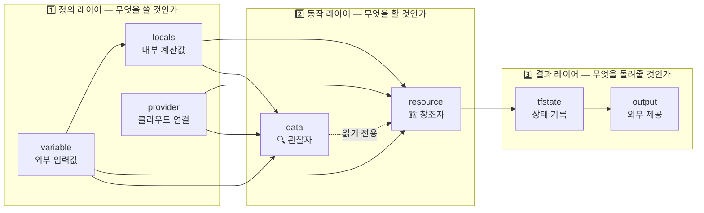

Terraform 코드를 처음 접하면 여섯 가지 블록이 나옵니다 — `provider`, `resource`, `data`, `variable`, `output`, `locals`. 각각의 문법은 배울 수 있지만, "이것들이 서로 어떻게 연결되어 있지?"라는 질문에 막히는 경우가 많습니다.

이 글은 그 관계를 한 번에 정리합니다.

---

## 핵심 질문 하나로 시작하기

Terraform 코드의 흐름을 이해하는 가장 빠른 방법은 이 질문을 던지는 것입니다.

> **"이 값은 어디서 왔고, 어디로 가는가?"**

모든 블록은 값을 **받거나**, **가공하거나**, **만들거나**, **내보내는** 역할 중 하나를 합니다. 이 관점에서 보면 여섯 개가 아니라 세 개의 레이어로 단순화됩니다.



---

## 1단계: 정의 레이어 — variable → locals → provider

### variable: 식재료 주문서

**변수는 "무엇이 필요한가"를 선언하는 곳**입니다. 환경마다 달라지는 값 — 환경 이름, 인스턴스 크기, 허용 IP 목록 — 을 여기서 받습니다.

```hcl
# variables.tf
variable "environment" {
  description = "배포 환경"
  type        = string
  default     = "dev"
}

variable "project" {
  description = "프로젝트 이름"
  type        = string
}
```

변수 자체는 아무 일도 하지 않습니다. 값을 선언만 할 뿐, 실제로 인프라에 적용되지는 않습니다. 요리에 비유하면 **식재료 주문서**입니다 — 무엇이 필요한지만 적혀 있습니다.

### locals: 요리사의 손질 단계

**여기서 많은 사람들이 "왜 굳이 locals를 써야 하지? 변수에서 바로 resource로 가면 안 되나?"라고 묻습니다.**

안 됩니다. 정확히는 "되긴 되지만, 그러면 안 됩니다."

이유는 두 가지입니다.

**중복 제거**: `"myapp-${var.environment}"` 라는 표현이 10개 파일 30군데에 들어간다고 생각해 보세요. 프로젝트 이름이 바뀌면 30군데를 전부 찾아서 바꿔야 합니다. 그게 아니라 `locals`에 한 번 정의해 두면:

```hcl
# locals.tf
locals {
  name_prefix = "${var.project}-${var.environment}"   # 한 번 정의
  common_tags = {
    Project     = var.project
    Environment = var.environment
    ManagedBy   = "terraform"
  }
}
```

이제 어디서든 `local.name_prefix`로 가져다 씁니다. 바꿀 때는 한 줄만 수정하면 됩니다.

**계산과 가공**: 변수는 "원재료"를 받는 것뿐이지만, locals는 그 재료를 **조합하고 계산**합니다.

```hcl
locals {
  # 변수를 조합해 이름 규칙 생성
  name_prefix = "${var.project}-${var.environment}"

  # 공통 태그를 외부 태그와 병합
  common_tags = merge(var.extra_tags, {
    Project     = var.project
    Environment = var.environment
    ManagedBy   = "terraform"
  })

  # 조건부 계산
  is_prod     = var.environment == "prod"
  min_size    = local.is_prod ? 3 : 1
}
```

요리 비유로 다시 보면: variable이 "양파 2개, 고기 500g"이라면, locals는 "양파를 썰고 고기를 양념해서 **양념육 세트**를 만들어 두는 단계"입니다. `resource`(요리)는 재료 준비를 신경 쓸 필요 없이 본업에만 집중할 수 있습니다.

### provider: 요리를 가능하게 하는 가스레인지

provider는 Terraform이 AWS, GCP, Azure 등 특정 클라우드와 통신하기 위한 플러그인 설정입니다. resource와 data가 동작하려면 provider가 먼저 구성되어 있어야 합니다.

```hcl
provider "aws" {
  region = "ap-northeast-2"

  default_tags {
    tags = local.common_tags   # locals 값 활용
  }
}
```

provider는 독립적으로 존재하지 않습니다. 항상 variable과 locals의 값을 받아 구성됩니다.

---

## 2단계: 동작 레이어 — resource vs data

이 두 블록은 Terraform의 핵심입니다. 그리고 이 둘의 차이를 명확히 이해하는 것이 Terraform을 잘 쓰는 출발점입니다.

| 구분 | resource | data |
|------|----------|------|
| 역할 | **창조자** — 직접 만든다 | **관찰자** — 이미 있는 것을 읽는다 |
| State 관리 | Terraform이 lifecycle 전체 관리 | 관리 안 함 (조회만) |
| 삭제 시 | `terraform destroy`로 제거됨 | 영향 없음 (원본은 그대로) |
| 비유 | 건물을 직접 짓는 것 | 기존 건물의 주소를 찾아내는 것 |

### resource: 창조자

내가 만들기 때문에 Terraform이 이 리소스의 **전체 생명주기(생성, 변경, 삭제)**를 책임집니다. 생성 결과는 `tfstate`에 기록됩니다.

```hcl
# main.tf
resource "aws_vpc" "main" {
  cidr_block = "10.0.0.0/16"

  tags = merge(local.common_tags, {   # locals 활용
    Name = "${local.name_prefix}-vpc"
  })
}

resource "aws_subnet" "public" {
  vpc_id     = aws_vpc.main.id   # 위에서 만든 resource 참조
  cidr_block = "10.0.1.0/24"
}
```

### data: 관찰자

내가 만든 게 아니라 이미 AWS에 있는 것을 **찾아서 가져오는** 역할입니다. State에 기록되지 않으며, 삭제해도 원본 리소스는 사라지지 않습니다.

```hcl
# data.tf
data "aws_vpc" "shared" {
  filter {
    name   = "tag:Name"
    values = ["shared-network-vpc"]   # 다른 팀이 만들어 둔 VPC
  }
}

data "aws_ami" "amazon_linux" {
  most_recent = true
  owners      = ["amazon"]
  filter {
    name   = "name"
    values = ["amzn2-ami-hvm-*-x86_64-gp2"]
  }
}

# 조회한 결과를 resource에서 활용
resource "aws_instance" "web" {
  ami           = data.aws_ami.amazon_linux.id   # 조회한 AMI 사용
  instance_type = "t3.micro"
  subnet_id     = data.aws_vpc.shared.id         # 조회한 VPC 사용
}
```


**왜 data가 필요한가?**

"이미 있는 네트워크(VPC)를 굳이 또 만들면 충돌이 납니다." 네트워크 팀이 이미 VPC를 만들어 뒀다면, 내 Terraform 코드에서 그걸 **다시 만들지 않고** 참조만 해야 합니다. 이때 data를 씁니다.


---

## 3단계: 결과 레이어 — output

resource로 인프라를 만들고 나면, 생성된 리소스의 정보(ID, IP, ARN 등)를 **다른 곳에서 사용할 수 있도록 노출**하는 것이 output의 역할입니다.

```hcl
# outputs.tf
output "vpc_id" {
  description = "생성된 VPC의 ID"
  value       = aws_vpc.main.id
}

output "public_subnet_ids" {
  description = "퍼블릭 서브넷 ID 목록"
  value       = aws_subnet.public[*].id
}

output "db_endpoint" {
  description = "RDS 엔드포인트 (외부 노출 금지)"
  value       = aws_db_instance.main.endpoint
  sensitive   = true
}
```

output은 두 가지 용도로 쓰입니다.

**모듈 간 연결**: VPC를 만드는 모듈의 output을 EC2를 만드는 모듈의 input으로 넘깁니다.

```hcl
# 다른 모듈에서 참조
module "network" {
  source = "./modules/network"
}

module "compute" {
  source    = "./modules/compute"
  vpc_id    = module.network.vpc_id   # output 활용
}
```

**CI/CD 파이프라인 연동**: GitHub Actions에서 생성된 리소스 정보를 추출합니다.

```bash
# GitHub Actions에서
VPC_ID=$(terraform output -raw vpc_id)
echo "배포된 VPC: $VPC_ID"
```

---

## 전체 흐름을 코드로 보기

```hcl
# 1. variables.tf — "무엇이 필요한가" 선언
variable "environment" {
  type    = string
  default = "dev"
}
variable "project" {
  type = string
}

# 2. locals.tf — 변수를 가공해 재사용 단위로 묶기
locals {
  name_prefix = "${var.project}-${var.environment}"
  common_tags = {
    Project     = var.project
    Environment = var.environment
    ManagedBy   = "terraform"
  }
}

# 3. data.tf — 이미 있는 리소스 조회 (창조 아님)
data "aws_availability_zones" "available" {
  state = "available"
}

# 4. main.tf — 준비된 값들로 실제 인프라 생성
resource "aws_vpc" "main" {
  cidr_block = "10.0.0.0/16"
  tags = merge(local.common_tags, {
    Name = "${local.name_prefix}-vpc"
  })
}

resource "aws_subnet" "public" {
  vpc_id            = aws_vpc.main.id
  cidr_block        = "10.0.1.0/24"
  availability_zone = data.aws_availability_zones.available.names[0]
}

# 5. outputs.tf — 생성된 결과를 외부에 노출
output "vpc_id" {
  value = aws_vpc.main.id
}
output "public_subnet_id" {
  value = aws_subnet.public.id
}
```

이 코드를 읽는 방법:

1. `variables.tf`에서 `environment`와 `project`가 어떤 환경에 배포할지 결정합니다
2. `locals.tf`에서 `"myapp-dev"` 같은 이름 규칙과 공통 태그를 미리 만들어 둡니다
3. `data.tf`에서 AWS 가용 영역 목록을 조회합니다 (생성 아님)
4. `main.tf`에서 1~3에서 준비된 값들을 모두 활용해 VPC와 서브넷을 만듭니다
5. `outputs.tf`에서 만들어진 VPC ID와 서브넷 ID를 외부에 공개합니다

---

## 정리: 역할 분담의 철학

Terraform의 6개 블록은 **관심사 분리**(Separation of Concerns)를 구현합니다.

| 블록 | 질문 | 파일 관례 |
|------|------|----------|
| `variable` | 무엇이 외부에서 들어오는가? | `variables.tf` |
| `locals` | 내부적으로 어떻게 가공할 것인가? | `locals.tf` |
| `provider` | 어느 클라우드와 어떻게 연결할 것인가? | `provider.tf` |
| `data` | 이미 있는 무엇을 참조할 것인가? | `data.tf` |
| `resource` | 무엇을 새로 만들 것인가? | `main.tf` |
| `output` | 만든 것 중 무엇을 외부에 알릴 것인가? | `outputs.tf` |

각 블록이 자기 역할만 하면, 코드가 읽기 쉽고 변경이 한 곳에만 영향을 미칩니다. `variable → locals → resource` 흐름은 테라폼 커뮤니티가 수년간 검증한 실무 표준 패턴입니다.

이 구조가 손에 익으면, 수천 줄짜리 테라폼 코드도 "어디서 선언하고, 어디서 가공하고, 어디서 적용하는가"라는 관점으로 빠르게 읽을 수 있습니다.
