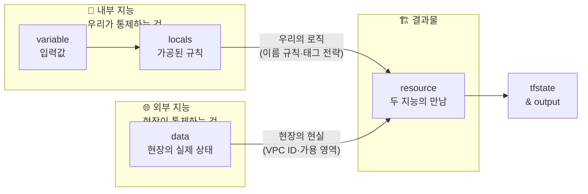
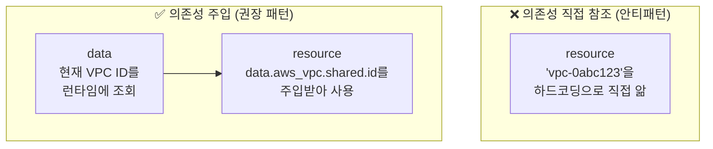

Terraform을 처음 배울 때는 블록의 **문법**을 배웁니다. 그런데 어느 시점에 문법을 아는 것과 **잘 짜는 것** 사이에 큰 간격이 있다는 걸 느끼게 됩니다.

그 간격을 메우는 것이 바로 설계 패턴입니다.

이 글에서 소개할 패턴은 복잡하지 않습니다. 오히려 너무 단순해서 처음엔 "이게 전부야?"라는 생각이 들 수 있습니다. 하지만 이 패턴 하나만 체득하면, 어떤 인프라든 동일한 구조로 설계할 수 있게 됩니다.

---

## 하나의 리소스를 만들기 위해 두 가지 지능이 결합한다

`main.tf`의 평범한 한 줄을 보겠습니다.

```hcl
resource "aws_subnet" "public" {
  vpc_id            = data.aws_vpc.shared.id
  availability_zone = data.aws_availability_zones.a.names[0]

  tags = merge(local.common_tags, {
    Name = "${local.name_prefix}-subnet"
  })
}
```

이 코드를 단순히 "VPC ID와 태그를 지정하는 곳"으로 읽으면 절반만 이해한 겁니다.

사실 이 한 블록은 **서로 다른 두 가지 지능이 결합하는 접점**입니다.



---

## 내부 지능: 우리가 만드는 규칙

`variable`과 `locals`는 우리 조직 내부의 결정을 코드로 표현합니다.

- "우리 회사 리소스는 `{프로젝트}-{환경}` 형식으로 이름 짓는다"
- "모든 리소스에는 `Project`, `Environment`, `ManagedBy` 태그를 달아야 한다"
- "prod 환경에서는 최소 3대, dev에서는 1대로 유지한다"

이것들은 AWS가 정한 규칙이 아닙니다. **우리 팀, 우리 회사가 정한 규칙**입니다.

```hcl
# locals.tf — "우리만의 로직"을 코드에 심는 곳
locals {
  name_prefix = "${var.project}-${var.environment}"

  common_tags = {
    Project     = var.project
    Environment = var.environment
    ManagedBy   = "terraform"
    Team        = var.team_name
  }

  # 환경별 규칙 — 우리가 결정한 것
  min_capacity = var.environment == "prod" ? 3 : 1
  instance_type = var.environment == "prod" ? "t3.medium" : "t3.micro"
}
```

이 코드를 보면 "Terraform 코드"라기보다 **팀의 운영 규칙 문서**에 가깝습니다. 팀 컨벤션, 네이밍 정책, 환경별 정책이 모두 여기 담겨 있습니다.


**내부 지능의 특성**: 변경 권한이 우리에게 있습니다. 이름 규칙을 바꾸고 싶으면 `locals`를 수정하면 됩니다. 이 수정이 코드 전체에 일관되게 반영됩니다.


---

## 외부 지능: 현장이 알려주는 사실

`data`는 우리가 **만들지 않은 것**, 하지만 **반드시 연결해야 하는 것**의 정보를 가져옵니다.

```hcl
# data.tf — "현장의 실제 상태"를 읽어오는 곳
data "aws_vpc" "shared" {
  filter {
    name   = "tag:Name"
    values = ["${var.environment}-shared-network"]
  }
}

data "aws_availability_zones" "available" {
  state = "available"
}

data "aws_ami" "amazon_linux" {
  most_recent = true
  owners      = ["amazon"]
  filter {
    name   = "name"
    values = ["amzn2-ami-hvm-*-x86_64-gp2"]
  }
}
```

이 값들은 우리가 결정할 수 없습니다.

- VPC ID는 네트워크 팀이 만들어 둔 것입니다. 우리가 하드코딩할 수 없습니다.
- 가용 영역은 AWS가 리전마다 다르게 운영합니다. 우리가 통제할 수 없습니다.
- AMI ID는 AWS가 패치를 올릴 때마다 바뀝니다. 하드코딩하면 구버전을 계속 씁니다.

`data`는 이런 "내가 통제할 수 없는 외부의 현실"을 코드 안으로 안전하게 끌어오는 역할을 합니다.


**외부 지능의 특성**: 변경 권한이 우리에게 없습니다. 네트워크가 교체되면 `data`가 알아서 새 값을 가져옵니다. 반대로 말하면, 우리 코드가 망가지지 않으면서 외부 변화에 자동으로 적응한다는 뜻이기도 합니다.


---

## 접점: main.tf의 한 줄이 하는 일

두 지능이 만나는 지점이 `resource` 블록입니다.

```hcl
resource "aws_subnet" "public" {
  # 외부 지능: 네트워크 팀이 만든 VPC의 실제 ID
  vpc_id = data.aws_vpc.shared.id

  # 외부 지능: AWS가 이 리전에서 운영 중인 가용 영역
  availability_zone = data.aws_availability_zones.available.names[0]

  # 내부 지능: 우리 팀의 CIDR 설계 규칙
  cidr_block = cidrsubnet(data.aws_vpc.shared.cidr_block, 8, 1)

  # 내부 지능: 우리 회사의 태그 정책
  tags = merge(local.common_tags, {
    Name = "${local.name_prefix}-public-subnet"
    Tier = "public"
  })
}
```

이 블록이 실행될 때 Terraform은 다음을 보장합니다.

1. VPC ID는 현재 환경에 실제로 존재하는 값입니다 (하드코딩이 아닙니다)
2. 가용 영역은 현재 리전에서 사용 가능한 값입니다
3. 태그는 우리 팀 정책을 100% 따릅니다
4. 이름은 환경마다 자동으로 달라집니다

다섯 줄이지만, 그 안에 **네트워크 팀의 설계 + AWS의 현재 상태 + 우리 팀의 정책**이 모두 담겨 있습니다.

---

## 이 패턴이 강력한 세 가지 이유

### 1. 변화에 대응하는 방식이 분리된다

무언가 바뀔 때 어디를 고쳐야 할지가 명확합니다.

| 무엇이 바뀌었나 | 어디를 수정하나 |
|----------------|----------------|
| 이름 규칙 변경 | `locals.tf` 한 곳 |
| 네트워크 교체 | `data` 블록이 자동으로 새 값 반영 |
| AMI 업데이트 | `data` 블록이 자동으로 최신 버전 참조 |
| prod 정책 변경 | `locals.tf`의 조건식 수정 |
| 새 환경 추가 | `variable` 기본값 추가 |

`main.tf`는 거의 건드리지 않아도 됩니다. 변화의 파급 범위를 최소화하는 구조입니다.

### 2. 리소스 생성 시 에러가 극도로 줄어든다

`resource`에 들어오는 모든 값은 이미 검증된 소스에서 옵니다.

- `data`에서 오는 값은 Terraform이 plan 단계에서 실제로 조회합니다. 없는 VPC ID를 참조하면 apply 전에 에러가 납니다.
- `locals`에서 오는 값은 코드에서 계산된 값이므로, 타입 오류나 오탈자가 있으면 validate 단계에서 걸립니다.

하드코딩된 VPC ID를 쓰다가 환경이 재구성된 후 그 ID가 사라지면, apply 도중에야 에러를 만납니다. `data`를 쓰면 그 에러가 plan 단계로 앞당겨집니다.

### 3. 코드가 자기 문서화된다

```hcl
# 이 코드는 "VPC ID가 뭔지"보다 "왜 이 VPC를 쓰는지"를 설명합니다
vpc_id = data.aws_vpc.shared.id          # shared 네트워크를 쓴다
# vs.
vpc_id = "vpc-0abc1234def56789"          # 이게 어떤 VPC인지 알 수 없다
```

`data.aws_vpc.shared`라는 이름만 봐도 "아, shared 네트워크 환경의 VPC를 가져오는구나"를 알 수 있습니다. 하드코딩된 ID는 코드만 봐서는 맥락을 전혀 알 수 없습니다.

---

## 더 깊이: 이 패턴의 본질은 의존성 주입이다

소프트웨어 설계에 익숙한 분이라면 이 패턴이 낯익게 느껴질 수 있습니다. 맞습니다. 이것은 인프라 코드에서의 **의존성 주입(Dependency Injection)** 패턴입니다.

`resource`는 직접 VPC를 찾으러 가지 않습니다. 대신 "VPC ID를 누군가 주입해 줘"라는 방식으로 작성됩니다. 그 "누군가"가 `data`입니다.



이 구조의 장점은 소프트웨어에서와 동일합니다.

- **테스트 가능성**: data 블록이 반환하는 값을 바꾸면 resource의 동작을 시뮬레이션할 수 있습니다
- **결합도 감소**: resource는 VPC가 어떻게 만들어졌는지 알 필요가 없습니다
- **교체 용이성**: 다른 VPC를 쓰고 싶으면 data 블록만 바꾸면 됩니다

---

## 팀 단위로 확장하면

이 패턴은 혼자 쓸 때도 강력하지만, 팀에서 쓸 때 진가를 발휘합니다.

```
네트워크 팀               애플리케이션 팀
──────────────────        ──────────────────────────────
resource "aws_vpc" ...    data "aws_vpc" "shared" { ... }
output "vpc_id" ...  →→→  (data가 output을 찾아서 가져옴)
```

네트워크 팀은 `output`으로 VPC 정보를 노출하고, 애플리케이션 팀은 `data`로 그것을 참조합니다. 두 팀은 서로의 코드를 건드리지 않아도 됩니다. **계약(output/data)만 지키면 됩니다.**

이것이 대규모 인프라 환경에서 Terraform이 팀 간 경계를 그리는 방식입니다.

---

## 정리: 하나의 공식

테라폼의 정석 설계 패턴을 한 줄로 요약하면:

> **우리의 규칙(locals) + 외부의 현실(data) = 실제 인프라(resource)**

`locals`는 우리가 통제하는 것을 코드로 표현합니다.
`data`는 우리가 통제할 수 없는 것을 코드 안으로 끌어옵니다.
`resource`는 그 두 가지가 만나 실제 인프라로 구현되는 곳입니다.

이 공식을 체득하면, 다음에 어떤 인프라를 만들든 자연스럽게 이 질문을 하게 됩니다.

- **"이 값은 우리가 결정하는 것인가, 아니면 외부에서 가져오는 것인가?"**

전자라면 `locals`에, 후자라면 `data`에 씁니다. 그리고 `resource`에서 두 가지를 조립합니다.

테라폼 코드를 잘 짠다는 것은, 결국 이 두 가지를 명확하게 분리하고 깔끔하게 연결하는 것입니다.
