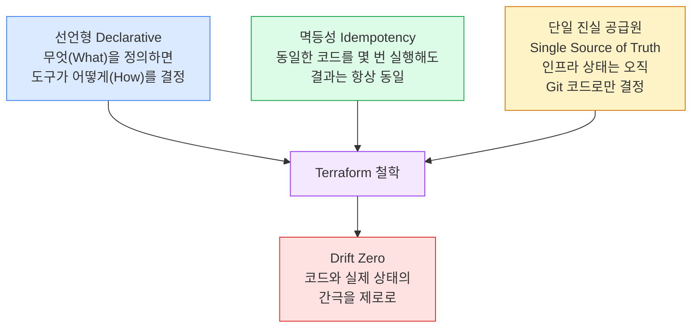

Terraform을 처음 배울 때 사람들은 문법과 명령어를 외우는 데 집중합니다. 하지만 실무에서 Terraform을 오래 다뤄본 엔지니어들이 공통적으로 하는 말이 있습니다.

> "Terraform은 도구가 아니라 철학이다."

`init`, `plan`, `apply`를 익히는 것은 누구나 하루면 됩니다. 그런데 왜 어떤 팀은 Terraform을 도입하고 6개월 후에 "이게 더 복잡해졌어요"라고 하고, 어떤 팀은 "인프라 관리가 훨씬 안정됐어요"라고 할까요?

그 차이는 **Terraform의 철학을 이해했느냐**에서 갈립니다.

---

## 1. 원하는 상태(Desired State): 모든 것의 출발점

Terraform의 기술적 기반은 **선언형(Declarative)** 철학에 있습니다.

대부분의 사람들이 처음에 헷갈리는 지점이 바로 여기입니다.

| 방식 | 예시 | 특징 |
|------|------|------|
| **명령형 (Imperative)** | "서버를 1대 만들어라" | 어떻게(How)를 지시 |
| **선언형 (Declarative)** | "서버가 3대 있어야 한다" | 무엇(What)을 정의 |

Bash 스크립트로 인프라를 구성하면 명령형입니다. 서버가 이미 있는지 없는지 직접 체크해야 하고, 실패하면 어디서부터 다시 시작해야 하는지 알기 어렵습니다.

Terraform은 다릅니다. "내 환경에는 항상 EC2 인스턴스 3대가 t3.micro 타입으로 존재해야 한다"고 선언하면, Terraform이 현재 상태를 파악해서 필요한 변경만 알아서 처리합니다.

```hcl
resource "aws_instance" "web" {
  count         = 3          # "3대가 있어야 한다"고 선언
  instance_type = "t3.micro"
  ami           = "ami-0c55b159cbfafe1f0"
}
```

누군가 실수로 1대를 지워도, 다음 `terraform apply` 때 자동으로 1대를 보충해서 3대를 맞춥니다. 이것이 **멱등성(Idempotency)**입니다.


**멱등성이란?** 동일한 코드를 몇 번을 실행해도 결과가 항상 동일한 상태로 수렴하는 성질. 이 덕분에 Terraform 코드는 "한 번 쓰고 버리는 스크립트"가 아니라 "언제든 재실행 가능한 선언문"이 됩니다.


---

## 2. 코드가 진실이다(Code is the Source of Truth)

Terraform 철학의 핵심 문장입니다.

> "인프라의 현재 상태를 나타내는 정보는 오직 코드(Git)뿐이다."

이게 왜 중요한지, 실제 현장에서 자주 벌어지는 상황으로 설명하겠습니다.

### 개발자 A의 수동 변경 — 아주 흔한 사고

```
초기 상태:
  코드(.tf):     instance_type = "t3.micro"
  실제 AWS:      t3.micro 인스턴스 동작 중  ← 일치 ✅

문제 발생:
  개발자 A: "서버가 너무 느린데... 콘솔에서 잠깐 바꿔야겠다"
  AWS 콘솔에서 t3.large로 직접 변경

깨진 상태:
  코드(.tf):     instance_type = "t3.micro"
  실제 AWS:      t3.large 인스턴스 동작 중  ← 불일치 ❌
```

이 상태에서 다음 날 팀원 B가 `terraform plan`을 실행하면:

```bash
# Terraform이 이렇게 판단합니다:
# "코드는 t3.micro인데 실제로는 t3.large네. Drift 발생."
# "코드가 진실이므로 t3.micro로 되돌린다."

  ~ aws_instance.web
      instance_type: "t3.large" -> "t3.micro"  # 다운그레이드 예정

Plan: 0 to add, 1 to change, 0 to destroy.
```

`terraform apply`를 실행하는 순간, 개발자 A가 했던 수동 변경은 사라집니다. 그리고 서버 재시작으로 잠깐의 다운타임이 발생할 수도 있습니다.

### 왜 "수동 변경"이 위험한가

| 문제 | 설명 |
|------|------|
| **히스토리 실종** | 누가, 언제, 왜 바꿨는지 Git에 기록이 없음 |
| **복구 불가능** | 장애 시 "원래 정상 설정"이 무엇인지 알 수 없음 |
| **협업 충돌** | 팀원은 코드 기준으로 인지, 실제 환경은 누군가 바꾼 상태 |
| **감사 불가** | 보안/컴플라이언스 감사 시 변경 근거 제시 불가 |

### 올바른 방법: 항상 코드를 먼저

```
서버 사양을 바꾸고 싶다면:

1. .tf 파일에서 instance_type = "t3.large" 로 수정
2. git commit -m "perf: web 서버 사양 t3.micro → t3.large (트래픽 증가 대응)"
3. GitHub PR 생성 → 팀원 리뷰
4. 승인 후 terraform apply
```

이 흐름을 지키면 변경 이유, 승인자, 적용 시간이 모두 Git에 남습니다. 그 코드가 바로 **변하지 않는 진실(Single Source of Truth)**이 됩니다.

---

## 3. Terraform 철학을 관통하는 3가지 키워드



| 철학적 개념 | 핵심 내용 | 실무적 의미 |
|------------|----------|------------|
| **선언형 (Declarative)** | "무엇(What)"을 만들지 정의하면, 도구가 "어떻게(How)" 할지 결정 | 결과 중심으로 코드를 쓰기 때문에 스크립트보다 읽기 쉽고 유지보수가 쉬움 |
| **멱등성 (Idempotency)** | 동일한 코드를 여러 번 실행해도 결과는 항상 동일 | CI/CD에서 자동 apply를 안전하게 실행 가능 |
| **단일 진실 공급원 (Single Source of Truth)** | 인프라 상태의 정보는 오직 코드(Git)뿐 | 문서가 따로 필요 없고, 코드가 곧 현재 상태의 증거 |

---

## 4. 실무적 관점에서의 한마디

누군가 "Terraform의 철학이 뭐야?"라고 묻는다면 이렇게 답하면 됩니다.

> **"인프라의 모든 변경 사항은 코드에 기록되어야 하며, 코드와 실제 상태 사이의 간극(Drift)을 제로로 만드는 것."**

이 원칙 하나만 팀 전체가 제대로 지켜도 실무에서 발생하는 인프라 사고의 90% 이상을 예방할 수 있습니다.


**Drift의 현실**: 많은 팀이 "우리는 Terraform 쓰는데 왜 계속 문제가 생기지?"라고 합니다. 대부분 원인은 하나입니다. 콘솔에서 수동으로 만진 것입니다. Terraform을 도입했다고 저절로 Drift가 없어지지 않습니다. 팀 전체가 "콘솔 직접 수정 금지"를 문화로 만들어야 합니다.


---

## 5. 2025년 최신 동향: 이 철학이 더 중요해진 이유

### OpenTofu의 등장

2023년 HashiCorp가 Terraform 라이선스를 BSL(Business Source License)로 변경하면서, 오픈소스 포크인 **OpenTofu**가 탄생했습니다. 2024년 CNCF 인큐베이팅 프로젝트로 승격되었고, Terraform과 거의 동일한 문법을 사용합니다.

핵심은 **도구는 바뀌어도 철학은 동일**하다는 것입니다. OpenTofu도 선언형, 멱등성, Single Source of Truth를 그대로 따릅니다. 도구 선택보다 철학을 이해하는 것이 먼저인 이유입니다.

### Drift Detection 자동화

2024년부터 대형 조직들이 도입하는 패턴이 있습니다. CI/CD 파이프라인에서 주기적으로 `terraform plan`을 실행해 Drift를 자동 감지하고, 발생 시 알림을 보내는 것입니다.

```yaml
# GitHub Actions - 매일 Drift 감지
schedule:
  - cron: '0 9 * * 1-5'   # 평일 오전 9시

jobs:
  drift-detection:
    steps:
      - run: terraform plan -detailed-exitcode
        # exit code 2 = 변경사항 있음 = Drift 발생
```

코드가 진실이라는 철학 없이는 이 자동화 자체가 의미가 없습니다.

### "Terraform 없이 인프라 만지기 금지" SCP

AWS Organizations의 Service Control Policy(SCP)로 콘솔 직접 변경 자체를 기술적으로 차단하는 팀이 늘고 있습니다. 철학을 문화가 아닌 **기술적 강제**로 구현하는 흐름입니다.

---

## 마치며

Terraform을 배우는 가장 빠른 방법은 명령어를 외우는 것이지만, Terraform을 **잘** 쓰는 방법은 이 철학을 팀 전체의 문화로 만드는 것입니다.

코드가 진실입니다.  
콘솔은 읽기 전용입니다.  
모든 변경은 PR로 시작합니다.

이 세 문장을 팀 위키 첫 줄에 붙여두는 것부터 시작해보세요.

---

*더 깊이 공부하고 싶다면:*
- [Terraform 실행 흐름 완전 이해](/docs/01-intro/workflow)
- [Drift detection과 수동 변경 통제 전략](/docs/04-team/drift)
- [팀 협업을 위한 Remote State](/docs/04-team/remote-state)
