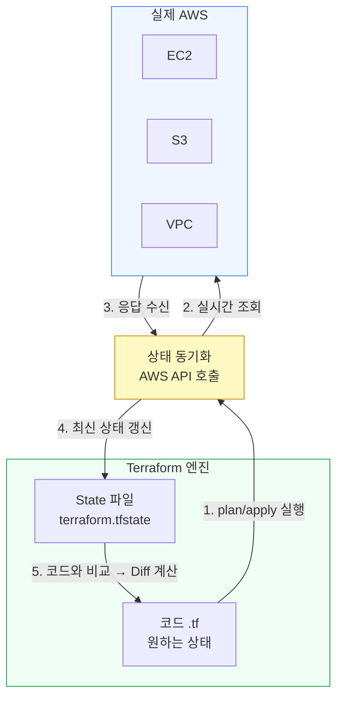
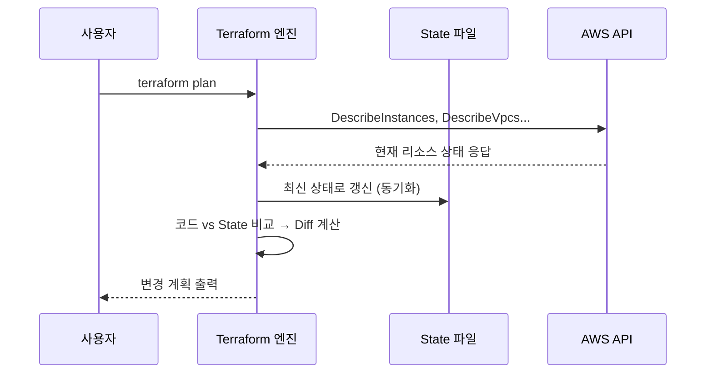
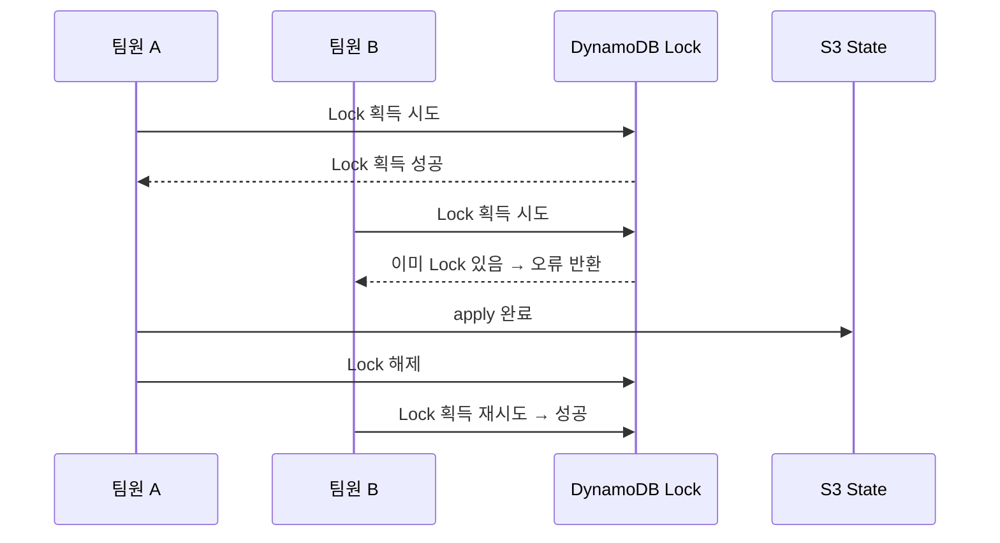
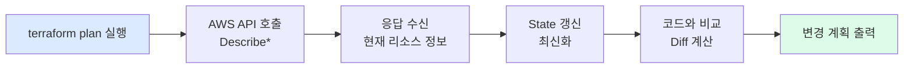

`terraform plan`을 실행하면 Terraform은 마치 현재 클라우드 상태를 꿰뚫어 보는 것처럼 정확한 변경 계획을 보여줍니다. 이것이 가능한 이유는 **상태 동기화** 과정 덕분입니다.

이 글에서는 상태 동기화가 내부적으로 어떻게 동작하는지, 그리고 이 과정에서 자주 발생하는 오류 상황들을 구체적인 예시와 함께 살펴봅니다.

---

## 상태 동기화란 무엇인가

아래 다이어그램에서 "상태 동기화"로 표시된 화살표의 정체는 **AWS API 호출**입니다.



Terraform은 `plan`이나 `apply`를 실행할 때마다 이 동기화 사이클을 돌립니다. "현재 AWS가 어떤 상태인지"를 직접 API로 확인한 뒤에야 변경 계획을 수립하는 것입니다.

---

## 동기화의 4단계 내부 동작

### 1단계: AWS API 조회

Terraform은 설치된 Provider 플러그인을 통해 AWS 각 서비스에 API 요청을 보냅니다.

```bash
# Terraform이 내부적으로 호출하는 AWS API 예시
DescribeInstances          # EC2 인스턴스 목록 조회
DescribeVpcs               # VPC 목록 조회
DescribeSubnets            # 서브넷 목록 조회
GetBucketLocation          # S3 버킷 조회
DescribeSecurityGroups     # 보안 그룹 조회
```

이 API 호출은 사용자가 터미널에서 직접 입력하는 AWS CLI 명령과 **동일한 방식**으로 동작합니다.

| 도구 | 실행 방법 | 내부 동작 |
|------|----------|----------|
| **AWS CLI** | `aws ec2 describe-instances` | AWS API 호출 → JSON 응답 출력 |
| **Terraform** | `terraform plan` | AWS API 호출 → State와 코드와 비교 |

차이는 API 응답을 "출력"하느냐, "State 및 코드와 비교"하느냐입니다.

### 2단계: 응답 수신

AWS는 현재 실제로 존재하는 리소스 정보를 JSON으로 응답합니다.

```json
{
  "Reservations": [{
    "Instances": [{
      "InstanceId": "i-0abc123def456",
      "InstanceType": "t3.large",      ← 실제 현재 타입
      "State": { "Name": "running" },
      "Tags": [{ "Key": "Name", "Value": "web-server" }]
    }]
  }]
}
```

### 3단계: State 파일과 대조

API 응답값을 로컬(또는 원격 백엔드)의 `terraform.tfstate`와 비교합니다.

```
State 파일에 기록된 값:  instance_type = "t3.micro"
AWS API 응답값:          instance_type = "t3.large"
                         ↑ 불일치! → Drift 감지
```

### 4단계: 코드와 비교 → Diff 계산

State 갱신 후 최종적으로 `.tf` 코드와 비교해 변경 계획을 생성합니다.

```bash
$ terraform plan

  ~ aws_instance.web
      instance_type: "t3.large" -> "t3.micro"

Plan: 0 to add, 1 to change, 0 to destroy.
```

---

## 왜 "동기화"라고 부르는가

클라우드 환경은 끊임없이 변합니다.

- 누군가 콘솔에서 수동으로 인스턴스 타입을 바꿀 수 있습니다.
- Auto Scaling이 인스턴스를 자동 종료할 수 있습니다.
- 팀원이 다른 Terraform 워크스페이스에서 리소스를 수정했을 수 있습니다.

Terraform은 `plan`을 실행할 때마다 이렇게 동작합니다.

> "현재 AWS에서 실제로 뭐가 있는지 API로 다시 확인하고, 그 최신 정보로 내 State를 업데이트한 뒤, 코드와 비교해 계획을 세우겠다."

이 과정 — **코드(목표) ↔ 실제 AWS(현실) 간의 격차를 계속 파악하고 줄이는 것** — 이 바로 동기화입니다.



---

## 상태 동기화 관련 오류 상황과 대처법

동기화 과정에서 발생할 수 있는 대표적인 오류들입니다. 실무에서 가장 자주 마주치는 순서로 정리했습니다.

### 오류 1: API 인증 실패

동기화의 첫 단계인 AWS API 호출 자체가 실패하는 경우입니다.

```bash
$ terraform plan

Error: No valid credential sources found
│ Please see https://registry.terraform.io/providers/hashicorp/aws
│ for more information about providing credentials.
│
│   with provider["registry.terraform.io/hashicorp/aws"],
│   on main.tf line 1, in terraform:
```

**원인과 해결:**

```bash
# 원인 1: AWS 자격증명 미설정
aws configure                          # Access Key, Region 설정

# 원인 2: IAM 권한 부족 (DescribeInstances 등 Read 권한 없음)
aws iam attach-role-policy \
  --role-name terraform-role \
  --policy-arn arn:aws:iam::aws:policy/ReadOnlyAccess

# 원인 3: 프로파일 불일치
export AWS_PROFILE=my-profile
terraform plan
```


**Terraform에 필요한 최소 권한**: `plan`만 실행해도 모든 리소스에 대한 `Describe*`, `List*`, `Get*` 권한이 필요합니다. 이 권한이 없으면 동기화 자체가 불가능합니다.


---

### 오류 2: State Lock 충돌

Remote Backend(S3 + DynamoDB)를 사용할 때, 다른 사람이 이미 `plan` 또는 `apply` 중인 경우 발생합니다.

```bash
$ terraform apply

Error: Error acquiring the state lock
│
│ Error message: ConditionalCheckFailedException: The conditional request failed
│ Lock Info:
│   ID:        f2ab5f76-1234-5678-abcd-ef1234567890
│   Path:      s3://my-state-bucket/prod/terraform.tfstate
│   Operation: OperationTypeApply
│   Who:       teamA@company.com
│   Created:   2026-06-29 08:45:00 +0000 UTC
```



**해결:**

```bash
# 1. 먼저 실제로 apply가 진행 중인지 확인
terraform force-unlock <LOCK_ID>   # 중단된 프로세스의 Lock 강제 해제

# 주의: apply가 실제로 실행 중일 때 force-unlock은 데이터 손상 위험
# 반드시 Lock을 건 당사자에게 확인 후 사용
```


`terraform force-unlock`은 정말 프로세스가 죽어서 Lock만 남은 경우에만 사용하세요. 실제로 apply가 진행 중인 상황에서 강제 해제하면 State 파일이 손상될 수 있습니다.


---

### 오류 3: 리소스가 외부에서 삭제된 경우 (Drift)

AWS 콘솔이나 다른 도구로 리소스를 삭제했는데, State 파일에는 여전히 존재하는 것으로 기록된 경우입니다.

```bash
$ terraform plan

aws_instance.web: Refreshing state... [id=i-0abc123def456]

│ Error: reading EC2 Instance (i-0abc123def456): couldn't find resource
```

또는 오류 없이 아래처럼 표시되기도 합니다.

```bash
# Terraform이 삭제된 리소스를 감지하고 재생성 계획을 세웁니다
  + aws_instance.web
      ami:           "ami-0c55b159cbfafe1f0"
      instance_type: "t3.micro"

Plan: 1 to add, 0 to change, 0 to destroy.
```

**상황별 대처:**

```bash
# 케이스 1: 재생성이 필요한 경우
terraform apply   # 그냥 apply → 삭제된 리소스 재생성

# 케이스 2: 더 이상 관리가 필요 없는 경우
terraform state rm aws_instance.web   # State에서만 제거 (실제 삭제 아님)
```

---

### 오류 4: API 스로틀링

관리 리소스가 많은 환경에서 `plan` 실행 시 AWS API 요청이 너무 많아 throttling이 발생합니다.

```bash
$ terraform plan

│ Error: reading EC2 VPCs: RequestLimitExceeded: Request limit exceeded.
│       status code: 400, request id: 1234abcd-...
```

**원인:** State 동기화 과정에서 Terraform이 모든 리소스를 동시에 조회하면 초당 API 요청 횟수 제한에 걸립니다.

**해결:**

```hcl
# provider 설정에서 재시도 횟수와 병렬 실행 수 제한
provider "aws" {
  region = "ap-northeast-2"

  # 재시도 설정 (기본값: 25)
  max_retries = 10
}
```

```bash
# plan 실행 시 병렬 처리 수 제한 (기본값: 10)
terraform plan -parallelism=5
```

---

### 오류 5: State 파일 버전 불일치

팀원이 더 높은 버전의 Terraform으로 `apply`한 후, 다른 팀원이 낮은 버전으로 `plan`을 실행하는 경우입니다.

```bash
$ terraform plan

│ Error: State version 4 is not supported
│
│ Your Terraform version is 1.3.0, but the state was written by Terraform 1.6.0.
│ Please upgrade Terraform to use this configuration.
```

**해결:**

```hcl
# terraform.tf에 버전 고정
terraform {
  required_version = ">= 1.6.0"   # 최소 버전 강제

  required_providers {
    aws = {
      source  = "hashicorp/aws"
      version = "~> 5.0"
    }
  }
}
```

```bash
# tfenv를 사용해 팀 전체가 동일 버전 사용
tfenv install 1.6.5
tfenv use 1.6.5
```

---

### 오류 6: State 파일과 실제 리소스 ID 불일치

`terraform import`를 잘못 실행하거나 State를 수동 편집한 후, State에 기록된 리소스 ID가 실제 AWS의 ID와 달라진 경우입니다.

```bash
$ terraform plan

│ Error: reading EC2 Instance (i-0wrongid999): InvalidInstanceID.NotFound:
│ The instance ID 'i-0wrongid999' does not exist
```

**해결:**

```bash
# 1. 현재 State에 기록된 정보 확인
terraform state show aws_instance.web

# 2. 잘못된 리소스를 State에서 제거
terraform state rm aws_instance.web

# 3. 실제 AWS의 올바른 ID로 재import
terraform import aws_instance.web i-0correctid123
```

---

### 오류 7: refresh-only로 동기화만 수행

코드를 변경하지 않고 State만 최신 AWS 상태로 갱신하고 싶을 때 사용합니다. Drift를 확인하는 용도로도 유용합니다.

```bash
# 실제 변경 없이 State만 갱신
$ terraform apply -refresh-only

  ~ aws_instance.web
      instance_type: "t3.micro" -> "t3.large"   ← 누가 콘솔에서 바꿨네요

Do you want to update the Terraform state?
  Only 'yes' will be accepted to confirm.

Enter a value: yes

Apply complete! Resources: 0 added, 0 changed, 0 destroyed.
```


`-refresh-only`는 State를 실제 AWS에 맞게 업데이트할 뿐, 인프라는 건드리지 않습니다. 수동 변경을 "공식 인정"하는 것이므로 신중하게 사용해야 합니다. 대부분의 경우 Drift는 코드를 업데이트해서 제거하는 게 올바른 방향입니다.


---

## 오류 빠른 참조표

| 오류 메시지 키워드 | 원인 | 첫 번째 확인 사항 |
|-------------------|------|-----------------|
| `No valid credential sources` | AWS 인증 실패 | `aws sts get-caller-identity` |
| `Error acquiring the state lock` | 다른 프로세스가 Lock 보유 | Lock 보유자 확인 후 `force-unlock` |
| `couldn't find resource` | 리소스 외부 삭제 (Drift) | 재생성 또는 `state rm` |
| `RequestLimitExceeded` | API 스로틀링 | `-parallelism` 낮추기 |
| `State version X is not supported` | Terraform 버전 불일치 | `terraform version` 확인 후 업그레이드 |
| `InvalidInstanceID.NotFound` | State의 ID와 실제 불일치 | `state rm` 후 재import |

---

## 핵심 정리

상태 동기화는 Terraform이 "현실"을 인식하는 유일한 방법입니다.



이 과정이 없으면 Terraform은 "지금 AWS에 뭐가 있는지" 알 수 없습니다. 그렇기 때문에:

- **API 호출 권한**이 없으면 `plan`이 실패합니다.
- **Lock**이 없으면 여러 사람이 동시에 State를 덮어씁니다.
- **State와 실제가 다르면** 예상치 못한 변경이 발생합니다.

상태 동기화를 이해하면, Terraform의 오류 메시지 대부분이 "이 4단계 중 어디서 실패했는가"로 해석됩니다. 오류 메시지를 보는 눈이 달라질 것입니다.

---

*관련 문서:*
- [State를 처음부터 제대로 이해하기](/docs/01-intro/state-intro)
- [Remote State와 Locking](/docs/04-team/remote-state)
- [State 문제 복구 실전 가이드](/docs/08-ops/state-recovery)
