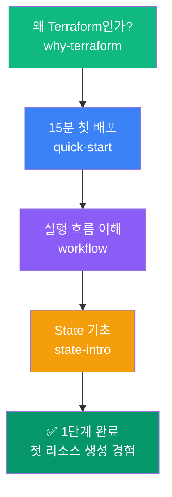

이 단계의 목표는 단 하나입니다. **Terraform을 왜 써야 하는지 몸으로 이해하기.**

긴 이론 설명 없이, 15분 안에 첫 인프라를 직접 배포해봅니다. plan/apply/destroy의 흐름을 손으로 느끼고, State가 무엇인지 감을 잡으면 이 단계는 끝입니다.

## 이 단계에서 배우는 것

## 단계별 학습 주제

| 주제 | 핵심 내용 | 소요 시간 |
|------|----------|----------|
| [Terraform을 왜 배우는가](why-terraform) | 콘솔 운영의 한계, IaC의 필요성 | 10분 |
| [15분 만에 첫 배포](quick-start) | Provider 설정, S3 생성, init/plan/apply | 15분 |
| [실행 흐름 완전 이해](workflow) | init→plan→apply→destroy 각 단계 역할 | 15분 |
| [State 기초](state-intro) | State란 무엇인가, Git에 넣으면 안 되는 이유 | 10분 |

## 이 단계를 마치면

- Terraform이 왜 필요한지 설명할 수 있음
- 최소 1개 리소스를 직접 생성/삭제해 봄
- 실행 흐름(init/plan/apply/destroy)을 몸으로 이해함
- State의 개념과 중요성을 설명할 수 있음
