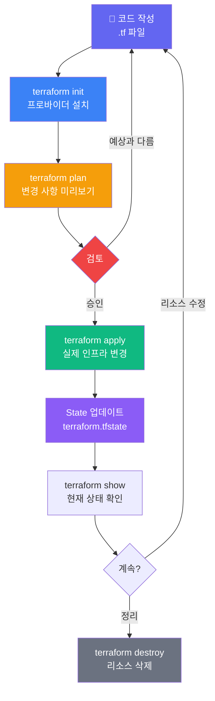
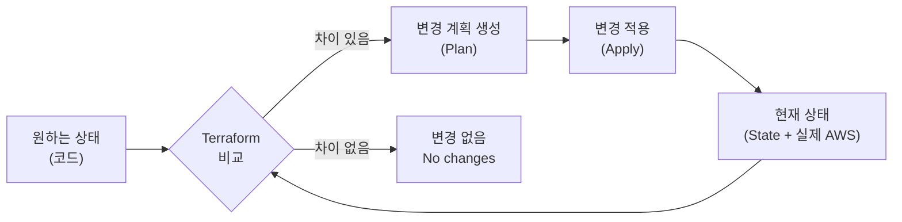

## Terraform의 전체 실행 흐름



---

## terraform init

**역할**: 작업 디렉토리를 초기화합니다.

```bash
terraform init
```

init이 하는 일:
1. **Provider 플러그인 다운로드**: `required_providers`에 선언된 플러그인을 `.terraform/providers/`에 설치
2. **Backend 초기화**: State를 저장할 위치 설정 (기본값: 로컬)
3. **모듈 다운로드**: `module` 블록에 선언된 원격 모듈 다운로드
4. **Lock 파일 생성**: `.terraform.lock.hcl`에 Provider 버전 고정


`init`은 매번 실행하지 않아도 됩니다. Provider 버전을 바꾸거나, Backend를 변경하거나, 새 모듈을 추가했을 때 다시 실행합니다.


---

## terraform plan

**역할**: 실제 변경 없이 무엇이 바뀔지 미리 보여줍니다.

```bash
terraform plan
# 결과를 파일로 저장 (CI/CD에서 자주 사용)
terraform plan -out=tfplan
```

Plan 결과 읽는 법:

```
+ create   → 새로 생성됨
~ update   → 기존 리소스 속성 변경
- destroy  → 삭제됨
-/+ replace → 삭제 후 재생성 (기존 리소스 교체!)
```


**`-/+` replace 기호를 주의하세요!** 이 기호는 기존 리소스를 삭제하고 새로 만든다는 뜻입니다. 데이터베이스, 스토리지처럼 데이터가 있는 리소스에서 발생하면 **데이터 손실**이 날 수 있습니다.


Plan이 중요한 이유:
- apply 전에 의도치 않은 삭제·교체를 발견할 수 있음
- CI/CD에서 PR마다 자동으로 plan을 실행해 팀이 리뷰

---

## terraform apply

**역할**: plan에서 확인한 변경을 실제 인프라에 적용합니다.

```bash
terraform apply
# 저장된 plan 파일로 apply (승인 없이 바로 실행)
terraform apply tfplan
# 자동 승인 (CI/CD용, 운영 환경에서는 주의)
terraform apply -auto-approve
```

apply 이후:
- `terraform.tfstate` 파일이 업데이트됨
- 현재 상태 확인: `terraform show`
- 특정 리소스만 보기: `terraform state show aws_s3_bucket.my_bucket`

---

## "원하는 상태(desired state)" 개념

Terraform은 **선언형(Declarative)** 방식으로 동작합니다.

```hcl
# "나는 이런 인프라를 원한다" 고 선언만 합니다
resource "aws_instance" "web" {
  ami           = "ami-12345678"
  instance_type = "t3.micro"
}
```

Terraform이 알아서 합니다:
- 현재 상태를 확인 (State 파일 + 실제 API 조회)
- 원하는 상태와 비교
- 차이를 없애기 위한 최소한의 변경만 수행



---

## terraform destroy

**역할**: 코드로 관리 중인 모든 리소스를 삭제합니다.

```bash
terraform destroy
# 특정 리소스만 삭제
terraform destroy -target=aws_s3_bucket.my_bucket
```


**운영 환경에서 `terraform destroy`는 절대 금지입니다.** `destroy`는 실습 환경 정리나 완전히 더 이상 필요 없는 서비스를 내릴 때만 사용합니다.


---

## 실무에서 자주 하는 실수


**실수 1: plan 없이 apply 하기**
`terraform apply`는 내부적으로 plan을 먼저 실행합니다. 하지만 CI/CD 파이프라인에서 plan 결과를 팀이 리뷰하지 않고 apply를 자동화하면 예상치 못한 리소스가 삭제될 수 있습니다.



**실수 2: State 파일을 Git에 커밋하기**
`terraform.tfstate`에는 비밀번호, 인증서 등 민감 정보가 포함될 수 있습니다. 반드시 `.gitignore`에 추가하세요.

```
# .gitignore
terraform.tfstate
terraform.tfstate.backup
.terraform/
```



**실수 3: init 없이 plan/apply 실행**
새 Provider를 추가하거나 Backend를 바꾼 후 `terraform init`을 실행하지 않으면 오류가 납니다.


---

## 자주 쓰는 추가 명령어

| 명령어 | 용도 |
|--------|------|
| `terraform fmt` | 코드 자동 포맷팅 |
| `terraform validate` | 문법 오류 검사 |
| `terraform show` | 현재 State 내용 출력 |
| `terraform state list` | 관리 중인 리소스 목록 |
| `terraform output` | Output 값 출력 |
| `terraform graph` | 의존성 그래프 출력 |

→ 다음: [Terraform State를 처음부터 제대로 이해하기](state-intro)
