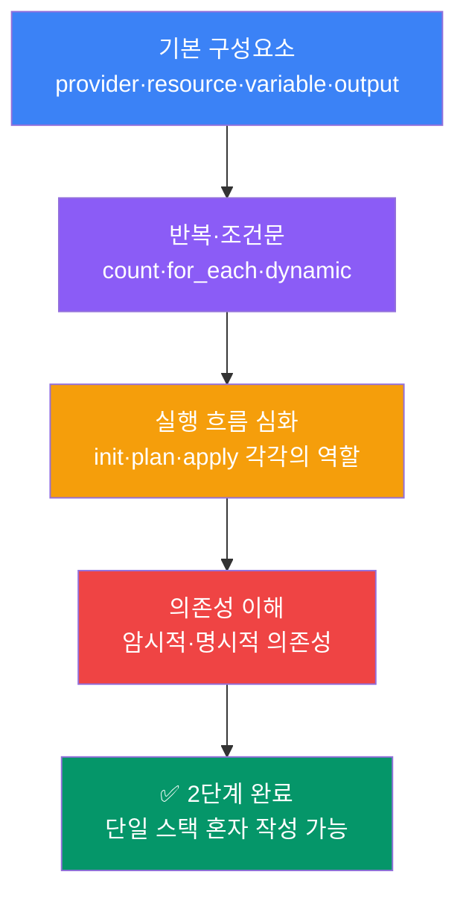

1단계에서 Terraform의 흐름을 익혔다면, 이제 **현업에서 가장 많이 쓰는 핵심 문법과 개념**을 다집니다.

이 단계는 문법 강의가 아닙니다. "왜 이게 필요한지"를 먼저 이해하고, 실무에서 바로 쓸 수 있는 코드 패턴을 익히는 것이 목표입니다.

## 이 단계 학습 경로

## 단계별 학습 주제

| 주제 | 핵심 내용 | 소요 시간 |
|------|----------|----------|
| [기본 구성요소](components) | provider, resource, data, variable, output, local | 20분 |
| [반복·조건·동적 블록](syntax) | count, for_each, 조건식, dynamic block | 20분 |
| [실행 흐름 심화](execution-flow) | init/plan/apply 역할, plan 읽는 법 | 15분 |
| [의존성 이해](dependencies) | 암시적·명시적 의존성, 리소스 순서 | 15분 |

## 이 단계를 마치면

- 단일 스택을 혼자 작성할 수 있음
- `plan` 결과를 읽고 변경 내용을 이해할 수 있음
- `count`와 `for_each`를 언제 쓸지 판단할 수 있음
- 리소스 의존 관계를 코드에서 표현할 수 있음
