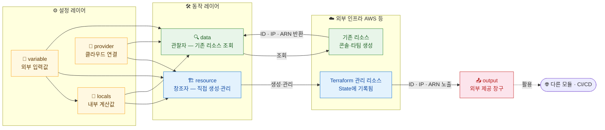

Terraform 코드는 여섯 가지 핵심 블록으로 구성됩니다. 각각의 역할을 이해하면 어떤 코드든 읽을 수 있습니다.



## provider

**목적**: Terraform이 특정 클라우드/서비스와 통신하기 위한 플러그인 설정

```hcl
terraform {
  required_providers {
    aws = {
      source  = "hashicorp/aws"
      version = "~> 5.0"  # 5.x 버전 사용
    }
  }
}

provider "aws" {
  region = "ap-northeast-2"

  default_tags {
    tags = {
      ManagedBy   = "terraform"
      Environment = var.environment
    }
  }
}
```

**실무 팁**: `default_tags`를 provider 수준에서 설정하면 모든 리소스에 자동으로 태그가 붙습니다. 태그 누락 실수를 방지합니다.

---

## resource

**목적**: 생성·관리할 인프라 리소스 선언

```hcl
# 형식: resource "<PROVIDER>_<TYPE>" "<NAME>" { ... }
resource "aws_vpc" "main" {
  cidr_block           = "10.0.0.0/16"
  enable_dns_hostnames = true
  enable_dns_support   = true

  tags = {
    Name = "main-vpc"
  }
}

resource "aws_subnet" "public" {
  vpc_id            = aws_vpc.main.id  # resource 참조
  cidr_block        = "10.0.1.0/24"
  availability_zone = "ap-northeast-2a"
}
```

**참조 방식**: `<RESOURCE_TYPE>.<NAME>.<ATTRIBUTE>`
- `aws_vpc.main.id` → VPC의 ID
- `aws_subnet.public.arn` → 서브넷의 ARN

---

## data

**목적**: Terraform 외부에 이미 존재하는 리소스 정보를 가져옴

```hcl
# 이미 AWS에 있는 데이터를 조회합니다 (생성하지 않음)
data "aws_ami" "amazon_linux" {
  most_recent = true
  owners      = ["amazon"]

  filter {
    name   = "name"
    values = ["amzn2-ami-hvm-*-x86_64-gp2"]
  }
}

data "aws_vpc" "existing" {
  filter {
    name   = "tag:Name"
    values = ["production-vpc"]
  }
}

# 사용 시: data.<TYPE>.<NAME>.<ATTRIBUTE>
resource "aws_instance" "web" {
  ami           = data.aws_ami.amazon_linux.id  # 조회한 AMI ID 사용
  instance_type = "t3.micro"
  subnet_id     = data.aws_vpc.existing.id
}
```

**실무 활용**: 다른 팀이 관리하는 VPC를 참조하거나, 최신 AMI를 동적으로 조회할 때 사용합니다.

---

## variable

**목적**: 코드에서 변경 가능한 입력값 선언 (하드코딩 제거)

```hcl
# 변수 선언
variable "environment" {
  description = "배포 환경 (dev, staging, prod)"
  type        = string
  default     = "dev"

  validation {
    condition     = contains(["dev", "staging", "prod"], var.environment)
    error_message = "environment는 dev, staging, prod 중 하나여야 합니다."
  }
}

variable "instance_count" {
  description = "생성할 EC2 인스턴스 수"
  type        = number
  default     = 1
}

variable "allowed_cidrs" {
  description = "접근을 허용할 CIDR 목록"
  type        = list(string)
  default     = ["10.0.0.0/8"]
}

variable "tags" {
  description = "공통 태그"
  type        = map(string)
  default     = {}
}

variable "db_password" {
  description = "데이터베이스 패스워드"
  type        = string
  sensitive   = true  # 로그에 출력되지 않음
}
```

**변수 전달 방법:**

```bash
# 1. 커맨드라인
terraform apply -var="environment=prod"

# 2. .tfvars 파일 (가장 많이 씀)
terraform apply -var-file="prod.tfvars"

# 3. 환경변수 (CI/CD에서 자주 사용)
export TF_VAR_db_password="secret123"
terraform apply
```

```hcl
# prod.tfvars
environment    = "prod"
instance_count = 3
allowed_cidrs  = ["172.16.0.0/12", "192.168.0.0/16"]
```

---

## output

**목적**: apply 후 외부에서 사용할 값을 출력

```hcl
output "vpc_id" {
  description = "생성된 VPC의 ID"
  value       = aws_vpc.main.id
}

output "public_subnet_ids" {
  description = "퍼블릭 서브넷 ID 목록"
  value       = aws_subnet.public[*].id
}

output "db_endpoint" {
  description = "RDS 엔드포인트"
  value       = aws_db_instance.main.endpoint
  sensitive   = true  # terraform output 시 가려짐
}
```

**실무 활용**: 모듈 간 값 전달, CI/CD에서 생성된 리소스 정보 추출

```bash
# Output 조회
terraform output vpc_id
terraform output -json  # JSON 형식 출력
terraform output -raw vpc_id  # 따옴표 없이 출력
```

---

## locals

**목적**: 코드 내에서 반복 사용하는 값을 중앙에서 관리

```hcl
locals {
  # 네이밍 규칙 중앙화
  name_prefix = "${var.project}-${var.environment}"

  # 공통 태그
  common_tags = merge(var.tags, {
    Project     = var.project
    Environment = var.environment
    ManagedBy   = "terraform"
  })

  # 조건부 값
  is_prod = var.environment == "prod"

  # 복잡한 계산 결과 캐싱
  availability_zones = slice(data.aws_availability_zones.available.names, 0, 3)
}

# 사용 시
resource "aws_vpc" "main" {
  cidr_block = "10.0.0.0/16"

  tags = merge(local.common_tags, {
    Name = "${local.name_prefix}-vpc"
  })
}
```

**변수 vs 로컬값 차이:**

| | variable | locals |
|--|----------|--------|
| 외부 입력 | 가능 | 불가 (코드 내부에서만) |
| 용도 | 환경마다 달라지는 값 | 코드 내 반복 표현식 |
| 변경 방법 | tfvars, -var 플래그 | 코드 직접 수정 |

---

## 전체 구성 예시

```hcl
# variables.tf
variable "environment" {
  type    = string
  default = "dev"
}

# locals.tf
locals {
  name_prefix = "myapp-${var.environment}"
  common_tags = {
    Environment = var.environment
    ManagedBy   = "terraform"
  }
}

# data.tf
data "aws_availability_zones" "available" {
  state = "available"
}

# main.tf
resource "aws_vpc" "main" {
  cidr_block = "10.0.0.0/16"
  tags = merge(local.common_tags, { Name = "${local.name_prefix}-vpc" })
}

# outputs.tf
output "vpc_id" {
  value = aws_vpc.main.id
}
```

→ 다음: [count와 for_each를 언제 어떻게 써야 하는가](syntax)
