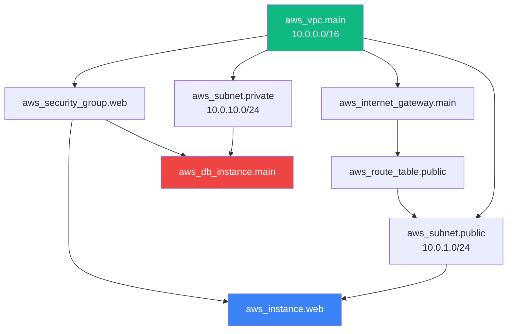

Terraform은 리소스 간 의존 관계를 파악해 올바른 순서로 생성/삭제합니다. 이 개념을 이해하면 "왜 이 리소스가 먼저 만들어지는가"를 설명할 수 있습니다.

## 암시적 의존성 (Implicit Dependency)

리소스 속성에서 다른 리소스를 참조하면, Terraform이 자동으로 의존 관계를 파악합니다.

```hcl
resource "aws_vpc" "main" {
  cidr_block = "10.0.0.0/16"
}

resource "aws_subnet" "public" {
  vpc_id     = aws_vpc.main.id  # ← VPC ID를 참조 → 암시적 의존성 생성
  cidr_block = "10.0.1.0/24"
}

resource "aws_instance" "web" {
  ami           = "ami-12345678"
  instance_type = "t3.micro"
  subnet_id     = aws_subnet.public.id  # ← 서브넷 참조 → 또 다른 암시적 의존성
}
```

Terraform이 자동으로 파악하는 생성 순서:
1. `aws_vpc.main` 먼저 생성
2. `aws_subnet.public` 생성 (VPC 필요)
3. `aws_instance.web` 생성 (서브넷 필요)

삭제 순서는 반대입니다:
1. `aws_instance.web` 먼저 삭제
2. `aws_subnet.public` 삭제
3. `aws_vpc.main` 삭제

---

## 리소스 의존성 그래프



`terraform graph` 명령어로 실제 의존성 그래프를 시각화할 수 있습니다:

```bash
terraform graph | dot -Tsvg > graph.svg
```

---

## 명시적 의존성: depends_on

속성 참조가 없지만 실행 순서를 보장해야 할 때 사용합니다.

```hcl
# IAM 정책이 EC2에 연결된 후에 애플리케이션을 배포해야 할 때
resource "aws_iam_role_policy_attachment" "app_policy" {
  role       = aws_iam_role.app.name
  policy_arn = aws_iam_policy.app.arn
}

resource "aws_instance" "app" {
  ami           = "ami-12345678"
  instance_type = "t3.micro"
  iam_instance_profile = aws_iam_instance_profile.app.name

  # IAM 정책이 완전히 연결된 후 EC2 생성
  depends_on = [aws_iam_role_policy_attachment.app_policy]
}
```

**depends_on이 필요한 경우:**
- IAM 권한이 완전히 적용된 후 리소스 생성 필요
- 데이터베이스가 준비된 후 마이그레이션 리소스 실행
- S3 버킷 정책 설정 후 객체 업로드


**depends_on은 최후의 수단입니다.** 가능하면 리소스 참조(암시적 의존성)를 사용하세요. `depends_on`은 Terraform이 의존성을 추론하지 못할 때만 사용합니다.


---

## 실무 사례: VPC → Subnet → EC2 전체 구성

```hcl
# 1. VPC (가장 먼저 생성)
resource "aws_vpc" "main" {
  cidr_block           = "10.0.0.0/16"
  enable_dns_hostnames = true
}

# 2. 인터넷 게이트웨이 (VPC 생성 후)
resource "aws_internet_gateway" "main" {
  vpc_id = aws_vpc.main.id  # ← VPC 참조
}

# 3. 퍼블릭 서브넷 (VPC 생성 후)
resource "aws_subnet" "public" {
  vpc_id                  = aws_vpc.main.id  # ← VPC 참조
  cidr_block              = "10.0.1.0/24"
  availability_zone       = "ap-northeast-2a"
  map_public_ip_on_launch = true
}

# 4. 라우팅 테이블 (IGW 생성 후)
resource "aws_route_table" "public" {
  vpc_id = aws_vpc.main.id

  route {
    cidr_block = "0.0.0.0/0"
    gateway_id = aws_internet_gateway.main.id  # ← IGW 참조
  }
}

# 5. 라우팅 테이블 연결 (서브넷 + 라우팅 테이블 생성 후)
resource "aws_route_table_association" "public" {
  subnet_id      = aws_subnet.public.id       # ← 서브넷 참조
  route_table_id = aws_route_table.public.id  # ← RT 참조
}

# 6. Security Group (VPC 생성 후)
resource "aws_security_group" "web" {
  name   = "web-sg"
  vpc_id = aws_vpc.main.id  # ← VPC 참조

  ingress {
    from_port   = 80
    to_port     = 80
    protocol    = "tcp"
    cidr_blocks = ["0.0.0.0/0"]
  }

  egress {
    from_port   = 0
    to_port     = 0
    protocol    = "-1"
    cidr_blocks = ["0.0.0.0/0"]
  }
}

# 7. EC2 (서브넷 + SG 생성 후)
resource "aws_instance" "web" {
  ami           = "ami-12345678"
  instance_type = "t3.micro"
  subnet_id     = aws_subnet.public.id            # ← 서브넷 참조
  vpc_security_group_ids = [aws_security_group.web.id]  # ← SG 참조
}
```

Terraform이 위 코드에서 자동으로 파악한 생성 순서:
1. `aws_vpc.main`
2. `aws_internet_gateway.main`, `aws_subnet.public`, `aws_security_group.web` (병렬 생성 가능)
3. `aws_route_table.public`
4. `aws_route_table_association.public`
5. `aws_instance.web`

---

## 의존성 관련 자주 발생하는 문제

### 문제 1: 순환 의존성 (Circular Dependency)

```hcl
# 잘못된 예: A가 B를 참조하고 B가 A를 참조
resource "aws_security_group" "a" {
  ingress {
    security_groups = [aws_security_group.b.id]  # B 참조
  }
}

resource "aws_security_group" "b" {
  ingress {
    security_groups = [aws_security_group.a.id]  # A 참조 → 순환!
  }
}
```

오류: `Error: Cycle: aws_security_group.a, aws_security_group.b`

**해결**: Security Group Rule을 분리하거나, 하나의 SG만 먼저 생성 후 나머지를 참조.

### 문제 2: 삭제 순서 오류

```
Error: Error deleting VPC: DependencyViolation:
  The vpc 'vpc-xxx' has dependencies and cannot be deleted.
```

Terraform 외부(콘솔 등)에서 VPC 내에 리소스를 수동 생성했을 때 발생합니다.

**해결**: 수동으로 생성한 리소스를 먼저 삭제하거나, `terraform import`로 Terraform 관리에 편입.

### 문제 3: 타임아웃

일부 리소스는 생성 완료까지 시간이 걸립니다. 기본 타임아웃이 충분하지 않을 때 설정합니다.

```hcl
resource "aws_eks_cluster" "main" {
  name     = "my-cluster"
  role_arn = aws_iam_role.eks.arn

  timeouts {
    create = "30m"  # 기본 25분에서 30분으로 연장
    delete = "15m"
  }
}
```

→ 다음 단계: [3단계: 재사용 가능한 코드](/docs/03-reusable)
