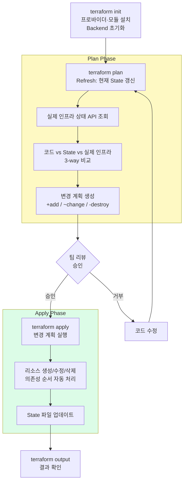

## Terraform 실행 흐름 전체 그림



---

## terraform init의 역할

`init`은 단순히 "시작 버튼"이 아닙니다. 세 가지 중요한 작업을 합니다.

### 1. Provider 플러그인 설치

```bash
$ terraform init

Initializing provider plugins...
- Finding hashicorp/aws versions matching "~> 5.0"...
- Installing hashicorp/aws v5.31.0...
- Installed hashicorp/aws v5.31.0 (signed by HashiCorp)

# 생성되는 파일:
# .terraform/providers/registry.terraform.io/hashicorp/aws/5.31.0/darwin_arm64/terraform-provider-aws_v5.31.0_x5
# .terraform.lock.hcl  ← Provider 버전 고정
```

### 2. Backend 초기화

```bash
# Remote Backend 설정 시
Initializing the backend...

Successfully configured the backend "s3"! Terraform will automatically
use this backend unless the backend configuration changes.
```

### 3. 모듈 다운로드

```bash
Initializing modules...
- vpc in git::https://github.com/terraform-aws-modules/terraform-aws-vpc.git
- eks in git::https://github.com/terraform-aws-modules/terraform-aws-eks.git
```

**언제 다시 실행?**
- Provider 버전 변경 시
- Backend 설정 변경 시
- 새 모듈 추가 시
- `.terraform/` 디렉토리 삭제 후

---

## plan이 중요한 이유

`terraform plan`은 Terraform에서 가장 중요한 안전장치입니다.

### 실제 plan 출력 읽는 법

```
$ terraform plan

Terraform will perform the following actions:

  # aws_instance.web will be updated in-place     ← ~ (update)
  ~ resource "aws_instance" "web" {
        id            = "i-0abc123def456"
      ~ instance_type = "t3.micro" -> "t3.small"  ← 이 속성만 변경
        tags          = { ... }
    }

  # aws_security_group.web will be replaced        ← -/+ (replace!)
  -/+ resource "aws_security_group" "web" {
      ~ name = "web-sg" -> "web-sg-v2"             ← 이름 변경은 재생성!
        # (forces replacement)
    }

  # aws_s3_bucket.logs will be destroyed           ← - (destroy)
  - resource "aws_s3_bucket" "logs" {
      - bucket = "my-logs-bucket"
      ...
    }

Plan: 0 to add, 1 to change, 1 to destroy.
# ↑ 이 한 줄로 전체 영향도를 파악
```

**기호 의미:**

| 기호 | 의미 | 주의 수준 |
|------|------|---------|
| `+` | 새로 생성 | 낮음 |
| `~` | 속성 변경 (in-place) | 중간 |
| `-` | 삭제 | 높음 |
| `-/+` | 삭제 후 재생성 | **매우 높음** |


**`-/+` replace는 반드시 검토하세요.** 일부 리소스 속성 변경은 AWS에서 in-place update가 불가능해 Terraform이 삭제 후 재생성합니다. 특히 **RDS, ElastiCache, Security Group name** 등은 재생성 시 다운타임이 발생할 수 있습니다.


---

## apply 전 검토 포인트 체크리스트


**apply 실행 전 이 체크리스트를 확인하세요**

- [ ] `Plan:` 라인의 숫자가 예상과 일치하는가?
- [ ] `-/+` replace 항목이 있는가? (있다면 의도한 것인가?)
- [ ] `-` destroy 항목이 있는가? (데이터 손실 위험은 없는가?)
- [ ] 예상보다 많은 리소스가 변경되는가? (의존성 연쇄 변경 확인)
- [ ] 올바른 환경(dev/staging/prod)에서 실행하는가?
- [ ] Remote Backend가 올바르게 설정되어 있는가?


---

## destroy를 언제 어떻게 써야 하는가

```bash
# 전체 삭제 - 개발 환경 정리 시
terraform destroy

# 특정 리소스만 삭제 - 주의해서 사용
terraform destroy -target=aws_instance.web

# 삭제 전 plan으로 확인
terraform plan -destroy
```

**destroy를 써야 할 때:**
- 실습 환경 완전 정리
- 더 이상 필요 없는 서비스 종료
- 개발팀 임시 환경 주기적 정리

**destroy를 쓰면 안 될 때:**
- 운영 환경에서 단독 실행 (`-target` 없이)
- 데이터가 있는 RDS, S3 (삭제 전 백업 필수)
- 다른 팀이 참조하는 공유 인프라


**운영 환경 보호**: `prevent_destroy = true` lifecycle 설정으로 실수로 인한 삭제를 방지합니다.

```hcl
resource "aws_db_instance" "main" {
  # ...
  lifecycle {
    prevent_destroy = true
  }
}
```

`prevent_destroy = true`가 설정된 리소스를 삭제하려 하면 Terraform이 오류를 발생시킵니다.


→ 다음: [의존성 이해](dependencies)
