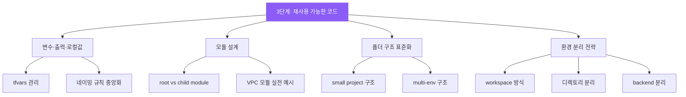

## 왜 재사용 가능한 코드가 중요한가

"돌아가는 코드"는 누구나 작성할 수 있습니다. 하지만 실무에서는 **계속 수정 가능하고, 팀 전체가 반복 활용할 수 있는 구조**가 진짜 가치입니다.

하드코딩된 값이 가득한 Terraform 코드는 처음엔 빠르게 느껴지지만, 환경이 늘어나고 팀이 커질수록 유지보수 비용이 폭발합니다. 이 단계에서는 변수·모듈·폴더 구조·환경 분리를 통해 **팀 표준 템플릿**을 만드는 방법을 다룹니다.

## 이 단계에서 다루는 내용

## 이 단계의 산출물

이 단계를 마치면 다음을 할 수 있습니다.

- 재사용 가능한 모듈형 코드를 작성할 수 있음
- 환경별 배포 구조를 설계할 수 있음
- 작은 팀 기준 표준 템플릿을 작성할 수 있음
