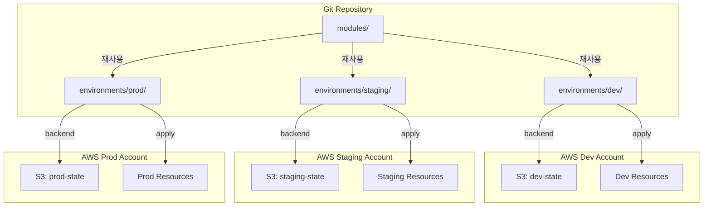

## 왜 환경 분리가 필요한가

dev에서 테스트한 코드가 prod에 즉시 반영되면 안 됩니다. 환경별로 인프라 크기, 설정, 비용이 다르고, 무엇보다 **실수의 영향 범위를 통제**해야 합니다. 환경 분리는 이를 위한 첫 번째 방어선입니다.

---

## 방식 1: Workspace 방식

Terraform workspace는 하나의 코드로 여러 state를 관리하는 기능입니다.

```bash
terraform workspace new dev
terraform workspace new prod
terraform workspace select dev
terraform apply
```

코드에서 workspace 이름으로 분기합니다.

```hcl
locals {
  is_prod = terraform.workspace == "prod"
  instance_type = local.is_prod ? "t3.medium" : "t3.micro"
}

resource "aws_instance" "web" {
  instance_type = local.instance_type
}
```

### 장점
- 단일 코드베이스 유지
- 빠른 환경 전환
- 구조 단순

### 단점
- 코드 내 조건 분기가 복잡해짐
- 실수로 prod workspace에서 apply 가능
- state 파일이 분리되나 backend 설정은 공유
- 팀 규모가 커질수록 관리 어려움


**workspace는 소규모 팀의 임시 해결책**으로 적합합니다. 환경 간 인프라 구성 차이가 클수록 workspace 방식은 복잡도가 급격히 증가합니다.


---

## 방식 2: 디렉토리 분리 방식

환경별로 독립된 디렉토리를 만들고, 각각 독립적으로 `init`/`apply`합니다.

```
environments/
├── dev/
│   ├── main.tf
│   └── terraform.tfvars
├── staging/
│   ├── main.tf
│   └── terraform.tfvars
└── prod/
    ├── main.tf
    └── terraform.tfvars
```

### 장점
- 환경 완전 독립 — prod apply 시 dev state에 영향 없음
- 환경별 다른 리소스 구성 가능
- CI/CD 파이프라인 연결이 명확

### 단점
- 공통 코드 중복 발생 (모듈로 해결)
- 환경 추가 시 디렉토리 복사 필요
- 환경 간 코드 동기화 주의 필요


**실무 권장**: 대부분의 팀은 이 방식을 사용합니다. 공통 코드는 `modules/`로 분리하고, 환경별 디렉토리에서 모듈을 호출하는 구조가 가장 안정적입니다.


---

## 방식 3: Backend 분리 방식

각 환경이 완전히 독립된 AWS 계정 또는 GCP 프로젝트를 사용하고, backend도 별도로 운영합니다.

```hcl
# environments/dev/backend.tf
terraform {
  backend "s3" {
    bucket  = "mycompany-terraform-state-dev"
    key     = "infrastructure/terraform.tfstate"
    region  = "ap-northeast-2"
    encrypt = true
  }
}

# environments/prod/backend.tf
terraform {
  backend "s3" {
    bucket  = "mycompany-terraform-state-prod"
    key     = "infrastructure/terraform.tfstate"
    region  = "ap-northeast-2"
    encrypt = true
  }
}
```

### 장점
- 완전한 환경 격리 (계정 분리 시 보안 경계 확보)
- prod state에 dev가 절대 접근 불가
- 클라우드 비용 분리 명확

### 단점
- 설정 복잡도 증가
- 다중 계정 관리 필요
- 초기 설정 비용 높음

---

## 비교 표: 언제 어떤 방식을 써야 하는가

| 기준 | Workspace | 디렉토리 분리 | Backend 분리 |
|------|-----------|--------------|--------------|
| 팀 규모 | 1~3명 | 3~20명 | 20명 이상 |
| 환경 수 | 2~3개 | 2~5개 | 제한 없음 |
| 보안 요구사항 | 낮음 | 중간 | 높음 |
| 환경 간 구성 차이 | 적음 | 보통 | 큼 |
| 규제/컴플라이언스 | 불필요 | 선택적 | 필수인 경우 |
| 설정 복잡도 | 낮음 | 중간 | 높음 |

---

## 환경 분리 아키텍처 (디렉토리 방식 기준)



---

## 추천 방식과 이유

**스타트업·소규모 팀**: 디렉토리 분리 방식으로 시작하세요. 단순하고 직관적이며, 나중에 계정 분리로 마이그레이션하기도 쉽습니다.

**중규모 팀**: 디렉토리 분리 + 환경별 AWS 계정 분리를 조합합니다. 보안 경계와 비용 분리가 명확해집니다.

**엔터프라이즈**: Backend 분리 + Landing Zone 구조로 멀티 계정을 체계적으로 관리합니다.


**핵심 원칙**: 어떤 방식을 선택하든, **prod는 항상 명시적인 승인 후에만 apply**되어야 합니다. 자동화 파이프라인에서도 prod apply 전에는 반드시 수동 승인 단계를 두세요.

