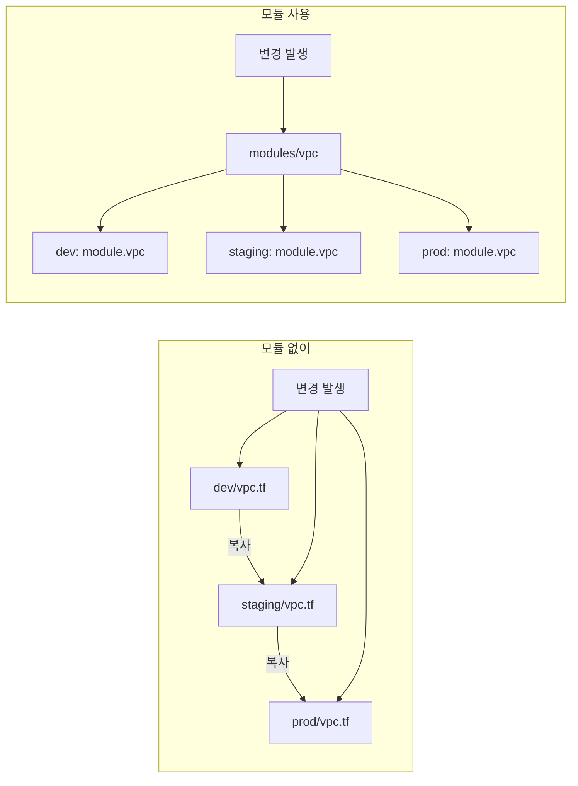

## 모듈이 필요한 이유

VPC를 dev, staging, prod 세 환경에 동일하게 만들어야 한다고 가정합시다. 모듈 없이 구성하면 같은 코드를 세 번 복사합니다. 하나를 수정하면 세 군데를 다 고쳐야 합니다.



모듈을 쓰면 변경은 **한 곳**에서만 합니다. 세 환경 모두에 즉시 반영됩니다.

---

## root module vs child module

Terraform의 모든 코드는 모듈입니다. 구조는 두 종류입니다.

| 구분 | 설명 |
|------|------|
| **root module** | `terraform init`을 실행하는 최상위 디렉토리의 `.tf` 파일 묶음 |
| **child module** | root module이 `module` 블록으로 호출하는 하위 디렉토리 |

```
terraform-project/
├── main.tf          ← root module
├── variables.tf
├── outputs.tf
└── modules/
    ├── vpc/         ← child module
    │   ├── main.tf
    │   ├── variables.tf
    │   └── outputs.tf
    └── ec2/         ← child module
        ├── main.tf
        ├── variables.tf
        └── outputs.tf
```

---

## 모듈 입력/출력 설계

모듈은 **인터페이스**를 명확히 정의해야 합니다. 입력(variables.tf)과 출력(outputs.tf)이 그 인터페이스입니다.

```hcl
# modules/vpc/variables.tf
variable "vpc_cidr" {
  description = "VPC CIDR 블록"
  type        = string
}

variable "environment" {
  description = "배포 환경"
  type        = string
}

variable "public_subnet_cidrs" {
  description = "퍼블릭 서브넷 CIDR 목록"
  type        = list(string)
  default     = ["10.0.1.0/24", "10.0.2.0/24"]
}
```

```hcl
# modules/vpc/outputs.tf
output "vpc_id" {
  description = "생성된 VPC ID"
  value       = aws_vpc.main.id
}

output "public_subnet_ids" {
  description = "퍼블릭 서브넷 ID 목록"
  value       = aws_subnet.public[*].id
}
```

---

## 실전 모듈 예시: VPC 모듈

```hcl
# modules/vpc/main.tf
resource "aws_vpc" "main" {
  cidr_block           = var.vpc_cidr
  enable_dns_hostnames = true
  enable_dns_support   = true

  tags = {
    Name        = "${var.environment}-vpc"
    Environment = var.environment
    ManagedBy   = "terraform"
  }
}

resource "aws_subnet" "public" {
  count             = length(var.public_subnet_cidrs)
  vpc_id            = aws_vpc.main.id
  cidr_block        = var.public_subnet_cidrs[count.index]
  availability_zone = data.aws_availability_zones.available.names[count.index]

  map_public_ip_on_launch = true

  tags = {
    Name        = "${var.environment}-public-${count.index + 1}"
    Environment = var.environment
    Type        = "public"
  }
}

resource "aws_internet_gateway" "main" {
  vpc_id = aws_vpc.main.id

  tags = {
    Name = "${var.environment}-igw"
  }
}
```

모듈을 호출하는 root module:

```hcl
# main.tf (root module)
module "vpc_dev" {
  source      = "./modules/vpc"
  vpc_cidr    = "10.0.0.0/16"
  environment = "dev"
}

module "vpc_prod" {
  source      = "./modules/vpc"
  vpc_cidr    = "10.1.0.0/16"
  environment = "prod"
  public_subnet_cidrs = ["10.1.1.0/24", "10.1.2.0/24", "10.1.3.0/24"]
}
```

---

## 모듈을 너무 잘게 쪼개면 생기는 문제


**과분리 안티패턴**

보안 그룹 하나에 모듈 하나, 서브넷 하나에 모듈 하나처럼 지나치게 세분화하면:

- `module.sg_web`, `module.sg_api`, `module.sg_db`를 각각 init/apply해야 함
- 의존성 추적이 어렵고, 단순 변경에도 여러 모듈을 건드려야 함
- 코드는 늘어나는데 재사용성은 오히려 낮아짐

**기준:** 논리적으로 함께 배포되고 함께 변경되는 리소스를 하나의 모듈로 묶으세요.


---

## 좋은 모듈 설계 원칙

1. **단일 책임**: 모듈은 하나의 논리적 기능 단위를 담당 (VPC, EC2 클러스터, RDS 등)
2. **안정적인 인터페이스**: variables.tf와 outputs.tf를 먼저 설계, 내부 구현은 숨김
3. **기본값 활용**: 자주 쓰는 설정엔 안전한 기본값을 제공
4. **description 필수**: 모든 variable과 output에 description 작성
5. **테스트 고려**: 모듈이 독립적으로 배포·테스트 가능한 단위인지 확인


**팁: 공개 모듈 레지스트리 활용**

AWS, GCP, Azure 벤더와 커뮤니티가 관리하는 공식 모듈이 [Terraform Registry](https://registry.terraform.io/)에 있습니다. VPC, EKS, RDS 같은 복잡한 모듈은 직접 만들기 전에 레지스트리를 먼저 확인하세요.

```hcl
module "vpc" {
  source  = "terraform-aws-modules/vpc/aws"
  version = "5.0.0"

  name = "my-vpc"
  cidr = "10.0.0.0/16"
}
```

