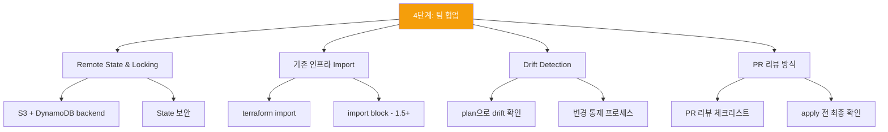

## 혼자 쓸 때와 팀으로 쓸 때의 차이

혼자 Terraform을 쓸 때는 로컬에서 apply하고 state 파일을 관리해도 괜찮습니다. 하지만 **팀으로 쓰는 순간**, 여러 문제가 생깁니다.

- 두 명이 동시에 apply하면 state 충돌이 발생합니다
- 누군가 콘솔에서 직접 수정하면 코드와 실제 인프라가 달라집니다
- 기존에 수동으로 만든 리소스는 Terraform이 모릅니다
- 누가 언제 무엇을 배포했는지 알기 어렵습니다

이 단계에서는 이 모든 문제를 다룹니다.

## 이 단계에서 다루는 내용

## 이 단계의 산출물

이 단계를 마치면 다음을 할 수 있습니다.

- 팀 단위 Terraform 운영 기본기를 갖춤
- state 사고를 예방할 수 있음
- 기존 인프라를 Terraform으로 전환하는 감을 익힘
- PR 리뷰에서 위험한 변경을 식별할 수 있음
