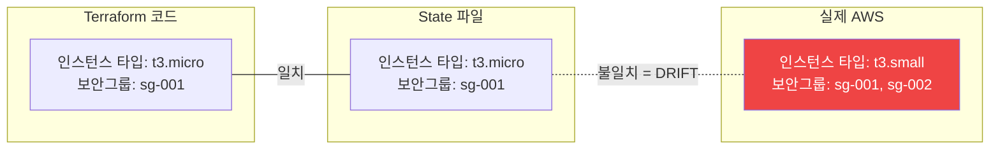
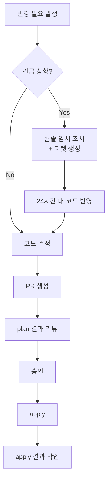

## Drift란 무엇인가

**Drift**는 Terraform 코드가 정의한 상태와 실제 인프라 상태가 달라진 것을 말합니다. 가장 흔한 원인은 AWS 콘솔에서 직접 리소스를 수정하는 것입니다.



---

## 콘솔 수동 변경이 왜 위험한가

1. **예상치 못한 되돌림**: 다음 `terraform apply` 시 코드 상태로 강제 복원됩니다. 긴급 패치가 사라질 수 있습니다.
2. **감사 불가**: 누가 언제 무엇을 바꿨는지 추적이 어렵습니다. Terraform apply 로그엔 기록이 없습니다.
3. **팀 신뢰 붕괴**: "코드가 실제 인프라"라는 전제가 무너지면, 모든 plan 결과를 믿을 수 없게 됩니다.
4. **연쇄 실패**: drift된 리소스에 의존하는 다른 리소스가 있을 때, apply가 예상치 못하게 실패합니다.

---

## terraform plan으로 drift 확인하는 방법

`terraform plan`은 코드와 state, 실제 인프라를 비교합니다. drift가 있으면 변경 사항으로 표시됩니다.

```bash
terraform plan -refresh-only   # 코드 변경 없이 실제 인프라 상태만 확인
```

출력 예시 (drift 감지):
```
~ aws_instance.web will be updated in-place
  ~ instance_type = "t3.micro" -> "t3.small"   # 콘솔에서 변경됨
  + tags = {
    + "TemporaryFix" = "true"                   # 콘솔에서 추가된 태그
  }

Plan: 0 to add, 1 to change, 0 to destroy.
```

---

## Drift 복구 전략

두 가지 방법이 있습니다.

### 방법 1: 코드를 실제 상태에 맞춤 (콘솔 변경을 유지)

```bash
# 현재 실제 상태를 state에 반영
terraform apply -refresh-only

# 이후 코드를 실제 상태에 맞게 수정
```

긴급 수정이 필요했고 그 변경이 유효한 경우 사용합니다.

### 방법 2: 실제 상태를 코드에 맞춤 (콘솔 변경을 되돌림)

```bash
terraform apply  # 코드대로 되돌림
```

수동 변경이 잘못된 것이고 코드가 올바른 경우 사용합니다.


**방법 선택은 반드시 팀 논의 후 결정하세요.** 무조건 코드로 되돌리면 운영 중인 임시 수정이 사라져서 장애가 발생할 수 있습니다.


---

## 변경 통제 프로세스 설계

drift를 방지하려면 **인프라 변경은 반드시 코드로만** 한다는 원칙을 팀이 합의해야 합니다.



---

## 조직 정책: 콘솔 변경 금지 가이드라인

강력한 drift 방지를 위한 조직 수준 통제 방법입니다.

### AWS Service Control Policy (SCP) 예시

```json
{
  "Version": "2012-10-17",
  "Statement": [
    {
      "Sid": "DenyConsoleEC2Changes",
      "Effect": "Deny",
      "Action": [
        "ec2:ModifyInstanceAttribute",
        "ec2:RunInstances",
        "ec2:TerminateInstances"
      ],
      "Resource": "*",
      "Condition": {
        "StringNotEquals": {
          "aws:PrincipalArn": [
            "arn:aws:iam::*:role/TerraformDeployRole"
          ]
        }
      }
    }
  ]
}
```

Terraform이 사용하는 IAM 역할만 인프라 변경이 가능하도록 제한합니다.

### 팀 운영 가이드라인

| 상황 | 허용 여부 | 조치 |
|------|-----------|------|
| 개발 중 테스트 | 허용 (dev만) | 코드 반영 후 삭제 |
| 장애 임시 대응 | 제한적 허용 | 24시간 내 코드 반영 필수 |
| 운영 변경 | 불허 | PR → 리뷰 → apply |
| prod 직접 수정 | 절대 불허 | 파이프라인으로만 |


**정기 Drift 검사**: CI/CD에 `terraform plan -refresh-only`를 주기적으로 실행하는 job을 추가하면, drift가 발생했을 때 자동으로 알림을 받을 수 있습니다.

