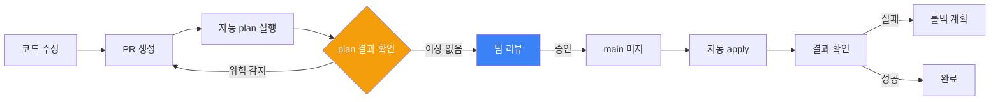

## PR 리뷰가 중요한 이유

Terraform apply는 실제 인프라를 변경합니다. 코드 버그는 수정 후 재배포하면 되지만, 잘못된 인프라 변경은 데이터 손실이나 서비스 중단으로 이어집니다. PR 리뷰는 apply 전 마지막 안전망입니다.

---

## 배포 흐름



---

## PR 리뷰 체크리스트

### 코드 품질

- [ ] 변수에 `description`이 있는가
- [ ] 하드코딩된 값 없이 변수·로컬값을 사용했는가
- [ ] 리소스 이름 규칙(네이밍 컨벤션)을 따르는가
- [ ] 필수 태그(Environment, ManagedBy, Owner)가 있는가
- [ ] 민감 변수에 `sensitive = true`가 붙어 있는가

### plan 결과 검토

- [ ] 예상한 리소스만 변경되는가 (의도치 않은 변경 없음)
- [ ] `destroy` 항목이 있다면 의도된 것인가
- [ ] `must be replaced` 표시된 리소스가 있다면 영향도를 파악했는가
- [ ] plan에서 오류나 경고 메시지는 없는가

### 보안

- [ ] 보안 그룹에 `0.0.0.0/0` 인바운드 규칙이 없는가
- [ ] S3 버킷이 public으로 설정되지 않았는가
- [ ] IAM 권한이 최소 권한 원칙을 따르는가
- [ ] 민감 정보(패스워드, 키)가 코드에 직접 포함되지 않았는가

### 비용

- [ ] 고비용 인스턴스 타입(m5.xlarge 이상 등)이 추가되는가
- [ ] 불필요한 리소스 복제가 없는가
- [ ] prod가 아닌 환경에서 운영 규모 리소스를 사용하는가

---

## plan 결과 읽는 방법

```
Terraform will perform the following actions:

  # aws_instance.web will be updated in-place    ← 교체 없이 수정
  ~ resource "aws_instance" "web" {
      ~ instance_type = "t3.micro" -> "t3.small"  ← ~ : 변경
        id            = "i-0123456789abcdef0"
    }

  # aws_security_group.api must be replaced      ← 재생성!
-/+ resource "aws_security_group" "api" {
      ~ id   = "sg-0abc" -> (known after apply)
      ~ name = "api-sg" -> "api-sg-v2"            # forces replacement
    }

  # aws_s3_bucket.logs will be destroyed         ← 삭제!
  - resource "aws_s3_bucket" "logs" {
      - id = "mycompany-logs"
    }

Plan: 0 to add, 2 to change, 1 to destroy.
```

| 기호 | 의미 | 주의 수준 |
|------|------|----------|
| `+` | 리소스 생성 | 낮음 |
| `~` | 리소스 수정 (in-place) | 중간 |
| `-` | 리소스 삭제 | 높음 |
| `-/+` | 리소스 삭제 후 재생성 | 매우 높음 |

---

## 위험한 변경사항 식별


**`must be replaced`는 가장 위험한 신호입니다.**

리소스가 삭제되고 새로 만들어집니다. RDS 인스턴스, ElasticSearch, 메시지 큐 등이 `must be replaced`로 표시되면 **데이터 손실 가능성**을 반드시 확인하세요.

```bash
# 특정 리소스만 apply (범위 제한)
terraform apply -target=aws_security_group.api
```


### 재생성 없이 변경하는 방법

일부 속성 변경은 `lifecycle` 블록으로 재생성을 피할 수 있습니다.

```hcl
resource "aws_security_group" "api" {
  name        = "api-sg-v2"
  description = "API 서버 보안 그룹"

  lifecycle {
    create_before_destroy = true  # 새 리소스 먼저 만들고 기존 것 삭제
  }
}
```

---

## apply 전 최종 체크리스트

apply 버튼을 누르기 전 마지막으로 확인할 사항입니다.

### 환경 확인

- [ ] 올바른 환경 디렉토리에 있는가 (`pwd` 확인)
- [ ] 올바른 AWS 계정/프로필이 설정되어 있는가 (`aws sts get-caller-identity`)
- [ ] 올바른 Terraform workspace인가 (`terraform workspace show`)

### 변경 확인

- [ ] 방금 다시 `terraform plan`을 실행해 결과를 확인했는가
- [ ] 리뷰어의 승인을 받았는가
- [ ] 트래픽이 낮은 시간대인가 (prod의 경우)

### 롤백 계획

- [ ] apply 실패 시 롤백 방법을 알고 있는가
- [ ] 영향받는 서비스 담당자에게 공지했는가
- [ ] 모니터링 대시보드를 열어 놓았는가


**apply 후 반드시 확인하세요**

```bash
terraform show          # 현재 state 전체 확인
terraform output        # output 값 확인
terraform plan          # 변경 후 plan이 "No changes"인지 확인
```

apply 직후 다시 plan을 실행해 아무 변경도 없으면 정상 배포된 것입니다.

