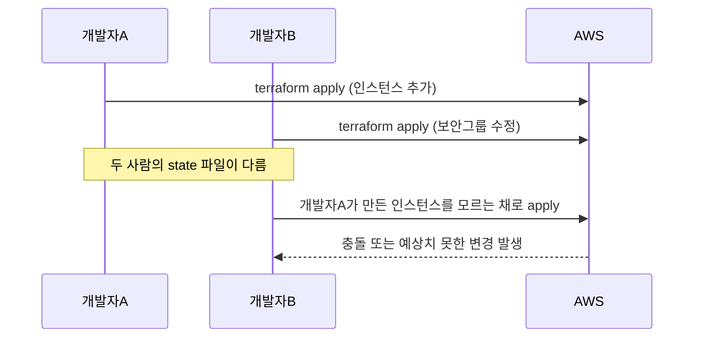

## 로컬 state의 한계

로컬에서 Terraform을 실행하면 `terraform.tfstate` 파일이 내 컴퓨터에 저장됩니다. 혼자라면 문제없지만, 팀으로 작업하면 즉시 충돌이 발생합니다.



이 문제를 해결하는 것이 **Remote State**입니다.

---

## Remote Backend 설정 (AWS S3 + DynamoDB)

S3에 state를 저장하고, DynamoDB로 잠금(locking)을 관리합니다.

### 1단계: S3 버킷과 DynamoDB 테이블 생성

```hcl
# bootstrap/main.tf — state 저장소 자체를 Terraform으로 관리
resource "aws_s3_bucket" "terraform_state" {
  bucket = "mycompany-terraform-state"

  lifecycle {
    prevent_destroy = true  # 실수로 삭제 방지
  }
}

resource "aws_s3_bucket_versioning" "terraform_state" {
  bucket = aws_s3_bucket.terraform_state.id
  versioning_configuration {
    status = "Enabled"
  }
}

resource "aws_s3_bucket_server_side_encryption_configuration" "terraform_state" {
  bucket = aws_s3_bucket.terraform_state.id
  rule {
    apply_server_side_encryption_by_default {
      sse_algorithm = "AES256"
    }
  }
}

resource "aws_dynamodb_table" "terraform_lock" {
  name         = "terraform-state-lock"
  billing_mode = "PAY_PER_REQUEST"
  hash_key     = "LockID"

  attribute {
    name = "LockID"
    type = "S"
  }
}
```

### 2단계: backend 설정

```hcl
# backend.tf
terraform {
  backend "s3" {
    bucket         = "mycompany-terraform-state"
    key            = "environments/prod/terraform.tfstate"
    region         = "ap-northeast-2"
    encrypt        = true
    dynamodb_table = "terraform-state-lock"
  }
}
```

```bash
terraform init  # 로컬 state를 S3로 마이그레이션
```

---

## State Locking 동작 방식

apply가 시작되면 DynamoDB에 잠금 레코드가 생성됩니다. 다른 사람이 동시에 apply를 시도하면 잠금 오류가 발생합니다.

```
Error: Error locking state: Error acquiring the state lock:
  ConditionalCheckFailedException: The conditional request failed
Lock Info:
  ID:        abc123
  Path:      environments/prod/terraform.tfstate
  Operation: OperationTypeApply
  Who:       developer-A@macbook
  Version:   1.6.0
  Created:   2024-01-15 09:30:00
  Info:
```

이 경우 기다렸다가 재시도하거나, 잠금을 강제로 해제합니다 (주의 필요).

```bash
terraform force-unlock abc123  # 반드시 상황 확인 후 사용
```

---

## State 보안

State 파일에는 민감한 정보가 포함될 수 있습니다. DB 패스워드, API 키, 인증서 등이 **평문으로 저장**됩니다.

### 필수 보안 설정

```hcl
# S3 버킷 공개 접근 차단
resource "aws_s3_bucket_public_access_block" "terraform_state" {
  bucket = aws_s3_bucket.terraform_state.id

  block_public_acls       = true
  block_public_policy     = true
  ignore_public_acls      = true
  restrict_public_buckets = true
}
```

### 접근 권한 최소화 (IAM 정책)

```json
{
  "Version": "2012-10-17",
  "Statement": [
    {
      "Effect": "Allow",
      "Action": ["s3:GetObject", "s3:PutObject", "s3:DeleteObject"],
      "Resource": "arn:aws:s3:::mycompany-terraform-state/environments/dev/*"
    },
    {
      "Effect": "Allow",
      "Action": ["dynamodb:GetItem", "dynamodb:PutItem", "dynamodb:DeleteItem"],
      "Resource": "arn:aws:dynamodb:ap-northeast-2:*:table/terraform-state-lock"
    }
  ]
}
```


**절대 하지 말아야 할 것**

- `terraform.tfstate`를 Git에 커밋하지 마세요
- State S3 버킷을 public으로 설정하지 마세요
- prod state에 개발자 전원이 직접 접근 가능하게 하지 마세요

State 파일이 유출되면 인프라 구성 전체와 민감 정보가 노출됩니다.


---

## State 백업 전략

S3 버전 관리(Versioning)를 활성화하면 자동으로 백업됩니다. 잘못된 apply 이후 이전 state로 복구할 수 있습니다.

```bash
# 이전 state 버전 목록 확인 (AWS CLI)
aws s3api list-object-versions \
  --bucket mycompany-terraform-state \
  --prefix environments/prod/terraform.tfstate

# 특정 버전으로 복구
aws s3api get-object \
  --bucket mycompany-terraform-state \
  --key environments/prod/terraform.tfstate \
  --version-id <VERSION_ID> \
  terraform.tfstate.backup
```


**실무 팁**: S3 버킷에 lifecycle 규칙을 설정해 30일 이상 된 버전은 자동 삭제하면 스토리지 비용을 줄일 수 있습니다. 단, 최소 7~14일분은 보관하세요.

