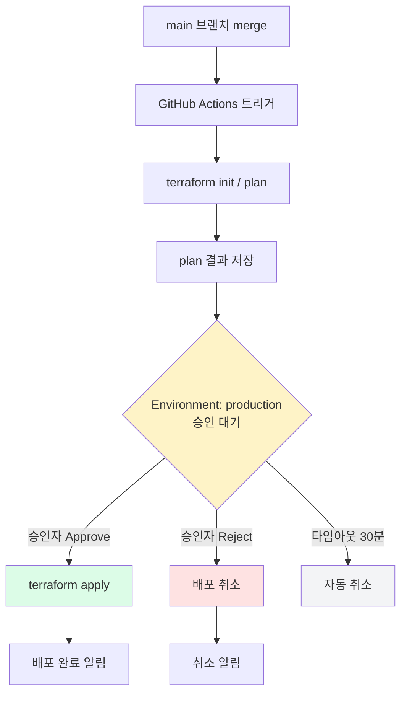
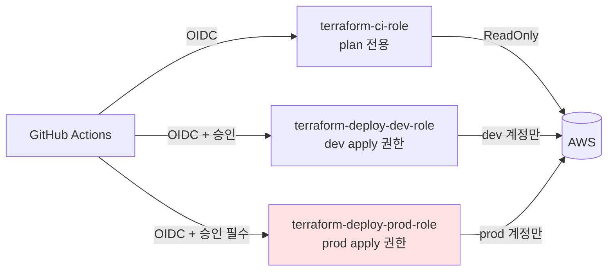
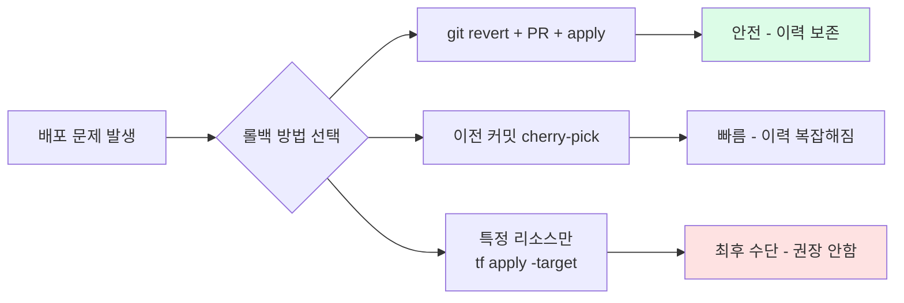

## 왜 승인 기반 배포가 필요한가

자동화된 apply는 편리하지만 위험합니다. 특히 **prod 환경**에서는 반드시 사람의 검토와 승인이 있어야 합니다.

| 자동 apply | 승인 기반 apply |
|-----------|----------------|
| merge되면 즉시 실행 | 승인자가 확인 후 실행 |
| 실수 즉시 반영 | 검토 시간 확보 가능 |
| 감사 추적 어려움 | 승인자 기록 자동 저장 |
| 긴급 중단 어려움 | 승인 취소로 배포 중단 가능 |

## GitHub Environments로 Approval Gate 설정

GitHub Environments는 특정 환경(prod 등)에 배포할 때 **지정된 사람의 승인**을 요구하도록 설정할 수 있습니다.

**설정 경로:** Repository → Settings → Environments → New environment



**Environment 설정 항목:**

```
환경 이름: production
Required reviewers: @devops-team (또는 특정 팀원)
Wait timer: 0분 (즉시 승인 가능)
Deployment branches: main만 허용
```

**워크플로우에 Environment 적용:**

```yaml
jobs:
  plan:
    name: Plan
    runs-on: ubuntu-latest
    outputs:
      plan_exit_code: ${{ steps.plan.outputs.exit_code }}
    steps:
      - uses: actions/checkout@v4
      # ... init, plan 단계 ...

  apply:
    name: Apply
    runs-on: ubuntu-latest
    needs: plan
    environment: production    # ← 이 한 줄로 승인 게이트 활성화
    if: github.ref == 'refs/heads/main'

    steps:
      - uses: actions/checkout@v4
      - name: Configure AWS Credentials
        uses: aws-actions/configure-aws-credentials@v4
        with:
          role-to-assume: arn:aws:iam::${{ secrets.AWS_ACCOUNT_ID }}:role/terraform-deploy-role
          aws-region: ap-northeast-2

      - name: Setup Terraform
        uses: hashicorp/setup-terraform@v3

      - name: terraform init
        run: terraform init

      - name: terraform apply
        run: terraform apply -auto-approve
```

## 환경별 배포 권한 제한

각 환경에 다른 IAM Role을 사용해 권한을 분리합니다.



**IAM Role 정책 예시 (plan 전용 role):**

```hcl
data "aws_iam_policy_document" "terraform_ci_policy" {
  statement {
    effect = "Allow"
    actions = [
      "ec2:Describe*",
      "s3:GetObject",
      "s3:ListBucket",
      "iam:GetRole",
      "iam:ListRoles",
    ]
    resources = ["*"]
  }
}
```

## 병렬 실행 통제 (Concurrency Groups)

같은 환경에 동시에 여러 배포가 실행되면 state locking 충돌이 발생합니다. `concurrency` 설정으로 이를 방지합니다.

```yaml
jobs:
  apply:
    name: Apply to Production
    runs-on: ubuntu-latest
    environment: production
    concurrency:
      group: terraform-production    # 같은 그룹은 동시 실행 불가
      cancel-in-progress: false      # 진행 중인 배포는 취소하지 않음
```


`cancel-in-progress: true`로 설정하면 진행 중인 apply가 강제 중단됩니다. apply 도중 중단은 state 불일치를 유발할 수 있으므로 `false`를 권장합니다.


## 롤백 전략

Terraform은 기본적으로 자동 롤백이 없습니다. 롤백은 **이전 코드로 되돌리는 방식**으로 처리합니다.



**실전 롤백 절차:**

```bash
# 1. 문제가 된 커밋 확인
git log --oneline -5

# 2. revert 커밋 생성
git revert <commit-hash>

# 3. PR 생성 후 빠른 승인 (긴급 변경 트랙)
# 4. merge 후 자동 plan → 승인 → apply
```


긴급 상황을 위한 별도 Environment(예: `production-emergency`)를 만들어두고, 승인자를 더 넓게 설정하거나 wait timer를 0으로 두는 방식으로 빠른 롤백 경로를 준비해두면 유용합니다.

