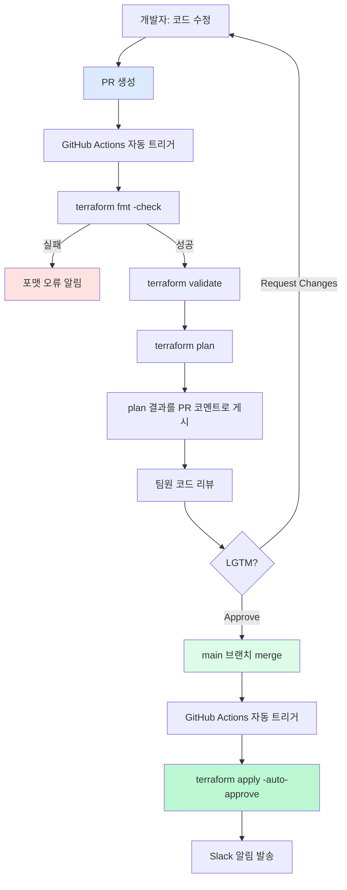
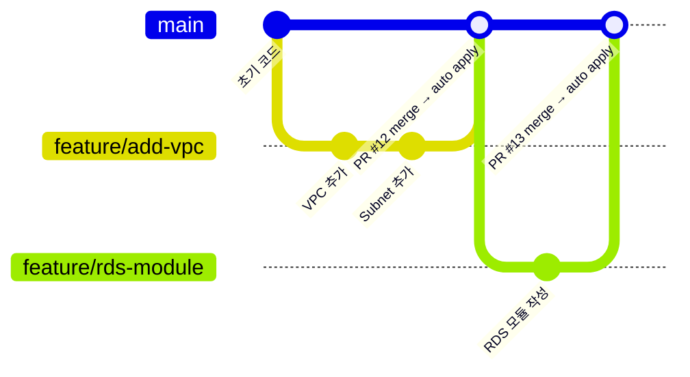

## 왜 CI/CD로 Terraform을 연결해야 하는가

로컬에서 `terraform apply`를 직접 실행하는 방식에는 구조적인 문제가 있습니다.

| 로컬 실행 방식 | CI/CD 파이프라인 방식 |
|--------------|---------------------|
| 누가 언제 apply 했는지 추적 어려움 | 모든 실행이 로그로 기록됨 |
| 팀원마다 다른 로컬 환경 | 통일된 실행 환경 |
| plan 없이 apply 가능 | 반드시 plan → review → apply 순서 강제 |
| 비밀정보가 로컬에 존재 | CI/CD 환경에서 안전하게 주입 |
| 변경 추적 어려움 | PR과 apply가 1:1로 연결됨 |


**핵심 원칙**: Terraform은 반드시 파이프라인을 통해 apply해야 합니다. 로컬 apply는 긴급 상황을 제외하고 금지하는 것이 실무 표준입니다.


## PR → plan → review → merge → apply 흐름



## 완성형 GitHub Actions 워크플로우

### PR 시 Plan 자동 실행 (`.github/workflows/terraform-plan.yml`)

```yaml
name: Terraform Plan

on:
  pull_request:
    branches: [main]
    paths:
      - '**.tf'
      - '**.tfvars'

permissions:
  contents: read
  pull-requests: write
  id-token: write

jobs:
  terraform-plan:
    name: Terraform Plan
    runs-on: ubuntu-latest
    defaults:
      run:
        working-directory: ./environments/prod

    steps:
      - name: Checkout
        uses: actions/checkout@v4

      - name: Configure AWS Credentials (OIDC)
        uses: aws-actions/configure-aws-credentials@v4
        with:
          role-to-assume: arn:aws:iam::${{ secrets.AWS_ACCOUNT_ID }}:role/terraform-ci-role
          aws-region: ap-northeast-2

      - name: Setup Terraform
        uses: hashicorp/setup-terraform@v3
        with:
          terraform_version: "~1.9"

      - name: Terraform Init
        id: init
        run: terraform init

      - name: Terraform Format Check
        id: fmt
        run: terraform fmt -check -recursive
        continue-on-error: true

      - name: Terraform Validate
        id: validate
        run: terraform validate

      - name: Terraform Plan
        id: plan
        run: terraform plan -no-color -out=tfplan 2>&1 | tee plan_output.txt
        continue-on-error: true

      - name: Post Plan to PR
        uses: actions/github-script@v7
        with:
          script: |
            const fs = require('fs');
            const planOutput = fs.readFileSync('environments/prod/plan_output.txt', 'utf8');
            const truncated = planOutput.length > 60000
              ? planOutput.substring(0, 60000) + '\n\n... (truncated)'
              : planOutput;

            const body = `## Terraform Plan 결과

            #### 포맷 체크: ${{ steps.fmt.outcome == 'success' && '✅ 통과' || '❌ 실패' }}
            #### 유효성 검사: ${{ steps.validate.outcome == 'success' && '✅ 통과' || '❌ 실패' }}
            #### Plan 결과: ${{ steps.plan.outcome == 'success' && '✅ 성공' || '⚠️ 오류 있음' }}

            <details><summary>Plan 상세 결과 보기</summary>

            \`\`\`hcl
            ${truncated}
            \`\`\`

            </details>

            *작성자: @${{ github.actor }}, 커밋: ${{ github.sha }}*`;

            github.rest.issues.createComment({
              issue_number: context.issue.number,
              owner: context.repo.owner,
              repo: context.repo.repo,
              body: body
            });

      - name: Plan 결과 확인
        if: steps.plan.outcome == 'failure'
        run: exit 1
```

### Merge 후 Apply 자동 실행 (`.github/workflows/terraform-apply.yml`)

```yaml
name: Terraform Apply

on:
  push:
    branches: [main]
    paths:
      - '**.tf'
      - '**.tfvars'

permissions:
  contents: read
  id-token: write

jobs:
  terraform-apply:
    name: Terraform Apply
    runs-on: ubuntu-latest
    environment: production
    defaults:
      run:
        working-directory: ./environments/prod

    steps:
      - name: Checkout
        uses: actions/checkout@v4

      - name: Configure AWS Credentials (OIDC)
        uses: aws-actions/configure-aws-credentials@v4
        with:
          role-to-assume: arn:aws:iam::${{ secrets.AWS_ACCOUNT_ID }}:role/terraform-deploy-role
          aws-region: ap-northeast-2

      - name: Setup Terraform
        uses: hashicorp/setup-terraform@v3
        with:
          terraform_version: "~1.9"

      - name: Terraform Init
        run: terraform init

      - name: Terraform Apply
        run: terraform apply -auto-approve

      - name: Slack 알림
        if: always()
        uses: slackapi/slack-github-action@v1
        with:
          payload: |
            {
              "text": "Terraform Apply ${{ job.status }}: ${{ github.repository }} (${{ github.sha }})"
            }
        env:
          SLACK_WEBHOOK_URL: ${{ secrets.SLACK_WEBHOOK_URL }}
```

## GitHub Secrets 설정 방법

리포지토리 → Settings → Secrets and variables → Actions에서 설정합니다.

| Secret 이름 | 설명 | 권장 방식 |
|------------|------|----------|
| `AWS_ACCOUNT_ID` | AWS 계정 ID | OIDC 사용 시 필요 |
| `SLACK_WEBHOOK_URL` | Slack 알림 URL | Incoming Webhook |
| `TF_VAR_db_password` | DB 비밀번호 등 민감값 | Secrets Manager 연계 권장 |


AWS Access Key/Secret Key를 GitHub Secrets에 직접 저장하는 방식은 피하세요. **OIDC(OpenID Connect)** 방식이 훨씬 안전합니다.


## 브랜치 전략과 CI/CD 연계



**권장 브랜치 전략:**
- `main` 브랜치: prod 환경에 직접 연결 (보호된 브랜치)
- `feature/*` 브랜치: 개발용, PR 생성 시 plan 자동 실행
- `hotfix/*` 브랜치: 긴급 수정, 별도 승인 프로세스 적용


Branch Protection Rule 설정: main 브랜치에 `Require status checks to pass before merging` 옵션을 반드시 활성화하세요. plan이 실패하면 merge 자체가 불가능해집니다.

