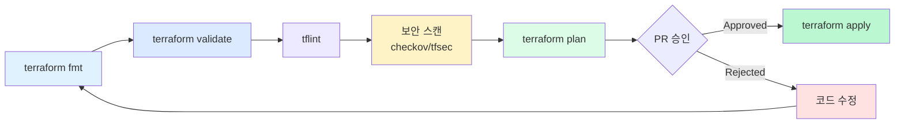

## 파이프라인의 각 단계

실무에서는 단순한 plan/apply 이상의 품질 게이트가 필요합니다. 각 단계는 독립적인 목적이 있으며, 실패 시 다음 단계로 넘어가지 않아야 합니다.



## 1. terraform fmt

코드 포맷을 자동으로 정렬합니다. CI에서는 `fmt -check`로 **포맷이 맞는지만 확인**합니다. 자동 수정은 로컬에서 수행합니다.

```bash
# 로컬: 자동 포맷 적용
terraform fmt -recursive

# CI: 포맷 검사만 (수정하지 않음)
terraform fmt -check -recursive
```


로컬에서 git commit 전에 `terraform fmt`가 자동 실행되도록 pre-commit hook을 설정하면 CI에서 포맷 실패가 나올 일이 없습니다.


## 2. terraform validate

문법 오류와 참조 오류를 검사합니다. provider를 실제로 호출하지 않으므로 빠릅니다.

```bash
terraform init -backend=false   # backend 없이 초기화
terraform validate
```

validate가 잡아주는 오류 예시:
- 존재하지 않는 변수 참조
- 잘못된 리소스 속성
- 타입 불일치

## 3. tflint

Terraform 코드의 **모범 사례 위반**을 잡아냅니다. validate보다 한 단계 높은 수준의 검사입니다.

**설치 및 설정:**

```bash
# macOS
brew install tflint

# tflint 실행
tflint --init
tflint --recursive
```

**`.tflint.hcl` 설정 파일:**

```hcl
plugin "aws" {
  enabled = true
  version = "0.32.0"
  source  = "github.com/terraform-linters/tflint-ruleset-aws"
}

rule "terraform_naming_convention" {
  enabled = true
}

rule "terraform_deprecated_interpolation" {
  enabled = true
}

rule "terraform_unused_declarations" {
  enabled = true
}

rule "aws_instance_invalid_type" {
  enabled = true
}
```

tflint이 잡아주는 문제 예시:
- 폐기된 인스턴스 타입 사용
- 네이밍 컨벤션 위반
- 사용되지 않는 변수 선언

## 4. 보안 스캔 (checkov / tfsec)

Terraform 코드의 **보안 설정 오류**를 자동으로 탐지합니다.

### checkov 사용

```bash
# 설치
pip install checkov

# 실행
checkov -d . --framework terraform

# 특정 검사 제외 (오탐 처리)
checkov -d . --skip-check CKV_AWS_20,CKV_AWS_57
```

### tfsec 사용

```bash
# macOS
brew install tfsec

# 실행
tfsec .

# JSON 출력 (CI 파싱용)
tfsec . --format json
```

**보안 스캔이 탐지하는 문제 예시:**

| 규칙 | 설명 |
|------|------|
| S3 버킷 퍼블릭 접근 허용 | 데이터 노출 위험 |
| Security Group 0.0.0.0/0 허용 | 불필요한 외부 노출 |
| 암호화 미적용 EBS/RDS | 컴플라이언스 위반 |
| 루트 계정 MFA 미설정 | 계정 탈취 위험 |
| 로깅 미설정 CloudTrail | 감사 추적 불가 |

## 완성형 GitHub Actions (전체 파이프라인)

```yaml
name: Terraform CI

on:
  pull_request:
    branches: [main]

permissions:
  contents: read
  pull-requests: write
  id-token: write

env:
  TF_VERSION: "~1.9"
  WORKING_DIR: ./environments/prod

jobs:
  quality-gate:
    name: Quality Gate
    runs-on: ubuntu-latest
    defaults:
      run:
        working-directory: ${{ env.WORKING_DIR }}

    steps:
      - uses: actions/checkout@v4

      - name: Setup Terraform
        uses: hashicorp/setup-terraform@v3
        with:
          terraform_version: ${{ env.TF_VERSION }}

      - name: Setup TFLint
        uses: terraform-linters/setup-tflint@v4

      - name: terraform fmt
        id: fmt
        run: terraform fmt -check -recursive
        continue-on-error: true

      - name: terraform init
        run: terraform init -backend=false

      - name: terraform validate
        id: validate
        run: terraform validate

      - name: tflint init
        run: tflint --init

      - name: tflint
        id: tflint
        run: tflint --recursive --format compact
        continue-on-error: true

      - name: checkov 보안 스캔
        id: checkov
        uses: bridgecrewio/checkov-action@v12
        with:
          directory: ${{ env.WORKING_DIR }}
          framework: terraform
          soft_fail: true
          output_format: cli

  plan:
    name: Terraform Plan
    runs-on: ubuntu-latest
    needs: quality-gate
    defaults:
      run:
        working-directory: ${{ env.WORKING_DIR }}

    steps:
      - uses: actions/checkout@v4

      - name: Configure AWS Credentials
        uses: aws-actions/configure-aws-credentials@v4
        with:
          role-to-assume: arn:aws:iam::${{ secrets.AWS_ACCOUNT_ID }}:role/terraform-ci-role
          aws-region: ap-northeast-2

      - name: Setup Terraform
        uses: hashicorp/setup-terraform@v3
        with:
          terraform_version: ${{ env.TF_VERSION }}

      - name: terraform init
        run: terraform init

      - name: terraform plan
        id: plan
        run: terraform plan -no-color 2>&1 | tee plan_output.txt
        continue-on-error: true

      - name: PR 코멘트 게시
        uses: actions/github-script@v7
        env:
          FMT: ${{ needs.quality-gate.outputs.fmt_outcome }}
        with:
          script: |
            const fs = require('fs');
            const planOutput = fs.readFileSync('${{ env.WORKING_DIR }}/plan_output.txt', 'utf8');

            github.rest.issues.createComment({
              issue_number: context.issue.number,
              owner: context.repo.owner,
              repo: context.repo.repo,
              body: `## Terraform 파이프라인 결과\n\n` +
                    `| 단계 | 결과 |\n` +
                    `|------|------|\n` +
                    `| fmt | ${{ steps.fmt.outcome }} |\n` +
                    `| validate | ${{ steps.validate.outcome }} |\n` +
                    `| tflint | ${{ steps.tflint.outcome }} |\n` +
                    `| plan | ${{ steps.plan.outcome }} |\n\n` +
                    `<details><summary>Plan 결과</summary>\n\n\`\`\`\n${planOutput}\n\`\`\`\n</details>`
            });

      - name: Plan 실패 시 워크플로우 중단
        if: steps.plan.outcome == 'failure'
        run: exit 1
```

## 단계별 실패 시 대응 방법

| 실패 단계 | 원인 | 대응 |
|----------|------|------|
| fmt | 포맷 불일치 | `terraform fmt -recursive` 로컬 실행 후 재push |
| validate | 문법 오류 | 오류 메시지 확인, 변수/리소스 참조 점검 |
| tflint | 모범 사례 위반 | 규칙 확인 후 코드 수정 또는 특정 규칙 예외 처리 |
| 보안 스캔 | 보안 설정 누락 | 지적된 리소스 보안 설정 추가 |
| plan | 권한 부족 / 리소스 충돌 | IAM 권한 확인, state 상태 점검 |


보안 스캔 결과를 `soft_fail: true`로 설정하면 경고만 표시되고 파이프라인은 통과합니다. 초기 도입 시에는 `soft_fail`로 시작해서 점차 강제화하는 것이 현실적인 전략입니다.

