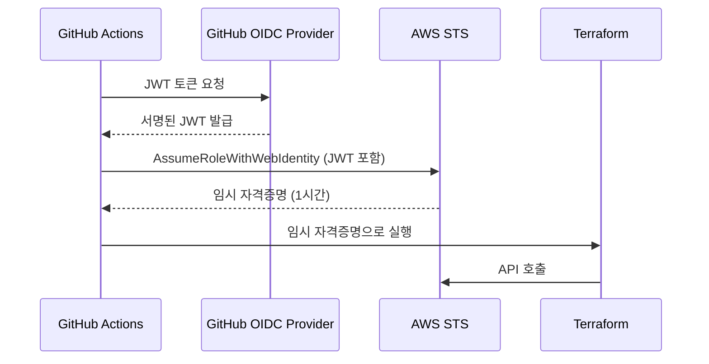

## 비밀정보 노출 위험 유형

Terraform에서 비밀정보가 노출되는 경로는 예상보다 다양합니다.

| 노출 경로 | 예시 | 위험도 |
|----------|------|--------|
| 코드에 하드코딩 | `password = "mypassword123"` | 매우 높음 |
| `.tfvars` 파일 Git 커밋 | `db_password = "secret"` | 높음 |
| `terraform.tfstate` Git 커밋 | state 파일에 평문 저장됨 | 매우 높음 |
| CI 로그 출력 | `TF_VAR_password` 로그 노출 | 중간 |
| 환경변수 노출 | `env | grep TF_VAR` | 중간 |


**`terraform.tfstate` 파일은 절대 Git에 커밋하지 마세요.** State 파일에는 리소스의 모든 속성이 평문으로 저장됩니다. 여기에는 RDS 비밀번호, IAM Access Key 등이 포함될 수 있습니다.


## 클라우드 자격증명 처리: OIDC vs Access Key

### OIDC 방식 (권장)

OIDC(OpenID Connect)는 장기 자격증명(Access Key) 없이 GitHub Actions가 AWS에 임시 인증하는 방식입니다.



**AWS에서 OIDC Identity Provider 설정:**

```hcl
resource "aws_iam_openid_connect_provider" "github" {
  url = "https://token.actions.githubusercontent.com"

  client_id_list = ["sts.amazonaws.com"]

  thumbprint_list = [
    "6938fd4d98bab03faadb97b34396831e3780aea1"
  ]
}

resource "aws_iam_role" "terraform_ci" {
  name = "terraform-ci-role"

  assume_role_policy = jsonencode({
    Version = "2012-10-17"
    Statement = [{
      Effect = "Allow"
      Principal = {
        Federated = aws_iam_openid_connect_provider.github.arn
      }
      Action = "sts:AssumeRoleWithWebIdentity"
      Condition = {
        StringEquals = {
          "token.actions.githubusercontent.com:aud" = "sts.amazonaws.com"
        }
        StringLike = {
          # 특정 리포지토리만 허용
          "token.actions.githubusercontent.com:sub" = "repo:myorg/myrepo:*"
        }
      }
    }]
  })
}
```

**GitHub Actions에서 OIDC 사용:**

```yaml
permissions:
  id-token: write   # OIDC 토큰 발급 권한
  contents: read

steps:
  - name: Configure AWS Credentials
    uses: aws-actions/configure-aws-credentials@v4
    with:
      role-to-assume: arn:aws:iam::123456789012:role/terraform-ci-role
      aws-region: ap-northeast-2
      # Access Key를 사용하지 않음
```

## AWS Secrets Manager 연계

DB 비밀번호 등의 민감값은 Secrets Manager에서 관리하고, Terraform에서 참조합니다.

```hcl
# Secrets Manager에서 DB 비밀번호 읽기
data "aws_secretsmanager_secret_version" "db_password" {
  secret_id = "prod/myapp/db-password"
}

resource "aws_db_instance" "main" {
  identifier = "myapp-prod"
  engine     = "mysql"

  # Secrets Manager에서 비밀번호 참조
  password = data.aws_secretsmanager_secret_version.db_password.secret_string

  # ... 기타 설정
}
```


이 방식을 사용하면 실제 비밀번호는 Terraform 코드에 존재하지 않습니다. 단, state 파일에는 여전히 저장되므로 remote state 암호화는 필수입니다.


## HashiCorp Vault 연계

기업 환경에서 Vault를 사용하는 경우 Terraform Vault provider로 직접 연계합니다.

```hcl
provider "vault" {
  address = "https://vault.company.com"
}

data "vault_generic_secret" "db_creds" {
  path = "secret/prod/database"
}

resource "aws_db_instance" "main" {
  username = data.vault_generic_secret.db_creds.data["username"]
  password = data.vault_generic_secret.db_creds.data["password"]
}
```

## GitHub Secrets 사용 best practices

| 권장 사항 | 설명 |
|----------|------|
| Repository Secrets 대신 Environment Secrets 사용 | 환경별로 다른 자격증명 적용 가능 |
| Secrets에 실제 자격증명 대신 ARN/경로 저장 | 자격증명은 Secrets Manager에, 참조 경로만 GitHub에 |
| 정기적인 Secret 순환 | 사람이 퇴사하거나 키 노출 시 즉시 교체 |
| 최소 권한 원칙 | CI 역할은 plan 전용, deploy 역할만 apply 가능 |

## .gitignore에 반드시 포함할 파일들

```gitignore
# Terraform state 파일
*.tfstate
*.tfstate.*
.terraform.tfstate.lock.info

# Terraform 설정 파일 (자격증명 포함 가능)
*.tfvars
!example.tfvars     # 예시 파일은 커밋 허용

# Terraform 캐시
.terraform/
.terraform.lock.hcl  # 이것은 커밋해도 됨 (의존성 고정)

# 민감한 환경 파일
.env
.env.*
credentials
*.pem
*.key
```


**절대 하면 안 되는 것들:**
1. Access Key/Secret Key를 `.tf` 파일에 직접 작성
2. `terraform.tfstate` 파일을 Git에 커밋
3. DB 비밀번호를 `terraform.tfvars`에 작성 후 Git에 커밋
4. CI 로그에 비밀정보가 출력되도록 `echo` 또는 `TF_LOG=TRACE` 설정
5. 모든 팀원이 같은 Access Key를 공유

이 중 하나라도 발생하면 즉시 해당 자격증명을 교체해야 합니다.

