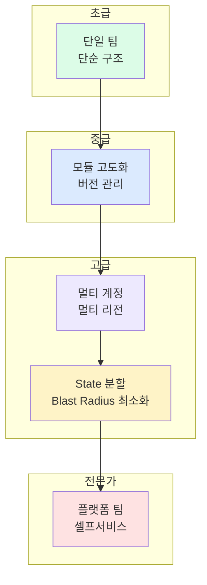

## 고급 설계: 대규모 운영을 위한 구조화

이 단계는 단순히 Terraform을 "쓸 줄 아는 수준"을 넘어, **확장성과 유지보수성을 고려한 설계 역량**을 다룹니다.

## 이 단계의 학습 목표

- 모듈을 버전으로 관리하고 Breaking change를 안전하게 처리할 수 있다
- 멀티 계정, 멀티 리전 구조를 설계할 수 있다
- State를 적절하게 분할하여 blast radius를 최소화할 수 있다
- 플랫폼 팀 역할에서 내부 팀을 위한 셀프서비스 인프라를 제공할 수 있다

## 핵심 주제

| 주제 | 내용 |
|------|------|
| [모듈 설계 고도화](module-design) | 범용 vs 서비스 전용, 버전 관리 전략 |
| [멀티 계정 운영](multi-account) | AWS Organizations, provider alias, 계정 간 참조 |
| [State 분할 전략](state-split) | Blast radius, 분할 기준, remote_state 참조 |
| [플랫폼 팀 관점](platform-team) | 셀프서비스, 모듈 카탈로그, Golden Path |

## 이 단계의 산출물

- 버전 관리가 적용된 재사용 가능한 모듈 라이브러리
- 멀티 계정/리전 구조 설계 문서
- State 분할 기준과 아키텍처
- 내부 팀이 사용할 수 있는 표준 모듈 카탈로그
