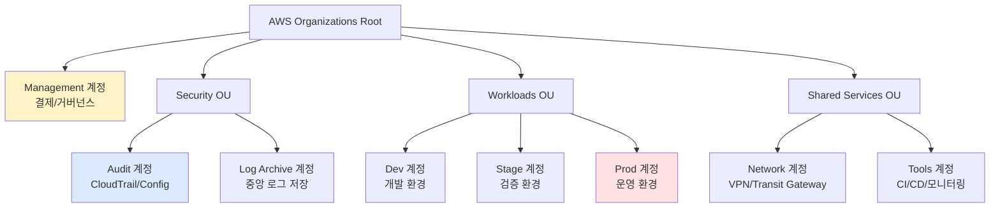

## 멀티 계정 전략이 필요한 이유

단일 AWS 계정에서 모든 환경을 운영하면 다음 문제가 발생합니다.

| 문제 | 설명 |
|------|------|
| 보안 격리 실패 | dev의 실수가 prod에 영향 가능 |
| 비용 추적 어려움 | 환경별 비용 구분 불가 |
| IAM 권한 관리 복잡 | 세밀한 권한 분리 어려움 |
| 서비스 한도 공유 | EC2 인스턴스 수 등 한도를 공유 |
| 컴플라이언스 위반 | 환경 분리 요구사항 충족 불가 |

## AWS Organizations 계정 구조



## 계정 분리 구조

**디렉토리 구조:**

```
terraform/
├── accounts/
│   ├── management/      # Organizations, SCPs 관리
│   ├── audit/           # CloudTrail, Config
│   ├── network/         # Transit Gateway, VPN
│   ├── dev/             # Dev 환경 리소스
│   ├── stage/           # Stage 환경 리소스
│   └── prod/            # Prod 환경 리소스
└── modules/             # 공통 모듈
```

**각 계정 디렉토리 내 backend 분리:**

```hcl
# accounts/prod/backend.tf
terraform {
  backend "s3" {
    bucket         = "terraform-state-prod-123456789012"
    key            = "prod/terraform.tfstate"
    region         = "ap-northeast-2"
    encrypt        = true
    dynamodb_table = "terraform-locks-prod"
    # prod 계정의 S3에 state 저장
  }
}
```

## provider alias 활용법

멀티 계정 배포 시 하나의 Terraform 코드에서 여러 계정을 동시에 다룰 때 `provider alias`를 사용합니다.

```hcl
# providers.tf

# 기본 provider (prod 계정)
provider "aws" {
  region = "ap-northeast-2"
  assume_role {
    role_arn = "arn:aws:iam::${var.prod_account_id}:role/terraform-deploy"
  }
}

# Dev 계정 alias provider
provider "aws" {
  alias  = "dev"
  region = "ap-northeast-2"
  assume_role {
    role_arn = "arn:aws:iam::${var.dev_account_id}:role/terraform-deploy"
  }
}

# Network 계정 alias provider
provider "aws" {
  alias  = "network"
  region = "ap-northeast-2"
  assume_role {
    role_arn = "arn:aws:iam::${var.network_account_id}:role/terraform-deploy"
  }
}
```

**alias provider를 사용하는 리소스:**

```hcl
# prod 계정에 VPC 생성 (기본 provider)
resource "aws_vpc" "prod" {
  cidr_block = "10.0.0.0/16"
}

# dev 계정에 VPC 생성 (alias provider)
resource "aws_vpc" "dev" {
  provider   = aws.dev    # ← alias 지정
  cidr_block = "10.1.0.0/16"
}

# 모듈에서 alias 전달
module "dev_vpc" {
  source = "../modules/vpc"
  providers = {
    aws = aws.dev    # ← 모듈에 provider 전달
  }
}
```

## 멀티 리전 배포 전략

```hcl
# 서울 리전 provider
provider "aws" {
  region = "ap-northeast-2"
}

# 버지니아 리전 provider (재해복구용)
provider "aws" {
  alias  = "us-east-1"
  region = "us-east-1"
}

# S3 버킷 복제: 서울 → 버지니아
resource "aws_s3_bucket_replication_configuration" "prod" {
  bucket = aws_s3_bucket.prod.id
  role   = aws_iam_role.replication.arn

  rule {
    destination {
      bucket        = aws_s3_bucket.dr.arn
      storage_class = "STANDARD_IA"
    }
  }
}

resource "aws_s3_bucket" "dr" {
  provider = aws.us-east-1    # 재해복구 리전에 생성
  bucket   = "myapp-prod-dr"
}
```

## 계정 간 State 참조 방법

다른 계정의 Terraform state에서 출력값을 참조할 때 `terraform_remote_state` data source를 사용합니다.

```hcl
# network 계정의 state에서 Transit Gateway ID 참조
data "terraform_remote_state" "network" {
  backend = "s3"
  config = {
    bucket  = "terraform-state-network-999999999999"
    key     = "network/terraform.tfstate"
    region  = "ap-northeast-2"
    # network 계정의 S3에 대한 읽기 권한 필요
    role_arn = "arn:aws:iam::999999999999:role/terraform-state-reader"
  }
}

# 참조해서 사용
resource "aws_ec2_transit_gateway_vpc_attachment" "prod" {
  transit_gateway_id = data.terraform_remote_state.network.outputs.transit_gateway_id
  vpc_id             = aws_vpc.prod.id
  subnet_ids         = aws_subnet.private[*].id
}
```


계정 간 State 참조는 계정 간 결합도를 높입니다. 가능하면 SSM Parameter Store나 AWS Resource Access Manager(RAM)를 통해 느슨한 결합을 유지하는 것이 좋습니다.


**SSM Parameter 방식 (느슨한 결합):**

```hcl
# network 계정에서 Transit Gateway ID를 SSM에 게시
resource "aws_ssm_parameter" "tgw_id" {
  name  = "/shared/network/transit-gateway-id"
  type  = "String"
  value = aws_ec2_transit_gateway.main.id
}

# prod 계정에서 SSM에서 조회
data "aws_ssm_parameter" "tgw_id" {
  name = "/shared/network/transit-gateway-id"
}
```
