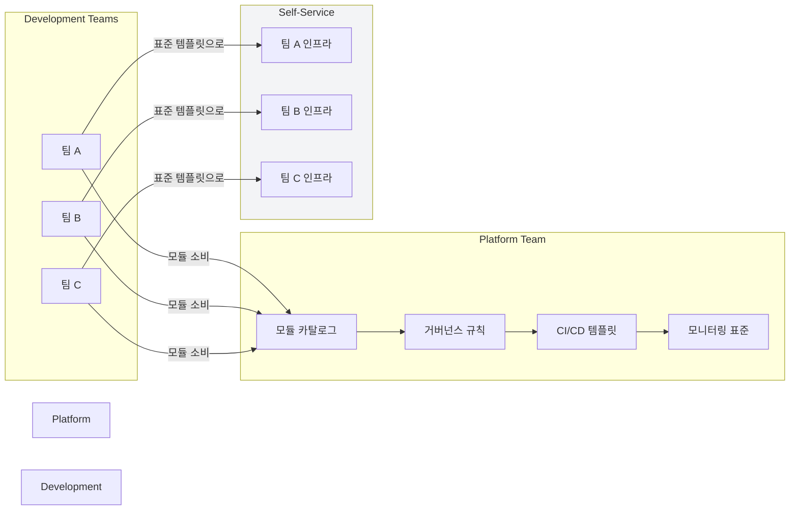
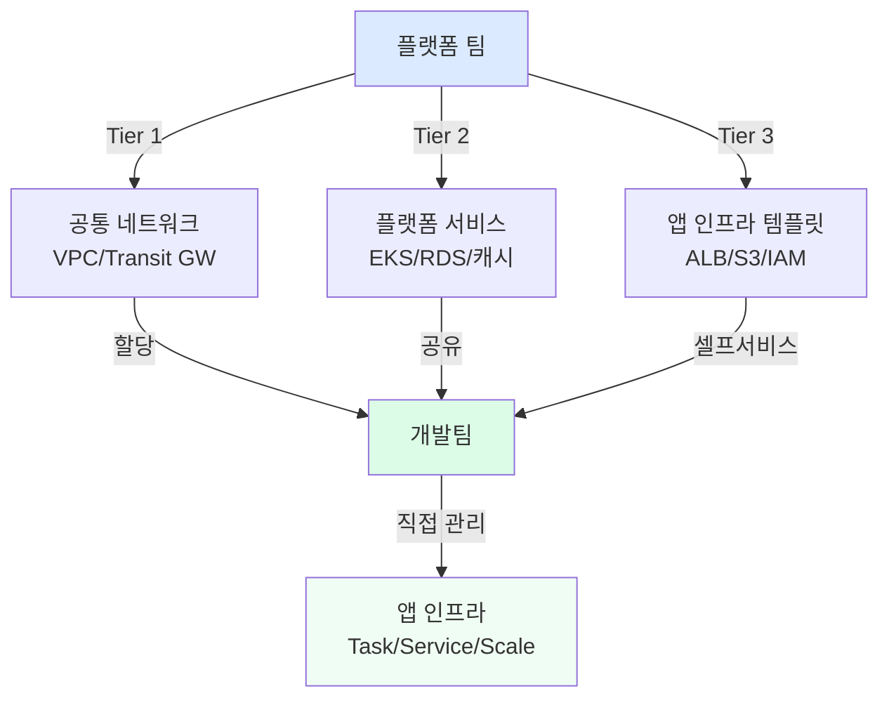

## 플랫폼 팀의 역할

조직이 성장하면 모든 팀이 직접 인프라를 관리하는 것은 비효율적입니다. **플랫폼 팀**은 개발팀이 인프라를 쉽고 안전하게 사용할 수 있는 표준 경로를 제공합니다.

| 플랫폼 팀이 하는 일 | 개발팀이 하는 일 |
|------------------|----------------|
| 표준 모듈 개발 및 유지 | 표준 모듈 소비 |
| 보안/정책 가드레일 운영 | 가드레일 내에서 자유롭게 사용 |
| CI/CD 파이프라인 표준화 | 표준 파이프라인 사용 |
| 공통 네트워크/계정 관리 | 할당된 계정/VPC에서 작업 |
| 운영 모니터링/알림 표준화 | 표준 모니터링 활용 |

## 셀프서비스 인프라 제공 모델



## 표준 모듈 카탈로그 운영

플랫폼 팀은 검증된 모듈을 카탈로그로 제공합니다.

```
platform-modules/ (리포지토리)
├── modules/
│   ├── networking/
│   │   ├── vpc/          # 표준 VPC (보안 그룹, 플로우 로그 포함)
│   │   └── alb/          # ALB (WAF, 인증서 자동 설정)
│   ├── compute/
│   │   ├── eks-nodegroup/ # EKS 노드그룹 (최적화 설정)
│   │   └── ec2-bastion/   # Bastion 서버 (SSM Session Manager)
│   ├── database/
│   │   ├── rds-postgres/  # RDS (자동 백업, 암호화, 모니터링)
│   │   └── elasticache/   # Redis (Multi-AZ, 암호화)
│   ├── storage/
│   │   └── s3/            # S3 (버전관리, 암호화, 로깅 기본 설정)
│   └── security/
│       ├── iam-role/      # IAM Role (최소권한 템플릿)
│       └── kms/           # KMS Key (정책 포함)
├── examples/              # 사용 예시
├── tests/                 # 모듈 테스트
└── CHANGELOG.md
```

**표준 모듈 사용 예시 (개발팀 입장):**

```hcl
# 개발팀은 복잡한 설정 없이 간단하게 사용
module "app_database" {
  source  = "git::https://github.com/company/platform-modules.git//modules/database/rds-postgres?ref=v3.2.0"

  name        = "myapp"
  environment = "prod"
  instance    = "db.t3.medium"

  # 아래는 모두 플랫폼 팀의 표준으로 자동 적용:
  # - 자동 백업 7일
  # - Multi-AZ 활성화 (prod 환경)
  # - 저장 암호화
  # - 성능 인사이트 활성화
  # - 표준 태그
}
```

## 내부 개발팀 소비 모델 설계

### 티어별 인프라 제공



## Golden Path 개념

**Golden Path**는 개발팀이 검증된 방식으로 빠르게 시작할 수 있는 표준 경로입니다.

```
terraform-starter-template/ (새 서비스 시작 템플릿)
├── README.md                  ← 3단계로 시작 가능한 가이드
├── environments/
│   ├── dev/
│   │   ├── main.tf            ← 플랫폼 모듈 참조 예시 포함
│   │   ├── variables.tf
│   │   └── terraform.tfvars   ← dev 환경 기본값
│   └── prod/
│       ├── main.tf
│       └── terraform.tfvars
└── .github/
    └── workflows/
        └── terraform.yml      ← 완성된 CI/CD 워크플로우
```

**개발팀 온보딩 3단계:**

```bash
# 1. 템플릿 복사
gh repo create myapp-infra --template company/terraform-starter-template

# 2. 서비스 이름과 환경 설정
cd myapp-infra
echo 'service_name = "myapp"' > environments/dev/terraform.tfvars

# 3. 첫 배포
git push origin main  # CI/CD 자동 실행
```

## 거버넌스와 자율성의 균형

플랫폼 팀의 가장 어려운 과제는 **통제와 자율성의 균형**입니다.

| 너무 통제적 | 너무 자율적 |
|-----------|-----------|
| 개발팀이 우회 방법을 찾음 | 보안/비용 문제 발생 |
| 개발 속도 저하 | 표준화 어려움 |
| 플랫폼 팀이 병목 | 운영 복잡도 증가 |

**권장 접근: 가드레일 안에서의 자유**

```hcl
# OPA/Sentinel 정책으로 금지 사항만 강제
# (허용 목록이 아닌 금지 목록 방식)

# 금지: prod에서 t2/t3.micro 사용
deny[msg] {
  resource := input.resource_changes[_]
  resource.type == "aws_instance"
  resource.change.after.instance_type == "t2.micro"
  resource.change.after.tags.Environment == "prod"
  msg := "prod 환경에서 t2.micro는 허용되지 않습니다"
}

# 그 외는 모두 허용
```


플랫폼 팀의 성공 지표: "개발팀이 인프라를 배포할 때 플랫폼 팀에 물어볼 필요 없이 스스로 할 수 있는가." 문서, 템플릿, 예제로 개발팀이 자급자족할 수 있게 만드는 것이 목표입니다.

