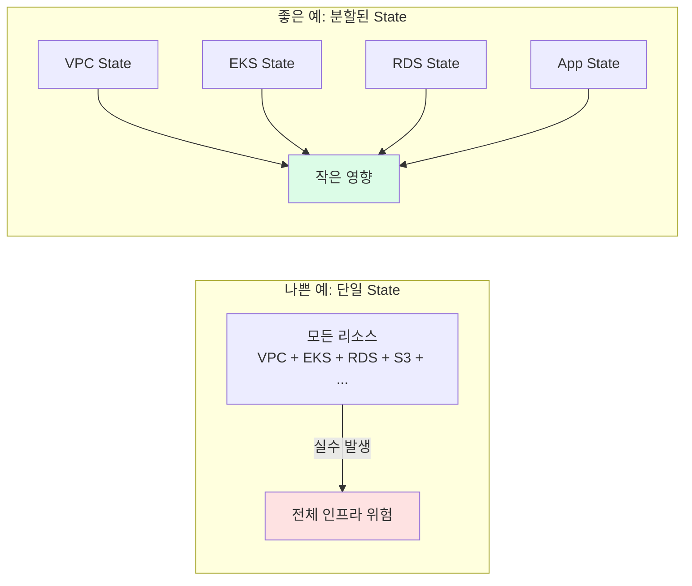
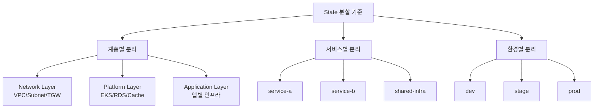
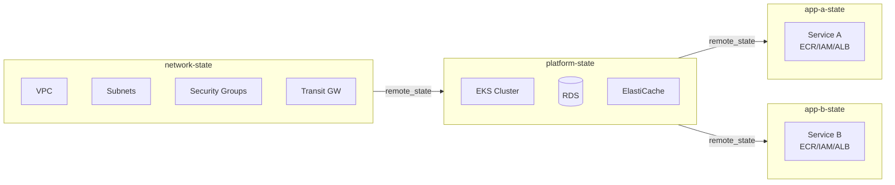

## State를 왜 나눠야 하는가

처음에는 하나의 state 파일로 시작하는 것이 간단합니다. 하지만 인프라가 커질수록 단일 state는 심각한 문제를 일으킵니다.

| 문제 | 영향 |
|------|------|
| plan 시간이 수 분 이상 걸림 | 개발 속도 저하 |
| 한 리소스 변경에 모든 팀 영향 | 협업 병목 |
| 실수 시 전체 인프라에 영향 | 대형 장애 위험 |
| 권한 분리 불가 | 팀별 접근 통제 어려움 |
| Locking 경합 | 동시 작업 불가 |

## Blast Radius 최소화 개념

**Blast radius**란 변경이 실패했을 때 영향을 받는 범위입니다.



## State 분할 기준

분할은 **변경 단위**와 **팀 경계**를 기준으로 합니다.



**실전 디렉토리 구조 (계층별 + 환경별 조합):**

```
terraform/
├── global/                  # 리전에 무관한 리소스 (IAM, Route53)
│   └── terraform.tfstate
├── network/                 # VPC, TGW, VPN (변경 빈도 낮음)
│   ├── dev/
│   ├── stage/
│   └── prod/
├── platform/                # EKS, RDS, ElastiCache (변경 빈도 중간)
│   ├── dev/
│   ├── stage/
│   └── prod/
└── services/                # 애플리케이션별 인프라 (변경 빈도 높음)
    ├── service-a/
    │   ├── dev/
    │   └── prod/
    └── service-b/
        ├── dev/
        └── prod/
```

## State 간 데이터 공유: `terraform_remote_state`

하위 레이어(network)의 출력값을 상위 레이어(platform)에서 참조합니다.

```hcl
# network/prod/outputs.tf
output "vpc_id" {
  value = aws_vpc.main.id
}
output "private_subnet_ids" {
  value = aws_subnet.private[*].id
}

# platform/prod/main.tf
data "terraform_remote_state" "network" {
  backend = "s3"
  config = {
    bucket = "terraform-state-prod"
    key    = "network/prod/terraform.tfstate"
    region = "ap-northeast-2"
  }
}

resource "aws_eks_cluster" "main" {
  name = "prod-cluster"

  vpc_config {
    # network state의 출력값 참조
    vpc_id     = data.terraform_remote_state.network.outputs.vpc_id
    subnet_ids = data.terraform_remote_state.network.outputs.private_subnet_ids
  }
}
```


`terraform_remote_state`는 상태 파일 전체에 대한 읽기 권한이 필요합니다. state에는 민감한 정보가 포함될 수 있으므로, SSM Parameter Store를 대안으로 고려하세요.


## 변경 단위 최적화

state를 나눌 때 **변경 주기가 다른 리소스**를 별도 state로 분리하면 효율적입니다.

| 변경 빈도 | 리소스 예시 | 분리 이유 |
|----------|------------|----------|
| 매우 낮음 (월 1회 이하) | VPC, TGW, DNS zone | 안정적 인프라는 변경 격리 |
| 낮음 (월 몇 회) | EKS, RDS | 플랫폼은 서비스와 분리 |
| 높음 (주 수회) | 앱 인프라, Task/Service | 빠른 개발 속도 필요 |

## 실전 분할 예시: 3-Tier 아키텍처



**분할 적용 효과:**

- network 변경 → network state만 영향 (EKS/앱 무관)
- Service A 배포 → app-a state만 영향 (Service B 무관)
- 팀별로 각자의 state만 apply 권한 부여 가능
- plan 시간이 수 초 ~ 수십 초로 단축


State를 너무 잘게 쪼개면 오히려 관리 복잡도가 올라갑니다. 처음에는 **환경별**(dev/prod) + **계층별**(network/platform/app) 조합으로 시작하고, 팀 규모와 함께 세분화하는 것이 현실적입니다.

