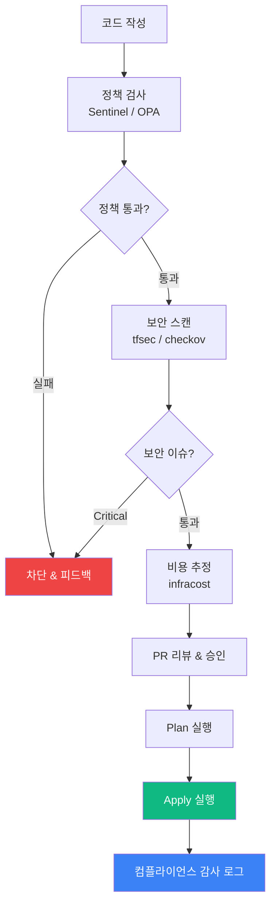

Terraform을 단순 배포 도구가 아닌 **운영 통제 플랫폼**으로 이해하는 단계입니다. 정책 통제, 보안 스캔, 컴플라이언스, 비용 관리를 배포 흐름에 내재화합니다.

## 이 단계에서 배우는 것

| 주제 | 핵심 내용 |
|------|----------|
| [정책 기반 통제](policy-control) | Sentinel, OPA로 리소스 생성 규칙 강제화 |
| [보안 스캐닝](security-scan) | tfsec, checkov로 IaC 취약점 자동 탐지 |
| [컴플라이언스 대응](compliance) | 표준 태깅, 감사 로그, 변경 추적 |
| [비용 통제](cost-control) | infracost로 배포 전 비용 예측 및 통제 |

## 이 단계의 산출물

- Terraform을 단순 배포 도구가 아닌 운영 통제 플랫폼으로 이해
- 보안/비용/정책을 배포 흐름에 내재화
- 컴플라이언스 요건을 자동으로 검증하는 파이프라인 구축
