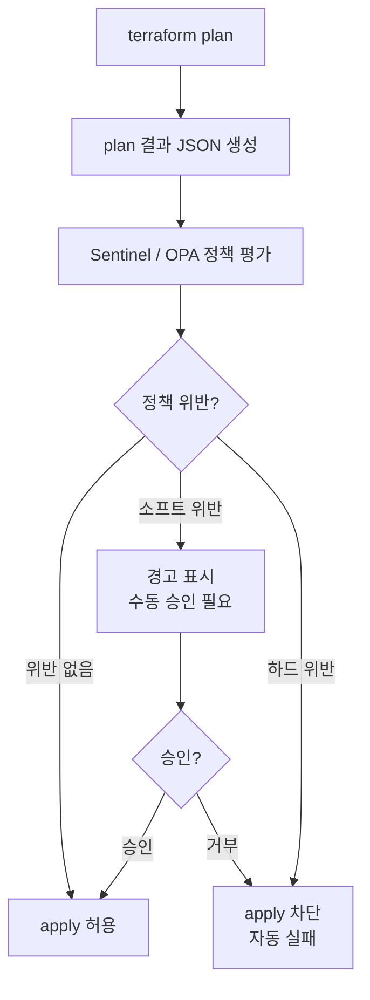

## 정책 통제가 필요한 이유

인프라 배포를 자유롭게 두면 반드시 문제가 생깁니다. 승인 없이 고비용 인스턴스가 생성되거나, 특정 리전에만 배포해야 하는 규정을 어기거나, 태그 없이 리소스가 만들어져 비용 추적이 불가능해집니다.

정책 기반 통제는 이런 문제를 **사람이 개입하기 전에 자동으로 차단**합니다.


정책 통제의 핵심은 "배포 후 감사"가 아니라 "배포 전 예방"입니다. Plan 단계에서 정책 위반을 잡아야 운영 비용이 줄어듭니다.


## Sentinel 정책 엔진

Sentinel은 HashiCorp의 정책-as-코드 프레임워크입니다. Terraform Cloud/Enterprise에서 사용하며, `plan` 결과에 대해 정책을 평가합니다.

```hcl
# allowed-regions.sentinel
# 허용된 리전에만 배포 가능

import "tfplan/v2" as tfplan

allowed_regions = ["ap-northeast-2", "ap-northeast-1"]

# 모든 AWS provider 설정에서 리전 확인
all_aws_providers = filter tfplan.providers as _, provider {
    provider.name is "registry.terraform.io/hashicorp/aws"
}

region_allowed = rule {
    all all_aws_providers as _, provider {
        provider.config.region.constant_value in allowed_regions
    }
}

main = rule {
    region_allowed
}
```

```hcl
# required-tags.sentinel
# 필수 태그 검증

import "tfplan/v2" as tfplan

required_tags = ["Environment", "Owner", "CostCenter", "Project"]

# 태그를 가질 수 있는 리소스 타입 목록
taggable_resources = [
    "aws_instance",
    "aws_s3_bucket",
    "aws_rds_instance",
    "aws_vpc",
]

# 모든 해당 리소스에 필수 태그가 있는지 확인
all_resources_tagged = rule {
    all tfplan.resource_changes as _, resource {
        resource.type not in taggable_resources or
        all required_tags as tag {
            tag in keys(resource.change.after.tags)
        }
    }
}

main = rule {
    all_resources_tagged
}
```

## OPA (Open Policy Agent) 활용법

OPA는 오픈소스 범용 정책 엔진입니다. Rego 언어로 정책을 작성하며, Terraform Cloud 없이도 사용 가능합니다.

```bash
# OPA 설치
brew install opa

# conftest 설치 (Terraform plan JSON을 OPA로 검증)
brew install conftest
```

```rego
# policy/allowed_regions.rego
package terraform.aws

import future.keywords

deny contains msg if {
    some resource in input.resource_changes
    resource.type == "aws_instance"
    region := resource.change.after.availability_zone
    not startswith(region, "ap-northeast-2")
    msg := sprintf("EC2 인스턴스는 ap-northeast-2 리전에만 생성할 수 있습니다. 현재 리전: %v", [region])
}
```

```bash
# Terraform plan을 JSON으로 출력
terraform plan -out=tfplan.binary
terraform show -json tfplan.binary > tfplan.json

# conftest로 정책 검증
conftest test tfplan.json --policy policy/
```

## 정책 통제 흐름



## 허용 리전 제한

```hcl
# 특정 리전 외 리소스 생성 방지 (terraform.tfvars 방식)
variable "allowed_regions" {
  type    = list(string)
  default = ["ap-northeast-2"]
}

# provider 설정에서 리전 검증
provider "aws" {
  region = var.aws_region

  # lifecycle 블록으로 허용 리전 외 배포 방지
  default_tags {
    tags = local.common_tags
  }
}

locals {
  # 허용되지 않은 리전이면 오류 발생
  region_check = contains(var.allowed_regions, var.aws_region) ? var.aws_region : error(
    "허용되지 않은 리전입니다: ${var.aws_region}. 허용 리전: ${join(", ", var.allowed_regions)}"
  )
}
```

## 태그 필수화 정책 구현

```hcl
# locals.tf - 공통 태그 중앙화
locals {
  required_tags = {
    Environment = var.environment      # dev, stage, prod
    Owner       = var.team_name        # 담당 팀
    CostCenter  = var.cost_center      # 비용 센터 코드
    Project     = var.project_name     # 프로젝트명
    ManagedBy   = "terraform"          # 필수: 관리 주체
    Repo        = var.repo_url         # 소스 저장소
  }
}

# 모든 리소스에 common_tags 적용
resource "aws_instance" "web" {
  ami           = data.aws_ami.amazon_linux.id
  instance_type = var.instance_type

  tags = merge(local.required_tags, {
    Name = "${var.project_name}-web-${var.environment}"
    Role = "web-server"
  })
}
```

## 특정 인스턴스 타입 제한

```hcl
# variables.tf
variable "instance_type" {
  type        = string
  description = "EC2 인스턴스 타입"

  validation {
    condition = contains([
      "t3.micro", "t3.small", "t3.medium",
      "t3.large", "m5.large", "m5.xlarge"
    ], var.instance_type)
    error_message = "허용된 인스턴스 타입: t3.micro, t3.small, t3.medium, t3.large, m5.large, m5.xlarge"
  }
}
```


`validation` 블록은 Terraform 자체 검증이라 plan 단계에서 오류를 잡습니다. 하지만 외부 정책 도구(Sentinel, OPA)가 있으면 더 중앙화된 통제가 가능합니다.


## 공개 리소스 생성 금지 정책

```hcl
# 공개 S3 버킷 방지
resource "aws_s3_bucket_public_access_block" "example" {
  bucket = aws_s3_bucket.example.id

  block_public_acls       = true
  block_public_policy     = true
  ignore_public_acls      = true
  restrict_public_buckets = true
}

# S3 버킷 ACL을 public으로 설정하는 코드 (나쁜 예)
# acl = "public-read"  ← 이런 코드는 정책으로 차단
```

```rego
# policy/no_public_resources.rego
package terraform.aws

deny contains msg if {
    some resource in input.resource_changes
    resource.type == "aws_s3_bucket_acl"
    resource.change.after.acl in ["public-read", "public-read-write", "authenticated-read"]
    msg := sprintf("S3 버킷 '%v'에 공개 ACL 설정이 불가합니다.", [resource.address])
}

deny contains msg if {
    some resource in input.resource_changes
    resource.type == "aws_security_group_rule"
    resource.change.after.cidr_blocks[_] == "0.0.0.0/0"
    resource.change.after.type == "ingress"
    resource.change.after.from_port == 22
    msg := sprintf("보안 그룹 '%v': SSH(22) 포트를 전체 공개(0.0.0.0/0)할 수 없습니다.", [resource.address])
}
```

## 정책 통제 실전 적용 순서

1. **현황 파악**: 현재 인프라에서 위반 사항 조사
2. **소프트 정책 도입**: 경고만 표시, 차단 없이 모니터링
3. **팀 공지**: 위반 패턴 공유, 수정 기간 부여
4. **하드 정책 전환**: 일정 기간 후 자동 차단으로 전환
5. **예외 프로세스 마련**: 긴급 상황 대비 승인 우회 절차 수립
