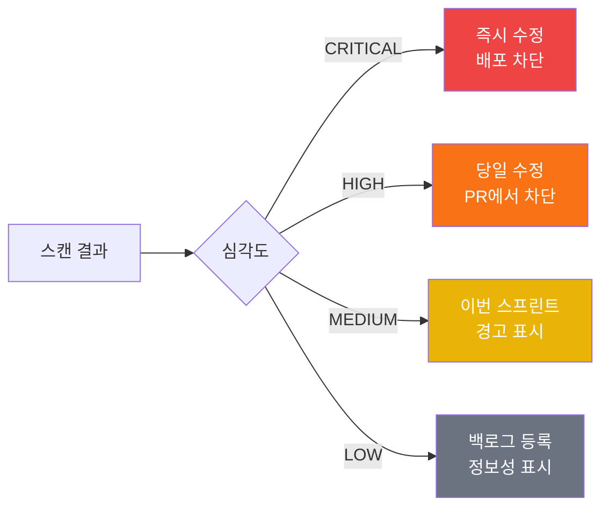

## IaC 보안 검사가 중요한 이유

Terraform 코드를 잘못 작성하면 인프라가 처음부터 취약하게 배포됩니다. S3 버킷이 공개되거나, 데이터베이스가 암호화되지 않거나, 보안 그룹이 전체 포트를 열어두는 일이 실수로 발생합니다.

보안 스캐닝 도구는 **코드를 실행하기 전에** 이런 문제를 자동으로 발견합니다.


코드 리뷰만으로는 보안 설정 누락을 잡기 어렵습니다. 스캐너는 수백 가지 규칙을 자동으로 체크합니다.


## tfsec 설치 및 사용법

tfsec은 Terraform 전용 정적 분석 도구입니다.

```bash
# macOS 설치
brew install tfsec

# 또는 바이너리 직접 설치
curl -s https://raw.githubusercontent.com/aquasecurity/tfsec/master/scripts/install_linux.sh | bash

# 버전 확인
tfsec --version
```

```bash
# 기본 스캔 (현재 디렉토리)
tfsec .

# JSON 출력 (CI/CD에서 파싱용)
tfsec . --format json > tfsec-results.json

# 특정 심각도 이상만 표시
tfsec . --minimum-severity HIGH

# 특정 규칙 제외
tfsec . --exclude aws-s3-enable-bucket-logging

# 상세 출력
tfsec . --verbose
```

### tfsec 결과 예시

```
Result #1 HIGH S3 버킷에 서버 측 암호화가 비활성화되어 있습니다.
──────────────────────────────────────────
  main.tf:15-20
──────────────────────────────────────────
   15 | resource "aws_s3_bucket" "data" {
   16 |   bucket = "my-data-bucket"
   17 |   # server_side_encryption_configuration 없음
   18 | }
──────────────────────────────────────────
  ID:           aws-s3-enable-bucket-encryption
  Impact:       데이터가 암호화되지 않고 저장됨
  Resolution:   서버 측 암호화 활성화
  See https://aquasecurity.github.io/tfsec/v1.28.0/checks/aws/s3/enable-bucket-encryption/
```

## checkov 설치 및 사용법

checkov는 Python 기반 IaC 보안 스캐너로 Terraform 외에도 CloudFormation, Kubernetes 등을 지원합니다.

```bash
# pip으로 설치
pip3 install checkov

# 또는 brew
brew install checkov

# 버전 확인
checkov --version
```

```bash
# 기본 스캔
checkov -d .

# 특정 파일 스캔
checkov -f main.tf

# JSON 리포트 생성
checkov -d . -o json > checkov-results.json

# JUnit XML 형식 (Jenkins 연동)
checkov -d . -o junitxml > checkov-results.xml

# 특정 체크만 실행
checkov -d . --check CKV_AWS_3,CKV_AWS_18

# 특정 체크 제외
checkov -d . --skip-check CKV_AWS_7

# 심각도 필터
checkov -d . --check-severity HIGH,CRITICAL
```

### checkov 결과 예시

```
Check: CKV_AWS_8: "Ensure all data stored in the Launch configuration EBS is securely encrypted"
  FAILED for resource: aws_instance.web
  File: /main.tf:10-25
  Guide: https://docs.bridgecrew.io/docs/general_3

Check: CKV_AWS_3: "Ensure all data stored in the S3 bucket is securely encrypted"
  PASSED for resource: aws_s3_bucket.logs

Passed checks: 12, Failed checks: 3, Skipped checks: 0
```

## trivy IaC 스캔

trivy는 컨테이너 이미지 스캔으로 유명하지만 IaC도 지원합니다.

```bash
# macOS 설치
brew install trivy

# Terraform 코드 스캔
trivy config .

# 심각도 필터
trivy config --severity HIGH,CRITICAL .

# 특정 정책 무시
trivy config --skip-policy-update .

# JSON 출력
trivy config --format json -o trivy-results.json .
```

## CI/CD 파이프라인에 보안 스캔 통합

```yaml
# .github/workflows/terraform-security.yml
name: Terraform Security Scan

on:
  pull_request:
    paths:
      - "**.tf"
      - "**.tfvars"

jobs:
  tfsec:
    name: tfsec 스캔
    runs-on: ubuntu-latest
    steps:
      - uses: actions/checkout@v4

      - name: tfsec 실행
        uses: aquasecurity/tfsec-action@v1.0.0
        with:
          soft_fail: false
          minimum_severity: HIGH

  checkov:
    name: checkov 스캔
    runs-on: ubuntu-latest
    steps:
      - uses: actions/checkout@v4

      - name: checkov 실행
        uses: bridgecrewio/checkov-action@master
        with:
          directory: .
          framework: terraform
          output_format: sarif
          output_file_path: checkov-results.sarif
          soft_fail: false
          check: CKV_AWS_3,CKV_AWS_18,CKV_AWS_20,CKV_AWS_21

      - name: SARIF 결과 업로드 (GitHub Security 탭에 표시)
        uses: github/codeql-action/upload-sarif@v3
        if: always()
        with:
          sarif_file: checkov-results.sarif
```

## 주요 misconfiguration 사례

| 분류 | 문제 | 올바른 설정 |
|------|------|------------|
| S3 | 퍼블릭 액세스 허용 | `block_public_acls = true` |
| S3 | 암호화 미설정 | `server_side_encryption_configuration` 추가 |
| EC2 | 루트 볼륨 암호화 없음 | `encrypted = true` |
| RDS | 암호화 비활성화 | `storage_encrypted = true` |
| RDS | 백업 미설정 | `backup_retention_period > 0` |
| 보안 그룹 | SSH 0.0.0.0/0 | 특정 IP 또는 Bastion 경유 |
| IAM | 와일드카드 권한 `*` | 최소 권한 원칙 적용 |
| CloudTrail | 로그 비활성화 | `enable_logging = true` |

```hcl
# 나쁜 예 - 여러 보안 문제
resource "aws_s3_bucket" "bad_example" {
  bucket = "my-bucket"
  acl    = "public-read"  # ← 공개 접근
  # 암호화 없음
  # 버전 관리 없음
  # 로깅 없음
}

# 좋은 예 - 보안 설정 완비
resource "aws_s3_bucket" "good_example" {
  bucket = "my-secure-bucket"
}

resource "aws_s3_bucket_public_access_block" "good_example" {
  bucket                  = aws_s3_bucket.good_example.id
  block_public_acls       = true
  block_public_policy     = true
  ignore_public_acls      = true
  restrict_public_buckets = true
}

resource "aws_s3_bucket_server_side_encryption_configuration" "good_example" {
  bucket = aws_s3_bucket.good_example.id
  rule {
    apply_server_side_encryption_by_default {
      sse_algorithm = "AES256"
    }
  }
}

resource "aws_s3_bucket_versioning" "good_example" {
  bucket = aws_s3_bucket.good_example.id
  versioning_configuration {
    status = "Enabled"
  }
}
```

## 보안 스캔 결과 해석 방법

스캔 결과를 받으면 우선순위를 정해 처리해야 합니다.




모든 경고를 무조건 무시(skip)하는 것은 금지입니다. 무시가 필요한 경우 반드시 주석으로 이유를 기록하세요.


```hcl
# tfsec 특정 경고 억제 (이유 주석 필수)
#tfsec:ignore:aws-s3-enable-bucket-logging
resource "aws_s3_bucket" "temp_artifacts" {
  # 임시 빌드 아티팩트 버킷: 로깅 비용 절감을 위해 로깅 비활성화
  # 보안 검토: 2024-01-15 팀장 승인
  bucket = "temp-build-artifacts"
}
```
