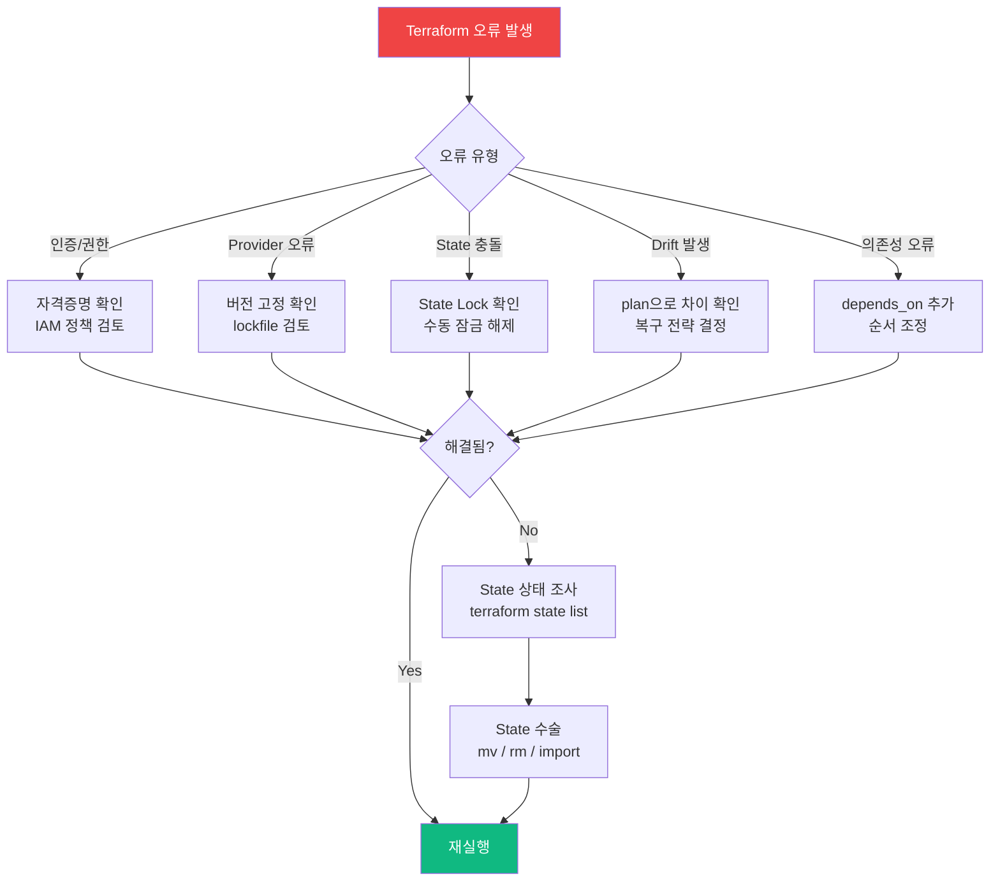

Terraform 운영에서 발생하는 실제 장애 패턴을 이해하고 빠르게 복구하는 역량을 키웁니다. 단순 성공 케이스뿐 아니라 **실패 케이스 대응 능력**이 실무 수준을 결정합니다.

## 이 단계에서 배우는 것

| 주제 | 핵심 내용 |
|------|----------|
| [실패 패턴 분석](failure-patterns) | Provider 오류, 권한, State 충돌, Drift 해결법 |
| [State 복구](state-recovery) | state list/mv/rm, import, taint 대응 |
| [안전한 운영 전략](safe-operations) | lifecycle, Blue/Green, 체크리스트 |
| [운영 체크리스트](checklist) | Apply 전/후, Prod 반영, 보안 검토 |

## 이 단계의 산출물

- 단순 성공 케이스뿐 아니라 실패 케이스 대응 가능
- 운영 안정성을 높이는 습관 형성
- State 문제를 안전하게 복구하는 절차 수립
