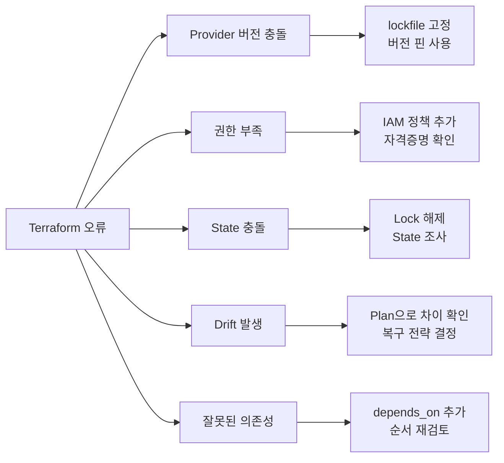
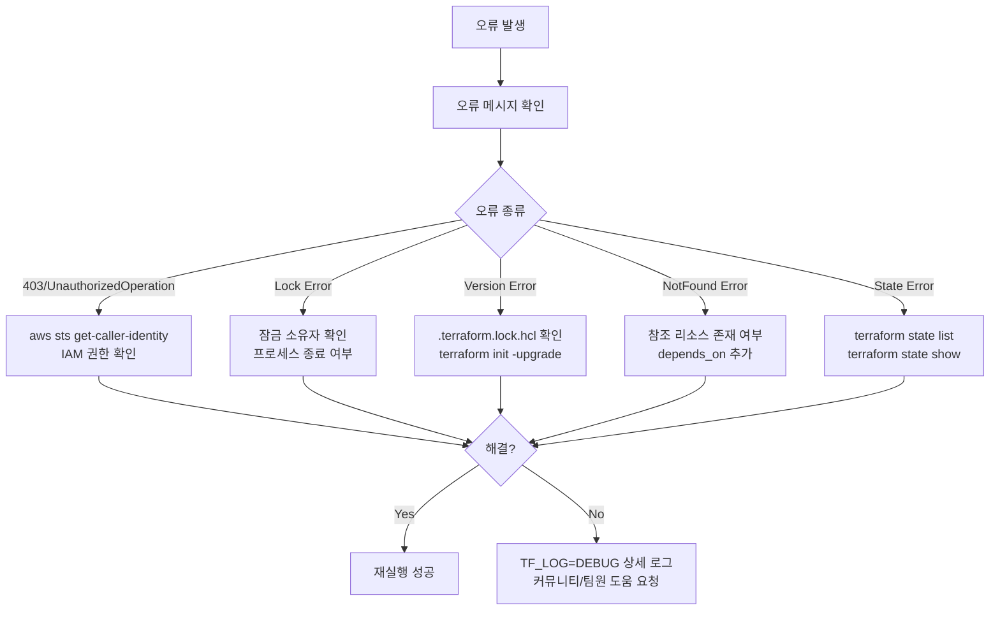

## 실패 유형 한눈에 보기

실무에서 Terraform 오류는 대부분 다음 5가지 원인에서 옵니다.



## 1. Provider 버전 충돌

### 증상

```
Error: Inconsistent dependency lock file

The following dependency selections recorded in the lock file are inconsistent
with the current configuration:
  - provider registry.terraform.io/hashicorp/aws: locked version selection 4.67.0
    doesn't match ~> 5.0
```

### 원인과 해결 방법

```hcl
# 문제: 버전 제약이 너무 느슨함
terraform {
  required_providers {
    aws = {
      source  = "hashicorp/aws"
      version = ">= 3.0"  # ← 너무 넓음, 메이저 버전 변경 포함
    }
  }
}

# 해결: ~> 를 사용해 마이너 버전만 허용
terraform {
  required_providers {
    aws = {
      source  = "hashicorp/aws"
      version = "~> 5.0"  # 5.x 범위만 허용
    }
  }
}
```

```bash
# lockfile 재생성
terraform init -upgrade

# lockfile 확인
cat .terraform.lock.hcl
```


`.terraform.lock.hcl` 파일을 Git에 커밋해야 합니다. 이 파일이 없으면 팀원마다 다른 provider 버전을 사용하게 됩니다.


## 2. 권한 부족 오류

### 증상

```
Error: creating EC2 Instance: UnauthorizedOperation: You are not authorized
to perform this operation. Encoded authorization failure message:
...
│ status code: 403
```

### 원인과 해결 방법

```bash
# 현재 사용 중인 자격증명 확인
aws sts get-caller-identity

# 필요한 권한 확인 (IAM Policy Simulator 사용)
aws iam simulate-principal-policy \
  --policy-source-arn arn:aws:iam::123456789:role/terraform-role \
  --action-names ec2:RunInstances \
  --resource-arns "*"
```

```hcl
# Terraform 실행 역할에 필요한 IAM 정책
data "aws_iam_policy_document" "terraform_policy" {
  statement {
    effect = "Allow"
    actions = [
      "ec2:*",
      "vpc:*",
      "s3:*",
      "iam:CreateRole",
      "iam:AttachRolePolicy",
      "iam:PassRole"
    ]
    resources = ["*"]
  }
}
```

## 3. State 충돌 (Lock Error)

### 증상

```
Error: Error locking state: Error acquiring the state lock: ConditionalCheckFailedException
Lock Info:
  ID:        a0c2ca9a-3f34-10c2-7d2a-6b3d2c5e1f9a
  Path:      terraform-state/prod/terraform.tfstate
  Operation: OperationTypeApply
  Who:       jenkins@ci-server
  Version:   1.6.0
  Created:   2024-01-15 09:23:11.123456789 +0000 UTC
  Info:
```

### 원인과 해결 방법

```bash
# 잠금 상태 확인
terraform force-unlock a0c2ca9a-3f34-10c2-7d2a-6b3d2c5e1f9a

# DynamoDB에서 직접 잠금 확인 (S3 backend 사용 시)
aws dynamodb scan \
  --table-name terraform-state-lock \
  --query 'Items[*]'
```


`force-unlock`은 해당 프로세스가 실제로 종료되었을 때만 사용하세요. 실행 중인 프로세스의 잠금을 강제 해제하면 State가 손상될 수 있습니다.


## 4. 수동 변경 Drift

### 증상

```
  # aws_instance.web will be updated in-place
  ~ resource "aws_instance" "web" {
      ~ instance_type = "t3.medium" -> "t3.large"  # 콘솔에서 수동 변경됨
        ...
    }
```

### 원인과 해결 방법

```bash
# 현재 drift 상태 확인
terraform plan -refresh-only

# 선택 1: Terraform 코드를 현실에 맞게 수정
# (instance_type을 t3.large로 코드 변경 후 apply)

# 선택 2: 현실을 코드 상태로 되돌리기
terraform apply  # 코드 기준으로 t3.medium으로 복원
```


프로덕션 환경에서 drift를 발견했다면, 즉시 되돌리기 전에 변경 이유를 먼저 파악하세요. 긴급 패치였을 수도 있습니다.


## 5. 잘못된 의존성 오류

### 증상

```
Error: Error creating Security Group Rule: InvalidGroup.NotFound: The security
group 'sg-0abc12345' does not exist
```

### 원인과 해결 방법

```hcl
# 문제: 보안 그룹이 만들어지기 전에 규칙을 생성하려 함
resource "aws_security_group_rule" "allow_http" {
  type        = "ingress"
  from_port   = 80
  to_port     = 80
  protocol    = "tcp"
  cidr_blocks = ["0.0.0.0/0"]
  security_group_id = "sg-0abc12345"  # ← 하드코딩 → 존재하지 않을 수 있음
}

# 해결: 참조(reference)를 사용해 암시적 의존성 생성
resource "aws_security_group" "web" {
  name   = "web-sg"
  vpc_id = aws_vpc.main.id
}

resource "aws_security_group_rule" "allow_http" {
  type              = "ingress"
  from_port         = 80
  to_port           = 80
  protocol          = "tcp"
  cidr_blocks       = ["0.0.0.0/0"]
  security_group_id = aws_security_group.web.id  # ← 참조로 변경
}
```

```hcl
# 명시적 의존성이 필요한 경우
resource "aws_instance" "app" {
  ami           = data.aws_ami.amazon_linux.id
  instance_type = "t3.medium"

  # IAM 역할이 완전히 연결된 후에 인스턴스 생성
  depends_on = [aws_iam_role_policy_attachment.app_policy]
}
```

## Plan 로그 읽는 방법

```bash
# 상세 로그 활성화
TF_LOG=DEBUG terraform plan 2>&1 | tee plan-debug.log

# INFO 수준만 표시 (일반적으로 충분)
TF_LOG=INFO terraform plan

# 특정 provider만 디버깅
TF_LOG_PROVIDER=DEBUG terraform plan
```

### Plan 출력 기호 해석

```
# 기호 의미
+ 리소스 생성 (create)
- 리소스 삭제 (destroy)  ← 주의!
~ 리소스 수정 (update in-place)
-/+ 리소스 교체 (destroy then create)  ← 주의! 다운타임 가능
+/- 리소스 교체 (create then destroy)  ← create_before_destroy
<= 데이터 소스 읽기 (data source read)
```

```
# 교체(replace) 원인 파악
Plan: 0 to add, 0 to change, 1 to destroy.

  # aws_instance.web must be replaced
-/+ resource "aws_instance" "web" {
      # (1 unchanged attribute hidden)
    ~ ami = "ami-0c55b159cbfafe1f0" -> "ami-0abcdef1234567890" # forces replacement
```

`forces replacement` 표시가 있으면 해당 속성 변경이 리소스를 새로 만든다는 의미입니다. 프로덕션에서는 다운타임을 의미할 수 있으므로 반드시 확인하세요.

## 트러블슈팅 의사결정 트리


