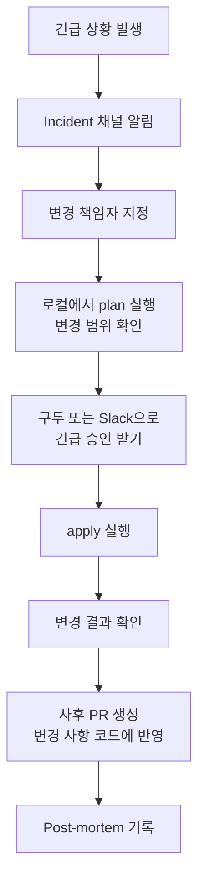

## 리소스 교체 영향도 파악 방법

Plan 결과에서 `-/+` 기호는 리소스가 삭제 후 재생성된다는 의미입니다. 이는 다운타임을 유발할 수 있습니다.

```bash
# Plan에서 교체 발생 여부 확인
terraform plan | grep -E "must be replaced|forces replacement"
```

```
# 교체 유발 속성 예시
-/+ resource "aws_instance" "web" {
    ~ ami = "ami-old" -> "ami-new"  # forces replacement
    ~ subnet_id = "subnet-a" -> "subnet-b"  # forces replacement
}
```

### 교체를 유발하는 주요 속성들

| 리소스 | 교체 유발 속성 |
|--------|--------------|
| `aws_instance` | `ami`, `subnet_id`, `availability_zone` |
| `aws_rds_instance` | `engine`, `engine_version` (메이저), `db_subnet_group_name` |
| `aws_elasticache_cluster` | `engine`, `node_type`, `parameter_group_name` |
| `aws_security_group` | `name`, `vpc_id` |
| `aws_iam_role` | `name` |

## create_before_destroy lifecycle 활용

기본 동작은 "기존 리소스 삭제 → 새 리소스 생성"입니다. `create_before_destroy`를 설정하면 "새 리소스 생성 → 기존 리소스 삭제"로 바뀌어 다운타임을 최소화합니다.

```hcl
resource "aws_instance" "web" {
  ami           = var.ami_id
  instance_type = var.instance_type

  lifecycle {
    create_before_destroy = true
  }
}

# Auto Scaling Group과 Launch Template 조합 (권장)
resource "aws_launch_template" "web" {
  name_prefix   = "${var.project_name}-web-"
  image_id      = var.ami_id
  instance_type = var.instance_type

  lifecycle {
    create_before_destroy = true
  }
}

resource "aws_autoscaling_group" "web" {
  name                = "${var.project_name}-web-asg"
  min_size            = var.min_size
  max_size            = var.max_size
  desired_capacity    = var.desired_capacity

  launch_template {
    id      = aws_launch_template.web.id
    version = "$Latest"
  }

  # AMI 변경 시 인스턴스 순차 교체
  instance_refresh {
    strategy = "Rolling"
    preferences {
      min_healthy_percentage = 90
    }
  }
}
```

## prevent_destroy로 중요 리소스 보호

데이터베이스, S3 버킷 등 삭제하면 안 되는 리소스에 `prevent_destroy`를 설정합니다.

```hcl
resource "aws_rds_instance" "production" {
  identifier        = "${var.project_name}-prod-db"
  engine            = "mysql"
  engine_version    = "8.0"
  instance_class    = "db.t3.medium"
  allocated_storage = 100

  lifecycle {
    prevent_destroy = true  # 실수로 삭제하는 것을 방지
  }
}

resource "aws_s3_bucket" "critical_data" {
  bucket = "${var.project_name}-critical-data"

  lifecycle {
    prevent_destroy = true
  }
}
```


`prevent_destroy = true`가 설정된 리소스를 삭제하려면 먼저 이 설정을 제거하고 apply한 후 다시 destroy해야 합니다. 이 2단계 과정이 실수를 방지합니다.


## 다운타임 최소화 전략 (Blue/Green with Terraform)

```hcl
# Blue/Green 배포를 위한 가중치 기반 라우팅
# 현재: Blue 100%, Green 0%
# 전환: Blue 50%, Green 50%
# 완료: Blue 0%, Green 100%

resource "aws_lb_listener_rule" "blue" {
  listener_arn = aws_lb_listener.web.arn
  priority     = 100

  action {
    type             = "forward"
    target_group_arn = aws_lb_target_group.blue.arn
  }

  condition {
    path_pattern {
      values = ["/*"]
    }
  }
}

# 가중치 기반 전환 (전환 중 상태)
resource "aws_lb_listener_rule" "weighted" {
  listener_arn = aws_lb_listener.web.arn
  priority     = 90

  action {
    type = "forward"
    forward {
      target_group {
        arn    = aws_lb_target_group.blue.arn
        weight = var.blue_weight   # 전환 시 0으로 줄임
      }
      target_group {
        arn    = aws_lb_target_group.green.arn
        weight = var.green_weight  # 전환 시 100으로 늘림
      }
    }
  }

  condition {
    path_pattern {
      values = ["/*"]
    }
  }
}
```

```hcl
# variables.tf - 가중치 변수
variable "blue_weight" {
  type        = number
  default     = 100
  description = "Blue 타겟 그룹 가중치 (0-100)"
}

variable "green_weight" {
  type        = number
  default     = 0
  description = "Green 타겟 그룹 가중치 (0-100)"
}
```

## 긴급 변경 프로세스

일반적인 PR 리뷰 → apply 흐름을 따를 수 없는 긴급 상황을 위한 프로세스입니다.



```bash
# 긴급 변경 시 로그 보존
terraform apply 2>&1 | tee "emergency-apply-$(date +%Y%m%d-%H%M%S).log"
```

## Prod 직접 Apply 제한 방법

```yaml
# .github/workflows/terraform-apply.yml
# prod 환경 apply에 수동 승인 요구

jobs:
  apply-prod:
    name: Prod Apply
    environment: production  # GitHub Environment에서 required reviewers 설정
    runs-on: ubuntu-latest
    if: github.ref == 'refs/heads/main'
    steps:
      - uses: actions/checkout@v4
      - name: Terraform Apply (Prod)
        run: terraform apply -auto-approve
        working-directory: environments/prod
        env:
          AWS_ACCESS_KEY_ID: ${{ secrets.PROD_AWS_ACCESS_KEY_ID }}
          AWS_SECRET_ACCESS_KEY: ${{ secrets.PROD_AWS_SECRET_ACCESS_KEY }}
```

## 운영 체크리스트 (Apply 전/후)

### Apply 전

- [ ] `terraform plan` 결과를 직접 읽었음
- [ ] 삭제(`-`)되는 리소스가 의도한 것인지 확인
- [ ] 교체(`-/+`)되는 리소스의 다운타임 영향 확인
- [ ] prod 환경이면 최소 1명 추가 검토 완료
- [ ] State 백업 완료 (중요 변경 시)
- [ ] 롤백 계획 수립 완료

### Apply 후

- [ ] 주요 리소스가 정상 상태(running/available)인지 확인
- [ ] 서비스 헬스체크 통과 확인
- [ ] CloudWatch 알람 상태 확인
- [ ] 변경 사항을 Slack/채널에 공지
- [ ] PR/커밋 메시지에 변경 이유 기록
