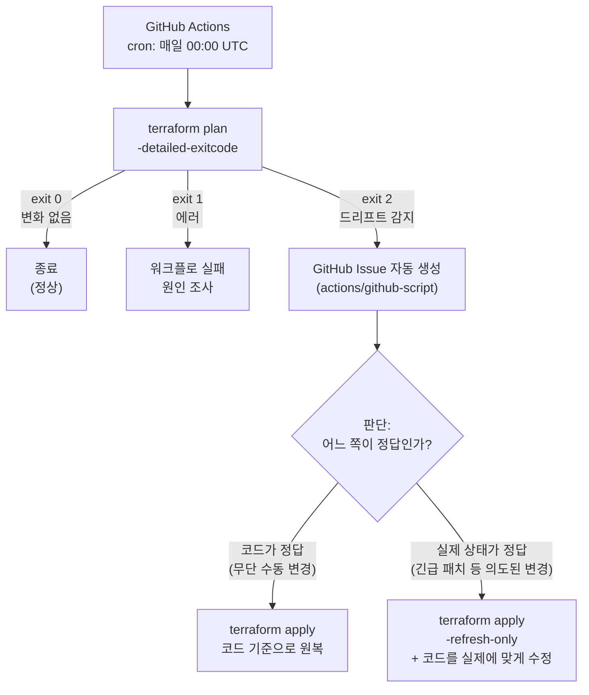



콘솔 수동 변경으로 코드와 실제 인프라가 어긋나는 것이 드리프트(Drift)입니다. [Lab 10](../state-recovery/)에서 드리프트를 수동으로 감지·복구했다면, 이번에는 `terraform plan -detailed-exitcode`와 GitHub Actions cron 스케줄로 **매일 자동으로 드리프트를 감지하고, 발견 시 GitHub Issue를 자동 생성**하는 체계를 만듭니다. 개념 배경은 [드리프트 관리 문서](../../04-team/drift)를 함께 참고하세요.

---

## `-detailed-exitcode` — 드리프트를 종료 코드로 읽는다

`terraform plan`은 기본적으로 성공하면 항상 exit 0입니다. 변경이 있든 없든 구분되지 않아 스크립트에서 판단할 수 없습니다. `-detailed-exitcode` 플래그를 붙이면 종료 코드에 의미가 생깁니다.

| Exit Code | 의미 | 자동화에서의 처리 |
|-----------|------|------------------|
| `0` | 성공, 변경 없음 | 정상 — 아무것도 안 함 |
| `1` | 에러 (문법 오류, 자격 증명 실패 등) | 파이프라인 실패로 알림 |
| `2` | 성공, **변경 있음 = 드리프트 감지** | Issue 생성·Slack 알림 등 대응 트리거 |




**동기화 vs 원복 판단 기준**: 드리프트를 발견했다고 무조건 apply로 덮어쓰면 안 됩니다. 장애 대응 중 콘솔에서 올린 인스턴스 사양을 자동으로 되돌리면 장애가 재발합니다. **의도된 변경**이면 `apply -refresh-only`로 State를 동기화하고 코드를 실제에 맞게 수정, **무단 변경**이면 일반 `apply`로 코드 기준 원복 — 이 판단은 사람이 해야 하므로, 자동화는 "감지와 알림"까지만 담당합니다.


---

## 이 랩이 입증하는 실무 역량

> "support production infrastructure changes... help establish best practices for safe, scalable cloud automation"
> — Snowrelic Inc, Senior Terraform Engineer

> "Own Foundation & Architecture: Design, scale, and maintain highly available... cloud infrastructure patterns"
> — MLabs, SRE

| JD 요구사항 | 이 랩에서 커버하는 내용 |
|-------------|------------------------|
| safe cloud automation의 best practice 수립 | 자동화는 감지·알림까지, 복구는 사람이 판단 — 안전한 자동화 경계 설계 |
| production infrastructure changes 지원 | 수동 변경(드리프트)을 24시간 내 탐지해 코드와 실제의 불일치가 누적되는 것을 방지 |
| highly available 인프라 유지 | 드리프트 방치 시 발생하는 "apply했더니 예상 밖 변경" 사고를 예방하는 운영 패턴 |
| SRE 스타일 운영 자동화 | exit code 기반 쉘 스크립트 + cron 스케줄 워크플로 + Issue 자동 생성으로 무인 감시 체계 구축 |

---

## 실습 파일 구성

```
lab17-drift-detection/
├── versions.tf
├── providers.tf
├── main.tf                                  ← random_string.suffix + aws_s3_bucket.app
├── outputs.tf
├── scripts/
│   └── check-drift.sh                       ← terraform plan -detailed-exitcode 래퍼
└── .github/
    └── workflows/
        └── drift-detection.yml              ← 매일 자정 cron + workflow_dispatch
```


`main.tf`는 `random_string.suffix` 리소스를 두고 S3 버킷 이름에 붙입니다. S3 버킷 이름은 전 세계에서 유일해야 하므로, 리터럴 이름(`lab17-drift-detection-app`)을 그대로 쓰면 다른 사용자의 버킷과 충돌해 `BucketAlreadyExists` 오류가 발생합니다. 이 때문에 `versions.tf`에도 `random` 프로바이더가 추가로 필요합니다.


---

## 전체 코드

### versions.tf

```hcl
terraform {
  required_version = ">= 1.0.0"

  required_providers {
    aws = {
      source  = "hashicorp/aws"
      version = "~> 5.0"
    }
    random = {
      source  = "hashicorp/random"
      version = "~> 3.0"
    }
  }
}
```

### providers.tf

```hcl
provider "aws" {
  region = "ap-northeast-2"
}
```

### main.tf

```hcl
# 버킷 이름 중복 방지를 위한 무작위 접미사
resource "random_string" "suffix" {
  length  = 8
  special = false
  upper   = false
}

# 드리프트 탐지 대상 S3 버킷
resource "aws_s3_bucket" "app" {
  bucket = "lab17-drift-detection-app-${random_string.suffix.result}"

  tags = {
    Name        = "lab17-app"
    Environment = "dev"
    ManagedBy   = "terraform"
  }
}
```

### outputs.tf

```hcl
output "bucket_name" {
  description = "드리프트 탐지 대상 S3 버킷 이름"
  value       = aws_s3_bucket.app.id
}

output "bucket_arn" {
  description = "드리프트 탐지 대상 S3 버킷 ARN"
  value       = aws_s3_bucket.app.arn
}
```

### scripts/check-drift.sh — 드리프트 탐지 스크립트

```bash
#!/usr/bin/env bash
# 드리프트 탐지: terraform plan의 detailed exit code 활용
set -uo pipefail

echo "[$(date '+%Y-%m-%d %H:%M:%S')] 드리프트 검사 시작"

terraform plan -detailed-exitcode -no-color -out=drift.tfplan > plan-output.txt 2>&1
EXIT_CODE=$?

case $EXIT_CODE in
  0)
    echo "✅ 드리프트 없음 — 코드와 실제 인프라 일치"
    ;;
  1)
    echo "❌ terraform plan 실행 에러"
    cat plan-output.txt
    exit 1
    ;;
  2)
    echo "⚠️ 드리프트 감지! 변경 내역:"
    grep -E '^\s*[~+-]' plan-output.txt | head -30
    exit 2
    ;;
esac
```

### .github/workflows/drift-detection.yml — 매일 자동 검사 + Issue 생성

```yaml
name: Drift Detection

on:
  schedule:
    - cron: "0 0 * * *" # 매일 00:00 UTC (KST 09:00)
  workflow_dispatch: # 수동 실행도 허용

env:
  TF_VERSION: "1.9.0"
  AWS_REGION: ${{ secrets.AWS_REGION }}

permissions:
  id-token: write # OIDC 토큰 발급에 필요
  contents: read
  issues: write # Issue 생성 권한

jobs:
  drift-check:
    name: Detect Drift
    runs-on: ubuntu-latest
    defaults:
      run:
        working-directory: lab17-drift-detection

    steps:
      - name: Checkout
        uses: actions/checkout@v4

      - name: Configure AWS credentials (OIDC)
        uses: aws-actions/configure-aws-credentials@v4
        with:
          role-to-assume: ${{ secrets.AWS_ROLE_ARN }}
          aws-region: ${{ env.AWS_REGION }}

      - name: Setup Terraform
        uses: hashicorp/setup-terraform@v3
        with:
          terraform_version: ${{ env.TF_VERSION }}
          terraform_wrapper: false # exit code를 직접 받기 위해 wrapper 비활성화

      - name: Terraform Init
        run: terraform init

      - name: Detect Drift
        id: plan
        run: |
          set +e
          terraform plan -detailed-exitcode -no-color > plan-output.txt 2>&1
          EXIT_CODE=$?
          set -e
          echo "exitcode=$EXIT_CODE" >> "$GITHUB_OUTPUT"

          if [ "$EXIT_CODE" -eq 1 ]; then
            cat plan-output.txt
            exit 1
          fi

      - name: Create Issue on Drift
        if: steps.plan.outputs.exitcode == '2'
        uses: actions/github-script@v7
        with:
          script: |
            const fs = require('fs');
            const planOutput = fs.readFileSync(
              'lab17-drift-detection/plan-output.txt', 'utf8'
            );
            // plan 출력이 길면 뒷부분만 첨부
            const trimmed = planOutput.length > 60000
              ? planOutput.slice(-60000) : planOutput;

            await github.rest.issues.create({
              owner: context.repo.owner,
              repo: context.repo.repo,
              title: `🚨 드리프트 감지: ${new Date().toISOString().slice(0, 10)}`,
              labels: ['drift', 'infrastructure'],
              body: [
                '## 인프라 드리프트가 감지되었습니다',
                '',
                '`terraform plan -detailed-exitcode`가 exit 2를 반환했습니다.',
                '',
                '### Plan 출력',
                '```',
                trimmed,
                '```',
                '',
                '### 대응 절차',
                '- [ ] 변경 주체·의도 확인 (긴급 패치? 무단 변경?)',
                '- [ ] 의도된 변경 → `terraform apply -refresh-only` + 코드 수정',
                '- [ ] 무단 변경 → `terraform apply`로 코드 기준 원복',
              ].join('\n'),
            });
```


**`terraform_wrapper: false`가 핵심**: `setup-terraform` 액션은 기본적으로 wrapper 스크립트를 씌워 exit code를 가공합니다. `-detailed-exitcode`의 종료 코드 2를 그대로 받으려면 wrapper를 꺼야 합니다. 이걸 빼먹으면 드리프트가 있어도 감지되지 않습니다.


---

## 실행 단계

{}

### 베이스 리소스 배포

```bash
cd lab17-drift-detection
terraform init
terraform apply -auto-approve

# 드리프트 없는 상태 확인
bash scripts/check-drift.sh
# ✅ 드리프트 없음
echo $?   # 0
```

### 드리프트 재현 — 콘솔 수동 변경 시뮬레이션

```bash
# 누군가 콘솔에서 태그를 바꿨다고 가정 (aws cli로 시뮬레이션)
# 버킷 이름은 random_string 접미사가 붙으므로 output에서 가져온다
BUCKET=$(terraform output -raw bucket_name)

aws s3api put-bucket-tagging \
  --bucket "$BUCKET" \
  --tagging 'TagSet=[{Key=Name,Value=lab17-app},{Key=Environment,Value=prod-CHANGED},{Key=ManagedBy,Value=terraform}]'
```

### 스크립트로 드리프트 감지

```bash
bash scripts/check-drift.sh
echo $?   # 2 ← 드리프트 감지
```

### 복구 — 무단 변경이므로 코드 기준 원복

```bash
terraform apply -auto-approve

# 재검사
bash scripts/check-drift.sh
echo $?   # 0 ← 정상 복구
```

### GitHub Secrets 확인 (OIDC)

이 워크플로는 [Lab 08](../github-actions/)에서 만든 OIDC IAM Role을 그대로 재사용합니다. 저장소 → Settings → Secrets and variables → Actions에 아래 두 개가 이미 등록되어 있어야 합니다.
- `AWS_ROLE_ARN`: Lab 08 bootstrap output의 Role ARN
- `AWS_REGION`: `ap-northeast-2`

### GitHub Actions 워크플로 등록

```bash
mkdir -p .github/workflows
# drift-detection.yml을 리포지토리 루트의 .github/workflows/에 배치
git add .github/workflows/drift-detection.yml
git commit -m "Add daily drift detection workflow"
git push

# 즉시 테스트: Actions 탭에서 workflow_dispatch로 수동 실행
```

{}

---

## 예상 결과 / 검증

### 드리프트 감지 시 스크립트 출력

```
[2026-07-06 09:00:01] 드리프트 검사 시작
⚠️ 드리프트 감지! 변경 내역:
  ~ resource "aws_s3_bucket" "app" {
      ~ tags = {
          ~ "Environment" = "prod-CHANGED" -> "dev"
        }
    }
```

### GitHub Actions 검증 포인트

1. Actions 탭 → `Drift Detection` 워크플로를 `workflow_dispatch`로 수동 실행
2. 드리프트가 있는 상태라면 → Issues 탭에 `🚨 드리프트 감지: 2026-07-06` Issue가 `drift` 라벨과 함께 생성됨
3. 드리프트 복구 후 재실행 → exit 0, Issue 미생성 확인

```bash
# gh CLI로 확인
gh run list --workflow=drift-detection.yml --limit 3
gh issue list --label drift
```

---

## 실습 정리

```bash
terraform destroy -auto-approve
rm -f drift.tfplan plan-output.txt

# 생성된 테스트 Issue도 닫기
gh issue list --label drift --json number --jq '.[].number' | xargs -I{} gh issue close {}
```

---

## 실무 포인트


**감지 주기는 조직의 변경 빈도에 맞춰서**: 매일 1회가 기본이지만, 콘솔 접근 권한자가 많은 조직은 6시간 주기(`0 */6 * * *`)도 씁니다. 단, plan 실행마다 State lock이 걸리므로 배포 파이프라인과 겹치지 않는 시간대를 고르세요.



**드리프트 자동 복구(auto-apply)는 신중하게**: 감지 즉시 `apply`로 자동 원복하는 파이프라인은 장애 대응 중 수동 조치까지 되돌려 장애를 키울 수 있습니다. 자동화는 Issue·알림 생성까지만, apply는 변경 의도를 확인한 사람이 실행하는 것이 안전한 기본값입니다.



**근본 대책은 콘솔 쓰기 권한 축소**: 드리프트 탐지는 사후 감지 장치입니다. 근본적으로는 운영 계정의 콘솔 쓰기 권한을 ReadOnly로 좁히고, 변경은 반드시 PR → 파이프라인 경로로만 가능하게 만드는 것이 목표입니다. [Lab 14 최소권한](../iam-least-privilege/)과 [드리프트 관리 문서](../../04-team/drift)를 함께 참고하세요.


→ 다음 실습: [Lab 18 ECS 컨테이너 배포](../ecs-container/) — 컨테이너 워크로드를 Terraform으로
