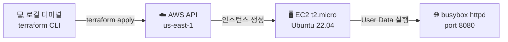



Terraform으로 AWS EC2 인스턴스를 배포하고, User Data로 웹서버를 자동 구성하는 입문 실습입니다.

---

## 구성 아키텍처




User Data 스크립트로 인스턴스 기동 시 웹서버가 자동 실행됩니다. 별도 SSH 접속 없이 바로 HTTP 응답을 확인할 수 있습니다.


---

## 파일 구성

실습 디렉터리 `ec2-webserver-lab/` 에 아래 5개 파일을 만듭니다.

| 파일 | 역할 |
|------|------|
| `versions.tf` | Terraform 및 AWS 프로바이더 버전 고정 |
| `providers.tf` | AWS 리전(us-east-1) 설정 |
| `main.tf` | 보안 그룹 + EC2 인스턴스 + User Data |
| `variables.tf` | 인스턴스 이름 변수 |
| `outputs.tf` | 퍼블릭 IP 출력 |

### versions.tf

```hcl
terraform {
  required_version = ">= 1.0.0"

  required_providers {
    aws = {
      source  = "hashicorp/aws"
      version = "~> 5.0"
    }
  }

  backend "local" {
    path = "terraform.tfstate"
  }
}
```

### providers.tf

```hcl
provider "aws" {
  region = "us-east-1" # 미국 동부 (버지니아 북부)
}
```

### variables.tf

```hcl
variable "instance_name" {
  description = "EC2 인스턴스의 이름 태그"
  type        = string
  default     = "t101-study"
}
```

### main.tf

```hcl
# 8080 포트 허용 보안그룹
resource "aws_security_group" "web_sg" {
  name        = "${var.instance_name}-sg"
  description = "Allow inbound HTTP on port 8080"

  ingress {
    description = "HTTP 8080"
    from_port   = 8080
    to_port     = 8080
    protocol    = "tcp"
    cidr_blocks = ["0.0.0.0/0"]
  }

  egress {
    from_port   = 0
    to_port     = 0
    protocol    = "-1"
    cidr_blocks = ["0.0.0.0/0"]
  }

  tags = {
    Name = "${var.instance_name}-sg"
  }
}

# EC2 인스턴스
resource "aws_instance" "example" {
  ami                    = "ami-0e86e20dae9224db8" # Ubuntu 22.04 LTS (us-east-1)
  instance_type          = "t2.micro"
  vpc_security_group_ids = [aws_security_group.web_sg.id]

  user_data = <<-EOF
              #!/bin/bash
              echo "Hello, Terraform" > index.html
              nohup busybox httpd -f -p 8080 &
              EOF

  tags = {
    Name = var.instance_name
  }
}
```

### outputs.tf

```hcl
output "public_ip" {
  description = "생성된 EC2의 퍼블릭 IP"
  value       = aws_instance.example.public_ip
}
```

---

## 실행 절차

{}

### 초기화 — terraform init

AWS 프로바이더 플러그인을 다운로드하고 로컬 백엔드를 구성합니다.

```bash
# 실습 디렉터리 생성 및 이동
mkdir ec2-webserver-lab && cd ec2-webserver-lab

# 위 파일 5개 작성 후 초기화
terraform init
```

완료되면 `.terraform/` 폴더와 `.terraform.lock.hcl` 파일이 생성됩니다.

### 계획 확인 — terraform plan

실제 배포 전에 생성될 리소스 내역을 미리 확인합니다. 아무것도 변경되지 않습니다.

```bash
terraform plan

# 인스턴스 이름을 변경하고 싶은 경우
terraform plan -var="instance_name=my-server"
```

출력에서 `+ create` 기호가 붙은 리소스가 생성 예정 목록입니다. `aws_security_group`과 `aws_instance` 2개가 표시되어야 합니다.

### 배포 — terraform apply

실제 AWS에 리소스를 생성합니다. 확인 메시지에 `yes`를 입력합니다.

```bash
terraform apply
```

완료 후 출력 예시:

```
Apply complete! Resources: 2 added, 0 changed, 0 destroyed.

Outputs:
public_ip = "54.xx.xx.xx"
```

EC2 기동에 1~2분 소요됩니다. 이후 curl로 확인합니다:

```bash
curl http://<public_ip>:8080
# Hello, Terraform
```

### 확인 후 삭제 — terraform destroy

실습이 끝나면 반드시 리소스를 삭제하여 비용을 방지합니다.

```bash
terraform destroy
```

`yes`를 입력하면 EC2 인스턴스와 보안 그룹이 모두 삭제됩니다.

{}

---

## 주의사항


**AWS 자격증명 필수**: `aws configure`로 Access Key를 설정하거나, 환경변수 `AWS_ACCESS_KEY_ID` / `AWS_SECRET_ACCESS_KEY`를 먼저 설정해야 합니다.



**AMI ID 유효성**: `ami-0e86e20dae9224db8`는 us-east-1 Ubuntu 22.04 LTS 기준입니다. 시간이 지나면 deprecated될 수 있으므로 [AWS EC2 AMI 카탈로그](https://us-east-1.console.aws.amazon.com/ec2/home?region=us-east-1#AMICatalog)에서 최신 Ubuntu 22.04 AMI로 교체하세요.



**비용**: t2.micro는 AWS 프리 티어 대상입니다. 단, 실습 후 `terraform destroy`를 실행하지 않으면 지속 과금됩니다.


---

## 핵심 학습 포인트

이 실습에서 체험한 패턴을 정리합니다.

**리소스 간 참조**: `aws_security_group.web_sg.id`처럼 한 리소스의 속성을 다른 리소스에서 직접 참조합니다. Terraform은 이 참조를 보고 **자동으로 생성 순서**(보안 그룹 → EC2)를 결정합니다.

**User Data**: EC2 기동 시 자동 실행되는 셸 스크립트입니다. 패키지 설치, 애플리케이션 시작 등 초기 설정을 코드로 표현합니다.

**Output**: `public_ip`를 output으로 정의해 두면, apply 완료 후 자동으로 IP가 출력되고, `terraform output public_ip`로 언제든 다시 확인할 수 있습니다.

→ 다음 실습: VPC + Subnet + EC2 완전한 네트워크 스택 구성
