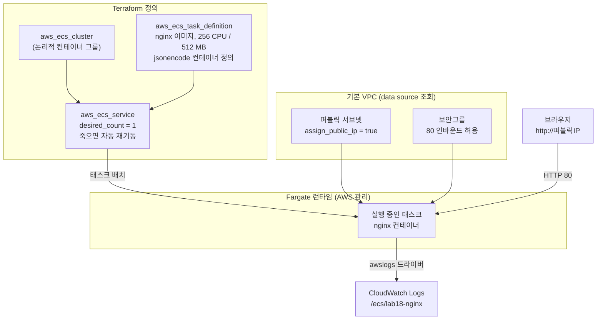



ECS Fargate로 nginx 컨테이너 하나를 배포합니다. 서버(EC2) 없이 컨테이너만 정의하면 AWS가 실행 환경을 관리해주는 서버리스 컨테이너 패턴으로, 클러스터·태스크 정의·서비스·로그 수집까지 전부 Terraform으로 구성합니다.

---

## ECS Fargate — 서버 없는 컨테이너 실행

컨테이너 오케스트레이션의 핵심 질문은 "컨테이너를 **어디서, 몇 개, 어떻게** 실행할 것인가"입니다. ECS는 AWS 네이티브 답변이고, Fargate는 그중에서도 EC2 관리까지 AWS에 위임하는 실행 모드입니다.



### ECS vs EKS vs 자체 운영 Kubernetes

JD들이 요구하는 것은 특정 도구가 아니라 **컨테이너 오케스트레이션 스펙트럼**에 대한 이해입니다.

| 구분 | ECS (Fargate) | EKS | 자체 운영 Kubernetes |
|------|---------------|-----|---------------------|
| 컨트롤 플레인 | AWS 완전 관리 (무료) | AWS 관리 (시간당 $0.10) | 직접 구축·운영 |
| 학습 곡선 | 낮음 — AWS 개념만 알면 됨 | 중간 — K8s + AWS 통합 | 높음 — K8s 전체 스택 |
| 이식성 | AWS 종속 | K8s 표준 — 매니페스트 재사용 가능 | 완전한 이식성 |
| 생태계 | AWS 서비스 통합 중심 | Helm, Operator 등 K8s 생태계 | K8s 생태계 전체 |
| Terraform 리소스 | `aws_ecs_*` 몇 개로 완결 | `aws_eks_cluster` + helm/kubernetes provider | 직접 조합 |
| 적합한 경우 | AWS 단일 클라우드, 소규모 팀 | K8s 표준이 필요한 조직 | 온프레미스, 특수 요구사항 |


**ECS로 시작하는 이유**: 태스크 정의(≈ Pod 스펙), 서비스(≈ Deployment), 클러스터라는 개념 구조가 Kubernetes와 1:1로 대응됩니다. ECS로 오케스트레이션의 뼈대를 익히면 EKS/Kubernetes 학습이 훨씬 빨라집니다.


---

## 이 랩이 입증하는 실무 역량

> **Mercor — DevSecOps Specialist**
> "Terraform with modular, reusable patterns across VPC, EC2, ECS, EKS, IAM, S3, and SQS"

> **First Soft Solutions — Cloud Terraform Engineer**
> "Configure and manage Kubernetes environments... Kubernetes, Infrastructure as Code (IaC)"

> **Information Consulting Services — Junior DevOps Engineer**
> "Deploy and support containerized services using Docker and/or Kubernetes"

| JD 요구사항 | 이 랩에서 다루는 내용 |
|-------------|----------------------|
| Terraform across VPC, ECS, IAM | 기본 VPC data source 조회 + ECS 클러스터/태스크/서비스 + 태스크 실행 IAM Role을 한 구성으로 |
| Kubernetes environments | ECS ↔ K8s 개념 매핑(태스크 정의=Pod, 서비스=Deployment)으로 오케스트레이션 공통 원리 학습 |
| Deploy containerized services | nginx 컨테이너를 코드로 배포하고 퍼블릭 IP로 서비스 확인 |
| Support (운영) | CloudWatch Logs로 컨테이너 로그 수집 — 배포 후 관측까지가 "지원"의 범위 |

---

## 파일 구조

```
lab18-ecs-container/
├── versions.tf
├── providers.tf
├── network.tf       # 기본 VPC/서브넷 조회 + 보안그룹
├── iam.tf           # 태스크 실행 Role
├── logs.tf          # 컨테이너 로그 그룹
├── ecs.tf           # 클러스터 + 태스크 정의 + 서비스
└── outputs.tf
```

---

## 전체 코드

### versions.tf

```hcl
terraform {
  required_version = ">= 1.0.0"

  required_providers {
    aws = {
      source  = "hashicorp/aws"
      version = "~> 5.0"
    }
  }
}
```

### providers.tf

```hcl
provider "aws" {
  region = "ap-northeast-2"
}
```

### network.tf

```hcl
# 기본 VPC와 퍼블릭 서브넷을 data source로 조회 (새 VPC 생성 없음)
data "aws_vpc" "default" {
  default = true
}

data "aws_subnets" "default" {
  filter {
    name   = "vpc-id"
    values = [data.aws_vpc.default.id]
  }

  filter {
    name   = "default-for-az"
    values = ["true"]
  }
}

resource "aws_security_group" "nginx" {
  name        = "lab18-nginx-sg"
  description = "Allow HTTP inbound for nginx task"
  vpc_id      = data.aws_vpc.default.id

  ingress {
    description = "HTTP"
    from_port   = 80
    to_port     = 80
    protocol    = "tcp"
    cidr_blocks = ["0.0.0.0/0"]
  }

  egress {
    description = "All outbound (image pull, logs)"
    from_port   = 0
    to_port     = 0
    protocol    = "-1"
    cidr_blocks = ["0.0.0.0/0"]
  }

  tags = {
    Name = "lab18-nginx-sg"
  }
}
```

### iam.tf

```hcl
# 태스크 "실행" Role — ECS 에이전트가 이미지 pull, 로그 전송에 사용
resource "aws_iam_role" "task_execution" {
  name = "lab18-ecs-task-execution-role"

  assume_role_policy = jsonencode({
    Version = "2012-10-17"
    Statement = [{
      Effect = "Allow"
      Principal = {
        Service = "ecs-tasks.amazonaws.com"
      }
      Action = "sts:AssumeRole"
    }]
  })
}

resource "aws_iam_role_policy_attachment" "task_execution" {
  role       = aws_iam_role.task_execution.name
  policy_arn = "arn:aws:iam::aws:policy/service-role/AmazonECSTaskExecutionRolePolicy"
}
```

### logs.tf

```hcl
resource "aws_cloudwatch_log_group" "nginx" {
  name              = "/ecs/lab18-nginx"
  retention_in_days = 3 # 실습용 — 짧게 보관해 비용 최소화
}
```

### ecs.tf

```hcl
resource "aws_ecs_cluster" "main" {
  name = "lab18-cluster"
}

resource "aws_ecs_task_definition" "nginx" {
  family                   = "lab18-nginx"
  requires_compatibilities = ["FARGATE"]
  network_mode             = "awsvpc" # Fargate 필수 — 태스크마다 ENI 할당
  cpu                      = 256      # 0.25 vCPU
  memory                   = 512      # 512 MB
  execution_role_arn       = aws_iam_role.task_execution.arn

  # 컨테이너 정의는 JSON — jsonencode로 HCL 안에서 관리
  container_definitions = jsonencode([
    {
      name      = "nginx"
      image     = "public.ecr.aws/nginx/nginx:stable"
      essential = true

      portMappings = [
        {
          containerPort = 80
          protocol      = "tcp"
        }
      ]

      logConfiguration = {
        logDriver = "awslogs"
        options = {
          "awslogs-group"         = aws_cloudwatch_log_group.nginx.name
          "awslogs-region"        = "ap-northeast-2"
          "awslogs-stream-prefix" = "nginx"
        }
      }
    }
  ])
}

resource "aws_ecs_service" "nginx" {
  name            = "lab18-nginx-svc"
  cluster         = aws_ecs_cluster.main.id
  task_definition = aws_ecs_task_definition.nginx.arn
  launch_type     = "FARGATE"
  desired_count   = 1 # 태스크가 죽으면 ECS가 자동으로 재기동

  network_configuration {
    subnets          = data.aws_subnets.default.ids
    security_groups  = [aws_security_group.nginx.id]
    assign_public_ip = true # 퍼블릭 서브넷 + NAT 없이 이미지 pull
  }
}
```

### outputs.tf

```hcl
output "cluster_name" {
  value = aws_ecs_cluster.main.name
}

output "service_name" {
  value = aws_ecs_service.nginx.name
}

output "log_group" {
  value = aws_cloudwatch_log_group.nginx.name
}
```


**Fargate는 프리 티어가 아닙니다 — 실습 후 즉시 destroy 하세요.** 이 구성(0.25 vCPU / 512 MB, 태스크 1개)은 서울 리전 기준 **시간당 약 $0.02** 수준입니다. 한두 시간 실습이면 커피값도 안 되지만, 켜둔 채 잊으면 한 달에 $15 안팎이 청구됩니다. 실습이 끝나면 반드시 `terraform destroy`를 실행하세요.


---

## 실행 단계

{}

### 배포

```bash
cd lab18-ecs-container
terraform init
terraform plan    # 클러스터, 태스크 정의, 서비스, SG, IAM, 로그 그룹 확인
terraform apply -auto-approve
```

### 태스크가 RUNNING 될 때까지 대기

```bash
CLUSTER=$(terraform output -raw cluster_name)
SERVICE=$(terraform output -raw service_name)

# 서비스가 안정화(태스크 RUNNING)될 때까지 대기 — 보통 1~2분
aws ecs wait services-stable --cluster "$CLUSTER" --services "$SERVICE"
echo "서비스 안정화 완료"
```

### 퍼블릭 IP 조회 후 nginx 응답 확인

Fargate 태스크의 퍼블릭 IP는 태스크에 붙은 ENI에서 조회합니다.

```bash
# 1. 실행 중인 태스크 ARN
TASK_ARN=$(aws ecs list-tasks --cluster "$CLUSTER" \
  --service-name "$SERVICE" --query 'taskArns[0]' --output text)

# 2. 태스크의 ENI ID
ENI_ID=$(aws ecs describe-tasks --cluster "$CLUSTER" --tasks "$TASK_ARN" \
  --query "tasks[0].attachments[0].details[?name=='networkInterfaceId'].value" \
  --output text)

# 3. ENI의 퍼블릭 IP
PUBLIC_IP=$(aws ec2 describe-network-interfaces --network-interface-ids "$ENI_ID" \
  --query 'NetworkInterfaces[0].Association.PublicIp' --output text)

echo "http://$PUBLIC_IP"
curl -s "http://$PUBLIC_IP" | grep -o "<title>.*</title>"
# <title>Welcome to nginx!</title>
```

### 컨테이너 로그 확인

```bash
aws logs tail /ecs/lab18-nginx --since 10m
# nginx 기동 로그 + 방금 보낸 curl의 액세스 로그 확인
```

{}

---

## 예상 결과 / 검증

```
Apply complete! Resources: 8 added, 0 changed, 0 destroyed.

Outputs:

cluster_name = "lab18-cluster"
log_group    = "/ecs/lab18-nginx"
service_name = "lab18-nginx-svc"
```

| 검증 항목 | 방법 | 기대 결과 |
|-----------|------|-----------|
| 태스크 상태 | `aws ecs describe-tasks --query 'tasks[0].lastStatus'` | `RUNNING` |
| HTTP 응답 | `curl http://$PUBLIC_IP` | `Welcome to nginx!` HTML |
| 자동 재기동 | 콘솔에서 태스크 수동 중지 → 1~2분 대기 | 새 태스크가 자동으로 RUNNING (desired_count 유지) |
| 로그 수집 | `aws logs tail /ecs/lab18-nginx` | nginx 액세스/에러 로그 스트림 |


**자동 재기동을 직접 확인해보세요**: `aws ecs stop-task --cluster lab18-cluster --task $TASK_ARN`으로 태스크를 죽이면, ECS 서비스가 `desired_count = 1`을 유지하기 위해 새 태스크를 자동으로 띄웁니다. Kubernetes의 ReplicaSet과 같은 원리입니다. 단, 새 태스크는 **퍼블릭 IP가 바뀌므로** IP를 다시 조회해야 합니다 — 실무에서 ALB를 앞에 두는 이유입니다.


---

## 실습 정리

```bash
terraform destroy -auto-approve
```


**destroy 후 과금 확인**: `aws ecs list-tasks --cluster lab18-cluster`가 클러스터 없음 오류를 반환하면 정상 삭제된 것입니다. Fargate는 태스크가 떠 있는 시간만큼 과금되므로, 삭제 확인까지가 실습의 끝입니다.


---

## 실무 포인트


**태스크 실행 Role vs 태스크 Role**: 이 랩의 `execution_role_arn`은 ECS 에이전트용(이미지 pull, 로그 전송)입니다. 컨테이너 안의 애플리케이션이 S3, SQS 등 AWS API를 호출해야 한다면 별도의 `task_role_arn`을 부여합니다. 두 Role의 구분은 ECS 면접 단골 질문입니다.



**실무 구성으로 가는 다음 단계**: ① 퍼블릭 IP 직접 노출 대신 **ALB + Target Group** 연결, ② 퍼블릭 이미지 대신 **ECR 프라이빗 레지스트리** + CI에서 이미지 빌드/푸시, ③ `desired_count` 고정 대신 **Application Auto Scaling**으로 태스크 수 자동 조절. 이 랩의 코드가 그 확장의 기반 골격입니다.



**jsonencode 안의 오타는 plan에서 안 잡힙니다**: `container_definitions`는 Terraform 입장에선 그냥 문자열이라, 키 이름 오타(`portMapping` vs `portMappings`)가 apply 시점 또는 태스크 기동 실패로만 드러납니다. 태스크가 `STOPPED`를 반복하면 `aws ecs describe-tasks`의 `stoppedReason`부터 확인하세요.


---

→ 실습을 모두 마쳤다면: [운영 체크리스트](../../08-ops/checklist/)로 실무 투입 준비 상태를 점검하세요.
