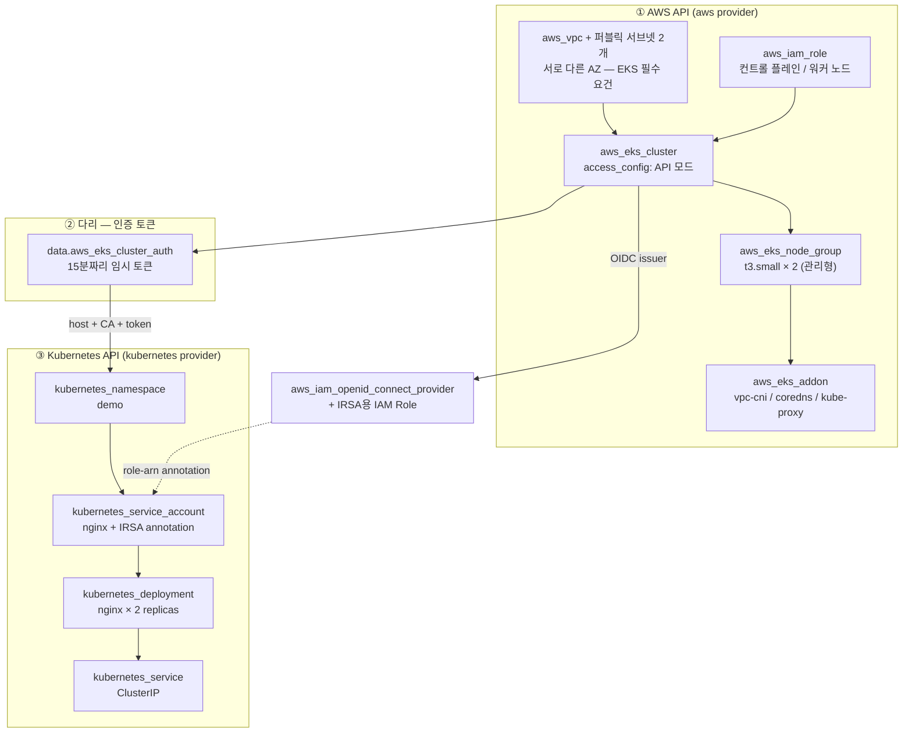



EKS 클러스터와 워커 노드를 Terraform으로 만들고, **같은 구성 안에서** 클러스터 내부의 Namespace·Deployment·Service까지 배포합니다. AWS API와 Kubernetes API를 하나의 state에서 다루는 것이 이 랩의 핵심이며, 파드에 IAM 권한을 위임하는 IRSA 패턴까지 포함합니다.

---

## 하나의 구성, 두 개의 API

Lab 18까지는 Terraform이 AWS API만 호출했습니다. 이 랩부터는 **경계를 하나 더 넘습니다** — 클러스터를 만든 뒤, 그 클러스터의 Kubernetes API에 접속해 워크로드를 배포합니다.




**provider 설정이 아직 없는 리소스를 참조합니다**: `providers.tf`의 `kubernetes` provider는 `aws_eks_cluster.main.endpoint`를 참조하는데, 첫 apply 시점에 그 클러스터는 존재하지 않습니다. Terraform은 provider 설정을 지연 평가하므로 대개 한 번에 성공하지만, 실패한다면 2단계로 나눠 실행하세요.

```bash
terraform apply -target=aws_eks_node_group.main   # 1단계: 인프라
terraform apply                                   # 2단계: k8s 리소스
```

실무에서는 아예 **클러스터 프로비저닝 root module과 워크로드 배포 root module을 분리**합니다. [Lab 05 환경 분리](../env-separation/)의 발상과 같습니다.


### Lab 18(ECS)과 무엇이 다른가

| 구분 | Lab 18 — ECS Fargate | Lab 19 — EKS |
|------|---------------------|--------------|
| 노드 | 없음 — AWS가 완전 은닉 | `aws_eks_node_group`으로 직접 소유 |
| 컨트롤 플레인 비용 | 무료 | **시간당 약 $0.10** (유휴 상태에도 과금) |
| 워크로드 정의 | `aws_ecs_task_definition` (AWS 리소스) | `kubernetes_deployment` (K8s 리소스) |
| 파드 IAM 권한 | 태스크 Role | **IRSA** — OIDC 기반 웹 아이덴티티 |
| provider 수 | 1개 (aws) | 3개 (aws + kubernetes + tls) |
| 이식성 | AWS 종속 | K8s 표준 — 매니페스트 재사용 가능 |

---

## 이 랩이 입증하는 실무 역량

> **Mercor — DevSecOps Specialist**
> "Terraform with modular, reusable patterns across VPC, EC2, ECS, EKS, IAM, S3, and SQS"

> **First Soft Solutions — Cloud Terraform Engineer**
> "Configure and manage Kubernetes environments... Kubernetes, Infrastructure as Code (IaC)"

| JD 요구사항 | 이 랩에서 다루는 내용 |
|-------------|----------------------|
| EKS를 포함한 Terraform 구성 | VPC·IAM·클러스터·노드 그룹·애드온을 하나의 root module로 |
| Configure and manage Kubernetes environments | `kubernetes` provider로 Namespace/Deployment/Service를 코드로 관리 |
| IAM 최소 권한 (Lab 14 연장) | 노드 Role에 권한을 몰아주는 대신 IRSA로 **파드 단위** 권한 부여 |
| 클러스터 수명주기 관리 | 애드온 버전 고정, `update_config`로 무중단 노드 교체 |

---

## 실습 파일 구성

```
lab19-eks-kubernetes/
├── versions.tf      ← aws + kubernetes + tls provider 선언
├── providers.tf     ← kubernetes provider를 클러스터 출력값으로 구성
├── variables.tf     ← 클러스터 버전, 노드 타입/수, service_type
├── locals.tf        ← cluster_name + common_tags + 앱 식별자
├── network.tf       ← VPC + 2개 AZ 퍼블릭 서브넷 (elb 태그 포함)
├── iam.tf           ← 컨트롤 플레인 Role + 워커 노드 Role(정책 4종)
├── eks.tf           ← 클러스터 + 관리형 노드 그룹 + 코어 애드온
├── irsa.tf          ← OIDC provider + ServiceAccount 전용 IAM Role
├── kubernetes.tf    ← Namespace / ServiceAccount / Deployment / Service
└── outputs.tf
```

---

## 전체 코드

### versions.tf

```hcl
terraform {
  required_version = ">= 1.0.0"

  required_providers {
    aws = {
      source  = "hashicorp/aws"
      version = "~> 5.0"
    }

    # EKS 클러스터를 만든 뒤, 같은 apply 안에서 클러스터 안의
    # 리소스(Namespace/Deployment/Service)까지 관리하기 위한 provider
    kubernetes = {
      source  = "hashicorp/kubernetes"
      version = "~> 2.30"
    }

    # IRSA용 OIDC provider 등록 시 인증서 지문(thumbprint)을 계산하는 데 사용
    tls = {
      source  = "hashicorp/tls"
      version = "~> 4.0"
    }
  }
}
```

### providers.tf

```hcl
provider "aws" {
  region = var.region
}

# 클러스터 접속용 임시 토큰(15분 유효) — kubeconfig 파일 없이 인증
data "aws_eks_cluster_auth" "main" {
  name = aws_eks_cluster.main.name
}

provider "kubernetes" {
  host                   = aws_eks_cluster.main.endpoint
  cluster_ca_certificate = base64decode(aws_eks_cluster.main.certificate_authority[0].data)
  token                  = data.aws_eks_cluster_auth.main.token
}
```

### variables.tf

```hcl
variable "project" {
  description = "프로젝트 이름"
  type        = string
  default     = "lab19"
}

variable "environment" {
  description = "배포 환경"
  type        = string
  default     = "dev"
}

variable "region" {
  description = "클러스터를 생성할 리전"
  type        = string
  default     = "ap-northeast-2"
}

variable "cluster_version" {
  description = "EKS 컨트롤 플레인 쿠버네티스 버전"
  type        = string
  default     = "1.31"
}

variable "node_instance_type" {
  description = "워커 노드 인스턴스 타입 — 실습용 최소 사양"
  type        = string
  default     = "t3.small"
}

variable "node_desired_size" {
  description = "관리형 노드 그룹의 희망 노드 수"
  type        = number
  default     = 2

  validation {
    condition     = var.node_desired_size >= 1 && var.node_desired_size <= 3
    error_message = "실습 비용을 감안해 1~3개 사이로 제한한다."
  }
}

variable "app_replicas" {
  description = "nginx Deployment의 파드 replica 수"
  type        = number
  default     = 2
}

# LoadBalancer로 바꾸면 AWS가 실제 ELB를 생성해 시간당 비용이 발생한다.
# 기본값은 ClusterIP이며, 접속 확인은 kubectl port-forward로 한다.
variable "service_type" {
  description = "nginx Service 타입 (ClusterIP | NodePort | LoadBalancer)"
  type        = string
  default     = "ClusterIP"

  validation {
    condition     = contains(["ClusterIP", "NodePort", "LoadBalancer"], var.service_type)
    error_message = "service_type은 ClusterIP, NodePort, LoadBalancer 중 하나여야 한다."
  }
}
```

### locals.tf

```hcl
locals {
  cluster_name = "${var.project}-eks"

  common_tags = {
    Project     = var.project
    Environment = var.environment
    ManagedBy   = "terraform"
  }

  # 클러스터 안에서 배포할 애플리케이션 식별자
  app_namespace = "demo"
  app_name      = "nginx"
}
```

### network.tf

```hcl
# EKS는 서로 다른 AZ의 서브넷을 최소 2개 요구한다
data "aws_availability_zones" "available" {
  state = "available"
}

resource "aws_vpc" "main" {
  cidr_block           = "10.19.0.0/16"
  enable_dns_support   = true
  enable_dns_hostnames = true # EKS 노드 등록에 필수

  tags = merge(local.common_tags, {
    Name = "${local.cluster_name}-vpc"
  })
}

resource "aws_internet_gateway" "main" {
  vpc_id = aws_vpc.main.id

  tags = merge(local.common_tags, {
    Name = "${local.cluster_name}-igw"
  })
}

# 실습 비용 최소화를 위해 퍼블릭 서브넷만 사용한다.
# 실무에서는 워커 노드를 프라이빗 서브넷에 두고 NAT Gateway로 아웃바운드를
# 처리하는 것이 표준이지만, NAT Gateway는 시간당 요금이 붙는다.
resource "aws_subnet" "public" {
  count = 2

  vpc_id                  = aws_vpc.main.id
  cidr_block              = cidrsubnet(aws_vpc.main.cidr_block, 8, count.index)
  availability_zone       = data.aws_availability_zones.available.names[count.index]
  map_public_ip_on_launch = true # 노드가 컨트롤 플레인/ECR에 접근하려면 필요

  tags = merge(local.common_tags, {
    Name = "${local.cluster_name}-public-${count.index + 1}"

    # 쿠버네티스가 이 서브넷에 외부용 LoadBalancer를 만들 수 있다고 표시하는 태그.
    # service_type = "LoadBalancer"로 바꿀 때 이 태그가 없으면 프로비저닝이 실패한다.
    "kubernetes.io/role/elb" = "1"
  })
}

resource "aws_route_table" "public" {
  vpc_id = aws_vpc.main.id

  route {
    cidr_block = "0.0.0.0/0"
    gateway_id = aws_internet_gateway.main.id
  }

  tags = merge(local.common_tags, {
    Name = "${local.cluster_name}-public-rt"
  })
}

resource "aws_route_table_association" "public" {
  count = length(aws_subnet.public)

  subnet_id      = aws_subnet.public[count.index].id
  route_table_id = aws_route_table.public.id
}
```

### iam.tf

```hcl
# ── 컨트롤 플레인 Role ────────────────────────────────────────────────
# EKS 서비스가 사용자 계정 안에서 ENI, 보안 그룹 등을 다루기 위해 위임받는 Role
resource "aws_iam_role" "cluster" {
  name = "${local.cluster_name}-cluster-role"

  assume_role_policy = jsonencode({
    Version = "2012-10-17"
    Statement = [{
      Effect = "Allow"
      Principal = {
        Service = "eks.amazonaws.com"
      }
      Action = ["sts:AssumeRole", "sts:TagSession"]
    }]
  })

  tags = merge(local.common_tags, {
    Name = "${local.cluster_name}-cluster-role"
  })
}

resource "aws_iam_role_policy_attachment" "cluster" {
  role       = aws_iam_role.cluster.name
  policy_arn = "arn:aws:iam::aws:policy/AmazonEKSClusterPolicy"
}

# ── 워커 노드 Role ───────────────────────────────────────────────────
# 노드는 EC2 인스턴스이므로 신뢰 주체가 ec2.amazonaws.com이다
resource "aws_iam_role" "node" {
  name = "${local.cluster_name}-node-role"

  assume_role_policy = jsonencode({
    Version = "2012-10-17"
    Statement = [{
      Effect = "Allow"
      Principal = {
        Service = "ec2.amazonaws.com"
      }
      Action = "sts:AssumeRole"
    }]
  })

  tags = merge(local.common_tags, {
    Name = "${local.cluster_name}-node-role"
  })
}

# 관리형 노드 그룹이 요구하는 3종 세트
locals {
  node_policies = {
    worker    = "arn:aws:iam::aws:policy/AmazonEKSWorkerNodePolicy"          # 클러스터 조인
    cni       = "arn:aws:iam::aws:policy/AmazonEKS_CNI_Policy"               # 파드 ENI/IP 할당
    ecr_read  = "arn:aws:iam::aws:policy/AmazonEC2ContainerRegistryReadOnly" # 이미지 pull
    ssm_agent = "arn:aws:iam::aws:policy/AmazonSSMManagedInstanceCore"       # SSH 키 없이 노드 접속
  }
}

resource "aws_iam_role_policy_attachment" "node" {
  for_each = local.node_policies

  role       = aws_iam_role.node.name
  policy_arn = each.value
}
```

### eks.tf

```hcl
# ── 컨트롤 플레인 ────────────────────────────────────────────────────
# AWS가 관리하는 API 서버/etcd. 시간당 요금이 부과되므로 실습 후 반드시 destroy.
resource "aws_eks_cluster" "main" {
  name     = local.cluster_name
  role_arn = aws_iam_role.cluster.arn
  version  = var.cluster_version

  vpc_config {
    subnet_ids              = aws_subnet.public[*].id
    endpoint_public_access  = true # 로컬 kubectl에서 접근하기 위함
    endpoint_private_access = true # 노드는 VPC 내부 경로로 통신
  }

  access_config {
    # API: aws_eks_access_entry 리소스로 접근 권한을 관리(신규 방식)
    # CONFIG_MAP: aws-auth ConfigMap 편집(레거시). 둘 다 쓰려면 API_AND_CONFIG_MAP.
    authentication_mode = "API"

    # apply를 실행한 IAM 주체에게 클러스터 관리자 권한을 자동 부여.
    # 이게 없으면 클러스터를 만들고도 kubectl/kubernetes provider가 인증에 실패한다.
    bootstrap_cluster_creator_admin_permissions = true
  }

  # Role의 권한이 먼저 붙고, 삭제는 나중에 되도록 순서 고정.
  # 그렇지 않으면 EKS가 만든 ENI/보안 그룹을 정리하지 못해 destroy가 멈춘다.
  depends_on = [aws_iam_role_policy_attachment.cluster]

  tags = merge(local.common_tags, {
    Name = local.cluster_name
  })
}

# ── 워커 노드(관리형 노드 그룹) ───────────────────────────────────────
# AMI 선택, 부트스트랩, 롤링 업데이트를 EKS가 대신 처리한다.
# lab18의 Fargate가 "노드조차 없는" 모델이라면, 여기서는 노드를 직접 소유한다.
resource "aws_eks_node_group" "main" {
  cluster_name    = aws_eks_cluster.main.name
  node_group_name = "${local.cluster_name}-ng"
  node_role_arn   = aws_iam_role.node.arn
  subnet_ids      = aws_subnet.public[*].id

  instance_types = [var.node_instance_type]
  capacity_type  = "ON_DEMAND"
  disk_size      = 20

  scaling_config {
    desired_size = var.node_desired_size
    min_size     = 1
    max_size     = 3
  }

  update_config {
    max_unavailable = 1 # 버전 업그레이드 시 한 번에 한 대씩 교체
  }

  depends_on = [aws_iam_role_policy_attachment.node]

  tags = merge(local.common_tags, {
    Name = "${local.cluster_name}-ng"
  })

  lifecycle {
    # 클러스터 오토스케일러가 desired_size를 바꿔도 Terraform이 되돌리지 않게 한다
    ignore_changes = [scaling_config[0].desired_size]
  }
}

# ── 애드온 ──────────────────────────────────────────────────────────
# CoreDNS/kube-proxy/VPC CNI는 EKS 애드온으로 버전을 코드에 고정할 수 있다.
# 애드온 파드는 노드 위에서 돌기 때문에 노드 그룹 이후에 설치한다.
resource "aws_eks_addon" "core" {
  for_each = toset(["vpc-cni", "coredns", "kube-proxy"])

  cluster_name = aws_eks_cluster.main.name
  addon_name   = each.value

  # 버전을 명시하지 않으면 클러스터 버전에 맞는 기본 버전이 설치된다
  resolve_conflicts_on_create = "OVERWRITE"
  resolve_conflicts_on_update = "OVERWRITE"

  depends_on = [aws_eks_node_group.main]

  tags = local.common_tags
}
```

### irsa.tf

```hcl
# ── IRSA (IAM Roles for Service Accounts) ────────────────────────────
# 파드에 AWS 권한을 주는 올바른 방법. 노드 Role에 권한을 몰아주면
# 그 노드의 "모든" 파드가 같은 권한을 갖게 되므로 최소 권한 원칙(lab14)이 깨진다.
#
# 동작 원리: 클러스터가 발급한 ServiceAccount 토큰(JWT)을 IAM이 신뢰하도록
# OIDC provider로 등록해 두면, 파드가 그 토큰으로 직접 AssumeRole 할 수 있다.

# 클러스터 OIDC 발급자의 TLS 인증서를 읽어 지문(thumbprint)을 계산
data "tls_certificate" "oidc" {
  url = aws_eks_cluster.main.identity[0].oidc[0].issuer
}

resource "aws_iam_openid_connect_provider" "eks" {
  url             = aws_eks_cluster.main.identity[0].oidc[0].issuer
  client_id_list  = ["sts.amazonaws.com"]
  thumbprint_list = [data.tls_certificate.oidc.certificates[0].sha1_fingerprint]

  tags = merge(local.common_tags, {
    Name = "${local.cluster_name}-oidc"
  })
}

# 신뢰 정책: "demo 네임스페이스의 nginx ServiceAccount"만 이 Role을 쓸 수 있다.
# sub 조건을 생략하면 클러스터의 아무 파드나 Role을 가져갈 수 있으니 반드시 고정한다.
data "aws_iam_policy_document" "app_assume_role" {
  statement {
    effect  = "Allow"
    actions = ["sts:AssumeRoleWithWebIdentity"]

    principals {
      type        = "Federated"
      identifiers = [aws_iam_openid_connect_provider.eks.arn]
    }

    condition {
      test     = "StringEquals"
      variable = "${replace(aws_iam_openid_connect_provider.eks.url, "https://", "")}:sub"
      values   = ["system:serviceaccount:${local.app_namespace}:${local.app_name}"]
    }

    condition {
      test     = "StringEquals"
      variable = "${replace(aws_iam_openid_connect_provider.eks.url, "https://", "")}:aud"
      values   = ["sts.amazonaws.com"]
    }
  }
}

resource "aws_iam_role" "app" {
  name               = "${local.cluster_name}-app-irsa-role"
  assume_role_policy = data.aws_iam_policy_document.app_assume_role.json

  tags = merge(local.common_tags, {
    Name = "${local.cluster_name}-app-irsa-role"
  })
}

# 예시 권한 — 자기 계정 정보 조회만 가능한 사실상 무해한 정책.
# 실제로는 여기에 애플리케이션이 필요한 S3/SQS 권한 등을 붙인다.
data "aws_iam_policy_document" "app" {
  statement {
    effect    = "Allow"
    actions   = ["sts:GetCallerIdentity"]
    resources = ["*"]
  }
}

resource "aws_iam_role_policy" "app" {
  name   = "${local.cluster_name}-app-policy"
  role   = aws_iam_role.app.id
  policy = data.aws_iam_policy_document.app.json
}
```

### kubernetes.tf

```hcl
# ── 클러스터 "안쪽" 리소스 ────────────────────────────────────────────
# 여기부터는 AWS API가 아니라 쿠버네티스 API를 호출한다.
# YAML + kubectl apply 대신 같은 state 안에서 워크로드까지 선언적으로 관리한다.

resource "kubernetes_namespace" "demo" {
  metadata {
    name = local.app_namespace

    labels = {
      "app.kubernetes.io/managed-by" = "terraform"
    }
  }

  depends_on = [aws_eks_node_group.main]
}

# irsa.tf에서 만든 IAM Role을 annotation으로 연결.
# 이 ServiceAccount를 쓰는 파드에는 AWS 자격증명이 자동 주입된다.
resource "kubernetes_service_account" "app" {
  metadata {
    name      = local.app_name
    namespace = kubernetes_namespace.demo.metadata[0].name

    annotations = {
      "eks.amazonaws.com/role-arn" = aws_iam_role.app.arn
    }
  }
}

resource "kubernetes_deployment" "app" {
  metadata {
    name      = local.app_name
    namespace = kubernetes_namespace.demo.metadata[0].name

    labels = {
      app = local.app_name
    }
  }

  spec {
    replicas = var.app_replicas

    selector {
      match_labels = {
        app = local.app_name
      }
    }

    template {
      metadata {
        labels = {
          app = local.app_name
        }
      }

      spec {
        service_account_name = kubernetes_service_account.app.metadata[0].name

        container {
          name  = local.app_name
          image = "public.ecr.aws/nginx/nginx:stable"

          port {
            container_port = 80
          }

          # 요청량을 명시해야 스케줄러가 노드를 제대로 고른다
          resources {
            requests = {
              cpu    = "100m"
              memory = "128Mi"
            }
            limits = {
              cpu    = "250m"
              memory = "256Mi"
            }
          }

          # 준비되지 않은 파드로 트래픽이 가지 않게 막는다
          readiness_probe {
            http_get {
              path = "/"
              port = 80
            }
            initial_delay_seconds = 5
            period_seconds        = 10
          }
        }
      }
    }
  }

  # 노드가 준비되기 전에는 파드가 Pending에 머문다
  depends_on = [aws_eks_node_group.main]
}

resource "kubernetes_service" "app" {
  metadata {
    name      = local.app_name
    namespace = kubernetes_namespace.demo.metadata[0].name
  }

  spec {
    type = var.service_type

    selector = {
      app = local.app_name
    }

    port {
      port        = 80
      target_port = 80
      protocol    = "TCP"
    }
  }
}
```

### outputs.tf

```hcl
output "cluster_name" {
  description = "EKS 클러스터 이름"
  value       = aws_eks_cluster.main.name
}

output "cluster_endpoint" {
  description = "쿠버네티스 API 서버 엔드포인트"
  value       = aws_eks_cluster.main.endpoint
}

output "cluster_version" {
  description = "실행 중인 쿠버네티스 버전"
  value       = aws_eks_cluster.main.version
}

output "oidc_provider_arn" {
  description = "IRSA용 OIDC provider ARN"
  value       = aws_iam_openid_connect_provider.eks.arn
}

output "app_irsa_role_arn" {
  description = "nginx ServiceAccount에 연결된 IAM Role ARN"
  value       = aws_iam_role.app.arn
}

# 로컬에서 kubectl을 쓰려면 kubeconfig에 클러스터를 등록해야 한다
output "kubeconfig_command" {
  description = "kubeconfig 갱신 명령"
  value       = "aws eks update-kubeconfig --region ${var.region} --name ${aws_eks_cluster.main.name}"
}
```


**이 랩은 이 시리즈에서 가장 비쌉니다 — 반드시 destroy 하세요.** EKS 컨트롤 플레인은 **시간당 약 $0.10**이 아무것도 배포하지 않아도 계속 과금됩니다. 여기에 `t3.small` 워커 노드 2대가 더해집니다. 서울 리전 기준 대략 **시간당 $0.15, 한 달 방치 시 $100 이상**입니다. 실습은 1~2시간 안에 끝내고 즉시 `terraform destroy`를 실행하세요.


---

## 실행 단계

{}

### 배포

```bash
cd lab19-eks-kubernetes
terraform init
terraform plan     # VPC, IAM, 클러스터, 노드 그룹, 애드온, k8s 리소스 확인
terraform apply -auto-approve
```

클러스터 생성에 **10~15분**이 걸립니다. 노드 그룹까지 합치면 첫 apply는 보통 15~20분입니다. `kubernetes` provider 인증 오류가 나면 위의 2단계 apply로 재시도하세요.

### kubeconfig 등록

```bash
$(terraform output -raw kubeconfig_command)
# 또는: aws eks update-kubeconfig --region ap-northeast-2 --name lab19-eks

kubectl get nodes
# NAME                        STATUS   ROLES    AGE   VERSION
# ip-10-19-0-x.ap-...         Ready    <none>   3m    v1.31.x
# ip-10-19-1-y.ap-...         Ready    <none>   3m    v1.31.x
```

### 워크로드 확인

```bash
kubectl -n demo get deploy,pod,svc

# NAME                    READY   UP-TO-DATE   AVAILABLE
# deployment.apps/nginx   2/2     2            2
#
# NAME                         READY   STATUS    RESTARTS
# pod/nginx-xxxxxxxxx-aaaaa    1/1     Running   0
# pod/nginx-xxxxxxxxx-bbbbb    1/1     Running   0
#
# NAME            TYPE        CLUSTER-IP      PORT(S)
# service/nginx   ClusterIP   172.20.x.x      80/TCP
```

### 서비스 접속 (port-forward)

`ClusterIP`는 클러스터 내부 주소이므로 로컬에서 터널을 엽니다.

```bash
kubectl -n demo port-forward svc/nginx 8080:80
# 다른 터미널에서
curl -s localhost:8080 | grep -o "<title>.*</title>"
# <title>Welcome to nginx!</title>
```

### IRSA 주입 확인

```bash
kubectl -n demo exec deploy/nginx -- env | grep AWS_
# AWS_ROLE_ARN=arn:aws:iam::<계정>:role/lab19-eks-app-irsa-role
# AWS_WEB_IDENTITY_TOKEN_FILE=/var/run/secrets/eks.amazonaws.com/serviceaccount/token
```

이 두 환경변수는 **Terraform이 넣은 게 아닙니다**. ServiceAccount의 `eks.amazonaws.com/role-arn` annotation을 보고 EKS의 Pod Identity Webhook이 파드 생성 시점에 자동 주입한 것입니다.

{}

---

## 예상 결과 / 검증

```
Apply complete! Resources: 22 added, 0 changed, 0 destroyed.

Outputs:

app_irsa_role_arn  = "arn:aws:iam::123456789012:role/lab19-eks-app-irsa-role"
cluster_endpoint   = "https://XXXXXXXX.gr7.ap-northeast-2.eks.amazonaws.com"
cluster_name       = "lab19-eks"
cluster_version    = "1.31"
kubeconfig_command = "aws eks update-kubeconfig --region ap-northeast-2 --name lab19-eks"
oidc_provider_arn  = "arn:aws:iam::123456789012:oidc-provider/oidc.eks.ap-northeast-2..."
```

| 검증 항목 | 방법 | 기대 결과 |
|-----------|------|-----------|
| 노드 조인 | `kubectl get nodes` | 2개 노드가 `Ready` |
| 코어 애드온 | `kubectl -n kube-system get pods` | coredns / aws-node / kube-proxy 모두 `Running` |
| 파드 기동 | `kubectl -n demo get pods` | nginx 2개 `1/1 Running` |
| 서비스 응답 | port-forward 후 `curl localhost:8080` | `Welcome to nginx!` |
| IRSA 주입 | `kubectl -n demo exec deploy/nginx -- env \| grep AWS_ROLE_ARN` | Role ARN 출력 |
| 자가 복구 | `kubectl -n demo delete pod <이름>` | Deployment가 즉시 새 파드 생성 |


**파드가 `Pending`에서 멈춘다면**: 대부분 노드가 아직 준비되지 않았거나 리소스가 부족한 경우입니다. `kubectl describe pod <이름>`의 Events를 먼저 보세요. `t3.small`은 파드 IP 수 제한(11개)이 있어 애드온 파드까지 합치면 빠듯할 수 있습니다 — `node_instance_type`을 `t3.medium`으로 올리면 해소됩니다.


---

## 실습 정리

```bash
terraform destroy -auto-approve
```


**destroy가 멈추면 순서 문제입니다**: EKS는 노드 그룹 → 클러스터 → VPC 순으로 지워져야 합니다. `aws_iam_role_policy_attachment`가 먼저 사라지면 EKS가 자기가 만든 ENI/보안 그룹을 정리하지 못해 VPC 삭제가 무한 대기에 빠집니다. 이 랩이 `depends_on`을 명시한 이유입니다. 그래도 막히면 콘솔에서 해당 VPC의 잔여 ENI를 수동 삭제한 뒤 다시 시도하세요.

삭제 확인: `aws eks list-clusters`에 `lab19-eks`가 없어야 과금이 멈춥니다.


---

## 실무 포인트


**왜 IRSA인가**: 노드 Role에 S3 권한을 붙이면 그 노드에 뜬 **모든 파드**가 S3에 접근할 수 있습니다. 멀티 테넌트 클러스터에서는 사실상 권한 격리가 없는 것과 같습니다. IRSA는 ServiceAccount 단위로 Role을 묶어 [Lab 14의 최소 권한 원칙](../iam-least-privilege/)을 클러스터 내부까지 연장합니다. 신뢰 정책의 `sub` 조건을 생략하면 이 격리가 통째로 무너지니 반드시 네임스페이스+SA 이름을 고정하세요.



**실무에서는 root module을 쪼갭니다**: 이 랩은 학습을 위해 클러스터와 워크로드를 한 state에 넣었지만, 실무에서는 ① 클러스터 인프라(팀: 플랫폼), ② 워크로드(팀: 애플리케이션)로 분리하고 ②는 `data.aws_eks_cluster`로 ①을 참조합니다. 클러스터를 건드리지 않고 앱만 배포할 수 있고, apply 실패 반경도 좁아집니다. [State 분리](../../06-advanced/state-split/) 문서와 함께 보세요.



**모듈을 직접 짤 것인가**: 실제 프로젝트에서는 [terraform-aws-modules/eks](https://registry.terraform.io/modules/terraform-aws-modules/eks/aws/latest) 커뮤니티 모듈을 쓰는 경우가 많습니다. 이 랩이 리소스를 직접 나열한 것은 **그 모듈이 내부에서 무엇을 하는지** 알기 위해서입니다. 모듈이 만들어준 OIDC provider가 왜 필요한지 모르면 트러블슈팅을 할 수 없습니다. [Lab 11 모듈 버전 관리](../module-versioning/)의 관점으로 이어집니다.



**`kubernetes` provider의 한계**: CRD가 많은 생태계(Istio, Prometheus Operator 등)는 `kubernetes_manifest`로 다루기 번거롭고, plan 시점에 클러스터 연결이 필요해 CI에서 깨지기 쉽습니다. 실무에서는 Terraform으로 **클러스터까지**, 그 위 워크로드는 Helm이나 ArgoCD(GitOps)로 넘기는 경계 설정이 일반적입니다.


---

→ 실습을 모두 마쳤다면: [운영 체크리스트](../../08-ops/checklist/)로 실무 투입 준비 상태를 점검하세요.
