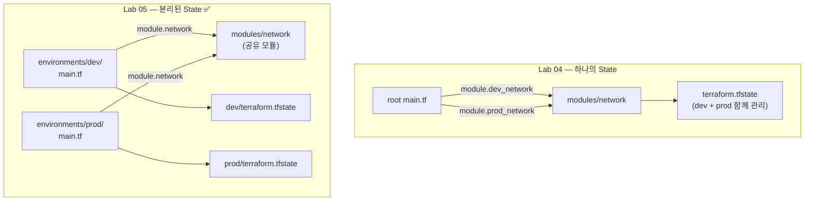



동일한 네트워크 모듈을 `dev`와 `prod` 두 디렉터리에서 각각 호출합니다. 환경마다 독립된 State 파일을 가지므로, dev 작업이 prod에 영향을 주지 않는 완전한 격리 구조를 만드는 것이 목표입니다.

---

## Lab 04 vs Lab 05: 핵심 차이




**Lab 04의 한계**: 하나의 State에 dev·prod가 함께 있으면 `terraform destroy`가 두 환경을 모두 삭제합니다. 실수로 prod를 날릴 수 있습니다. Lab 05의 디렉터리 분리는 이 위험을 구조적으로 차단합니다.


---

## 전체 디렉터리 구조

```
lab05-environments/
├── modules/
│   └── network/              ← Lab 04와 동일한 공유 모듈
│       ├── variables.tf
│       ├── main.tf
│       └── outputs.tf
└── environments/
    ├── dev/
    │   ├── versions.tf
    │   ├── providers.tf
    │   ├── main.tf           ← module 소스: ../../modules/network
    │   ├── outputs.tf
    │   └── terraform.tfvars  ← dev 전용 입력값
    └── prod/
        ├── versions.tf
        ├── providers.tf
        ├── main.tf           ← module 소스: ../../modules/network
        ├── outputs.tf
        └── terraform.tfvars  ← prod 전용 입력값
```

---

## 공유 모듈 코드 (`modules/network/`)

Lab 04와 동일합니다. 한 번 만든 모듈을 여러 환경에서 재사용합니다.

### modules/network/variables.tf

```hcl
variable "name_prefix" {
  type = string
}

variable "vpc_cidr" {
  type = string
}

variable "public_subnet_cidr" {
  type = string
}

variable "availability_zone" {
  type    = string
  default = "ap-northeast-2a"
}

variable "tags" {
  type    = map(string)
  default = {}
}
```

### modules/network/main.tf

```hcl
resource "aws_vpc" "this" {
  cidr_block           = var.vpc_cidr
  enable_dns_hostnames = true
  enable_dns_support   = true

  tags = merge(var.tags, { Name = "${var.name_prefix}-vpc" })
}

resource "aws_subnet" "public" {
  vpc_id                  = aws_vpc.this.id
  cidr_block              = var.public_subnet_cidr
  availability_zone       = var.availability_zone
  map_public_ip_on_launch = true

  tags = merge(var.tags, { Name = "${var.name_prefix}-public-subnet" })
}

resource "aws_internet_gateway" "this" {
  vpc_id = aws_vpc.this.id

  tags = merge(var.tags, { Name = "${var.name_prefix}-igw" })
}

resource "aws_route_table" "public" {
  vpc_id = aws_vpc.this.id

  route {
    cidr_block = "0.0.0.0/0"
    gateway_id = aws_internet_gateway.this.id
  }

  tags = merge(var.tags, { Name = "${var.name_prefix}-public-rt" })
}

resource "aws_route_table_association" "public" {
  subnet_id      = aws_subnet.public.id
  route_table_id = aws_route_table.public.id
}
```

### modules/network/outputs.tf

```hcl
output "vpc_id" {
  value = aws_vpc.this.id
}

output "public_subnet_id" {
  value = aws_subnet.public.id
}

output "vpc_cidr" {
  value = aws_vpc.this.cidr_block
}
```

---

## dev 환경 코드 (`environments/dev/`)

### environments/dev/versions.tf

```hcl
terraform {
  required_version = ">= 1.0.0"

  required_providers {
    aws = {
      source  = "hashicorp/aws"
      version = "~> 5.0"
    }
  }
}
```

### environments/dev/providers.tf

```hcl
provider "aws" {
  region = "ap-northeast-2"
}
```

### environments/dev/main.tf

```hcl
module "network" {
  source = "../../modules/network"   # 공유 모듈 참조

  name_prefix        = "lab05-dev"
  vpc_cidr           = var.vpc_cidr
  public_subnet_cidr = var.public_subnet_cidr
  availability_zone  = var.availability_zone

  tags = {
    Environment = "dev"
    ManagedBy   = "terraform"
  }
}
```

### environments/dev/outputs.tf

```hcl
output "vpc_id" {
  value = module.network.vpc_id
}

output "public_subnet_id" {
  value = module.network.public_subnet_id
}

output "environment" {
  value = "dev"
}
```

### environments/dev/terraform.tfvars

```hcl
vpc_cidr           = "10.0.0.0/16"
public_subnet_cidr = "10.0.1.0/24"
availability_zone  = "ap-northeast-2a"
```


파일 이름이 `terraform.tfvars`이면 `-var-file` 없이도 자동 로드됩니다. 각 환경 디렉터리 안에 두기 때문에 실행 위치(디렉터리)가 환경을 결정합니다.


---

## prod 환경 코드 (`environments/prod/`)

`versions.tf`·`providers.tf`는 dev와 동일합니다. 다른 파일만 표시합니다.

### environments/prod/main.tf

```hcl
module "network" {
  source = "../../modules/network"

  name_prefix        = "lab05-prod"
  vpc_cidr           = var.vpc_cidr
  public_subnet_cidr = var.public_subnet_cidr
  availability_zone  = var.availability_zone

  tags = {
    Environment = "prod"
    ManagedBy   = "terraform"
  }
}
```

### environments/prod/outputs.tf

```hcl
output "vpc_id" {
  value = module.network.vpc_id
}

output "public_subnet_id" {
  value = module.network.public_subnet_id
}

output "environment" {
  value = "prod"
}
```

### environments/prod/terraform.tfvars

```hcl
vpc_cidr           = "10.1.0.0/16"   # CIDR 대역이 dev와 다름 (충돌 방지)
public_subnet_cidr = "10.1.1.0/24"
availability_zone  = "ap-northeast-2b"   # 가용 영역도 다르게 설정
```

---

## variables.tf (dev·prod 공통)

각 환경 디렉터리에 동일한 `variables.tf`를 둡니다.

```hcl
variable "vpc_cidr" {
  description = "VPC CIDR 블록"
  type        = string
}

variable "public_subnet_cidr" {
  description = "퍼블릭 서브넷 CIDR 블록"
  type        = string
}

variable "availability_zone" {
  description = "가용 영역"
  type        = string
  default     = "ap-northeast-2a"
}
```

---

## 실행 절차

{}

### 디렉터리 구조 생성

```bash
mkdir -p lab05-environments/modules/network
mkdir -p lab05-environments/environments/dev
mkdir -p lab05-environments/environments/prod
```

### dev 환경 초기화 및 배포

**반드시 환경 디렉터리 안에서 실행합니다.**

```bash
cd lab05-environments/environments/dev

terraform init
terraform plan
terraform apply -auto-approve
```

완료 후 출력:

```
Outputs:
environment       = "dev"
public_subnet_id  = "subnet-0dev111aaa"
vpc_id            = "vpc-0dev000aaa"
```

`terraform.tfstate` 파일이 `environments/dev/` 에 생성됩니다.

### prod 환경 초기화 및 배포

**다른 터미널에서, prod 디렉터리로 이동해 실행합니다.**

```bash
cd lab05-environments/environments/prod

terraform init
terraform plan
terraform apply -auto-approve
```

완료 후 출력:

```
Outputs:
environment       = "prod"
public_subnet_id  = "subnet-0prod222bbb"
vpc_id            = "vpc-0prod111bbb"
```

`terraform.tfstate` 파일이 `environments/prod/` 에 별도로 생성됩니다.

### 격리 검증

두 State 파일이 완전히 분리되어 있는지 확인합니다.

```bash
# dev State 리소스 목록
cd lab05-environments/environments/dev
terraform state list
# module.network.aws_vpc.this
# module.network.aws_subnet.public
# ...

# prod State 리소스 목록
cd lab05-environments/environments/prod
terraform state list
# module.network.aws_vpc.this   ← 이름은 같지만 별개의 State
# ...

# AWS 콘솔에서 VPC 두 개 확인
# lab05-dev-vpc  (10.0.0.0/16)
# lab05-prod-vpc (10.1.0.0/16)
```

### dev만 삭제 (prod 영향 없음)

```bash
cd lab05-environments/environments/dev
terraform destroy -auto-approve
# dev VPC만 삭제됨 — prod는 그대로
```

prod 디렉터리로 가서 확인합니다.

```bash
cd lab05-environments/environments/prod
terraform state list   # prod 리소스는 여전히 존재
```

### prod 삭제

```bash
cd lab05-environments/environments/prod
terraform destroy -auto-approve
```

{}

---

## 주의사항


**실행 위치가 환경을 결정합니다.** `terraform apply`는 현재 디렉터리의 State를 사용합니다. 반드시 올바른 환경 디렉터리에서 실행하고 있는지 확인하세요. prod 디렉터리에서 실수로 `destroy`하지 않도록 터미널 프롬프트에 디렉터리 경로를 표시해 두는 것을 권장합니다.



**VPC CIDR 대역 충돌 주의**: 동일 AWS 계정에서 두 VPC가 나중에 VPC Peering이나 Transit Gateway로 연결될 가능성이 있다면, 처음부터 CIDR이 겹치지 않게 설계해야 합니다. dev `10.0.0.0/16`, prod `10.1.0.0/16` 처럼 분리합니다.



**다음 단계 — Remote State**: 지금은 `terraform.tfstate`가 로컬 파일입니다. 팀 협업 환경에서는 S3 + DynamoDB로 State를 원격 저장해야 합니다. Lab 06에서 다룹니다.


---

## 환경 분리 방법 비교

실무에서 사용하는 세 가지 패턴입니다.

| 방법 | 특징 | 적합한 상황 |
|------|------|------------|
| **디렉터리 분리** (이 실습) | 환경마다 독립 State · 독립 실행 | 환경 간 완전한 격리가 필요할 때 |
| **tfvars 분리** (Lab 03) | 동일 State · `-var-file`로 구분 | 소규모, 환경 수가 적을 때 |
| **Terraform Workspace** | 동일 코드 · State만 분리 | 임시 환경 생성, 빠른 브랜치 테스트 |


대부분의 실무 팀은 **디렉터리 분리** 방식을 선택합니다. Workspace는 State만 분리되고 provider 설정은 공유되어 prod에 실수로 dev 설정이 적용될 수 있습니다.


---

## 핵심 학습 포인트

**디렉터리 = 격리 경계**: 같은 AWS 계정이더라도 디렉터리가 다르면 State가 다르므로 `terraform plan`·`apply`·`destroy`가 해당 환경에만 영향을 줍니다.

**모듈은 공유, State는 분리**: `modules/network/` 코드는 dev·prod 양쪽에서 참조하지만, 실제로 생성되는 리소스와 State는 환경마다 독립적입니다. 모듈 코드를 수정하면 다음 `apply`에서 양 환경에 반영됩니다.

**`../../modules/network` 상대 경로**: 환경 디렉터리에서 공유 모듈을 참조할 때 두 단계 상위(`../../`)로 올라갑니다. 이 경로 패턴이 흔들리면 모듈을 찾지 못하므로 디렉터리 구조를 먼저 확정한 뒤 코드를 작성합니다.

→ 다음 실습: [Lab 06 Remote State 설정](#) — S3 + DynamoDB로 팀 협업 기반 마련
