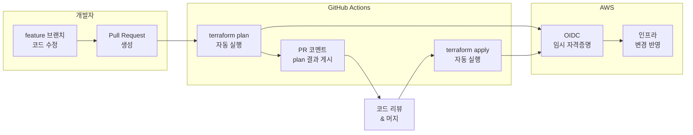



PR 생성 시 `terraform plan` 결과를 자동으로 코멘트로 달고, `main` 브랜치 머지 시 `terraform apply`가 자동 실행되는 CI/CD 파이프라인을 구성합니다. AWS 자격증명은 장기 키 대신 OIDC로 안전하게 처리합니다.

---

## 전체 파이프라인 흐름




**OIDC 인증**: GitHub Actions에서 AWS Access Key를 GitHub Secrets에 저장하는 대신, IAM OIDC Provider를 통해 워크플로 실행 시마다 임시 자격증명을 발급받습니다. 키가 유출될 위험이 없습니다.


---

## 전체 파일 구성

```
lab08-github-actions/
├── .github/
│   └── workflows/
│       └── terraform.yml    ← CI/CD 워크플로
├── bootstrap/               ← OIDC IAM Role 생성 (1회)
│   ├── versions.tf
│   ├── providers.tf
│   ├── main.tf
│   └── outputs.tf
├── versions.tf              ← 실제 Terraform 코드
├── providers.tf
├── backend.tf               ← Remote State (Lab 06 참고)
├── main.tf
└── outputs.tf
```

---

## 1단계: OIDC IAM Role 생성 (bootstrap)

GitHub Actions가 AWS에 접근할 수 있도록 OIDC 신뢰 관계를 설정한 IAM Role을 만듭니다.

### bootstrap/versions.tf

```hcl
terraform {
  required_version = ">= 1.0.0"

  required_providers {
    aws = {
      source  = "hashicorp/aws"
      version = "~> 5.0"
    }
  }
}
```

### bootstrap/providers.tf

```hcl
provider "aws" {
  region = "ap-northeast-2"
}
```

### bootstrap/main.tf

```hcl
# GitHub Actions OIDC Provider
resource "aws_iam_openid_connect_provider" "github" {
  url = "https://token.actions.githubusercontent.com"

  client_id_list = ["sts.amazonaws.com"]

  # GitHub Actions OIDC 인증서 지문 (고정값)
  thumbprint_list = ["6938fd4d98bab03faadb97b34396831e3780aea1"]
}

# GitHub Actions가 사용할 IAM Role
resource "aws_iam_role" "github_actions" {
  name = "github-actions-terraform-role"

  assume_role_policy = jsonencode({
    Version = "2012-10-17"
    Statement = [
      {
        Effect = "Allow"
        Principal = {
          Federated = aws_iam_openid_connect_provider.github.arn
        }
        Action = "sts:AssumeRoleWithWebIdentity"
        Condition = {
          StringEquals = {
            "token.actions.githubusercontent.com:aud" = "sts.amazonaws.com"
          }
          StringLike = {
            # 특정 GitHub 저장소만 허용
            "token.actions.githubusercontent.com:sub" = "repo:<GITHUB_USERNAME>/<REPO_NAME>:*"
          }
        }
      }
    ]
  })
}

# Terraform 실행에 필요한 권한 부여
resource "aws_iam_role_policy" "github_actions" {
  name = "terraform-permissions"
  role = aws_iam_role.github_actions.id

  policy = jsonencode({
    Version = "2012-10-17"
    Statement = [
      {
        Effect   = "Allow"
        Action   = ["s3:*", "ec2:*", "iam:*", "dynamodb:*"]
        Resource = "*"
      }
    ]
  })
}
```


`<GITHUB_USERNAME>/<REPO_NAME>` 을 실제 GitHub 저장소로 교체하세요. 이 조건이 없으면 모든 GitHub 저장소에서 이 Role을 사용할 수 있어 보안 위험이 생깁니다.


### bootstrap/outputs.tf

```hcl
output "role_arn" {
  description = "GitHub Actions에 설정할 IAM Role ARN"
  value       = aws_iam_role.github_actions.arn
}
```

### Bootstrap 실행

```bash
cd bootstrap
terraform init
terraform apply -auto-approve

# Role ARN 복사 (워크플로에서 사용)
terraform output role_arn
# arn:aws:iam::123456789012:role/github-actions-terraform-role
```

---

## 2단계: GitHub Secrets 설정

GitHub 저장소 → Settings → Secrets and variables → Actions에서 설정합니다.

| Secret 이름 | 값 | 설명 |
|------------|-----|------|
| `AWS_ROLE_ARN` | bootstrap output의 Role ARN | OIDC로 가정할 IAM Role |
| `AWS_REGION` | `ap-northeast-2` | AWS 리전 |
| `TF_STATE_BUCKET` | Lab 06에서 만든 S3 버킷 이름 | Remote State 버킷 |

---

## 3단계: GitHub Actions 워크플로

### .github/workflows/terraform.yml

```yaml
name: Terraform CI/CD

on:
  pull_request:
    branches: [main]
    paths:
      - "**.tf"
      - "**.tfvars"
  push:
    branches: [main]
    paths:
      - "**.tf"
      - "**.tfvars"

permissions:
  id-token: write     # OIDC 토큰 발급에 필요
  contents: read
  pull-requests: write  # PR 코멘트 작성에 필요

env:
  TF_VERSION: "1.9.0"
  AWS_REGION: ${{ secrets.AWS_REGION }}

jobs:
  terraform-plan:
    name: Terraform Plan
    runs-on: ubuntu-latest
    if: github.event_name == 'pull_request'

    steps:
      - name: Checkout
        uses: actions/checkout@v4

      - name: Configure AWS credentials (OIDC)
        uses: aws-actions/configure-aws-credentials@v4
        with:
          role-to-assume: ${{ secrets.AWS_ROLE_ARN }}
          aws-region: ${{ env.AWS_REGION }}

      - name: Setup Terraform
        uses: hashicorp/setup-terraform@v3
        with:
          terraform_version: ${{ env.TF_VERSION }}

      - name: Terraform Init
        id: init
        run: terraform init

      - name: Terraform Format Check
        id: fmt
        run: terraform fmt -check
        continue-on-error: true

      - name: Terraform Validate
        id: validate
        run: terraform validate

      - name: Terraform Plan
        id: plan
        run: terraform plan -no-color -out=tfplan
        continue-on-error: true

      - name: PR 코멘트에 Plan 결과 게시
        uses: actions/github-script@v7
        if: github.event_name == 'pull_request'
        with:
          script: |
            const output = `#### Terraform Format \`${{ steps.fmt.outcome }}\`
            #### Terraform Init \`${{ steps.init.outcome }}\`
            #### Terraform Validate \`${{ steps.validate.outcome }}\`
            #### Terraform Plan \`${{ steps.plan.outcome }}\`

            <details><summary>Plan 상세 결과</summary>

            \`\`\`terraform
            ${{ steps.plan.outputs.stdout }}
            \`\`\`

            </details>

            *실행자: @${{ github.actor }}, 워크플로: \`${{ github.workflow }}\`*`;

            github.rest.issues.createComment({
              issue_number: context.issue.number,
              owner: context.repo.owner,
              repo: context.repo.repo,
              body: output
            })

      - name: Plan 실패 시 워크플로 종료
        if: steps.plan.outcome == 'failure'
        run: exit 1

  terraform-apply:
    name: Terraform Apply
    runs-on: ubuntu-latest
    if: github.event_name == 'push' && github.ref == 'refs/heads/main'
    environment: production   # GitHub Environment 승인 설정 가능

    steps:
      - name: Checkout
        uses: actions/checkout@v4

      - name: Configure AWS credentials (OIDC)
        uses: aws-actions/configure-aws-credentials@v4
        with:
          role-to-assume: ${{ secrets.AWS_ROLE_ARN }}
          aws-region: ${{ env.AWS_REGION }}

      - name: Setup Terraform
        uses: hashicorp/setup-terraform@v3
        with:
          terraform_version: ${{ env.TF_VERSION }}

      - name: Terraform Init
        run: terraform init

      - name: Terraform Apply
        run: terraform apply -auto-approve
```

---

## 4단계: Terraform 코드 (main-app)

### backend.tf

```hcl
terraform {
  backend "s3" {
    bucket         = "terraform-state-xxxxxxxx"   # Lab 06 버킷
    key            = "lab08/terraform.tfstate"
    region         = "ap-northeast-2"
    dynamodb_table = "terraform-state-lock"
    encrypt        = true
  }
}
```

### versions.tf

```hcl
terraform {
  required_version = ">= 1.0.0"

  required_providers {
    aws = {
      source  = "hashicorp/aws"
      version = "~> 5.0"
    }
  }
}
```

### providers.tf

```hcl
provider "aws" {
  region = "ap-northeast-2"
}
```

### main.tf

```hcl
resource "aws_s3_bucket" "lab08" {
  bucket = "lab08-cicd-demo-${formatdate("YYYYMMDDhhmmss", timestamp())}"

  tags = {
    Name      = "lab08-cicd-demo"
    ManagedBy = "github-actions"
  }
}
```

### outputs.tf

```hcl
output "bucket_name" {
  value = aws_s3_bucket.lab08.bucket
}
```

---

## 실행 절차

{}

### 저장소 생성 및 코드 푸시

```bash
git init lab08-github-actions
cd lab08-github-actions
git remote add origin https://github.com/<USERNAME>/<REPO>.git

# 파일 작성 후 main 브랜치에 초기 커밋
git add .
git commit -m "Initial Terraform setup"
git push -u origin main
```

### Bootstrap 실행 — OIDC Role 생성

```bash
cd bootstrap
terraform init
terraform apply -auto-approve
# Role ARN 출력 확인 후 복사
```

### GitHub Secrets 등록

GitHub 저장소 → Settings → Secrets and variables → Actions:
- `AWS_ROLE_ARN`: bootstrap output의 ARN
- `AWS_REGION`: `ap-northeast-2`

### feature 브랜치에서 코드 수정 후 PR 생성

```bash
git checkout -b feature/add-s3-bucket
# main.tf 수정
git add . && git commit -m "Add S3 bucket"
git push origin feature/add-s3-bucket
# GitHub에서 PR 생성
```

GitHub Actions가 자동으로 실행되고, PR에 plan 결과 코멘트가 달립니다.

### PR 머지 — Apply 자동 실행

PR을 `main`에 머지하면 `terraform-apply` 잡이 자동 실행됩니다.

```
Terraform Apply 잡 실행 중...
Apply complete! Resources: 1 added, 0 changed, 0 destroyed.
```

### 정리

```bash
# 로컬에서 직접 삭제
terraform destroy -auto-approve

# bootstrap 삭제
cd bootstrap && terraform destroy -auto-approve
```

{}

---

## 주의사항


**IAM 권한 최소화**: bootstrap의 `aws_iam_role_policy`에서 `Action: "*"` 또는 `Resource: "*"`는 실습 편의를 위한 것입니다. 실무에서는 Terraform이 실제로 사용하는 리소스 타입과 ARN으로 범위를 좁혀야 합니다.



**GitHub Environment로 수동 승인 추가**: `environment: production`을 워크플로에 선언하고, GitHub → Settings → Environments → production에서 Required reviewers를 설정하면 Apply 전에 수동 승인을 요구할 수 있습니다.



**`paths` 필터**: `.tf`·`.tfvars` 파일이 바뀔 때만 워크플로가 실행됩니다. README.md만 수정하면 불필요한 plan이 실행되지 않습니다.



**`timestamp()` 함수 주의**: `main.tf`의 `formatdate("YYYYMMDDhhmmss", timestamp())`는 실행할 때마다 값이 달라집니다. 매번 apply하면 버킷 이름이 바뀌어 기존 버킷이 삭제되고 새 버킷이 생성됩니다. 실무에서는 변수로 고정 이름을 쓰세요.


---

## 핵심 학습 포인트

**OIDC = 키 없는 인증**: 장기 Access Key를 Secrets에 저장하는 방식은 키 유출 위험이 있습니다. OIDC는 워크플로 실행 시마다 AWS가 임시 자격증명을 발급하므로, 키 로테이션이나 유출 걱정이 없습니다.

**Plan은 PR에서, Apply는 main에서**: PR 단계에서 `plan` 결과를 코드 리뷰어가 볼 수 있어 인프라 변경을 코드처럼 리뷰합니다. `apply`는 승인된 코드(`main`)에서만 실행해 실수로 인한 인프라 변경을 방지합니다.

**`continue-on-error: true`의 역할**: `fmt`, `plan` 단계에 이를 붙이면 실패해도 다음 단계로 넘어가 PR 코멘트에 결과가 게시됩니다. `exit 1`로 마지막에 워크플로를 실패 처리합니다.

**`environment: production`으로 게이트 추가**: 자동 apply에 수동 승인 단계를 추가할 수 있습니다. prod 환경에는 이 게이트를 반드시 설정합니다.

→ 다음 실습: [Lab 09 보안 스캔 통합](#) — tfsec·checkov를 파이프라인에 추가해 코드 푸시 시 취약점 자동 탐지
