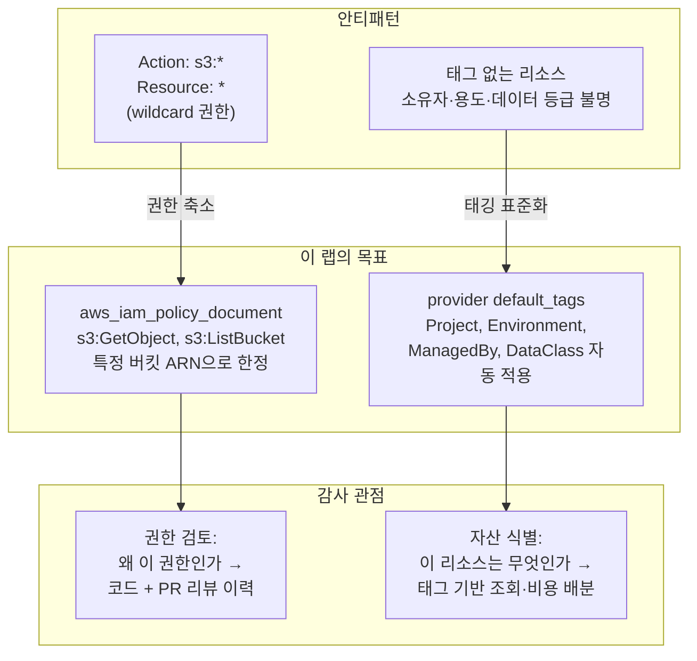



`aws_iam_policy_document` data source로 **특정 S3 버킷에만 읽기를 허용하는 최소권한(Least Privilege) IAM Role**을 작성하고, provider의 `default_tags`로 모든 리소스에 컴플라이언스 태그를 자동 적용합니다. HIPAA 같은 규제 환경에서 "누가 무엇에 접근할 수 있고, 이 리소스는 어떤 데이터 등급인가"에 코드로 답하는 방법을 익힙니다.

---

## 최소권한 원칙과 태깅이 왜 함께 가는가

규제 환경(HIPAA, PCI-DSS, ISO 27001)의 감사(audit)에서 반복해서 나오는 질문은 두 가지입니다. **"이 권한은 왜 필요한가?"** 와 **"이 리소스는 무엇인가?"** 전자는 최소권한 IAM으로, 후자는 일관된 태깅으로 답합니다. 둘 다 코드에 있으면 감사 대응이 "스크린샷 수집"에서 "코드 리뷰 이력 제출"로 바뀝니다.




**wildcard(`*`)의 위험**: `Action = "s3:*", Resource = "*"`는 계정 내 **모든 버킷의 삭제 권한까지** 포함합니다. 이 권한이 붙은 role의 자격 증명이 유출되면 피해 범위가 계정 전체가 됩니다. 최소권한은 유출 사고의 폭발 반경(blast radius)을 줄이는 가장 확실한 방법입니다.



**`default_tags`의 힘**: provider 블록에 한 번 선언하면 해당 provider로 생성되는 **모든 리소스**에 태그가 자동 적용됩니다. "리소스마다 tags 블록 복붙"에서 벗어나며, 누락도 원천적으로 방지됩니다. 리소스 개별 `tags`는 default_tags와 병합되고, 같은 키는 리소스 쪽이 우선합니다.


---

## 이 랩이 입증하는 실무 역량

> "Maintain AWS infrastructure as code using Terraform with modular, reusable patterns across VPC, EC2, ECS, EKS, IAM, S3, and SQS in HIPAA-regulated production."
> — Mercor, DevSecOps Specialist

> "support secure, scalable cloud environments for mission-critical systems"
> — Altamira Technologies, Cloud Infrastructure Engineer SME

| JD 요구사항 | 이 랩에서 커버하는 내용 |
|-------------|------------------------|
| IAM을 Terraform 코드로 관리 | `aws_iam_role` + `aws_iam_policy_document` data source로 신뢰 정책·권한 정책을 선언적으로 작성 |
| HIPAA 등 규제 환경 운영 | DataClass 태그로 데이터 등급 식별, 태그 기반 감사·접근 통제·비용 배분 체계 구축 |
| secure cloud environments | wildcard 권한 제거, 특정 리소스 ARN으로 한정한 최소권한 정책 설계 |
| mission-critical 시스템 지원 | `aws_caller_identity`로 배포 대상 계정 검증 — 잘못된 계정 배포 사고 방지 |
| modular, reusable patterns | policy document를 data source로 분리해 재사용 가능한 구조로 작성 |

---

## 실습 파일 구성

```
lab14-iam-least-privilege/
├── versions.tf
├── providers.tf   ← default_tags 블록 포함
├── main.tf        ← aws_caller_identity, random_string.suffix, aws_s3_bucket.data
├── iam.tf         ← 최소권한 IAM 정책/역할
└── outputs.tf
```

---

## 전체 코드

### versions.tf

```hcl
terraform {
  required_version = ">= 1.0.0"

  required_providers {
    aws = {
      source  = "hashicorp/aws"
      version = "~> 5.0"
    }
    random = {
      source  = "hashicorp/random"
      version = "~> 3.0"
    }
  }
}
```

### providers.tf — default_tags로 공통 태그 자동 적용

```hcl
provider "aws" {
  region = "ap-northeast-2"

  default_tags {
    tags = {
      Project     = "lab14-iam"
      Environment = "dev"
      ManagedBy   = "terraform"
      DataClass   = "internal"
    }
  }
}
```

### main.tf — 계정 확인 + 랜덤 접미사 + 실습용 S3 버킷

```hcl
# 현재 자격 증명이 가리키는 계정 확인 (잘못된 계정 배포 방지)
data "aws_caller_identity" "current" {}

# 버킷 이름 중복 방지를 위한 무작위 접미사
resource "random_string" "suffix" {
  length  = 8
  special = false
  upper   = false
}

# 실습용 S3 버킷 (IAM role이 읽기 권한을 갖는 대상)
resource "aws_s3_bucket" "data" {
  bucket = "lab14-least-privilege-data-${random_string.suffix.result}"

  # default_tags 외에 리소스 고유 태그만 추가
  tags = {
    Name = "lab14-data"
  }
}
```


버킷 이름에 AWS 계정 ID 대신 `random_string.suffix`를 쓰는 이유: 계정 ID를 리소스 이름에 그대로 노출하면 로그·URL·Terraform state 어디서나 계정 식별 정보가 새어나갑니다. `aws_caller_identity`는 계정 ID 노출용이 아니라 "지금 어느 계정에 배포하는지" 확인하는 안전장치로만 쓰고, 전역 유일성이 필요한 이름에는 `random_string`을 사용합니다.


### iam.tf — 최소권한 Role과 Policy

```hcl
# 1) 신뢰 정책: EC2 서비스만 이 role을 assume 가능
data "aws_iam_policy_document" "assume_ec2" {
  statement {
    effect  = "Allow"
    actions = ["sts:AssumeRole"]

    principals {
      type        = "Service"
      identifiers = ["ec2.amazonaws.com"]
    }
  }
}

# 2) 권한 정책: 특정 버킷에만 읽기 허용
#    - s3:* 나 Resource: "*" 를 쓰지 않음
data "aws_iam_policy_document" "s3_read_only" {
  statement {
    sid     = "ListBucket"
    effect  = "Allow"
    actions = ["s3:ListBucket"]
    resources = [
      aws_s3_bucket.data.arn,
    ]
  }

  statement {
    sid     = "ReadObjects"
    effect  = "Allow"
    actions = ["s3:GetObject"]
    resources = [
      "${aws_s3_bucket.data.arn}/*",
    ]
  }
}

resource "aws_iam_role" "app_reader" {
  name               = "lab14-app-reader"
  assume_role_policy = data.aws_iam_policy_document.assume_ec2.json
}

resource "aws_iam_role_policy" "s3_read_only" {
  name   = "lab14-s3-read-only"
  role   = aws_iam_role.app_reader.id
  policy = data.aws_iam_policy_document.s3_read_only.json
}
```


**`aws_iam_policy_document`를 쓰는 이유**: JSON heredoc 대신 data source를 쓰면 ① `plan` 시점에 문법 검증, ② HCL 참조(`aws_s3_bucket.data.arn`)로 하드코딩 제거, ③ statement 단위 재사용이 가능합니다. IAM 정책의 오타는 배포 후 런타임에야 드러나므로 plan 단계 검증의 가치가 큽니다.


### outputs.tf

```hcl
output "account_id" {
  description = "배포된 AWS 계정 ID"
  value       = data.aws_caller_identity.current.account_id
}

output "role_arn" {
  description = "최소권한 role ARN"
  value       = aws_iam_role.app_reader.arn
}

output "bucket_name" {
  description = "실습용 버킷 이름"
  value       = aws_s3_bucket.data.id
}
```

---

## 실행 단계

{}

### 배포 대상 계정 확인

```bash
cd lab14-iam-least-privilege
aws sts get-caller-identity --query Account --output text
# 의도한 계정인지 반드시 확인 후 진행
```

### 배포

```bash
terraform init
terraform plan
terraform apply -auto-approve
```

### default_tags 적용 검증

```bash
BUCKET=$(terraform output -raw bucket_name)

aws s3api get-bucket-tagging --bucket "$BUCKET" \
  --query 'TagSet' --output table
```

### IAM 정책이 최소권한인지 확인

```bash
aws iam get-role-policy \
  --role-name lab14-app-reader \
  --policy-name lab14-s3-read-only \
  --query 'PolicyDocument.Statement[].{Sid:Sid,Action:Action,Resource:Resource}'
```

{}

---

## 예상 결과 / 검증

### 태그 검증 결과

```
--------------------------------------
|          GetBucketTagging          |
+--------------+---------------------+
|     Key      |        Value        |
+--------------+---------------------+
|  Project     |  lab14-iam          |
|  Environment |  dev                |
|  ManagedBy   |  terraform          |
|  DataClass   |  internal           |
|  Name        |  lab14-data         |
+--------------+---------------------+
```

`main.tf`의 리소스에는 `Name` 태그만 선언했지만, provider의 `default_tags` 4개가 자동으로 병합되어 있습니다. ✅

### IAM 정책 검증 결과

```json
[
    {
        "Sid": "ListBucket",
        "Action": "s3:ListBucket",
        "Resource": "arn:aws:s3:::lab14-least-privilege-data-a1b2c3d4"
    },
    {
        "Sid": "ReadObjects",
        "Action": "s3:GetObject",
        "Resource": "arn:aws:s3:::lab14-least-privilege-data-a1b2c3d4/*"
    }
]
```

`Action`에 wildcard가 없고 `Resource`가 특정 버킷 ARN으로 한정되어 있습니다. 이 role은 다른 버킷을 볼 수도, 이 버킷에 쓸 수도 없습니다. ✅

### 규제 환경에서 태그가 감사에 쓰이는 방식

| 태그 | 감사·운영에서의 용도 |
|------|---------------------|
| `DataClass` | HIPAA의 PHI(보호 대상 건강 정보) 저장 위치 식별 — `DataClass=phi` 리소스만 골라 암호화·접근 로그 요건 점검 |
| `Environment` | prod 리소스만 대상으로 변경 통제(Change Control) 절차 적용 |
| `Owner` / `Project` | 사고 발생 시 책임 팀 즉시 식별, 부서별 비용 배분(Cost Allocation Tags) |
| `ManagedBy` | `terraform` 태그가 없는 리소스 = 수동 생성 리소스 → IaC 미준수 자산 탐지 |

```bash
# 예: 태그 기반으로 특정 등급 리소스 전수 조회 (Resource Groups Tagging API)
aws resourcegroupstaggingapi get-resources \
  --tag-filters Key=DataClass,Values=internal \
  --query 'ResourceTagMappingList[].ResourceARN'
```

---

## 실습 정리

```bash
terraform destroy -auto-approve
```

---

## 실무 포인트


**최소권한은 "거부에서 시작해 필요한 만큼 허용"**: 처음부터 완벽한 정책을 만들기 어렵다면 IAM Access Analyzer의 정책 생성 기능(CloudTrail 기록 기반)으로 실제 사용된 액션만 추려낼 수 있습니다. `s3:*`를 준 뒤 줄이는 것보다, `GetObject`부터 시작해 필요 시 추가하는 방향이 안전합니다.



**default_tags와 리소스 tags의 키 충돌**: 같은 키를 provider와 리소스 양쪽에 선언하면 리소스 쪽 값이 이깁니다. 의도적 override가 아니라면 혼란의 원인이 되므로, 조직 표준 태그는 default_tags에만 두고 리소스에는 `Name`처럼 고유한 태그만 선언하는 규칙을 세우세요.



**`aws_caller_identity`는 안전장치**: 멀티 계정 환경에서 프로필을 잘못 잡고 apply하는 사고가 실제로 일어납니다. output이나 precondition으로 계정 ID를 노출·검증해두면, plan 출력만 봐도 "지금 어느 계정에 배포하는가"를 즉시 확인할 수 있습니다.


→ 다음 실습: [Lab 15 모니터링 as Code](../monitoring-as-code/) — 알람과 대시보드도 코드로 관리
