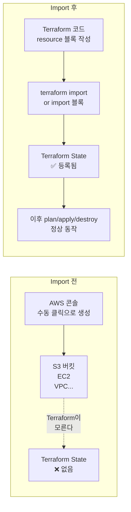



AWS 콘솔에서 수동으로 만든 리소스를 Terraform 관리 아래로 편입합니다. CLI import와 import block(Terraform 1.5+) 두 가지 방법을 모두 실습합니다.

---

## Import가 필요한 상황




**언제 Import가 필요한가?**
- 콘솔·스크립트·다른 IaC 도구로 만든 기존 리소스를 Terraform으로 전환할 때
- 다른 팀이 수동으로 만든 리소스를 내 Terraform 코드로 가져올 때
- 실수로 State에서 리소스를 지웠지만(`state rm`) 실제 리소스는 살아있을 때


---

## 실습 구조

이 실습은 **세 가지 방법**을 순서대로 체험합니다.

| 방법 | 버전 | 특징 |
|------|------|------|
| **방법 1**: `terraform import` CLI | 모든 버전 | 직접 명령어 실행, 코드 자동 생성 없음 |
| **방법 2**: `import` 블록 | Terraform 1.5+ | 코드로 선언, `plan`에서 미리 확인 가능 |
| **방법 3**: `-generate-config-out` | Terraform 1.5+ | 리소스 코드 자동 생성 |

---

## 사전 준비 — 수동 리소스 생성

Import할 대상 리소스를 AWS CLI로 만듭니다. (콘솔에서 직접 만들어도 됩니다.)

```bash
# S3 버킷 수동 생성 (ap-northeast-2)
aws s3api create-bucket \
  --bucket my-manual-bucket-$(date +%s) \
  --region ap-northeast-2 \
  --create-bucket-configuration LocationConstraint=ap-northeast-2

# 생성된 버킷 이름 확인
aws s3 ls | grep my-manual-bucket
```

이제 이 버킷은 Terraform이 전혀 모르는 상태입니다. `terraform plan`을 실행하면 "이 버킷을 새로 만들겠다"고 나오거나, 아예 코드 자체가 없는 상태입니다.

---

## 방법 1: `terraform import` CLI

### 파일 구성

```
lab07-import/
├── versions.tf
├── providers.tf
└── main.tf
```

### versions.tf

```hcl
terraform {
  required_version = ">= 1.0.0"

  required_providers {
    aws = {
      source  = "hashicorp/aws"
      version = "~> 5.0"
    }
  }
}
```

### providers.tf

```hcl
provider "aws" {
  region = "ap-northeast-2"
}
```

### main.tf — 빈 리소스 블록 먼저 작성

```hcl
# import 전: 내용이 비어 있어도 됩니다
resource "aws_s3_bucket" "imported" {
}
```


`terraform import`는 State에만 등록합니다. `.tf` 파일의 속성값은 자동으로 채워지지 않습니다. import 후 `terraform state show`로 실제 값을 확인하고 코드를 직접 맞춰야 합니다.


### Import 실행

```bash
cd lab07-import
terraform init

# 형식: terraform import <리소스_타입>.<이름> <리소스_ID>
terraform import aws_s3_bucket.imported my-manual-bucket-1234567890
```

성공 메시지:

```
aws_s3_bucket.imported: Importing from ID "my-manual-bucket-1234567890"...
aws_s3_bucket.imported: Import prepared!
  Prepared aws_s3_bucket for import
aws_s3_bucket.imported: Refreshing state... [id=my-manual-bucket-1234567890]

Import successful!

The resources that were imported are shown above. These resources are now in
your Terraform state and will henceforth be managed by Terraform.
```

### State 확인 및 코드 완성

```bash
# State에 등록된 실제 속성 확인
terraform state show aws_s3_bucket.imported
```

출력 예시:

```hcl
# aws_s3_bucket.imported:
resource "aws_s3_bucket" "imported" {
    bucket                      = "my-manual-bucket-1234567890"
    bucket_domain_name          = "my-manual-bucket-1234567890.s3.amazonaws.com"
    id                          = "my-manual-bucket-1234567890"
    region                      = "ap-northeast-2"
    tags                        = {}
    # ... 기타 속성
}
```

이 출력을 참고해 `main.tf`를 채웁니다:

```hcl
resource "aws_s3_bucket" "imported" {
  bucket = "my-manual-bucket-1234567890"

  tags = {}
}
```

### 검증 — `No changes` 확인

```bash
terraform plan
# No changes. Your infrastructure matches the configuration.
```

`No changes`가 나오면 코드와 실제 리소스가 일치합니다. Import 완료입니다.

---

## 방법 2: `import` 블록 (Terraform 1.5+)

코드에 `import` 블록을 선언해 두면 `terraform plan`에서 미리 확인하고 `terraform apply`로 import합니다.

### main.tf

```hcl
# import 블록 — apply 시 State에 등록
import {
  to = aws_s3_bucket.imported_v2
  id = "my-manual-bucket-1234567890"
}

# 리소스 블록 — 실제 속성을 맞춰서 작성
resource "aws_s3_bucket" "imported_v2" {
  bucket = "my-manual-bucket-1234567890"
}
```

### Plan으로 미리 확인

```bash
terraform plan
```

```
Terraform will perform the following actions:

  # aws_s3_bucket.imported_v2 will be imported
    resource "aws_s3_bucket" "imported_v2" {
        bucket = "my-manual-bucket-1234567890"
        id     = "my-manual-bucket-1234567890"
        ...
    }

Plan: 1 to import, 0 to add, 0 to change, 0 to destroy.
```

### Apply로 import 실행

```bash
terraform apply -auto-approve
```


**방법 1 vs 방법 2**: CLI import는 즉시 State를 변경하지만 `import` 블록은 `plan`에서 먼저 검토할 수 있습니다. 실무에서는 방법 2를 권장합니다 — Git에 남기고 코드 리뷰를 거칠 수 있기 때문입니다.


---

## 방법 3: `-generate-config-out` (Terraform 1.5+)

`import` 블록만 작성하면 리소스 코드를 자동으로 생성해 줍니다. 속성이 많은 복잡한 리소스(VPC, EC2 등)에 유용합니다.

### main.tf — import 블록만 작성 (리소스 블록 없음)

```hcl
import {
  to = aws_s3_bucket.auto_generated
  id = "my-manual-bucket-1234567890"
}
```

### 코드 자동 생성

```bash
terraform plan -generate-config-out=generated.tf
```

`generated.tf` 파일이 생성됩니다:

```hcl
# __generated__ by Terraform
# Please review these resources and move them into your main configuration files.

# __generated__ by Terraform from "my-manual-bucket-1234567890"
resource "aws_s3_bucket" "auto_generated" {
  bucket              = "my-manual-bucket-1234567890"
  force_destroy       = null
  object_lock_enabled = false
  tags                = {}
  tags_all            = {}
}
```

생성된 코드를 검토하고 `main.tf`로 옮긴 뒤 `terraform apply`로 import를 완료합니다.

```bash
# generated.tf 내용 검토 후 적용
terraform apply -auto-approve
```

---

## 실습 전체 흐름 요약

{}

### 수동 리소스 생성

AWS CLI 또는 콘솔에서 S3 버킷을 생성합니다.

```bash
aws s3api create-bucket \
  --bucket my-manual-bucket-$(date +%s) \
  --region ap-northeast-2 \
  --create-bucket-configuration LocationConstraint=ap-northeast-2
```

### 방법 1: CLI import 실습

빈 리소스 블록 작성 → `terraform import` → `state show`로 속성 확인 → 코드 완성 → `plan`으로 `No changes` 검증.

```bash
terraform init
terraform import aws_s3_bucket.imported <버킷이름>
terraform state show aws_s3_bucket.imported
terraform plan   # No changes 확인
```

### 방법 2: import 블록 실습

`import {}` 블록과 리소스 블록을 함께 작성 → `plan`으로 미리 확인 → `apply`로 import.

```bash
terraform plan    # "will be imported" 확인
terraform apply -auto-approve
```

### 방법 3: 코드 자동 생성 실습

`import {}` 블록만 작성 → `-generate-config-out`으로 코드 자동 생성 → 검토 후 적용.

```bash
terraform plan -generate-config-out=generated.tf
cat generated.tf   # 생성된 코드 확인
terraform apply -auto-approve
```

### 정리 — 리소스 삭제

```bash
terraform destroy -auto-approve
```

{}

---

## 주의사항


**Import = State 등록이지 코드 생성이 아닙니다** (방법 1 한정): `terraform import` CLI는 State에만 등록합니다. `.tf` 파일의 코드는 직접 맞춰야 합니다. 코드를 맞추지 않으면 다음 `plan`에서 "코드대로 리소스를 변경하겠다"는 계획이 나옵니다.



**Import 후 반드시 `plan`으로 검증**: import가 성공해도 코드와 실제 리소스 상태가 다르면 다음 `apply`에서 의도치 않은 변경이 일어납니다. `No changes`가 나올 때까지 코드를 다듬어야 합니다.



**리소스 ID 찾는 법**: 각 리소스 타입마다 Import에 사용하는 ID 형식이 다릅니다.

| 리소스 타입 | Import ID 형식 | 예시 |
|------------|---------------|------|
| `aws_s3_bucket` | 버킷 이름 | `my-bucket` |
| `aws_instance` | 인스턴스 ID | `i-0abc123def` |
| `aws_vpc` | VPC ID | `vpc-0abc123` |
| `aws_iam_role` | 역할 이름 | `my-role-name` |

Terraform 공식 문서 각 리소스 페이지 하단 **Import** 섹션에서 확인합니다.


---

## 핵심 학습 포인트

**Import는 편입이지 복제가 아닙니다**: 리소스가 State에 등록될 뿐, 리소스 자체는 이동하거나 복사되지 않습니다. AWS에 있는 그 리소스를 Terraform이 "이제부터 내가 관리한다"고 선언하는 것입니다.

**`No changes`가 Import 완료의 증거**: `terraform plan` 결과가 `No changes`여야 코드와 실제 상태가 일치합니다. 차이가 있으면 다음 `apply`에서 리소스가 변경되거나 재생성될 수 있습니다.

**방법 2(import 블록)가 실무 표준**: `import {}` 블록은 코드 리뷰, Git 이력, `plan` 사전 확인이 모두 가능합니다. 팀 작업에서는 이 방법을 사용합니다.

**`-generate-config-out`은 출발점**: 자동 생성된 코드는 불필요한 속성이 많습니다. 그대로 쓰지 말고 검토하면서 필요한 속성만 남기고 정리합니다.

→ 다음 실습: [Lab 08 GitHub Actions 파이프라인](#) — PR 생성 시 자동 plan, 머지 시 자동 apply
