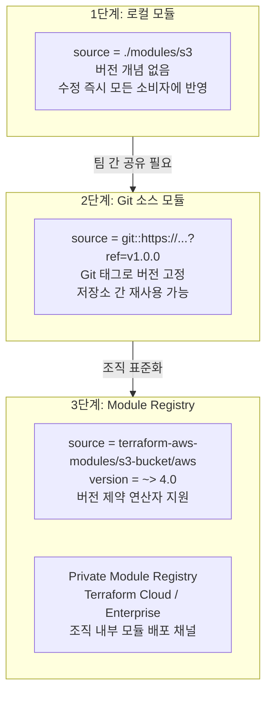



로컬 모듈을 Git 소스 모듈로 전환하고, 시맨틱 버저닝 태그(v1.0.0 → v1.1.0 → v2.0.0)를 붙여가며 소비자 코드에서 안전하게 업그레이드하는 흐름을 실습합니다. 팀 규모가 커질수록 "모듈을 만드는 것"보다 "모듈의 버전을 관리하는 것"이 훨씬 어려운 문제가 됩니다.

---

## 모듈 소스의 진화 단계

모듈 소스는 보통 세 단계로 진화합니다. 로컬 경로 모듈은 버전 개념이 없어 모듈을 수정하는 순간 모든 소비자가 즉시 영향을 받습니다. Git 태그를 붙이면 소비자가 원하는 버전을 골라 쓸 수 있고, Registry로 가면 `~> 4.0` 같은 버전 제약 연산자까지 사용할 수 있습니다.



### 시맨틱 버저닝(Semantic Versioning) 규칙

| 버전 변경 | 의미 | 예시 |
|-----------|------|------|
| **v1.0.0 → v1.0.1** (Patch) | 버그 수정, 동작 변경 없음 | 태그 오타 수정 |
| **v1.0.0 → v1.1.0** (Minor) | 하위 호환되는 기능 추가 | 선택적 변수 `enable_versioning` 추가 |
| **v1.0.0 → v2.0.0** (Major) | **Breaking Change** — 하위 호환 깨짐 | 변수 이름 변경, 필수 변수 추가 |


**버전 고정(Pinning) 없는 Git 소스는 시한폭탄입니다**: `ref` 없이 `source = "git::https://..."`만 쓰면 항상 기본 브랜치(main)의 최신 커밋을 가져옵니다. 모듈 저장소에 누군가 커밋을 푸시하는 순간, 다음 `terraform init`부터 소비자의 인프라 계획이 바뀔 수 있습니다. **운영 코드는 반드시 태그로 버전을 고정하세요.**


---

## 이 랩이 입증하는 실무 역량

실제 LinkedIn 채용공고(JD)에서 요구하는 역량입니다.

> "lead the design, development, and governance of Infrastructure as Code (IaC) using Terraform... build and maintain reusable Terraform modules, support production infrastructure changes"
> — **Snowrelic Inc, Senior Terraform Engineer**

> "Terraform Enterprise, Private Module Registry, Terraform Sentinel"
> — **TALENTRIX AI / Congensys Corp, Terraform Infrastructure Engineer**

| JD 요구사항 | 이 랩에서 커버하는 내용 |
|-------------|------------------------|
| reusable Terraform modules 구축·유지보수 | S3 버킷 모듈을 별도 Git 저장소로 분리하고 입력/출력 인터페이스 설계 |
| IaC governance | 시맨틱 버저닝 태그 전략과 버전 고정(pinning)으로 변경 통제 |
| production infrastructure changes 지원 | v1 → v2 breaking change를 소비자가 원하는 시점에 선택적으로 수용하는 업그레이드 절차 |
| Private Module Registry | Terraform Cloud/Enterprise의 내부 레지스트리 개념과 Registry 공개 모듈(`terraform-aws-modules`) 사용법 |

---

## 파일 구조

모듈 저장소와 소비자 코드는 **별도의 Git 저장소**입니다. 이 랩에서는 로컬에 두 디렉터리로 만들되, 모듈 쪽만 Git 저장소로 초기화하고 태그를 붙입니다.

```
lab11-module-versioning/
├── s3-module/               # 모듈 저장소 (독립된 Git 저장소)
│   ├── versions.tf
│   ├── variables.tf
│   ├── main.tf
│   └── outputs.tf
└── consumer/                # 모듈 소비자 (실제 인프라 코드)
    ├── versions.tf
    ├── providers.tf
    ├── main.tf
    └── outputs.tf
```

---

## 모듈 코드 — s3-module (v1.0.0)

### s3-module/versions.tf

```hcl
terraform {
  required_version = ">= 1.0.0"

  required_providers {
    aws = {
      source  = "hashicorp/aws"
      version = "~> 5.0"
    }
  }
}
```

### s3-module/variables.tf

```hcl
variable "bucket_name" {
  description = "생성할 S3 버킷 이름"
  type        = string
}

variable "tags" {
  description = "버킷에 부여할 태그"
  type        = map(string)
  default     = {}
}
```

### s3-module/main.tf

```hcl
resource "aws_s3_bucket" "this" {
  bucket = var.bucket_name

  tags = merge(var.tags, {
    ManagedBy = "terraform"
  })
}
```

### s3-module/outputs.tf

```hcl
output "bucket_id" {
  description = "생성된 버킷 이름"
  value       = aws_s3_bucket.this.id
}

output "bucket_arn" {
  description = "생성된 버킷 ARN"
  value       = aws_s3_bucket.this.arn
}
```

---

## 소비자 코드 — consumer

### consumer/versions.tf

```hcl
terraform {
  required_version = ">= 1.0.0"

  required_providers {
    aws = {
      source  = "hashicorp/aws"
      version = "~> 5.0"
    }
  }
}
```

### consumer/providers.tf

```hcl
provider "aws" {
  region = "ap-northeast-2"
}
```

### consumer/main.tf

```hcl
# Git 태그로 버전을 고정한 모듈 호출
# 실습에서는 로컬 Git 저장소(file://)를 사용하고,
# 실무에서는 GitHub 등 원격 저장소 URL을 사용합니다.
module "app_bucket" {
  source = "git::file:///절대경로/lab11-module-versioning/s3-module?ref=v1.0.0"
  # 실무 예시:
  # source = "git::https://github.com/my-org/terraform-aws-s3-module.git?ref=v1.0.0"

  bucket_name = "lab11-module-versioning-app"

  tags = {
    Name = "lab11-app"
  }
}
```

### consumer/outputs.tf

```hcl
output "bucket_id" {
  value = module.app_bucket.bucket_id
}

output "bucket_arn" {
  value = module.app_bucket.bucket_arn
}
```


**`git::file://`도 동작 원리는 동일합니다**: Terraform은 `git::` 접두어를 보면 `git clone`을 실행하고 `ref`로 지정된 태그/브랜치/커밋을 체크아웃합니다. 로컬 경로든 GitHub URL이든 태그 기반 버전 고정 메커니즘은 완전히 같으므로, 네트워크 없이도 실무와 동일한 흐름을 연습할 수 있습니다.


---

## 실행 단계

{}

### 모듈 저장소 초기화 및 v1.0.0 태그

```bash
cd lab11-module-versioning/s3-module

git init
git add .
git commit -m "feat: initial S3 bucket module"

# 시맨틱 버저닝 태그 부여
git tag v1.0.0
git tag   # v1.0.0 확인
```

### 소비자에서 v1.0.0 사용

```bash
cd ../consumer

# main.tf의 source에 s3-module의 실제 절대경로를 반영한 뒤
terraform init
```

```
Initializing modules...
Downloading git::file:///.../s3-module?ref=v1.0.0 for app_bucket...
- app_bucket in .terraform/modules/app_bucket
```

```bash
terraform apply -auto-approve
```

### v1.1.0 — 하위 호환 기능 추가 (Minor)

모듈에 **선택적 변수**를 추가합니다. 기본값이 있으므로 기존 소비자는 아무것도 바꾸지 않아도 됩니다.

`s3-module/variables.tf`에 추가:

```hcl
variable "enable_versioning" {
  description = "버킷 버저닝 활성화 여부"
  type        = bool
  default     = false
}
```

`s3-module/main.tf`에 추가:

```hcl
resource "aws_s3_bucket_versioning" "this" {
  count  = var.enable_versioning ? 1 : 0
  bucket = aws_s3_bucket.this.id

  versioning_configuration {
    status = "Enabled"
  }
}
```

```bash
cd ../s3-module
git add .
git commit -m "feat: add optional enable_versioning variable"
git tag v1.1.0
```

### 소비자 업그레이드 — ref 변경 + init -upgrade

`consumer/main.tf`의 `ref`만 수정합니다:

```hcl
  source = "git::file:///절대경로/lab11-module-versioning/s3-module?ref=v1.1.0"

  bucket_name       = "lab11-module-versioning-app"
  enable_versioning = true   # v1.1.0의 새 기능 사용
```

```bash
cd ../consumer

# ref가 바뀌면 반드시 init -upgrade로 모듈을 다시 다운로드
terraform init -upgrade
terraform plan
terraform apply -auto-approve
```

### v2.0.0 — Breaking Change (Major)

변수 이름을 `bucket_name` → `name`으로 변경합니다. **기존 소비자 코드가 그대로는 동작하지 않는** 파괴적 변경입니다.

`s3-module/variables.tf`:

```hcl
variable "name" {   # bucket_name에서 이름 변경 (BREAKING)
  description = "생성할 S3 버킷 이름"
  type        = string
}
```

`s3-module/main.tf`의 참조도 `var.name`으로 수정 후:

```bash
cd ../s3-module
git add .
git commit -m "feat!: rename bucket_name to name

BREAKING CHANGE: input variable bucket_name renamed to name"
git tag v2.0.0
```

### v2.0.0 업그레이드 실패 체험 → 코드 수정 후 성공

먼저 `ref=v2.0.0`으로만 바꾸고 소비자 코드는 그대로 둔 채 실행해봅니다:

```bash
cd ../consumer
terraform init -upgrade
terraform plan
```

```
Error: Unsupported argument

  on main.tf line 8, in module "app_bucket":
   8:   bucket_name = "lab11-module-versioning-app"

An argument named "bucket_name" is not expected here.
```

Breaking change가 소비자를 어떻게 깨뜨리는지 확인했습니다. 이제 소비자 코드를 v2 인터페이스에 맞게 수정합니다:

```hcl
module "app_bucket" {
  source = "git::file:///절대경로/lab11-module-versioning/s3-module?ref=v2.0.0"

  name              = "lab11-module-versioning-app"   # bucket_name → name
  enable_versioning = true

  tags = {
    Name = "lab11-app"
  }
}
```

```bash
terraform plan    # No changes 또는 태그 변경만 확인
terraform apply -auto-approve
```

{}

---

## 예상 결과 / 검증

각 단계에서 다음을 확인할 수 있어야 합니다.

```bash
# 1. 모듈 저장소에 세 개의 버전 태그 존재
cd ../s3-module && git tag
# v1.0.0
# v1.1.0
# v2.0.0

# 2. 소비자가 어떤 버전을 쓰는지 확인
cd ../consumer
cat .terraform/modules/modules.json | python3 -m json.tool
# "Source": "git::file:///...?ref=v2.0.0"  ← ref가 그대로 기록됨 ✅

# 3. 버저닝이 실제로 켜졌는지 확인 (v1.1.0 기능)
aws s3api get-bucket-versioning --bucket lab11-module-versioning-app
# { "Status": "Enabled" } ✅

# 4. plan이 깨끗한지 최종 확인
terraform plan
# No changes. Your infrastructure matches the configuration. ✅
```

핵심 검증 포인트: **v2.0.0으로 `ref`만 올렸을 때 `Unsupported argument` 오류가 났다가, 소비자 코드를 수정하면 통과**하는 흐름을 직접 경험했다면 이 랩의 목표를 달성한 것입니다.

---

## Terraform Registry 공개 모듈 사용 (보너스)

직접 만들지 않아도 되는 범용 모듈은 [Terraform Registry](https://registry.terraform.io)의 검증된 모듈을 사용합니다. Registry 모듈은 `version` 인자로 **버전 제약 연산자**를 지원합니다.

```hcl
module "registry_bucket" {
  source  = "terraform-aws-modules/s3-bucket/aws"
  version = "~> 4.0"   # 4.x의 최신 버전 사용, 5.0은 차단

  bucket = "lab11-registry-example"

  tags = {
    Name = "lab11-registry"
  }
}
```

| 연산자 | 의미 |
|--------|------|
| `version = "4.1.2"` | 정확히 4.1.2만 |
| `version = "~> 4.1"` | 4.1 이상 5.0 미만 (Minor까지 허용) |
| `version = "~> 4.1.0"` | 4.1.0 이상 4.2.0 미만 (Patch만 허용) |
| `version = ">= 4.0, < 5.0"` | 범위 지정 |


**Private Module Registry**: Terraform Cloud/Enterprise에는 조직 전용 모듈 레지스트리가 내장되어 있습니다. VCS(GitHub 등) 저장소를 연결하면 **Git 태그를 푸시하는 것만으로 새 버전이 자동 배포**되고, 소비자는 `source = "app.terraform.io/my-org/s3-bucket/aws"` + `version = "~> 1.0"` 형태로 사용합니다. 이 랩에서 연습한 "태그 = 버전" 전략이 그대로 Private Registry의 배포 메커니즘이 됩니다. Sentinel 정책과 결합하면 "승인된 모듈만 사용 가능" 같은 거버넌스도 강제할 수 있습니다.


---

## 실습 정리

```bash
cd lab11-module-versioning/consumer
terraform destroy -auto-approve
```

Registry 보너스 모듈까지 배포했다면 함께 삭제되는지 `destroy` 출력에서 확인하세요.

---

## 실무 포인트


**`ref`에는 브랜치가 아닌 태그(또는 커밋 해시)를 사용하세요**: `ref=main`은 기술적으로 동작하지만 브랜치는 계속 움직이는 포인터입니다. 태그도 강제로 옮길 수 있으므로, 감사(audit) 요구사항이 엄격한 조직은 `ref=<커밋 해시>`로 고정하기도 합니다.



**Major 업그레이드는 반드시 CHANGELOG와 함께**: v2.0.0을 릴리스할 때는 무엇이 깨지는지, 소비자가 코드를 어떻게 수정해야 하는지(마이그레이션 가이드)를 문서화해야 합니다. `git tag -a v2.0.0 -m "..."` 주석 태그와 저장소의 CHANGELOG.md가 최소한의 장치입니다.



**모듈 업그레이드는 환경별로 점진적으로**: 실무에서는 dev 환경의 `ref`를 먼저 올려 검증한 뒤 stage → prod 순서로 올립니다. 환경마다 소비자 코드가 분리되어 있으면(Lab 06 환경 분리 참고) 환경별로 다른 모듈 버전을 쓰는 과도기를 안전하게 운영할 수 있습니다.



**모듈 개발 중에는 로컬 경로, 릴리스 후에는 태그**: 모듈을 활발히 수정하는 동안 매번 커밋+태그+`init -upgrade`를 반복하면 느립니다. 개발 중에는 `source = "../s3-module"` 로컬 경로로 빠르게 반복하고, 인터페이스가 안정되면 태그를 릴리스해 Git 소스로 전환하는 것이 일반적인 워크플로입니다.


---

→ 다음 실습: [Lab 12 Policy as Code](../policy-as-code/) — 배포 전 정책 검사 자동화
