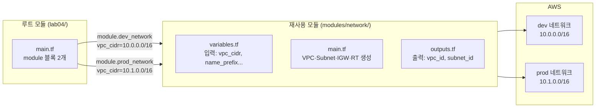



재사용 가능한 `network` 모듈을 직접 작성하고, 동일한 모듈을 dev·prod 두 환경에 호출합니다. "한 번 만들고 여러 번 쓴다"는 모듈의 핵심 가치를 체험합니다.

---

## 모듈이란?




동일한 모듈 코드를 두 번 호출해 dev용 VPC와 prod용 VPC를 각각 만듭니다. 코드 중복 없이 설정값(입력 변수)만 다르게 주면 됩니다.


---

## 파일 구성

```
lab04-modules/
├── versions.tf
├── providers.tf
├── variables.tf          ← 루트 변수
├── main.tf               ← 모듈 호출 (module 블록)
├── outputs.tf            ← 모듈 출력값 재노출
└── modules/
    └── network/
        ├── variables.tf  ← 모듈 입력 정의
        ├── main.tf       ← 실제 리소스 생성
        └── outputs.tf    ← 모듈 결과값 반환
```

---

## 루트 모듈 코드

### versions.tf

```hcl
terraform {
  required_version = ">= 1.0.0"

  required_providers {
    aws = {
      source  = "hashicorp/aws"
      version = "~> 5.0"
    }
  }
}
```

### providers.tf

```hcl
provider "aws" {
  region = "ap-northeast-2"
}
```

### variables.tf

```hcl
variable "project" {
  description = "프로젝트 이름"
  type        = string
  default     = "lab04"
}
```

### main.tf

```hcl
# dev 환경 네트워크 — 모듈 첫 번째 호출
module "dev_network" {
  source = "./modules/network"   # 로컬 모듈 경로

  name_prefix        = "${var.project}-dev"
  vpc_cidr           = "10.0.0.0/16"
  public_subnet_cidr = "10.0.1.0/24"
  availability_zone  = "ap-northeast-2a"

  tags = {
    Environment = "dev"
    ManagedBy   = "terraform"
  }
}

# prod 환경 네트워크 — 동일 모듈 두 번째 호출 (설정값만 다름)
module "prod_network" {
  source = "./modules/network"

  name_prefix        = "${var.project}-prod"
  vpc_cidr           = "10.1.0.0/16"
  public_subnet_cidr = "10.1.1.0/24"
  availability_zone  = "ap-northeast-2a"

  tags = {
    Environment = "prod"
    ManagedBy   = "terraform"
  }
}
```

### outputs.tf

```hcl
# 모듈의 output을 루트에서 재노출
output "dev_vpc_id" {
  description = "dev VPC ID"
  value       = module.dev_network.vpc_id
}

output "dev_subnet_id" {
  description = "dev 퍼블릭 서브넷 ID"
  value       = module.dev_network.public_subnet_id
}

output "prod_vpc_id" {
  description = "prod VPC ID"
  value       = module.prod_network.vpc_id
}

output "prod_subnet_id" {
  description = "prod 퍼블릭 서브넷 ID"
  value       = module.prod_network.public_subnet_id
}
```

---

## 네트워크 모듈 코드 (`modules/network/`)

### modules/network/variables.tf

```hcl
variable "name_prefix" {
  description = "리소스 이름 접두사"
  type        = string
}

variable "vpc_cidr" {
  description = "VPC CIDR 블록"
  type        = string
}

variable "public_subnet_cidr" {
  description = "퍼블릭 서브넷 CIDR 블록"
  type        = string
}

variable "availability_zone" {
  description = "가용 영역"
  type        = string
}

variable "tags" {
  description = "리소스에 적용할 태그"
  type        = map(string)
  default     = {}
}
```

### modules/network/main.tf

```hcl
resource "aws_vpc" "this" {
  cidr_block           = var.vpc_cidr
  enable_dns_hostnames = true
  enable_dns_support   = true

  tags = merge(var.tags, {
    Name = "${var.name_prefix}-vpc"
  })
}

resource "aws_subnet" "public" {
  vpc_id                  = aws_vpc.this.id
  cidr_block              = var.public_subnet_cidr
  availability_zone       = var.availability_zone
  map_public_ip_on_launch = true

  tags = merge(var.tags, {
    Name = "${var.name_prefix}-public-subnet"
  })
}

resource "aws_internet_gateway" "this" {
  vpc_id = aws_vpc.this.id

  tags = merge(var.tags, {
    Name = "${var.name_prefix}-igw"
  })
}

resource "aws_route_table" "public" {
  vpc_id = aws_vpc.this.id

  route {
    cidr_block = "0.0.0.0/0"
    gateway_id = aws_internet_gateway.this.id
  }

  tags = merge(var.tags, {
    Name = "${var.name_prefix}-public-rt"
  })
}

resource "aws_route_table_association" "public" {
  subnet_id      = aws_subnet.public.id
  route_table_id = aws_route_table.public.id
}
```

### modules/network/outputs.tf

```hcl
output "vpc_id" {
  description = "생성된 VPC ID"
  value       = aws_vpc.this.id
}

output "vpc_cidr" {
  description = "VPC CIDR 블록"
  value       = aws_vpc.this.cidr_block
}

output "public_subnet_id" {
  description = "퍼블릭 서브넷 ID"
  value       = aws_subnet.public.id
}

output "internet_gateway_id" {
  description = "인터넷 게이트웨이 ID"
  value       = aws_internet_gateway.this.id
}
```

---

## 실행 절차

{}

### 디렉터리와 파일 생성

```bash
mkdir -p lab04-modules/modules/network
cd lab04-modules

# 루트 모듈 파일 4개 작성
# modules/network/ 파일 3개 작성
```

### 초기화 — terraform init

```bash
terraform init
```

`init`은 로컬 모듈도 탐색합니다. 완료 메시지에 모듈 경로가 표시됩니다:

```
Initializing modules...
- dev_network in modules/network
- prod_network in modules/network
```

### 계획 확인 — terraform plan

```bash
terraform plan
```

dev·prod 각각 5개씩 **총 10개** 리소스가 생성 예정으로 표시됩니다:

```
Plan: 10 to add, 0 to change, 0 to destroy.

  # module.dev_network.aws_vpc.this will be created
  # module.dev_network.aws_subnet.public will be created
  # module.dev_network.aws_internet_gateway.this will be created
  # module.dev_network.aws_route_table.public will be created
  # module.dev_network.aws_route_table_association.public will be created
  # module.prod_network.aws_vpc.this will be created
  ...
```

State 키 앞에 `module.dev_network.`·`module.prod_network.` 접두사가 붙습니다.

### 배포 — terraform apply

```bash
terraform apply -auto-approve
```

완료 후 출력 예시:

```
Outputs:
dev_subnet_id  = "subnet-0aaa111bbb"
dev_vpc_id     = "vpc-0dev111aaa"
prod_subnet_id = "subnet-0bbb222ccc"
prod_vpc_id    = "vpc-0prod222bbb"
```

### 모듈 출력값 직접 조회

```bash
# 특정 모듈의 output만 조회
terraform output dev_vpc_id
terraform output -json   # 전체 JSON 형태로 출력

# State에서 모듈 리소스 확인
terraform state list
# module.dev_network.aws_vpc.this
# module.dev_network.aws_subnet.public
# ...
```

### 리소스 삭제

```bash
terraform destroy -auto-approve
```

{}

---

## 주의사항


**`source` 경로**: `./modules/network` 처럼 반드시 `./`로 시작해야 합니다. `modules/network`(슬래시 없음)로 쓰면 Terraform Registry에서 찾으려 해서 오류가 납니다.



**모듈 변경 후 `terraform init` 재실행**: 모듈의 `source` 경로나 버전을 바꾸면 반드시 `terraform init`을 다시 실행해야 합니다. 코드만 수정하면 반영되지 않습니다.



**모듈 내부 리소스 이름**: 모듈 내부에서는 `aws_vpc.this`, `aws_subnet.this`처럼 `this`를 관례적으로 사용합니다. 모듈은 이미 `module.dev_network`라는 네임스페이스로 구분되기 때문에 내부 이름을 단순하게 유지합니다.


---

## 핵심 학습 포인트

**모듈 = 입력 → 처리 → 출력 블랙박스**: 모듈을 호출하는 쪽은 `variables.tf`(입력)와 `outputs.tf`(출력)만 알면 됩니다. 내부 구현(`main.tf`)은 몰라도 됩니다. 팀원이 만든 모듈을 믿고 쓸 수 있는 이유입니다.

**같은 모듈, 다른 설정**: `module "dev_network"`와 `module "prod_network"`는 같은 코드(`./modules/network`)를 가리키지만 입력값이 다릅니다. 인프라 코드 중복 없이 환경을 분리하는 핵심 패턴입니다.

**State 네임스페이스**: 모듈로 만든 리소스는 `module.<이름>.<리소스_타입>.<리소스_이름>` 형태로 State에 기록됩니다. `terraform state list`로 확인하면 어느 모듈이 만든 리소스인지 바로 알 수 있습니다.

**output 체이닝**: 모듈 내부 `outputs.tf` → 루트 `outputs.tf` → `module.dev_network.vpc_id` 형태로 값이 전달됩니다. 이 체계를 통해 다른 모듈이나 워크스페이스가 이 값을 참조할 수 있습니다.

→ 다음 실습: [Lab 05 dev/prod 환경 분리](#) — 디렉터리 기반으로 환경을 완전히 분리하는 실전 구조
