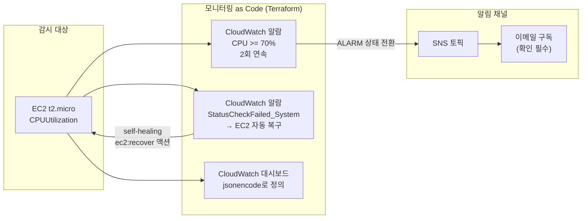



CloudWatch 알람, SNS 이메일 알림, CloudWatch 대시보드를 전부 Terraform 코드로 관리합니다. 콘솔에서 클릭으로 만든 알람은 환경 복제도, 리뷰도, 복구도 불가능합니다 — 모니터링도 인프라처럼 코드여야 하는 이유를 직접 체험합니다.

---

## 모니터링을 코드로 관리하면 얻는 것

애플리케이션 인프라는 Terraform으로 관리하면서 알람과 대시보드는 콘솔에서 수동으로 만드는 팀이 의외로 많습니다. 그 결과 스테이징에는 알람이 없고, 담당자가 퇴사하면 알람 기준의 근거를 아무도 모르게 됩니다.

| 관점 | 콘솔 수동 생성 | 모니터링 as Code |
|------|---------------|------------------|
| 코드 리뷰 | 불가능 — 임계값 변경 이력 없음 | PR로 "왜 70%인가" 논의 가능 |
| 환경 복제 | dev에 만든 알람을 prod에 재현 불가 | `terraform apply` 한 번으로 동일 구성 |
| 드리프트 | 누가 알람을 껐는지 모름 | `terraform plan`으로 즉시 감지 |
| 재해 복구 | 알람 유실 시 기억에 의존해 재생성 | 코드에서 몇 분 만에 복원 |



### Self-healing — 알람이 사람 대신 조치까지

알람의 액션이 반드시 "사람에게 알림"일 필요는 없습니다. 알람 → 자동 조치로 이어지면 **self-healing**이 됩니다.

| 알람 | 액션 | 효과 |
|------|------|------|
| `StatusCheckFailed_System` | `arn:aws:automate:<region>:ec2:recover` | 호스트 장애 시 EC2를 다른 하드웨어로 자동 복구 |
| `CPUUtilization` 고부하 | Auto Scaling 정책 트리거 | 인스턴스 자동 증설 (self-scaling) |
| 커스텀 메트릭 | Lambda / SSM Automation | 프로세스 재시작 등 자동 복구 런북 실행 |

이 랩에서는 가장 간단한 self-healing인 **EC2 recover 액션**을 코드로 구성합니다.

---

## 이 랩이 입증하는 실무 역량

> **Mercor — DevSecOps Specialist**
> "Implement self-scaling and self-healing configurations... Monitor infrastructure with Prometheus, Grafana, and the LGTM stack; participate in on-call rotations and blameless post-mortems"

| JD 요구사항 | 이 랩에서 다루는 내용 |
|-------------|----------------------|
| Self-healing configurations | `ec2:recover` 액션 알람 — 시스템 상태 검사 실패 시 자동 복구 |
| Self-scaling | 알람 → Auto Scaling 정책 연결 구조 이해 (개념 + 확장 경로) |
| Monitor infrastructure | 메트릭 알람 + 대시보드를 코드로 정의 — Grafana 대시보드 as Code(jsonnet/Terraform grafana provider)와 동일한 사고방식 |
| On-call rotations | SNS 토픽 → 이메일 구독 알림 파이프라인. 실무에선 이메일 대신 PagerDuty/Slack 연동으로 확장 |
| Blameless post-mortems | 알람 기준이 코드에 남아 "왜 이 임계값이었나"를 이력으로 추적 가능 |


**CloudWatch로 배우고 Prometheus/Grafana로 확장**: JD가 요구하는 LGTM 스택(Loki·Grafana·Tempo·Mimir)도 결국 "메트릭 수집 → 알람 규칙 → 대시보드"의 같은 구조입니다. Grafana에는 공식 Terraform provider가 있어 이 랩의 패턴이 그대로 통용됩니다.


---

## 파일 구조

```
lab15-monitoring-as-code/
├── versions.tf
├── providers.tf
├── variables.tf
├── main.tf          # 감시 대상 EC2
├── sns.tf           # 알림 채널
├── alarms.tf        # 알람 2종 (CPU + self-healing)
├── dashboard.tf     # 대시보드
└── outputs.tf
```

---

## 전체 코드

### versions.tf

```hcl
terraform {
  required_version = ">= 1.0.0"

  required_providers {
    aws = {
      source  = "hashicorp/aws"
      version = "~> 5.0"
    }
  }
}
```

### providers.tf

```hcl
provider "aws" {
  region = "ap-northeast-2"
}
```

### variables.tf

```hcl
variable "alert_email" {
  description = "알람을 수신할 이메일 주소"
  type        = string
}

variable "cpu_threshold" {
  description = "CPU 사용률 알람 임계값 (%)"
  type        = number
  default     = 70
}
```

### main.tf

```hcl
# 감시 대상 — 프리 티어 EC2
data "aws_ami" "al2023" {
  most_recent = true
  owners      = ["amazon"]

  filter {
    name   = "name"
    values = ["al2023-ami-2023*-x86_64"]
  }
}

resource "aws_instance" "target" {
  ami           = data.aws_ami.al2023.id
  instance_type = "t2.micro"

  tags = {
    Name = "lab15-monitoring-target"
  }
}
```

### sns.tf

```hcl
resource "aws_sns_topic" "alerts" {
  name = "lab15-infra-alerts"
}

# 이메일 구독 — apply 후 수신함에서 "Confirm subscription" 클릭 필요
resource "aws_sns_topic_subscription" "email" {
  topic_arn = aws_sns_topic.alerts.arn
  protocol  = "email"
  endpoint  = var.alert_email
}
```

### alarms.tf

```hcl
# 알람 1: CPU 고부하 → 이메일 알림
resource "aws_cloudwatch_metric_alarm" "cpu_high" {
  alarm_name          = "lab15-cpu-high"
  alarm_description   = "EC2 CPU가 ${var.cpu_threshold}% 이상 2분간 지속"
  namespace           = "AWS/EC2"
  metric_name         = "CPUUtilization"
  statistic           = "Average"
  period              = 60
  evaluation_periods  = 2
  threshold           = var.cpu_threshold
  comparison_operator = "GreaterThanOrEqualToThreshold"

  dimensions = {
    InstanceId = aws_instance.target.id
  }

  alarm_actions = [aws_sns_topic.alerts.arn]
  ok_actions    = [aws_sns_topic.alerts.arn] # 정상 복귀도 알림
}

# 알람 2: self-healing — 시스템 상태 검사 실패 시 EC2 자동 복구
resource "aws_cloudwatch_metric_alarm" "auto_recover" {
  alarm_name          = "lab15-ec2-auto-recover"
  alarm_description   = "하드웨어 장애 감지 시 EC2 자동 복구"
  namespace           = "AWS/EC2"
  metric_name         = "StatusCheckFailed_System"
  statistic           = "Maximum"
  period              = 60
  evaluation_periods  = 2
  threshold           = 1
  comparison_operator = "GreaterThanOrEqualToThreshold"

  dimensions = {
    InstanceId = aws_instance.target.id
  }

  alarm_actions = [
    "arn:aws:automate:ap-northeast-2:ec2:recover", # self-healing 액션
    aws_sns_topic.alerts.arn,                      # 복구 사실도 사람에게 알림
  ]
}
```

### dashboard.tf

```hcl
resource "aws_cloudwatch_dashboard" "main" {
  dashboard_name = "lab15-infra-overview"

  # 대시보드 레이아웃도 코드 — jsonencode로 HCL을 JSON으로 변환
  dashboard_body = jsonencode({
    widgets = [
      {
        type   = "text"
        x      = 0
        y      = 0
        width  = 24
        height = 1
        properties = {
          markdown = "# Lab 15 — Monitoring as Code (Terraform 관리 대시보드)"
        }
      },
      {
        type   = "metric"
        x      = 0
        y      = 1
        width  = 12
        height = 6
        properties = {
          title  = "EC2 CPU 사용률"
          region = "ap-northeast-2"
          stat   = "Average"
          period = 60
          metrics = [
            ["AWS/EC2", "CPUUtilization", "InstanceId", aws_instance.target.id]
          ]
          annotations = {
            horizontal = [
              { label = "알람 임계값", value = var.cpu_threshold }
            ]
          }
        }
      },
      {
        type   = "metric"
        x      = 12
        y      = 1
        width  = 12
        height = 6
        properties = {
          title  = "시스템 상태 검사 실패 (self-healing 트리거)"
          region = "ap-northeast-2"
          stat   = "Maximum"
          period = 60
          metrics = [
            ["AWS/EC2", "StatusCheckFailed_System", "InstanceId", aws_instance.target.id]
          ]
        }
      }
    ]
  })
}
```

### outputs.tf

```hcl
output "instance_id" {
  value = aws_instance.target.id
}

output "sns_topic_arn" {
  value = aws_sns_topic.alerts.arn
}

output "dashboard_url" {
  value = "https://ap-northeast-2.console.aws.amazon.com/cloudwatch/home?region=ap-northeast-2#dashboards/dashboard/${aws_cloudwatch_dashboard.main.dashboard_name}"
}
```

---

## 실행 단계

{}

### 배포

```bash
cd lab15-monitoring-as-code
terraform init
terraform apply -var="alert_email=you@example.com" -auto-approve
```

### 이메일 구독 확인

apply 직후 입력한 주소로 **"AWS Notification - Subscription Confirmation"** 메일이 도착합니다. 본문의 **Confirm subscription** 링크를 클릭해야 알람 메일이 수신됩니다.

```bash
# 구독 상태 확인 — PendingConfirmation이면 아직 미확인
aws sns list-subscriptions-by-topic \
  --topic-arn $(terraform output -raw sns_topic_arn) \
  --query 'Subscriptions[0].SubscriptionArn'
```

### 알람 트리거 시뮬레이션

실제로 CPU를 태우지 않고도 `set-alarm-state`로 알람 상태를 강제 전환해 **알림 파이프라인 전체를 검증**할 수 있습니다.

```bash
aws cloudwatch set-alarm-state \
  --alarm-name lab15-cpu-high \
  --state-value ALARM \
  --state-reason "파이프라인 테스트를 위한 수동 트리거"
```

몇 초 안에 `ALARM: "lab15-cpu-high" in Asia Pacific (Seoul)` 제목의 이메일이 도착합니다. (다음 메트릭 평가 주기에 실제 값 기준으로 OK로 자동 복귀하며, 이때 OK 메일도 수신됩니다.)

실제 부하로 검증하고 싶다면 인스턴스에 접속해 stress를 실행합니다.

```bash
# (선택) SSM 또는 SSH 접속 후
sudo dnf install -y stress-ng
stress-ng --cpu 1 --timeout 300   # 5분간 CPU 100% → 2분 뒤 알람 발화
```

### 대시보드 확인

```bash
terraform output -raw dashboard_url
# 브라우저로 열어 CPU 그래프 + 임계값 주석선 + 상태 검사 위젯 확인
```

{}

---

## 예상 결과 / 검증

```
Apply complete! Resources: 6 added, 0 changed, 0 destroyed.

Outputs:

dashboard_url = "https://ap-northeast-2.console.aws.amazon.com/cloudwatch/..."
instance_id   = "i-0abc123def456"
sns_topic_arn = "arn:aws:sns:ap-northeast-2:123456789012:lab15-infra-alerts"
```

| 검증 항목 | 방법 | 기대 결과 |
|-----------|------|-----------|
| 알람 등록 | `aws cloudwatch describe-alarms --alarm-name-prefix lab15` | 알람 2개, `StateValue: OK` 또는 `INSUFFICIENT_DATA` |
| 이메일 구독 | SNS 콘솔 또는 `list-subscriptions-by-topic` | `Confirmed` 상태 |
| 알람 → 메일 | `set-alarm-state`로 ALARM 전환 | 수분 내 알람 메일 수신 |
| self-healing 액션 | `describe-alarms`의 `AlarmActions` | `arn:aws:automate:...:ec2:recover` 포함 |
| 대시보드 | dashboard_url 접속 | 위젯 3개 렌더링 |


**INSUFFICIENT_DATA는 정상입니다**: 알람 생성 직후에는 평가할 데이터가 쌓이지 않아 `INSUFFICIENT_DATA` 상태로 시작합니다. 2~3분 뒤 메트릭이 수집되면 `OK`로 전환됩니다.


---

## 실습 정리

```bash
terraform destroy -var="alert_email=you@example.com" -auto-approve
```


이메일 구독이 **미확인(PendingConfirmation)** 상태면 Terraform이 구독을 삭제하지 못하고 3일 후 자동 만료됩니다. 확인된 구독은 destroy 시 정상 삭제됩니다.


---

## 실무 포인트


**알람 임계값도 변수로**: `cpu_threshold`를 변수로 뺀 이유는 환경별로 다른 기준(dev 90%, prod 70%)을 같은 코드로 적용하기 위해서입니다. tfvars 파일만 바꾸면 환경별 모니터링 정책이 분기됩니다.



**알림 피로(alert fatigue)를 경계하세요**: 알람이 너무 민감하면 on-call 엔지니어가 알림을 무시하기 시작합니다. `evaluation_periods`로 "2회 연속" 같은 지속 조건을 걸고, 조치가 필요 없는 알람은 만들지 않는 것이 원칙입니다. 알람 기준이 코드 리뷰를 거치면 이런 논의가 자연스럽게 일어납니다.



**실무 확장 경로**: 이메일 → Slack(AWS Chatbot) → PagerDuty 온콜 로테이션 순으로 알림 채널을 고도화하고, 메트릭 스택은 CloudWatch → Prometheus + Grafana(LGTM)로 확장합니다. 어느 스택이든 "알람 규칙과 대시보드를 코드로 리뷰한다"는 이 랩의 원칙은 동일합니다.


---

→ 다음 실습: [Lab 16 Terraform 네이티브 테스트](../terraform-test/) — 인프라 코드에도 테스트를
