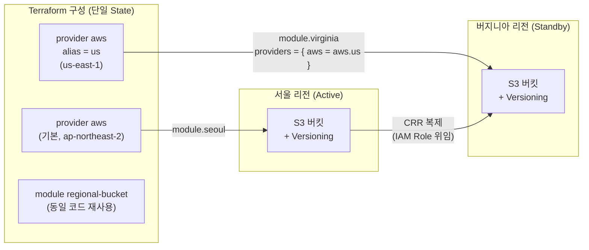



Provider alias로 하나의 Terraform 구성에서 서울(ap-northeast-2)과 버지니아(us-east-1) 두 리전에 동일한 모듈을 배포하고, S3 교차 리전 복제(CRR)로 active-standby 데이터 복제를 구성합니다. 재해 복구(DR)와 글로벌 서비스의 출발점이 되는 패턴입니다.

---

## 왜 멀티 리전인가

단일 리전 장애는 드물지만 실제로 발생합니다. 규제(데이터 주권), 지연시간(글로벌 사용자), 가용성(DR) 요구가 있는 조직은 두 개 이상의 리전에 인프라를 배포합니다. Terraform에서는 **provider alias** 하나로 같은 코드를 여러 리전에 재사용할 수 있습니다.



### Multi-Region 아키텍처 패턴 비교

| 구분 | Active-Standby (이 랩) | Active-Active |
|------|------------------------|---------------|
| 트래픽 처리 | 주 리전만 처리, 보조 리전은 대기 | 모든 리전이 동시에 트래픽 처리 |
| 데이터 복제 | 단방향 (주 → 보조) | 양방향 또는 글로벌 테이블 |
| 장애 대응 | 페일오버 필요 (RTO 존재) | 리전 장애 시 자동 흡수 |
| 비용 | 낮음 (보조 리전 최소 리소스) | 높음 (전 리전 풀 스택) |
| 복잡도 | 낮음 — 복제 방향이 명확 | 높음 — 데이터 충돌 해결 필요 |
| 대표 사례 | DR 백업, 규제 대응 | 글로벌 SaaS, 게임 서버 |


**시작은 Active-Standby부터**: 대부분의 조직은 Active-Standby로 시작해 트래픽과 요구사항이 커지면 Active-Active로 전환합니다. 이 랩의 provider alias + 모듈 패턴은 두 아키텍처 모두의 기반이 됩니다.


---

## 이 랩이 입증하는 실무 역량

> **MLabs — SRE (Terminal)**
> "Own Foundation & Architecture: Design, scale, and maintain highly available, multi-region, or active-active cloud infrastructure patterns"

| JD 요구사항 | 이 랩에서 다루는 내용 |
|-------------|----------------------|
| Multi-region infrastructure patterns | provider alias로 두 리전에 동일 모듈 배포, 단일 State로 멀티 리전 관리 |
| Highly available | S3 CRR로 리전 장애 시에도 데이터 보존 — 데이터 계층의 가용성 확보 |
| Active-active patterns | Active-Standby vs Active-Active 패턴 비교, 확장 경로 이해 |
| Design & scale | 모듈에 provider를 주입하는 구조라 리전 추가 시 모듈 호출 블록 하나만 늘리면 됨 |

---

## 파일 구조

```
lab13-multi-region/
├── versions.tf
├── providers.tf
├── main.tf
├── iam.tf
├── replication.tf
├── outputs.tf
└── modules/
    └── regional-bucket/
        ├── main.tf
        ├── variables.tf
        └── outputs.tf
```

---

## 전체 코드

### versions.tf

```hcl
terraform {
  required_version = ">= 1.0.0"

  required_providers {
    aws = {
      source  = "hashicorp/aws"
      version = "~> 5.0"
    }
  }
}
```

### providers.tf

```hcl
# 기본 provider — 서울 리전
provider "aws" {
  region = "ap-northeast-2"
}

# alias provider — 버지니아 리전
provider "aws" {
  alias  = "us"
  region = "us-east-1"
}
```

### main.tf

```hcl
data "aws_caller_identity" "current" {}

locals {
  suffix = data.aws_caller_identity.current.account_id
}

# 서울 리전 — 기본 provider 사용
module "seoul" {
  source = "./modules/regional-bucket"

  bucket_name = "lab13-crr-seoul-${local.suffix}"
  environment = "active"
}

# 버지니아 리전 — alias provider를 모듈에 주입
module "virginia" {
  source = "./modules/regional-bucket"

  bucket_name = "lab13-crr-virginia-${local.suffix}"
  environment = "standby"

  providers = {
    aws = aws.us
  }
}
```

### iam.tf

```hcl
# S3가 사용자를 대신해 복제를 수행할 IAM Role
resource "aws_iam_role" "replication" {
  name = "lab13-s3-replication-role"

  assume_role_policy = jsonencode({
    Version = "2012-10-17"
    Statement = [{
      Effect = "Allow"
      Principal = {
        Service = "s3.amazonaws.com"
      }
      Action = "sts:AssumeRole"
    }]
  })
}

resource "aws_iam_role_policy" "replication" {
  name = "lab13-s3-replication-policy"
  role = aws_iam_role.replication.id

  policy = jsonencode({
    Version = "2012-10-17"
    Statement = [
      {
        # 소스 버킷: 복제 설정·버킷 목록 조회
        Effect = "Allow"
        Action = [
          "s3:GetReplicationConfiguration",
          "s3:ListBucket"
        ]
        Resource = module.seoul.bucket_arn
      },
      {
        # 소스 객체: 복제 대상 버전 읽기
        Effect = "Allow"
        Action = [
          "s3:GetObjectVersionForReplication",
          "s3:GetObjectVersionAcl",
          "s3:GetObjectVersionTagging"
        ]
        Resource = "${module.seoul.bucket_arn}/*"
      },
      {
        # 대상 객체: 복제 쓰기
        Effect = "Allow"
        Action = [
          "s3:ReplicateObject",
          "s3:ReplicateDelete",
          "s3:ReplicateTags"
        ]
        Resource = "${module.virginia.bucket_arn}/*"
      }
    ]
  })
}
```

### replication.tf

```hcl
# 서울 → 버지니아 교차 리전 복제 (CRR)
resource "aws_s3_bucket_replication_configuration" "seoul_to_virginia" {
  # 양쪽 버킷의 Versioning이 켜진 후에만 생성 가능
  depends_on = [module.seoul, module.virginia]

  role   = aws_iam_role.replication.arn
  bucket = module.seoul.bucket_id

  rule {
    id     = "replicate-all"
    status = "Enabled"

    filter {} # 빈 filter = 버킷 전체 복제

    delete_marker_replication {
      status = "Disabled"
    }

    destination {
      bucket        = module.virginia.bucket_arn
      storage_class = "STANDARD"
    }
  }
}
```

### outputs.tf

```hcl
output "seoul_bucket" {
  description = "Active 버킷 (서울)"
  value       = module.seoul.bucket_id
}

output "virginia_bucket" {
  description = "Standby 버킷 (버지니아)"
  value       = module.virginia.bucket_id
}
```

### modules/regional-bucket/variables.tf

```hcl
variable "bucket_name" {
  description = "생성할 S3 버킷 이름 (전역 고유)"
  type        = string
}

variable "environment" {
  description = "active 또는 standby"
  type        = string
  default     = "active"
}
```

### modules/regional-bucket/main.tf

```hcl
# 모듈은 리전을 모릅니다 — 주입받은 provider의 리전에 생성됩니다
resource "aws_s3_bucket" "this" {
  bucket        = var.bucket_name
  force_destroy = true

  tags = {
    Name        = var.bucket_name
    Environment = var.environment
    ManagedBy   = "terraform"
  }
}

# CRR의 필수 조건 — 양쪽 버킷 모두 Versioning 활성화
resource "aws_s3_bucket_versioning" "this" {
  bucket = aws_s3_bucket.this.id

  versioning_configuration {
    status = "Enabled"
  }
}
```

### modules/regional-bucket/outputs.tf

```hcl
output "bucket_id" {
  value = aws_s3_bucket.this.id
}

output "bucket_arn" {
  value = aws_s3_bucket.this.arn
}
```


**모듈은 리전을 몰라야 재사용됩니다**: `regional-bucket` 모듈 안에는 리전 정보가 전혀 없습니다. 호출 측에서 `providers = { aws = aws.us }`로 provider를 주입하기 때문에, 리전을 추가할 때 모듈 코드는 한 줄도 바꾸지 않습니다.


---

## 실행 단계

{}

### 초기화 및 배포

```bash
cd lab13-multi-region
terraform init
terraform plan    # 두 리전에 버킷 2개 + IAM Role + 복제 설정 확인
terraform apply -auto-approve
```

### 두 리전에 버킷이 생성됐는지 확인

```bash
SEOUL=$(terraform output -raw seoul_bucket)
VIRGINIA=$(terraform output -raw virginia_bucket)

aws s3api get-bucket-location --bucket "$SEOUL"
# { "LocationConstraint": "ap-northeast-2" }

aws s3api get-bucket-location --bucket "$VIRGINIA"
# { "LocationConstraint": null }  ← us-east-1은 null로 표시됨
```

### 서울에 객체 업로드

```bash
echo "replicated from seoul at $(date)" > hello.txt
aws s3 cp hello.txt s3://$SEOUL/hello.txt
```

### 버지니아에서 복제 확인

```bash
# 복제는 보통 수초~수분 소요 — 잠시 기다린 후 확인
sleep 30
aws s3 ls s3://$VIRGINIA/
# 2026-07-06 ...   hello.txt  ← 복제 성공

# 객체의 복제 상태 확인
aws s3api head-object --bucket "$SEOUL" --key hello.txt \
  --query 'ReplicationStatus'
# "COMPLETED"
```

{}

---

## 예상 결과 / 검증

```
Apply complete! Resources: 7 added, 0 changed, 0 destroyed.

Outputs:

seoul_bucket    = "lab13-crr-seoul-123456789012"
virginia_bucket = "lab13-crr-virginia-123456789012"
```

검증 체크리스트:

| 검증 항목 | 명령 | 기대 결과 |
|-----------|------|-----------|
| 서울 버킷 리전 | `aws s3api get-bucket-location` | `ap-northeast-2` |
| 버지니아 버킷 리전 | `aws s3api get-bucket-location` | `null` (us-east-1) |
| Versioning 상태 | `aws s3api get-bucket-versioning --bucket $SEOUL` | `"Status": "Enabled"` |
| 복제 상태 | `aws s3api head-object --query 'ReplicationStatus'` | `PENDING` → `COMPLETED` |
| 버지니아 객체 존재 | `aws s3 ls s3://$VIRGINIA/` | `hello.txt` 표시 |


**복제는 소급 적용되지 않습니다**: CRR은 복제 설정이 활성화된 **이후에 업로드된 객체**만 복제합니다. 기존 객체까지 복제하려면 S3 Batch Replication을 별도로 실행해야 합니다.


---

## 실습 정리

```bash
# 버킷에 객체(버전 포함)가 있어도 force_destroy = true라 한 번에 삭제됩니다
terraform destroy -auto-approve
rm -f hello.txt
```

---

## 실무 포인트


**provider alias는 리전뿐 아니라 계정 분리에도 사용됩니다**: `provider "aws" { alias = "prod" assume_role { ... } }`처럼 다른 AWS 계정의 Role을 assume하는 provider를 만들면, 하나의 구성에서 멀티 계정 배포도 가능합니다. 멀티 리전 패턴을 익히면 멀티 계정은 같은 문법의 연장입니다.



**멀티 리전 ≠ State도 하나여야 한다는 뜻은 아닙니다**: 이 랩은 학습을 위해 단일 State를 사용했지만, 운영 규모에서는 리전별로 State를 분리하는 경우가 많습니다. 한 리전의 apply 실패가 다른 리전에 영향을 주지 않도록 **장애 격리(blast radius) 관점**에서 State 분리를 검토하세요.



**RTO/RPO를 먼저 정의하고 아키텍처를 고르세요**: 복구 목표 시간(RTO)과 데이터 손실 허용치(RPO)가 느슨하면 Active-Standby + CRR로 충분하고, 초 단위 RTO가 필요하면 Active-Active + Route 53 페일오버로 확장합니다. 면접에서 "왜 이 패턴을 선택했나"에 답할 수 있어야 합니다.


---

→ 다음 실습: [Lab 14 IAM 최소권한과 컴플라이언스 태깅](../iam-least-privilege/) — 규제 환경의 보안 기본기
