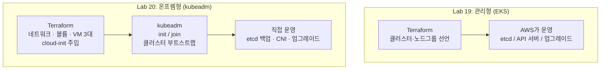



클라우드 관리형 서비스(EKS) 없이, **Terraform으로 VM 3대(컨트롤 플레인 1 + 워커 2)를 프로비저닝하고 kubeadm으로 직접 클러스터를 부트스트랩**합니다. Lab 19가 "AWS가 컨트롤 플레인을 대신 운영해주는 세계"였다면, 이번 랩은 사내 데이터센터·베어메탈·프라이빗 클라우드에서 벌어지는 **온프렘형 Kubernetes**의 세계입니다. Terraform이 어디까지 책임지고, 어디서부터 구성 관리 도구(kubeadm/Ansible)에 바통을 넘기는지 그 경계를 체험하는 것이 핵심입니다.

---

## 관리형 vs 온프렘형 — Terraform의 책임 범위가 달라진다

EKS에서는 컨트롤 플레인(etcd, API 서버, 스케줄러)이 AWS 소유였습니다. 온프렘에서는 **그 전부가 내 책임**이 됩니다.




**역할 경계**: 이 랩에서 Terraform은 "머신이 존재하게 만드는 것"까지 담당하고, 클러스터를 만드는 것은 cloud-init에 실어 보낸 kubeadm이 합니다. 실무 온프렘 환경에서는 이 두 번째 단계를 Ansible이 담당하는 경우가 많습니다 — JD에서 Terraform과 Ansible이 세트로 등장하는 이유가 바로 이 역할 분담입니다.


---

## 이 랩이 입증하는 실무 역량

> "This position is for a DevOps Engineer focused on CI/CD tooling for the **on-premises and AWS infrastructure**."
> — The Clearing House, DevOps Junior Engineer

> "We are seeking a Cloud Terraform Engineer to automate cloud infrastructure using **Terraform and Ansible**... Configure and manage **Kubernetes environments**."
> — First Soft Solutions, Cloud Terraform Engineer

> "Deploy and support containerized services using **Docker and/or Kubernetes**."
> — Information Consulting Services, Junior DevOps Engineer

| JD 요구사항 | 이 랩에서의 커버 |
|---|---|
| 온프렘 + 클라우드 하이브리드 운영 | 클라우드 API 없이 libvirt(KVM)로 동일한 IaC 워크플로 수행 |
| Terraform + 구성 관리 도구 조합 | Terraform(VM 프로비저닝) → cloud-init/kubeadm(클러스터 구성) 역할 분담 |
| Kubernetes 환경 구성·관리 | 컨트롤 플레인·워커 아키텍처, CNI, 노드 조인을 밑바닥부터 구성 |
| 컨테이너 서비스 배포 | 완성된 클러스터에 nginx Deployment/NodePort 배포·검증 |

---

## 사전 준비

이 랩은 **KVM을 지원하는 리눅스 호스트**(사내 서버, 홈랩, 클라우드의 베어메탈/중첩가상화 VM)를 전제로 합니다. 메모리 8GB 이상을 권장합니다.

```bash
# KVM/libvirt 확인 (Ubuntu 기준)
sudo apt install -y qemu-kvm libvirt-daemon-system genisoimage
virsh list --all        # 에러 없이 실행되면 준비 완료
sudo usermod -aG libvirt $USER   # 재로그인 필요
```


**macOS/Windows 사용자라면**: libvirt는 리눅스 전용입니다. 같은 구조를 노트북에서 재현하려면 ① Multipass로 VM 3대를 띄우고 아래 cloud-init 파일을 `--cloud-init` 옵션으로 그대로 주입하거나, ② 클러스터 동작 원리만 실습하려면 `kind create cluster --config`(3노드 구성)로 대체할 수 있습니다. Terraform 코드 자체는 리눅스 호스트에서만 실행됩니다.


---

## 파일 구조

```
lab20-onprem-k8s/
├── versions.tf
├── providers.tf
├── variables.tf
├── network.tf          # 전용 NAT 네트워크 (10.10.10.0/24)
├── volumes.tf          # Ubuntu 클라우드 이미지 + 노드별 디스크
├── nodes.tf            # VM 3대 + cloud-init 주입
├── outputs.tf
└── cloud-init/
    ├── control-plane.yaml.tftpl
    ├── worker.yaml.tftpl
    └── network.yaml.tftpl
```

---

## 전체 코드

### versions.tf

```hcl
terraform {
  required_version = ">= 1.6.0"

  required_providers {
    libvirt = {
      source  = "dmacvicar/libvirt"
      version = "~> 0.7"
    }
  }
}
```

### providers.tf

```hcl
provider "libvirt" {
  uri = "qemu:///system"
}
```


**AWS provider가 없다**: 이 랩의 provider는 `dmacvicar/libvirt`입니다. Terraform은 클라우드 전용 도구가 아니라 **provider가 있는 모든 API를 다루는 프로비저닝 엔진**입니다. 온프렘 하이퍼바이저(libvirt, vSphere, Proxmox)도 같은 워크플로(init → plan → apply)로 관리한다는 것이 이 랩의 숨은 메시지입니다.


### variables.tf

```hcl
variable "cluster_name" {
  description = "클러스터 이름 (VM 이름 접두사)"
  type        = string
  default     = "lab20"
}

variable "control_plane_ip" {
  description = "컨트롤 플레인 고정 IP"
  type        = string
  default     = "10.10.10.10"
}

variable "worker_ips" {
  description = "워커 노드 고정 IP 목록"
  type        = list(string)
  default     = ["10.10.10.11", "10.10.10.12"]
}

variable "bootstrap_token" {
  description = "kubeadm 부트스트랩 토큰 (실습용 고정값)"
  type        = string
  default     = "abcdef.0123456789abcdef"
  sensitive   = true
}

variable "ssh_public_key" {
  description = "VM 접속용 SSH 공개키"
  type        = string
}
```

### network.tf

```hcl
resource "libvirt_network" "k8s" {
  name      = "${var.cluster_name}-net"
  mode      = "nat"
  addresses = ["10.10.10.0/24"]

  dhcp {
    enabled = false          # cloud-init으로 고정 IP를 직접 설정
  }
}
```

### volumes.tf

```hcl
# Ubuntu 22.04 클라우드 이미지 (베이스)
resource "libvirt_volume" "base" {
  name   = "${var.cluster_name}-ubuntu-base"
  pool   = "default"
  source = "https://cloud-images.ubuntu.com/jammy/current/jammy-server-cloudimg-amd64.img"
  format = "qcow2"
}

# 노드별 디스크 (베이스 이미지에서 분기, 20GB)
resource "libvirt_volume" "node" {
  for_each = local.nodes

  name           = "${var.cluster_name}-${each.key}.qcow2"
  pool           = "default"
  base_volume_id = libvirt_volume.base.id
  size           = 20 * 1024 * 1024 * 1024
}
```

### nodes.tf

```hcl
locals {
  nodes = merge(
    {
      "cp-1" = { role = "control-plane", ip = var.control_plane_ip }
    },
    {
      for idx, ip in var.worker_ips :
      "worker-${idx + 1}" => { role = "worker", ip = ip }
    }
  )
}

resource "libvirt_cloudinit_disk" "node" {
  for_each = local.nodes

  name = "${var.cluster_name}-${each.key}-init.iso"
  pool = "default"

  user_data = templatefile(
    each.value.role == "control-plane"
      ? "${path.module}/cloud-init/control-plane.yaml.tftpl"
      : "${path.module}/cloud-init/worker.yaml.tftpl",
    {
      hostname         = "${var.cluster_name}-${each.key}"
      ssh_public_key   = var.ssh_public_key
      control_plane_ip = var.control_plane_ip
      bootstrap_token  = var.bootstrap_token
    }
  )

  network_config = templatefile("${path.module}/cloud-init/network.yaml.tftpl", {
    node_ip = each.value.ip
  })
}

resource "libvirt_domain" "node" {
  for_each = local.nodes

  name   = "${var.cluster_name}-${each.key}"
  vcpu   = 2
  memory = 2048

  cloudinit = libvirt_cloudinit_disk.node[each.key].id

  disk {
    volume_id = libvirt_volume.node[each.key].id
  }

  network_interface {
    network_id = libvirt_network.k8s.id
    addresses  = [each.value.ip]
  }

  console {
    type        = "pty"
    target_type = "serial"
    target_port = "0"
  }
}
```

### outputs.tf

```hcl
output "control_plane_ip" {
  value = var.control_plane_ip
}

output "worker_ips" {
  value = var.worker_ips
}

output "ssh_command" {
  value = "ssh ubuntu@${var.control_plane_ip}"
}
```

### cloud-init/network.yaml.tftpl

```yaml
version: 2
ethernets:
  ens3:
    addresses: [${node_ip}/24]
    gateway4: 10.10.10.1
    nameservers:
      addresses: [8.8.8.8]
```

### cloud-init/control-plane.yaml.tftpl

```yaml
#cloud-config
hostname: ${hostname}
users:
  - name: ubuntu
    sudo: ALL=(ALL) NOPASSWD:ALL
    shell: /bin/bash
    ssh_authorized_keys:
      - ${ssh_public_key}

write_files:
  - path: /etc/modules-load.d/k8s.conf
    content: |
      overlay
      br_netfilter
  - path: /etc/sysctl.d/k8s.conf
    content: |
      net.bridge.bridge-nf-call-iptables  = 1
      net.bridge.bridge-nf-call-ip6tables = 1
      net.ipv4.ip_forward                 = 1

runcmd:
  # 1) 커널 모듈·컨테이너 런타임
  - modprobe overlay && modprobe br_netfilter && sysctl --system
  - apt-get update && apt-get install -y containerd apt-transport-https curl
  - mkdir -p /etc/containerd && containerd config default > /etc/containerd/config.toml
  - sed -i 's/SystemdCgroup = false/SystemdCgroup = true/' /etc/containerd/config.toml
  - systemctl restart containerd

  # 2) kubeadm / kubelet / kubectl 설치 (v1.29)
  - curl -fsSL https://pkgs.k8s.io/core:/stable:/v1.29/deb/Release.key | gpg --dearmor -o /etc/apt/keyrings/kubernetes.gpg
  - echo "deb [signed-by=/etc/apt/keyrings/kubernetes.gpg] https://pkgs.k8s.io/core:/stable:/v1.29/deb/ /" > /etc/apt/sources.list.d/kubernetes.list
  - apt-get update && apt-get install -y kubelet kubeadm kubectl
  - apt-mark hold kubelet kubeadm kubectl

  # 3) 컨트롤 플레인 초기화
  - >
    kubeadm init
    --apiserver-advertise-address=${control_plane_ip}
    --pod-network-cidr=10.244.0.0/16
    --token=${bootstrap_token}
    --token-ttl=0

  # 4) ubuntu 사용자 kubeconfig + Flannel CNI
  - mkdir -p /home/ubuntu/.kube
  - cp /etc/kubernetes/admin.conf /home/ubuntu/.kube/config
  - chown -R ubuntu:ubuntu /home/ubuntu/.kube
  - sudo -u ubuntu kubectl apply -f https://github.com/flannel-io/flannel/releases/latest/download/kube-flannel.yml
```

### cloud-init/worker.yaml.tftpl

```yaml
#cloud-config
hostname: ${hostname}
users:
  - name: ubuntu
    sudo: ALL=(ALL) NOPASSWD:ALL
    shell: /bin/bash
    ssh_authorized_keys:
      - ${ssh_public_key}

write_files:
  - path: /etc/modules-load.d/k8s.conf
    content: |
      overlay
      br_netfilter
  - path: /etc/sysctl.d/k8s.conf
    content: |
      net.bridge.bridge-nf-call-iptables  = 1
      net.bridge.bridge-nf-call-ip6tables = 1
      net.ipv4.ip_forward                 = 1

runcmd:
  - modprobe overlay && modprobe br_netfilter && sysctl --system
  - apt-get update && apt-get install -y containerd apt-transport-https curl
  - mkdir -p /etc/containerd && containerd config default > /etc/containerd/config.toml
  - sed -i 's/SystemdCgroup = false/SystemdCgroup = true/' /etc/containerd/config.toml
  - systemctl restart containerd
  - curl -fsSL https://pkgs.k8s.io/core:/stable:/v1.29/deb/Release.key | gpg --dearmor -o /etc/apt/keyrings/kubernetes.gpg
  - echo "deb [signed-by=/etc/apt/keyrings/kubernetes.gpg] https://pkgs.k8s.io/core:/stable:/v1.29/deb/ /" > /etc/apt/sources.list.d/kubernetes.list
  - apt-get update && apt-get install -y kubelet kubeadm kubectl
  - apt-mark hold kubelet kubeadm kubectl

  # 컨트롤 플레인이 뜰 때까지 재시도하며 조인
  - >
    until kubeadm join ${control_plane_ip}:6443
    --token=${bootstrap_token}
    --discovery-token-unsafe-skip-ca-verification;
    do echo "control plane not ready, retrying..."; sleep 15; done
```


**고정 토큰과 CA 검증 생략은 실습 전용**: `--token-ttl=0`(무기한 토큰)과 `--discovery-token-unsafe-skip-ca-verification`은 부트스트랩 순서를 단순화하기 위한 실습용 타협입니다. 실무에서는 `kubeadm token create --print-join-command`로 **짧은 TTL의 토큰 + CA 인증서 해시**를 함께 사용하고, 토큰을 state나 코드에 평문으로 남기지 않습니다(Vault·SSM 등 시크릿 스토어 사용 — [Lab 08의 시크릿 관리](../../05-cicd/secret-management/) 참고).


---

## 실행 단계

{}

### 프로비저닝

```bash
cd lab20-onprem-k8s
export TF_VAR_ssh_public_key="$(cat ~/.ssh/id_rsa.pub)"

terraform init
terraform plan     # 리소스 12개: 네트워크 1 + 볼륨 4 + cloud-init 3 + VM 3 ...
terraform apply
```

### 부트스트랩 대기 (약 3~5분)

cloud-init이 각 VM에서 containerd 설치 → kubeadm init/join까지 자동 수행합니다.

```bash
# 컨트롤 플레인 진행 상황 관찰
ssh ubuntu@10.10.10.10 "cloud-init status --wait"
```

### 클러스터 확인

```bash
ssh ubuntu@10.10.10.10 "kubectl get nodes -o wide"
```

### 워크로드 배포

```bash
ssh ubuntu@10.10.10.10 <<'EOF'
kubectl create deployment web --image=nginx --replicas=3
kubectl expose deployment web --type=NodePort --port=80
kubectl get pods -o wide          # 파드가 worker-1, worker-2에 분산되는지 확인
NODEPORT=$(kubectl get svc web -o jsonpath='{.spec.ports[0].nodePort}')
curl -s http://10.10.10.11:$NODEPORT | head -4
EOF
```

{}

---

## 예상 결과

```
NAME             STATUS   ROLES           AGE   VERSION
lab20-cp-1       Ready    control-plane   5m    v1.29.x
lab20-worker-1   Ready    <none>          3m    v1.29.x
lab20-worker-2   Ready    <none>          3m    v1.29.x
```

| 검증 항목 | 명령 | 기대 결과 |
|---|---|---|
| 노드 3대 Ready | `kubectl get nodes` | cp 1 + worker 2 모두 `Ready` |
| CNI 동작 | `kubectl get pods -n kube-flannel` | flannel 파드 3개 `Running` |
| 파드 분산 스케줄링 | `kubectl get pods -o wide` | nginx 파드가 워커 2대에 분산 |
| 서비스 접근 | `curl http://<worker-ip>:<nodeport>` | nginx 환영 페이지 HTML |

---

## 실습 정리

```bash
terraform destroy   # VM 3대·디스크·네트워크 전부 제거
```


온프렘형 실습의 장점: 클라우드 비용이 **0원**입니다. VM은 로컬 하이퍼바이저 위에 있으므로 destroy를 잊어도 과금되지 않습니다. 다만 노트북/서버 메모리를 6GB가량 점유하므로 실습 후 정리를 권장합니다.


---

## 관리형(EKS) vs 온프렘형(kubeadm) — 언제 무엇을 쓰나

| 관점 | Lab 19: EKS | Lab 20: kubeadm 온프렘 |
|---|---|---|
| 컨트롤 플레인 운영 | AWS 책임 (SLA 제공) | 직접 운영 (etcd 백업·모니터링 필요) |
| 업그레이드 | 버전 지정 후 관리형 롤링 | `kubeadm upgrade` 직접 수행 |
| 비용 구조 | 시간당 과금 (클러스터 + 노드) | 하드웨어 자산 + 운영 인건비 |
| 규제·망분리 대응 | 리전/서비스 제약 | 폐쇄망·온프렘 규제 환경에 적합 |
| Terraform의 역할 | 클러스터 선언까지 | VM 계층까지, 이후 kubeadm/Ansible |
| 적합한 상황 | 빠른 출시, 운영 인력 최소화 | 금융·공공 폐쇄망, 데이터 주권, GPU 팜 |

---

## 실무 포인트


**컨트롤 플레인 1대는 SPOF**: 이 랩의 cp 1대 구성은 학습용입니다. 운영 환경 기준은 **컨트롤 플레인 3대(etcd 쿼럼) + 로드밸런서 뒤의 API 서버**입니다. kubeadm은 `--control-plane-endpoint`에 LB 주소를 지정하는 HA 토폴로지를 공식 지원합니다.



**etcd 백업이 곧 클러스터 백업**: 온프렘에서는 `etcdctl snapshot save`를 크론으로 돌리고 오프사이트에 보관하는 것이 필수 운영 항목입니다. State 백업([Lab 10](../state-recovery/))과 마찬가지로, "복구를 연습해본 백업만이 진짜 백업"입니다.


**하이브리드가 현실**: 채용공고들이 "on-premises **and** AWS"를 함께 요구하는 이유는, 실제 기업 인프라가 두 세계에 걸쳐 있기 때문입니다. 같은 Terraform 워크플로로 EKS(Lab 19)와 온프렘 VM(Lab 20)을 모두 다뤄봤다면, 하이브리드 환경 JD의 핵심 요구를 정면으로 커버한 것입니다.

---

→ 실습을 모두 마쳤다면: [운영 체크리스트](../../08-ops/checklist/)로 실무 투입 준비 상태를 점검하세요.
