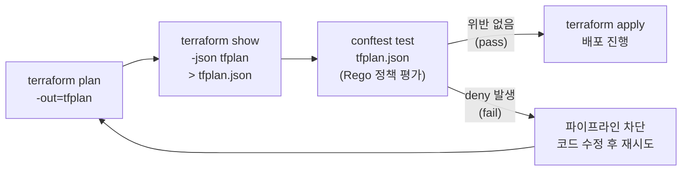



`terraform plan` 결과를 JSON으로 추출하고, OPA(Open Policy Agent) 기반 도구인 **conftest**로 Rego 정책 검사를 수행합니다. "S3 버킷은 반드시 Public Access Block을 가져야 한다", "모든 리소스에 필수 태그가 있어야 한다" 같은 조직의 규칙을 **코드로 정의하고, 배포 전에 자동으로 강제**하는 것이 Policy as Code입니다.

---

## Policy as Code란?

코드 리뷰에서 사람이 "태그 빠졌어요", "이 버킷 퍼블릭인데요"를 잡아내는 방식은 확장되지 않습니다. 정책을 코드(Rego)로 작성해두면, plan 단계에서 위반 사항이 **자동으로 차단**됩니다. Terraform Cloud/Enterprise에서는 Sentinel이 이 역할을 하고, OSS 환경에서는 OPA + conftest 조합이 사실상의 표준입니다.




**핵심 아이디어**: plan 파일은 "앞으로 일어날 변경"의 완전한 기록입니다. 이를 JSON으로 변환하면 어떤 도구로든 프로그래밍 방식으로 검사할 수 있습니다. apply 전에 검사하므로 **잘못된 인프라가 생성되기 전에** 막을 수 있습니다.


### Sentinel vs OPA/conftest 비교

| 항목 | Sentinel | OPA / conftest |
|------|----------|----------------|
| 제공 주체 | HashiCorp (Terraform Cloud/Enterprise 전용) | CNCF 오픈소스 |
| 비용 | 유료 (TFC Plus 이상) | 무료 |
| 정책 언어 | Sentinel (HashiCorp 자체 언어) | Rego |
| 적용 범위 | Terraform Cloud 워크플로 내장 | Terraform 외에 Kubernetes, Dockerfile, CI 설정 등 범용 |
| 실행 위치 | TFC 서버에서 자동 실행 | 로컬·CI 어디서나 CLI로 실행 |
| 적용 수준 | advisory / soft-mandatory / hard-mandatory | exit code 기반 (deny 시 비정상 종료) |

JD에서 "Terraform Sentinel" 경험을 요구할 때, 실제로 묻는 것은 **정책을 코드로 정의하고 파이프라인에서 강제해 본 경험**입니다. OPA/conftest로 같은 개념을 입증할 수 있습니다.

---

## 이 랩이 입증하는 실무 역량

> "Terraform Enterprise, Private Module Registry, Terraform Sentinel etc."
> — TALENTRIX AI / Congensys Corp, Terraform Infrastructure Engineer

> "Azure Policy, Microsoft Defender for Cloud... Cloud Security"
> — Congensys Corp

| JD 요구사항 | 이 랩에서 커버하는 내용 |
|-------------|------------------------|
| Terraform Sentinel | Sentinel의 OSS 대안인 OPA/conftest로 동일한 Policy as Code 워크플로 구현 — plan을 정책 엔진으로 검사하고 위반 시 차단 |
| Azure Policy 류의 정책 강제 | 클라우드 네이티브 정책 서비스와 동일한 개념(선언적 규칙 + 자동 평가)을 Rego 정책으로 직접 작성 |
| Cloud Security | S3 Public Access Block 필수 정책으로 데이터 노출 사고를 배포 전에 차단 |
| 거버넌스/컴플라이언스 | 필수 태그(Environment, Owner) 강제 정책으로 비용 추적·책임 소재 관리 자동화 |

---

## 파일 구조

```
lab12-policy-as-code/
├── versions.tf
├── providers.tf
├── main.tf
└── policy/
    ├── s3_public_access.rego
    └── required_tags.rego
```

---

## 전체 코드

### versions.tf

```hcl
terraform {
  required_version = ">= 1.0.0"

  required_providers {
    aws = {
      source  = "hashicorp/aws"
      version = "~> 5.0"
    }
  }
}
```

### providers.tf

```hcl
provider "aws" {
  region = "ap-northeast-2"
}
```

### main.tf — 처음에는 **일부러 위반 상태**로 작성

정책 위반을 재현하기 위해 Public Access Block 없이, 태그도 불완전하게 시작합니다.

```hcl
resource "aws_s3_bucket" "app" {
  bucket = "lab12-policy-as-code-app"

  tags = {
    Name = "lab12-app"
    # Environment, Owner 태그 없음 → 정책 위반
  }
}

# aws_s3_bucket_public_access_block 리소스 없음 → 정책 위반
```

### policy/s3_public_access.rego — S3 Public Access Block 필수

```rego
package main

# plan JSON에서 생성/변경될 리소스 목록
resources := input.resource_changes

# 생성되는 S3 버킷 목록
s3_buckets[r] {
    r := resources[_]
    r.type == "aws_s3_bucket"
    r.change.actions[_] == "create"
}

# 생성되는 public access block 목록
public_access_blocks[r] {
    r := resources[_]
    r.type == "aws_s3_bucket_public_access_block"
    r.change.actions[_] == "create"
}

# S3 버킷이 있는데 public access block이 하나도 없으면 deny
deny[msg] {
    count(s3_buckets) > 0
    count(public_access_blocks) == 0
    msg := "S3 버킷에는 aws_s3_bucket_public_access_block이 필수입니다"
}

# public access block의 4개 설정이 모두 true인지 검사
deny[msg] {
    r := public_access_blocks[_]
    settings := ["block_public_acls", "block_public_policy", "ignore_public_acls", "restrict_public_buckets"]
    s := settings[_]
    r.change.after[s] != true
    msg := sprintf("%s: %s 설정이 true여야 합니다", [r.address, s])
}
```

### policy/required_tags.rego — 필수 태그 강제

```rego
package main

# 태그를 지원하는 리소스 타입 (실무에서는 목록을 확장)
taggable_types := {"aws_s3_bucket", "aws_instance", "aws_vpc", "aws_subnet"}

required_tags := {"Environment", "Owner"}

deny[msg] {
    r := input.resource_changes[_]
    taggable_types[r.type]
    r.change.actions[_] == "create"

    tags := object.get(r.change.after, "tags", {})
    missing := required_tags - {key | tags[key]}
    count(missing) > 0

    msg := sprintf("%s: 필수 태그 누락 — %v", [r.address, missing])
}
```

---

## 실행 단계

{}

### conftest 설치

```bash
brew install conftest
conftest --version
```

### plan을 JSON으로 추출

```bash
cd lab12-policy-as-code
terraform init
terraform plan -out=tfplan
terraform show -json tfplan > tfplan.json
```

### 정책 검사 — 위반 확인

```bash
conftest test tfplan.json --policy policy/
```

### 코드 수정 — 정책 통과 상태로

`main.tf`를 다음과 같이 수정합니다.

```hcl
resource "aws_s3_bucket" "app" {
  bucket = "lab12-policy-as-code-app"

  tags = {
    Name        = "lab12-app"
    Environment = "dev"
    Owner       = "platform-team"
  }
}

resource "aws_s3_bucket_public_access_block" "app" {
  bucket = aws_s3_bucket.app.id

  block_public_acls       = true
  block_public_policy     = true
  ignore_public_acls      = true
  restrict_public_buckets = true
}
```

### 재검사 후 배포

```bash
terraform plan -out=tfplan
terraform show -json tfplan > tfplan.json
conftest test tfplan.json --policy policy/

# 정책 통과 후에만 apply
terraform apply tfplan
```

{}

---

## 예상 결과 / 검증

### 위반 상태 (수정 전)

```
FAIL - tfplan.json - main - S3 버킷에는 aws_s3_bucket_public_access_block이 필수입니다
FAIL - tfplan.json - main - aws_s3_bucket.app: 필수 태그 누락 — {"Environment", "Owner"}

2 tests, 0 passed, 0 warnings, 2 failures, 0 exceptions
```

`conftest`는 deny가 하나라도 있으면 **비정상 종료 코드(exit 1)**를 반환합니다. CI에서 이 단계가 실패하면 파이프라인이 멈춥니다.

### 통과 상태 (수정 후)

```
2 tests, 2 passed, 0 warnings, 0 failures, 0 exceptions
```

```bash
# exit code로 확인
conftest test tfplan.json --policy policy/ && echo "정책 통과 ✅"
```

### GitHub Actions에 conftest 단계 추가

[Lab 08](../github-actions/)의 워크플로에 다음 단계를 `plan` 뒤, `apply` 앞에 추가합니다.

```yaml
      - name: Terraform Plan (JSON)
        run: |
          terraform plan -out=tfplan
          terraform show -json tfplan > tfplan.json

      - name: Setup Conftest
        run: |
          CONFTEST_VERSION=0.56.0
          wget -q "https://github.com/open-policy-agent/conftest/releases/download/v${CONFTEST_VERSION}/conftest_${CONFTEST_VERSION}_Linux_x86_64.tar.gz"
          tar xzf conftest_${CONFTEST_VERSION}_Linux_x86_64.tar.gz
          sudo mv conftest /usr/local/bin/

      - name: Policy Check (OPA/Conftest)
        run: conftest test tfplan.json --policy policy/
        # deny 발생 시 exit 1 → 이후 apply 단계가 실행되지 않음
```

---

## 실습 정리

```bash
terraform destroy -auto-approve
rm -f tfplan tfplan.json
```

---

## 실무 포인트


**정책은 plan 기준으로 검사**: `tfplan.json`의 `resource_changes`에는 "무엇이 어떻게 바뀔지"가 모두 들어 있습니다. `.tf` 파일을 정적 분석하는 tfsec/checkov([Lab 09](../security-scan/))와 달리, conftest는 **변수가 해석된 최종 값**을 검사하므로 `var.enable_public = true` 같은 동적 케이스도 잡아냅니다. 두 방식은 상호 보완적입니다.



**정책 예외는 코드 리뷰로**: 불가피하게 정책을 우회해야 한다면 정책 파일에 예외 조건을 명시적으로 추가하고 PR 리뷰를 받으세요. `--policy` 디렉터리를 통째로 빼거나 CI 단계를 주석 처리하는 방식은 정책 자체를 무력화합니다. 정책 저장소를 별도 리포지토리로 분리해 인프라 코드와 다른 승인권자를 두는 조직도 많습니다.



**Rego 정책도 테스트 대상**: `conftest verify`로 정책 자체의 단위 테스트를 작성할 수 있습니다. 정책이 늘어나면 "정책이 의도대로 deny하는가"를 검증하는 테스트가 필수입니다.


→ 다음 실습: [Lab 13 멀티 리전 배포](../multi-region/) — 고가용성을 위한 리전 이중화
