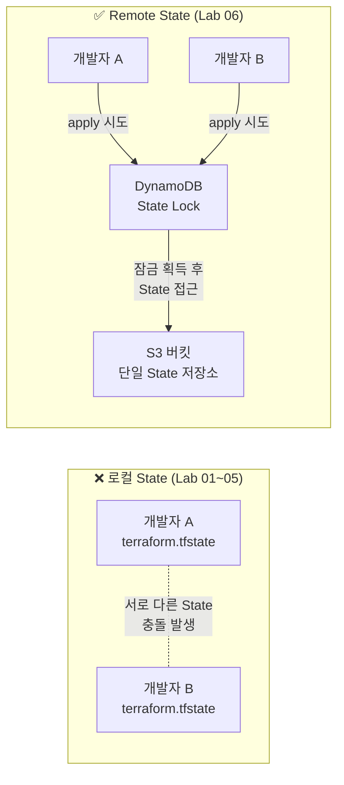



S3 + DynamoDB로 Remote Backend를 구성합니다. 로컬 `terraform.tfstate` 파일 대신 원격 저장소를 사용해 팀 협업의 기반을 마련하고, State Locking으로 동시 실행 충돌을 방지합니다.

---

## 왜 Remote State가 필요한가



| | 로컬 State | Remote State |
|--|-----------|-------------|
| State 위치 | 작업자 PC | S3 버킷 (공유) |
| 동시 실행 | 충돌 위험 | DynamoDB Lock으로 방지 |
| State 분실 | PC 손상 시 유실 | S3 버전 관리로 복구 가능 |
| 팀 공유 | 수동 복사 필요 | 자동 공유 |
| 암호화 | 없음 | S3 SSE 암호화 |

---

## 전체 디렉터리 구조

```
lab06-remote-state/
├── bootstrap/          ← 1단계: S3·DynamoDB 생성 (로컬 State)
│   ├── versions.tf
│   ├── providers.tf
│   ├── main.tf
│   └── outputs.tf
└── main-app/           ← 2단계: 실제 앱 코드 (Remote State 사용)
    ├── versions.tf
    ├── providers.tf
    ├── backend.tf      ← S3 backend 설정
    ├── main.tf
    └── outputs.tf
```


**닭이 먼저냐 달걀이 먼저냐**: Remote State를 저장할 S3 버킷 자체는 어디서 만드나요? `bootstrap/` 디렉터리에서 **로컬 State로 먼저** S3와 DynamoDB를 만듭니다. 이 bootstrap은 한 번만 실행합니다.


---

## 1단계: Bootstrap — S3·DynamoDB 생성

### bootstrap/versions.tf

```hcl
terraform {
  required_version = ">= 1.0.0"

  required_providers {
    aws = {
      source  = "hashicorp/aws"
      version = "~> 5.0"
    }
    random = {
      source  = "hashicorp/random"
      version = "~> 3.0"
    }
  }
}
```

### bootstrap/providers.tf

```hcl
provider "aws" {
  region = "ap-northeast-2"
}
```

### bootstrap/main.tf

```hcl
# 버킷 이름 전역 유일성 보장
resource "random_string" "suffix" {
  length  = 8
  special = false
  upper   = false
}

# State 저장용 S3 버킷
resource "aws_s3_bucket" "terraform_state" {
  bucket = "terraform-state-${random_string.suffix.result}"

  tags = {
    Name      = "terraform-remote-state"
    ManagedBy = "terraform"
  }
}

# 버전 관리 — 실수로 State를 덮어써도 복구 가능
resource "aws_s3_bucket_versioning" "terraform_state" {
  bucket = aws_s3_bucket.terraform_state.id

  versioning_configuration {
    status = "Enabled"
  }
}

# 서버 측 암호화
resource "aws_s3_bucket_server_side_encryption_configuration" "terraform_state" {
  bucket = aws_s3_bucket.terraform_state.id

  rule {
    apply_server_side_encryption_by_default {
      sse_algorithm = "AES256"
    }
  }
}

# 퍼블릭 액세스 차단 — State에는 민감 정보가 포함될 수 있음
resource "aws_s3_bucket_public_access_block" "terraform_state" {
  bucket = aws_s3_bucket.terraform_state.id

  block_public_acls       = true
  block_public_policy     = true
  ignore_public_acls      = true
  restrict_public_buckets = true
}

# State Lock용 DynamoDB 테이블
resource "aws_dynamodb_table" "terraform_lock" {
  name         = "terraform-state-lock"
  billing_mode = "PAY_PER_REQUEST"   # 온디맨드 과금 (실습 비용 최소화)
  hash_key     = "LockID"            # Terraform이 요구하는 고정 키 이름

  attribute {
    name = "LockID"
    type = "S"
  }

  tags = {
    Name      = "terraform-state-lock"
    ManagedBy = "terraform"
  }
}
```

### bootstrap/outputs.tf

```hcl
output "state_bucket_name" {
  description = "State 저장용 S3 버킷 이름 — backend.tf에 사용"
  value       = aws_s3_bucket.terraform_state.bucket
}

output "dynamodb_table_name" {
  description = "Lock용 DynamoDB 테이블 이름 — backend.tf에 사용"
  value       = aws_dynamodb_table.terraform_lock.name
}
```

---

## 2단계: main-app — Remote State 사용

### main-app/backend.tf

```hcl
terraform {
  backend "s3" {
    bucket         = "terraform-state-xxxxxxxx"   # bootstrap output 값으로 교체
    key            = "lab06/main-app/terraform.tfstate"
    region         = "ap-northeast-2"
    dynamodb_table = "terraform-state-lock"
    encrypt        = true
  }
}
```


**`backend` 블록에는 변수를 쓸 수 없습니다.** `var.bucket_name`처럼 변수 참조가 불가능합니다. bootstrap에서 출력된 버킷 이름을 직접 복사해서 붙여넣어야 합니다. 또는 `terraform init -backend-config` 플래그를 사용합니다.


### main-app/versions.tf

```hcl
terraform {
  required_version = ">= 1.0.0"

  required_providers {
    aws = {
      source  = "hashicorp/aws"
      version = "~> 5.0"
    }
  }
}
```

### main-app/providers.tf

```hcl
provider "aws" {
  region = "ap-northeast-2"
}
```

### main-app/main.tf

```hcl
# Remote State 테스트용 S3 버킷 (간단한 리소스)
resource "aws_s3_bucket" "app" {
  bucket = "lab06-app-bucket-${formatdate("YYYYMMDDhhmmss", timestamp())}"

  tags = {
    Name      = "lab06-app"
    ManagedBy = "terraform"
  }
}
```

### main-app/outputs.tf

```hcl
output "app_bucket_name" {
  value = aws_s3_bucket.app.bucket
}
```

---

## 실행 절차

{}

### Bootstrap — S3·DynamoDB 생성

```bash
cd lab06-remote-state/bootstrap

terraform init
terraform apply -auto-approve
```

출력에서 버킷 이름을 복사해 둡니다:

```
Outputs:
dynamodb_table_name = "terraform-state-lock"
state_bucket_name   = "terraform-state-a1b2c3d4"
```

### backend.tf에 버킷 이름 입력

`main-app/backend.tf`의 `bucket` 값을 위 출력값으로 교체합니다:

```hcl
backend "s3" {
  bucket = "terraform-state-a1b2c3d4"   # 실제 출력값으로 교체
  ...
}
```

### main-app 초기화 — Remote Backend 연결

```bash
cd lab06-remote-state/main-app

terraform init
```

Remote backend에 연결됐다는 메시지가 출력됩니다:

```
Initializing the backend...
Successfully configured the backend "s3"!
Terraform will automatically use this backend unless the configuration
changes.
```

### 배포 — State가 S3에 저장되는지 확인

```bash
terraform apply -auto-approve
```

완료 후 AWS 콘솔 또는 CLI로 S3에 State가 저장됐는지 확인합니다:

```bash
aws s3 ls s3://terraform-state-a1b2c3d4/lab06/main-app/
# 2026-06-30 ... terraform.tfstate
```

### State Locking 체험 — 두 터미널 동시 실행

**터미널 1** 에서 apply를 실행합니다:

```bash
# 터미널 1
terraform apply -auto-approve
```

apply가 실행 중인 상태에서 **터미널 2** 에서도 apply를 시도합니다:

```bash
# 터미널 2 (동시에 실행)
terraform apply -auto-approve
```

터미널 2에서 Lock 오류가 발생합니다:

```
Error: Error acquiring the state lock

  lock Info:
    ID: xxxxxxxx-xxxx-xxxx-xxxx-xxxxxxxxxxxx
    Path: lab06/main-app/terraform.tfstate
    Operation: OperationTypeApply
    Who: user@hostname
    Created: 2026-06-30 ...

  Terraform acquires a state lock to protect the state from being written
  by multiple users at the same time.
```

DynamoDB 콘솔에서 `terraform-state-lock` 테이블의 항목을 보면 LockID 레코드가 생성된 것을 확인할 수 있습니다.

### 정리 — 역순 삭제

```bash
# main-app 리소스 삭제
cd lab06-remote-state/main-app
terraform destroy -auto-approve

# bootstrap 리소스 삭제 (S3·DynamoDB)
cd lab06-remote-state/bootstrap
terraform destroy -auto-approve
```


bootstrap의 S3 버킷을 삭제하기 전에 버킷이 비어 있어야 합니다. State 파일이 남아 있으면 `destroy`가 실패합니다. `aws s3 rm s3://버킷이름 --recursive`로 먼저 비워야 합니다.


{}

---

## 주의사항


**`backend` 블록에 변수 불가**: `backend "s3"` 안에서는 `var.*`, `local.*`, `data.*` 참조가 모두 금지됩니다. 버킷 이름 등 backend 설정값은 리터럴 문자열로 직접 입력하거나 `terraform init -backend-config=backend.hcl` 방식을 사용합니다.



**`-backend-config` 활용**: 버킷 이름을 코드에 하드코딩하기 싫다면 별도 파일로 분리합니다.

```hcl
# backend.hcl (Git에서 제외하거나 공유 가능)
bucket         = "terraform-state-a1b2c3d4"
dynamodb_table = "terraform-state-lock"
region         = "ap-northeast-2"
encrypt        = true
```

```bash
terraform init -backend-config=backend.hcl
```



**State Key 설계**: `key`는 S3 내 파일 경로입니다. 프로젝트·환경별로 겹치지 않게 설계합니다.

```
# 권장 Key 패턴
{project}/{environment}/{component}/terraform.tfstate

# 예시
myapp/dev/network/terraform.tfstate
myapp/dev/compute/terraform.tfstate
myapp/prod/network/terraform.tfstate
```


---

## 핵심 학습 포인트

**S3 = 저장, DynamoDB = 잠금**: 두 서비스는 역할이 다릅니다. S3는 State 파일을 저장하고, DynamoDB는 동시에 두 명이 State를 수정하지 못하도록 잠금(Lock)을 관리합니다. 둘 다 있어야 완전한 Remote Backend입니다.

**버킷 보안 3원칙**: ① 버전 관리 활성화(실수 복구), ② 서버 측 암호화(민감 정보 보호), ③ 퍼블릭 액세스 차단(외부 노출 방지). State 파일에는 DB 비밀번호 등이 평문으로 들어갈 수 있습니다.

**bootstrap은 한 번만**: S3·DynamoDB 자체는 로컬 State로 관리합니다. 이 bootstrap 코드는 팀 공유 저장소에 보관하되, `destroy`는 신중하게 합니다. State 저장소가 사라지면 전체 인프라 State를 잃습니다.

**State Key = 경계**: 같은 S3 버킷이더라도 `key`가 다르면 완전히 독립된 State입니다. 하나의 버킷으로 여러 프로젝트·환경의 State를 관리할 수 있습니다.

→ 다음 실습: [Lab 07 기존 리소스 Import](#) — 콘솔에서 수동 생성한 리소스를 Terraform으로 편입
