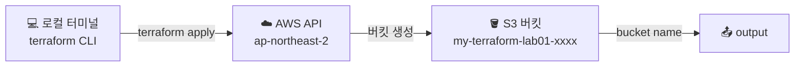



Terraform의 기본 실행 흐름(`init` → `plan` → `apply` → `destroy`)을 S3 버킷 하나로 체험합니다. Terraform을 처음 실행해 보는 입문 실습입니다.

---

## 구성 아키텍처




`random_string`으로 버킷 이름에 8자리 무작위 접미사를 붙입니다. S3 버킷 이름은 전 세계에서 유일해야 하기 때문입니다.


---

## 파일 구성

| 파일 | 역할 |
|------|------|
| `versions.tf` | Terraform 및 프로바이더 버전 고정 |
| `providers.tf` | AWS 리전(ap-northeast-2) 설정 |
| `main.tf` | S3 버킷 + random_string 리소스 |
| `outputs.tf` | 생성된 버킷 이름 출력 |

### versions.tf

```hcl
terraform {
  required_version = ">= 1.0.0"

  required_providers {
    aws = {
      source  = "hashicorp/aws"
      version = "~> 5.0"
    }
    random = {
      source  = "hashicorp/random"
      version = "~> 3.0"
    }
  }
}
```

### providers.tf

```hcl
provider "aws" {
  region = "ap-northeast-2" # 서울 리전
}
```

### main.tf

```hcl
# 버킷 이름 중복 방지를 위한 무작위 접미사
resource "random_string" "suffix" {
  length  = 8
  special = false
  upper   = false
}

# S3 버킷 생성
resource "aws_s3_bucket" "my_first_bucket" {
  bucket = "my-terraform-lab01-${random_string.suffix.result}"

  tags = {
    Name      = "my-terraform-lab01"
    ManagedBy = "terraform"
  }
}
```

### outputs.tf

```hcl
output "bucket_name" {
  description = "생성된 S3 버킷 이름"
  value       = aws_s3_bucket.my_first_bucket.id
}

output "bucket_arn" {
  description = "생성된 S3 버킷 ARN"
  value       = aws_s3_bucket.my_first_bucket.arn
}
```

---

## 실행 절차

{}

### 디렉터리 생성 및 파일 작성

작업 디렉터리를 만들고 위 파일 4개를 작성합니다.

```bash
mkdir lab01-s3-bucket && cd lab01-s3-bucket
# versions.tf, providers.tf, main.tf, outputs.tf 작성
```

### 초기화 — terraform init

AWS 프로바이더와 random 프로바이더 플러그인을 다운로드합니다.

```bash
terraform init
```

완료 메시지 예시:

```
Terraform has been successfully initialized!
```

`.terraform/` 폴더와 `.terraform.lock.hcl` 파일이 생성됩니다.

### 계획 확인 — terraform plan

생성될 리소스를 미리 확인합니다. 이 단계에서는 실제로 아무것도 만들어지지 않습니다.

```bash
terraform plan
```

`+ create` 기호가 붙은 항목이 생성 예정 리소스입니다. `random_string`과 `aws_s3_bucket` 2개가 보여야 합니다.

```
Plan: 2 to add, 0 to change, 0 to destroy.
```

```
Note: You didn't use the -out option to save this plan, so Terraform can't
guarantee to take exactly these actions if you run "terraform apply" now.
```


**이 메시지는 왜 나올까?** `plan` 결과를 파일로 저장하지 않으면, `apply`를 실행하는 시점까지 사이에 인프라 상태가 바뀔 경우(다른 사람이 콘솔에서 수동 변경 등) 실제 적용되는 작업이 방금 본 계획과 달라질 수 있다는 경고입니다. 개인 실습에서는 무시해도 되지만, 실무 및 CI/CD 환경에서는 아래처럼 계획을 파일로 고정한 뒤 그 파일로 적용하는 방식을 권장합니다.


### (심화) 계획 파일 저장 — plan -out

`-out` 옵션으로 계획 결과를 파일에 고정하면, plan 시점에 확인한 내용을 apply 시점에도 100% 동일하게 실행할 수 있습니다.

```bash
# 1. 계획을 파일로 저장
terraform plan -out=tfplan

# 2. 저장된 계획 파일로 배포 (plan 단계 없이 바로 적용)
terraform apply "tfplan"
```

| 방식 | 특징 |
|------|------|
| `terraform apply` | 실행 시점에 다시 plan을 계산 후 확인/적용. 개인 실습에 적합 |
| `terraform apply tfplan` | 저장된 계획을 그대로 적용. plan과 apply 사이 상태 변경 위험 없음. CI/CD 파이프라인에 적합 |


`tfplan` 파일은 리소스 속성 값을 포함할 수 있으므로 Git에 커밋하지 않습니다. (`.gitignore`에 `*.tfplan`, `tfplan` 추가 권장)


### 배포 — terraform apply

실제 AWS에 S3 버킷을 생성합니다.

```bash
terraform apply

# 확인 없이 자동 승인 (CI/CD 환경)
terraform apply -auto-approve
```

완료 후 출력 예시:

```
Apply complete! Resources: 2 added, 0 changed, 0 destroyed.

Outputs:
bucket_arn  = "arn:aws:s3:::my-terraform-lab01-a1b2c3d4"
bucket_name = "my-terraform-lab01-a1b2c3d4"
```

AWS 콘솔 → S3에서 버킷이 생성된 것을 확인할 수 있습니다.

### 버킷 쓰기 테스트 — 파일 업로드로 검증

인프라가 "생성"된 것과 "정상 동작"하는 것은 다른 문제입니다. 버킷 생성 권한과 오브젝트(파일) 읽기/쓰기 권한은 IAM에서 별도로 관리되므로, 실제로 파일을 하나 올려봐야 권한 설정까지 제대로 되었는지 확인할 수 있습니다.

```bash
# 1. 테스트 파일 생성
echo "Hello Terraform" > test.txt

# 2. output에서 버킷 이름 가져오기
BUCKET_NAME=$(terraform output -raw bucket_name)

# 3. S3에 업로드
aws s3 cp test.txt s3://$BUCKET_NAME/test.txt

# 4. 업로드 확인
aws s3 ls s3://$BUCKET_NAME/
```

업로드가 성공하면 자격증명과 권한이 올바르게 설정된 것입니다. `AccessDenied` 오류가 나면 IAM 정책에 `s3:PutObject` 권한이 있는지 확인하세요.


**(심화) Terraform으로 업로드 자동화**: `aws_s3_object` 리소스를 추가하면 `terraform apply` 시점에 파일까지 함께 업로드됩니다. 인프라와 데이터를 하나의 흐름으로 관리하고 싶을 때 사용합니다.

```hcl
resource "aws_s3_object" "hello" {
  bucket = aws_s3_bucket.my_first_bucket.id
  key    = "hello.txt"
  source = "test.txt" # 로컬 파일 경로
}
```

이 리소스를 추가하면 버킷 안에 항상 오브젝트가 존재하게 되므로, 아래 `force_destroy = true` 설정 없이는 `terraform destroy`가 실패합니다.


### 리소스 삭제 — terraform destroy

실습이 끝나면 반드시 삭제합니다.

```bash
terraform destroy
```

`yes`를 입력하면 S3 버킷과 random_string이 모두 삭제됩니다.

```
Destroy complete! Resources: 2 destroyed.
```

앞서 버킷 쓰기 테스트로 `test.txt`를 업로드했다면, `force_destroy = true`를 추가하지 않은 이상 아래처럼 삭제가 실패합니다. 버킷 안에 파일이 남아있는 상태에서 `destroy`가 왜 실패하는지 직접 겪어보는 것도 중요한 학습 포인트입니다.

```
Error: deleting S3 Bucket ... BucketNotEmpty: The bucket you tried to delete is not empty
```

이 경우 버킷을 비운 뒤 다시 destroy 하거나, main.tf에 `force_destroy = true`를 추가하고 `terraform apply`로 갱신한 후 destroy 하세요.

```bash
aws s3 rm s3://$BUCKET_NAME --recursive
terraform destroy
```

{}

---

## 주의사항


**AWS 자격증명 필수**: `aws configure`로 Access Key를 설정하거나, 환경변수 `AWS_ACCESS_KEY_ID` / `AWS_SECRET_ACCESS_KEY`를 먼저 설정해야 합니다.



**버킷 삭제 조건**: S3 버킷에 오브젝트(파일)가 있으면 `terraform destroy`가 실패합니다. 실습 중 파일을 업로드했다면 버킷을 비운 후 삭제하거나, `force_destroy = true`를 main.tf에 추가하세요.

```hcl
resource "aws_s3_bucket" "my_first_bucket" {
  bucket        = "my-terraform-lab01-${random_string.suffix.result}"
  force_destroy = true   # 버킷 내 오브젝트가 있어도 삭제 허용
}
```



**비용**: S3 버킷 자체는 무료입니다. 데이터 저장·요청 건수에 따라 과금됩니다. 빈 버킷은 요금이 발생하지 않으나 실습 후 삭제를 권장합니다.


---

## 핵심 학습 포인트

**init → plan → apply → destroy 흐름**: Terraform의 모든 작업은 이 4단계를 따릅니다. 이 순서를 손에 익히는 것이 이 실습의 목표입니다.

**프로바이더 조합**: `aws`와 `random` 두 프로바이더를 함께 씁니다. Terraform은 필요한 모든 프로바이더를 `init` 때 자동으로 다운로드합니다.

**리소스 간 참조**: `"my-terraform-lab01-${random_string.suffix.result}"` — random_string의 결과를 S3 버킷 이름에 직접 삽입합니다. Terraform은 이 참조를 보고 `random_string`을 먼저 만든 뒤 S3 버킷을 만듭니다.

**output으로 결과 확인**: apply 완료 후 버킷 이름과 ARN이 자동으로 출력됩니다. `terraform output bucket_name`으로 언제든 다시 확인할 수 있습니다.

**계획 파일(-out)로 실행 보장**: `plan`과 `apply` 사이에 인프라 상태가 바뀌면 실제 적용 내용이 달라질 수 있습니다. `-out`으로 계획을 파일에 고정하면 확인한 그대로 적용됨을 보장할 수 있으며, 이는 CI/CD 파이프라인의 표준 패턴입니다.

**생성 확인은 쓰기 테스트로**: 리소스가 "생성"되었다는 것과 "정상 동작"한다는 것은 다릅니다. 실제로 파일을 업로드해보면 IAM 권한, 네트워크 연결 등 콘솔 화면만으로는 알 수 없는 부분까지 검증할 수 있습니다.

→ 다음 실습: [EC2 웹서버 퀵실습](../ec2-webserver) — User Data로 웹서버 자동 구성
