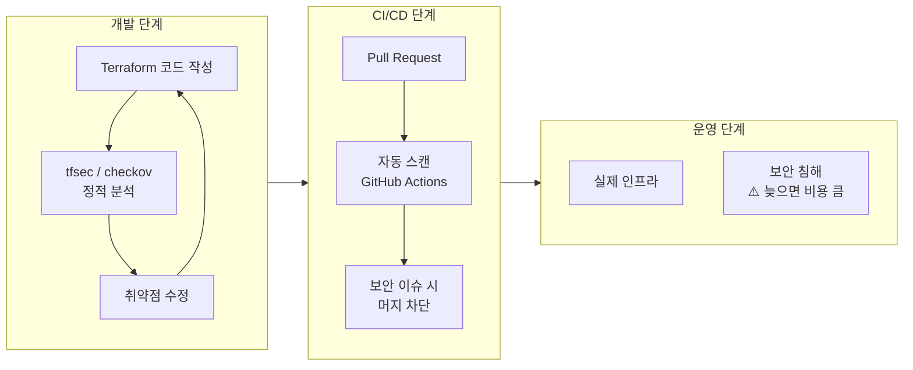



의도적으로 보안 취약점이 있는 Terraform 코드를 작성하고, `tfsec`·`checkov`로 탐지한 뒤 수정합니다. 최종적으로 두 도구를 GitHub Actions 파이프라인에 통합해 코드 푸시마다 자동 스캔이 실행되도록 구성합니다.

---

## IaC 보안 스캔이 필요한 이유




보안 이슈는 코드 단계에서 잡을수록 수정 비용이 낮습니다. 인프라가 배포된 후 발견하면 서비스 중단 없이 수정하기 어려운 경우가 많습니다.


---

## 도구 비교

| | tfsec | checkov |
|-|-------|---------|
| 특화 | Terraform 전용 | Terraform·CloudFormation·K8s 등 멀티 IaC |
| 설치 | Go 바이너리 | Python pip |
| 출력 | 터미널 컬러 | 터미널·JSON·SARIF |
| 규칙 수 | ~150개 | ~1000개 이상 |
| GitHub Actions | 공식 Action 있음 | 공식 Action 있음 |

---

## 실습 파일 구성

```
lab09-security-scan/
├── insecure/           ← 취약점 있는 코드 (Before)
│   ├── versions.tf
│   ├── providers.tf
│   └── main.tf
└── secure/             ← 수정된 코드 (After)
    ├── versions.tf
    ├── providers.tf
    └── main.tf
```

---

## Before: 취약점 있는 코드

### insecure/versions.tf

```hcl
terraform {
  required_version = ">= 1.0.0"
  required_providers {
    aws = {
      source  = "hashicorp/aws"
      version = "~> 5.0"
    }
  }
}
```

### insecure/providers.tf

```hcl
provider "aws" {
  region = "ap-northeast-2"
}
```

### insecure/main.tf

```hcl
# ❌ 취약점 1: 퍼블릭 액세스 차단 없음
resource "aws_s3_bucket" "bad" {
  bucket = "lab09-insecure-bucket"
}

# ❌ 취약점 2: 암호화 없음 (버킷 수준 암호화 미설정)

# ❌ 취약점 3: 버전 관리 비활성화
resource "aws_s3_bucket_versioning" "bad" {
  bucket = aws_s3_bucket.bad.id
  versioning_configuration {
    status = "Disabled"
  }
}

# ❌ 취약점 4: 보안 그룹 — SSH를 전체 인터넷에 개방
resource "aws_security_group" "bad" {
  name = "lab09-insecure-sg"

  ingress {
    from_port   = 22
    to_port     = 22
    protocol    = "tcp"
    cidr_blocks = ["0.0.0.0/0"]   # 전체 인터넷 허용
  }

  ingress {
    from_port   = 3389
    to_port     = 3389
    protocol    = "tcp"
    cidr_blocks = ["0.0.0.0/0"]   # RDP도 전체 허용
  }

  egress {
    from_port   = 0
    to_port     = 0
    protocol    = "-1"
    cidr_blocks = ["0.0.0.0/0"]
  }
}
```

---

## 로컬 스캔 실행

### tfsec 설치 및 실행

```bash
# macOS
brew install tfsec

# Linux
curl -s https://raw.githubusercontent.com/aquasecurity/tfsec/master/scripts/install_linux.sh | bash

# 스캔 실행
cd lab09-security-scan/insecure
tfsec .
```

tfsec 출력 예시:

```
Result #1 HIGH S3 Bucket does not have logging enabled.
──────────────────────────────────────────
  insecure/main.tf:2-4

Result #2 HIGH S3 Bucket does not have encryption enabled.
──────────────────────────────────────────
  insecure/main.tf:2-4

Result #3 HIGH S3 Bucket does not have public access block configured.
──────────────────────────────────────────
  insecure/main.tf:2-4

Result #4 CRITICAL Security group rule allows unrestricted ingress from internet (port 22).
──────────────────────────────────────────
  insecure/main.tf:22-28

Result #5 CRITICAL Security group rule allows unrestricted ingress from internet (port 3389).
──────────────────────────────────────────
  insecure/main.tf:30-36

  5 potential problems detected.
```

### checkov 설치 및 실행

```bash
# pip 설치
pip3 install checkov

# 스캔 실행
checkov -d insecure/

# JSON 형식 출력 (CI/CD 파싱용)
checkov -d insecure/ -o json > checkov-report.json

# 특정 체크만 실행
checkov -d insecure/ --check CKV_AWS_18,CKV_AWS_19,CKV_AWS_20
```

checkov 출력 예시:

```
Check: CKV_AWS_18: "Ensure the S3 bucket has access logging enabled"
  FAILED for resource: aws_s3_bucket.bad
  File: /insecure/main.tf:2-4

Check: CKV_AWS_19: "Ensure all data stored in the S3 bucket is securely encrypted at rest"
  FAILED for resource: aws_s3_bucket.bad

Check: CKV_AWS_20: "Ensure the S3 bucket has access control list (ACL) applied"
  FAILED for resource: aws_s3_bucket.bad

Check: CKV_AWS_25: "Ensure no security groups allow ingress from 0.0.0.0:0 to port 3389"
  FAILED for resource: aws_security_group.bad

Passed checks: 2, Failed checks: 8, Skipped checks: 0
```

---

## After: 보안 강화 코드

### secure/main.tf

```hcl
# ✅ S3 버킷 기본 생성
resource "aws_s3_bucket" "good" {
  bucket = "lab09-secure-bucket"
}

# ✅ 취약점 1 수정: 퍼블릭 액세스 전면 차단
resource "aws_s3_bucket_public_access_block" "good" {
  bucket = aws_s3_bucket.good.id

  block_public_acls       = true
  block_public_policy     = true
  ignore_public_acls      = true
  restrict_public_buckets = true
}

# ✅ 취약점 2 수정: 서버 측 암호화 활성화
resource "aws_s3_bucket_server_side_encryption_configuration" "good" {
  bucket = aws_s3_bucket.good.id

  rule {
    apply_server_side_encryption_by_default {
      sse_algorithm = "AES256"
    }
  }
}

# ✅ 취약점 3 수정: 버전 관리 활성화
resource "aws_s3_bucket_versioning" "good" {
  bucket = aws_s3_bucket.good.id
  versioning_configuration {
    status = "Enabled"
  }
}

# ✅ 액세스 로깅 활성화 (tfsec HIGH 탐지 항목)
resource "aws_s3_bucket_logging" "good" {
  bucket        = aws_s3_bucket.good.id
  target_bucket = aws_s3_bucket.good.id
  target_prefix = "access-logs/"
}

# ✅ 취약점 4 수정: 보안 그룹 — 최소 권한 원칙 적용
resource "aws_security_group" "good" {
  name        = "lab09-secure-sg"
  description = "Secure security group"

  ingress {
    description = "SSH from corporate network only"
    from_port   = 22
    to_port     = 22
    protocol    = "tcp"
    cidr_blocks = ["10.0.0.0/8"]   # 내부 네트워크만 허용
  }

  # RDP 규칙 제거 — 필요하면 VPN 또는 Session Manager 사용

  egress {
    from_port   = 0
    to_port     = 0
    protocol    = "-1"
    cidr_blocks = ["0.0.0.0/0"]
  }
}
```

### 수정 후 스캔 재실행

```bash
cd lab09-security-scan/secure
tfsec .
# 0 potential problems detected. ✅

checkov -d .
# Passed checks: 10, Failed checks: 0 ✅
```

---

## GitHub Actions 통합

### .github/workflows/security-scan.yml

```yaml
name: Terraform Security Scan

on:
  pull_request:
    paths:
      - "**.tf"
  push:
    branches: [main]
    paths:
      - "**.tf"

permissions:
  contents: read
  pull-requests: write
  security-events: write   # SARIF 업로드용

jobs:
  tfsec:
    name: tfsec
    runs-on: ubuntu-latest

    steps:
      - name: Checkout
        uses: actions/checkout@v4

      - name: tfsec 실행
        uses: aquasecurity/tfsec-action@v1.0.0
        with:
          soft_fail: false          # 취약점 발견 시 워크플로 실패
          format: lovely            # 가독성 높은 출력 형식

      - name: tfsec SARIF 업로드 (GitHub Security 탭 연동)
        uses: aquasecurity/tfsec-sarif-action@v0.1.0
        if: always()
        with:
          sarif_file: tfsec.sarif

      - name: SARIF 파일을 GitHub Security에 업로드
        uses: github/codeql-action/upload-sarif@v3
        if: always()
        with:
          sarif_file: tfsec.sarif

  checkov:
    name: checkov
    runs-on: ubuntu-latest

    steps:
      - name: Checkout
        uses: actions/checkout@v4

      - name: checkov 실행
        uses: bridgecrewio/checkov-action@v12
        with:
          directory: .
          framework: terraform
          output_format: cli,sarif
          output_file_path: console,checkov-results.sarif
          soft_fail: false

      - name: SARIF 파일을 GitHub Security에 업로드
        uses: github/codeql-action/upload-sarif@v3
        if: always()
        with:
          sarif_file: checkov-results.sarif
```


**SARIF 업로드**: `security-events: write` 권한과 SARIF 업로드를 함께 사용하면 스캔 결과가 GitHub 저장소의 **Security → Code scanning** 탭에서 관리됩니다. 발견된 취약점을 이슈처럼 추적하고 닫을 수 있습니다.


---

## 실행 절차

{}

### 취약점 있는 코드 작성 및 로컬 스캔

```bash
mkdir -p lab09-security-scan/insecure
# insecure/main.tf 작성 후

cd lab09-security-scan

# tfsec 설치 및 실행
brew install tfsec
tfsec insecure/

# checkov 설치 및 실행
pip3 install checkov
checkov -d insecure/
```

탐지된 취약점 목록을 확인합니다.

### 취약점 분석 — 규칙 이해

tfsec 결과의 각 항목에서 규칙 코드를 클릭하거나 검색합니다.

```bash
# 특정 규칙 상세 확인
tfsec --help
checkov --list   # 전체 체크 목록

# 특정 체크만 실행
tfsec . --include-passed --severity HIGH
checkov -d insecure/ --check CKV_AWS_18
```

### 코드 수정 후 재스캔

`secure/main.tf`를 작성하고 스캔을 다시 실행합니다.

```bash
tfsec secure/
checkov -d secure/
# 0 issues 확인
```

### 특정 규칙 무시 처리 (예외 설정)

모든 규칙을 적용하기 어려운 경우 명시적으로 무시할 수 있습니다.

```hcl
# tfsec 무시: 특정 리소스에 주석으로 선언
resource "aws_security_group" "exception" {
  name = "allow-all-for-dev"

  ingress {
    from_port   = 22
    to_port     = 22
    protocol    = "tcp"
    cidr_blocks = ["0.0.0.0/0"]
    #tfsec:ignore:aws-ec2-no-public-ingress-sgr
  }
}
```

```bash
# checkov 무시: .checkov.yaml 파일로 관리
cat > .checkov.yaml << 'EOF'
skip-check:
  - CKV_AWS_130   # 특정 VPC 서브넷 체크 제외
EOF
```

### GitHub Actions 파이프라인 통합

`.github/workflows/security-scan.yml`을 작성하고 푸시합니다.

```bash
git add .github/workflows/security-scan.yml
git commit -m "Add security scan workflow"
git push origin feature/add-security-scan
# PR 생성 → 자동 스캔 실행 확인
```

{}

---

## 주요 체크 규칙 목록

| 규칙 코드 | 도구 | 설명 | 심각도 |
|----------|------|------|--------|
| `aws-s3-enable-bucket-encryption` | tfsec | S3 암호화 미설정 | HIGH |
| `aws-s3-enable-versioning` | tfsec | S3 버전 관리 비활성화 | HIGH |
| `aws-s3-block-public-acls` | tfsec | S3 퍼블릭 ACL 허용 | HIGH |
| `aws-ec2-no-public-ingress-sgr` | tfsec | 보안 그룹 인터넷 개방 | CRITICAL |
| `CKV_AWS_18` | checkov | S3 액세스 로깅 없음 | MEDIUM |
| `CKV_AWS_19` | checkov | S3 암호화 없음 | HIGH |
| `CKV_AWS_20` | checkov | S3 퍼블릭 읽기 허용 | HIGH |
| `CKV_AWS_25` | checkov | 보안 그룹 RDP 인터넷 개방 | CRITICAL |
| `CKV_AWS_135` | checkov | EC2 IMDSv2 미적용 | MEDIUM |

---

## 주의사항


**`soft_fail: false` vs `true`**: `soft_fail: false`로 설정하면 취약점 발견 시 워크플로가 실패해 PR 머지가 차단됩니다. 처음 도입할 때는 `soft_fail: true`로 시작해 기존 코드의 이슈를 파악한 뒤, 수정 완료 후 `false`로 전환하는 것을 권장합니다.



**tfsec vs checkov 함께 쓰기**: 두 도구는 탐지 규칙이 겹치면서도 각자 잡아내는 이슈가 다릅니다. CI/CD에서 두 도구를 병렬로 실행하면 더 넓은 범위를 커버할 수 있습니다.



**Session Manager로 SSH 대체**: 보안 그룹에서 SSH 포트(22)를 닫고 AWS Systems Manager Session Manager를 쓰면 키 페어·보안 그룹 설정 없이 EC2에 접속할 수 있습니다. 가장 확실한 취약점 제거 방법입니다.


---

## 핵심 학습 포인트

**탐지 → 이해 → 수정 → 재검증 사이클**: 스캔 결과를 단순히 무시하지 않고, 각 규칙이 왜 존재하는지 이해한 뒤 코드를 수정합니다. 규칙 코드(`CKV_AWS_19` 등)를 검색하면 공격 시나리오와 수정 방법이 나옵니다.

**예외는 명시적으로**: 비즈니스 이유로 특정 규칙을 적용할 수 없다면 코드에 `#tfsec:ignore:` 또는 `.checkov.yaml`로 **이유와 함께** 명시합니다. 조용히 무시하는 것과 의도적으로 예외 처리하는 것은 다릅니다.

**`soft_fail: false`로 게이트 역할**: 보안 스캔이 PR을 차단하도록 설정하면, 모든 인프라 코드가 기준 이상의 보안 수준을 유지합니다. 이 게이트 없이는 "나중에 고치자"가 반복됩니다.

→ 다음 실습: [Lab 10 State 복구 시나리오](#) — 운영 중 발생하는 State 문제 상황 재현 및 복구
