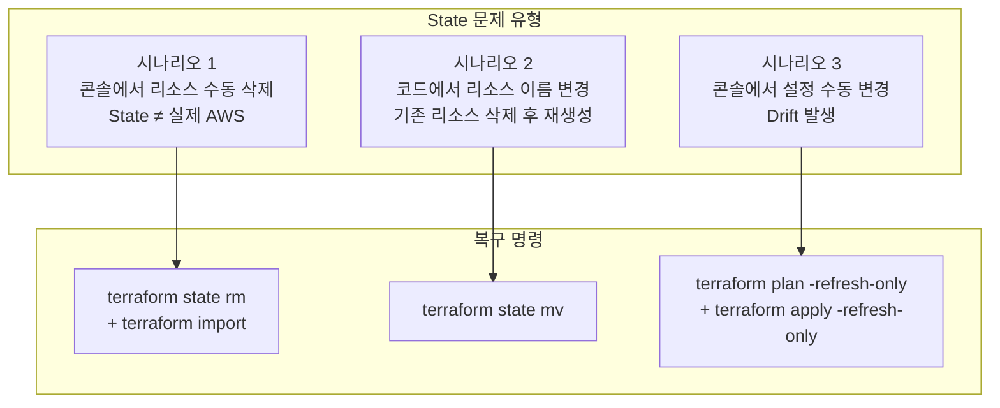



운영 중 실제로 발생하는 Terraform State 문제 상황 세 가지를 직접 재현하고 복구합니다. 문제를 직접 만들어보는 것이 가장 빠른 학습법입니다.

---

## State 문제가 발생하는 주요 원인




**State 조작은 신중하게**: `state rm`, `state mv` 등의 명령은 되돌리기 어렵습니다. 실습 전에 `terraform state pull > backup.tfstate`로 State를 백업하는 습관을 들이세요.


---

## 사전 준비 — 실습용 리소스 배포

세 시나리오 모두 같은 베이스 코드에서 시작합니다.

```
lab10-state-recovery/
├── versions.tf
├── providers.tf
└── main.tf
```

### versions.tf

```hcl
terraform {
  required_version = ">= 1.0.0"

  required_providers {
    aws = {
      source  = "hashicorp/aws"
      version = "~> 5.0"
    }
  }
}
```

### providers.tf

```hcl
provider "aws" {
  region = "ap-northeast-2"
}
```

### main.tf

```hcl
resource "aws_s3_bucket" "app" {
  bucket = "lab10-state-recovery-app"

  tags = {
    Name = "lab10-app"
  }
}

resource "aws_s3_bucket" "logs" {
  bucket = "lab10-state-recovery-logs"

  tags = {
    Name = "lab10-logs"
  }
}
```

### 초기 배포

```bash
cd lab10-state-recovery
terraform init
terraform apply -auto-approve
```

---

## 시나리오 1: 콘솔에서 리소스 수동 삭제

**상황**: 팀원이 AWS 콘솔에서 S3 버킷을 직접 삭제했습니다. Terraform State에는 여전히 존재합니다.

### 문제 재현

```bash
# AWS CLI로 버킷 삭제 (콘솔에서 직접 삭제한 것을 시뮬레이션)
aws s3 rb s3://lab10-state-recovery-logs --force

# State에는 아직 존재
terraform state list
# aws_s3_bucket.app
# aws_s3_bucket.logs  ← State에 있지만 실제로는 삭제됨
```

### 문제 확인

```bash
terraform plan
```

```
aws_s3_bucket.logs: Refreshing state... [id=lab10-state-recovery-logs]

Error: reading S3 Bucket (lab10-state-recovery-logs): NoSuchBucket
```

또는 Terraform 버전에 따라:

```
  # aws_s3_bucket.logs will be created
  + resource "aws_s3_bucket" "logs" {
      + bucket = "lab10-state-recovery-logs"
      ...
    }

Plan: 1 to add, 0 to change, 0 to destroy.
```

`plan`이 "새로 생성하겠다"고 나옵니다. 코드대로 다시 만들 것인지, 아니면 코드도 삭제할 것인지 선택해야 합니다.

### 복구 방법 A: 코드도 삭제 (리소스가 더 이상 필요 없는 경우)

```bash
# 1. State에서 제거
terraform state rm aws_s3_bucket.logs

# 2. main.tf에서 aws_s3_bucket.logs 블록 삭제

# 3. plan으로 검증
terraform plan
# No changes. ✅
```

### 복구 방법 B: AWS에서 다시 생성 (리소스가 필요한 경우)

```bash
# 코드는 그대로, apply로 재생성
terraform apply -auto-approve
# aws_s3_bucket.logs: Creating...
# Apply complete! Resources: 1 added. ✅
```

---

## 시나리오 2: 코드에서 리소스 이름 변경

**상황**: `aws_s3_bucket.app`을 `aws_s3_bucket.main`으로 리팩터링했습니다. 그냥 apply하면 기존 버킷이 삭제되고 새 버킷이 생성됩니다.

### 문제 재현

`main.tf`에서 이름을 변경합니다:

```hcl
# 변경 전: resource "aws_s3_bucket" "app"
# 변경 후:
resource "aws_s3_bucket" "main" {
  bucket = "lab10-state-recovery-app"

  tags = {
    Name = "lab10-app"
  }
}
```

### 문제 확인

```bash
terraform plan
```

```
  # aws_s3_bucket.app will be destroyed
  - resource "aws_s3_bucket" "app" {
      - bucket = "lab10-state-recovery-app"
    }

  # aws_s3_bucket.main will be created
  + resource "aws_s3_bucket" "main" {
      + bucket = "lab10-state-recovery-app"
    }

Plan: 1 to add, 0 to change, 1 to destroy.
```


이 상태에서 `apply`하면 기존 버킷이 삭제됩니다. 버킷에 데이터가 있다면 유실됩니다.


### 복구: `terraform state mv`로 이름만 변경

```bash
# 형식: terraform state mv <현재_주소> <새_주소>
terraform state mv aws_s3_bucket.app aws_s3_bucket.main
```

```
Move "aws_s3_bucket.app" to "aws_s3_bucket.main"
Successfully moved 1 object(s).
```

### 검증

```bash
terraform plan
# No changes. Your infrastructure matches the configuration. ✅
```

State의 이름만 바뀌었을 뿐, 실제 AWS 버킷은 그대로입니다.

---

## 시나리오 3: Drift 감지 및 복구

**상황**: 누군가 AWS 콘솔에서 S3 버킷 태그를 수동으로 변경했습니다. Terraform 코드와 실제 인프라 사이에 차이(Drift)가 생겼습니다.

### 문제 재현

```bash
# AWS CLI로 태그 수동 변경 (콘솔 수동 변경 시뮬레이션)
aws s3api put-bucket-tagging \
  --bucket lab10-state-recovery-app \
  --tagging 'TagSet=[{Key=Name,Value=lab10-app-MANUAL},{Key=Owner,Value=ops-team}]'
```

### Drift 감지

```bash
# -refresh-only: 계획 없이 실제 상태를 State에 반영해 차이를 확인
terraform plan -refresh-only
```

```
  ~ aws_s3_bucket.main will be updated in-place
  ~ tags = {
      ~ "Name"  = "lab10-app" -> "lab10-app-MANUAL"
      + "Owner" = "ops-team"
    }

Plan: 0 to add, 1 to change, 0 to destroy.
```

Drift가 시각적으로 표시됩니다. 이제 두 가지 선택이 있습니다.

### 복구 방법 A: 코드 기준으로 되돌리기

```bash
# 일반 apply — 코드 상태로 덮어씀
terraform apply -auto-approve
# aws_s3_bucket.main: Modifying... [id=lab10-state-recovery-app]
# Apply complete! ✅ 태그가 코드 기준으로 복구됨
```

### 복구 방법 B: 현재 실제 상태를 State에 반영 (콘솔 변경 수용)

```bash
# State를 실제 AWS 상태로 동기화 (코드는 수정 필요)
terraform apply -refresh-only -auto-approve
```

이후 코드를 실제 상태와 일치하도록 업데이트합니다:

```hcl
resource "aws_s3_bucket" "main" {
  bucket = "lab10-state-recovery-app"

  tags = {
    Name  = "lab10-app-MANUAL"
    Owner = "ops-team"
  }
}
```

---

## 실행 절차

{}

### 사전 준비 및 State 백업

```bash
cd lab10-state-recovery
terraform init
terraform apply -auto-approve

# 항상 작업 전 State 백업
terraform state pull > backup.tfstate
echo "백업 완료: $(wc -c < backup.tfstate) bytes"
```

### 시나리오 1 — 콘솔 수동 삭제 복구

```bash
# 문제 재현
aws s3 rb s3://lab10-state-recovery-logs --force

# 확인
terraform plan   # 오류 또는 재생성 계획 확인

# 복구 (방법 A: State에서 제거 후 코드도 삭제)
terraform state rm aws_s3_bucket.logs
# main.tf에서 logs 블록 삭제
terraform plan   # No changes 확인
```

### 시나리오 2 — 리소스 이름 변경

```bash
# main.tf에서 "app" → "main"으로 이름 변경 후
terraform plan   # 삭제+생성 계획 확인 (위험!)

# state mv로 이름만 변경
terraform state mv aws_s3_bucket.app aws_s3_bucket.main

# 검증
terraform plan   # No changes 확인
```

### 시나리오 3 — Drift 감지 및 복구

```bash
# Drift 재현
aws s3api put-bucket-tagging \
  --bucket lab10-state-recovery-app \
  --tagging 'TagSet=[{Key=Name,Value=lab10-app-MANUAL}]'

# Drift 확인
terraform plan -refresh-only

# 복구 (코드 기준으로 되돌리기)
terraform apply -auto-approve
terraform plan -refresh-only   # No changes 확인
```

### 정리

```bash
terraform destroy -auto-approve
```

{}

---

## State 조작 명령어 총정리

| 명령어 | 용도 | 주의사항 |
|--------|------|----------|
| `terraform state list` | 현재 State에 등록된 리소스 목록 | — |
| `terraform state show <주소>` | 특정 리소스의 State 상세 확인 | — |
| `terraform state rm <주소>` | State에서 리소스 제거 (실제 AWS 리소스 유지) | 되돌리기 어려움 |
| `terraform state mv <from> <to>` | State 내 리소스 주소 변경 | 되돌리기 어려움 |
| `terraform state pull` | 현재 State를 stdout으로 출력 | 백업 시 활용 |
| `terraform state push` | 로컬 파일을 Remote State에 강제 업로드 | 매우 위험 — 신중하게 |
| `terraform plan -refresh-only` | Drift 감지 (계획만, 변경 없음) | — |
| `terraform apply -refresh-only` | State를 실제 AWS 상태로 동기화 | 코드 수정 필요 |
| `terraform apply -replace=<주소>` | 특정 리소스 강제 재생성 | 다운타임 발생 가능 |

---

## 주의사항


**작업 전 State 백업 필수**: `terraform state pull > backup-$(date +%Y%m%d-%H%M%S).tfstate` — State를 잘못 수정하면 전체 인프라 관리가 불가능해질 수 있습니다.



**`terraform state push`는 최후의 수단**: 잘못된 State 파일을 push하면 Terraform이 존재하지 않는 리소스를 관리하려 하거나, 실제 리소스를 모르는 상태가 됩니다. Remote State에서 버전 관리(S3 versioning)가 켜져 있어야 롤백이 가능합니다.



**`-replace` vs 수동 삭제 후 apply**: `terraform apply -replace="aws_instance.web"`은 Terraform이 해당 리소스를 먼저 삭제하고 다시 만듭니다. 콘솔에서 직접 삭제하고 `apply`하는 것과 결과는 같지만, `-replace`는 State와 실제 리소스를 동기화 상태로 유지합니다.



**Drift는 일상적인 문제**: 운영 환경에서는 긴급 패치, 콘솔 실수, 다른 팀의 수동 변경 등으로 Drift가 자주 발생합니다. `terraform plan -refresh-only`를 CI/CD에서 주기적으로 실행해 Drift를 조기에 감지하세요.


---

## 핵심 학습 포인트

**State는 Terraform의 세계관**: Terraform은 State에 있는 것만 관리합니다. AWS에 실제로 존재해도 State에 없으면 모르고, State에 있어도 AWS에서 삭제되면 다시 만들려 합니다. State를 이해하면 Terraform의 동작 방식이 전부 예측 가능해집니다.

**`state mv` = 리소스를 건드리지 않고 이름만 변경**: 코드 리팩터링 시 리소스 이름이 바뀌어도 `state mv`로 State 주소를 먼저 맞추면 삭제·재생성 없이 적용할 수 있습니다. 데이터가 있는 리소스(DB, S3)에서 특히 중요합니다.

**Drift 감지는 정기 작업으로**: `plan -refresh-only`는 인프라를 변경하지 않고 실제 상태와의 차이만 보여줍니다. 주간 스케줄러나 CI/CD에 넣어두면 수동 변경을 조기에 발견할 수 있습니다.
