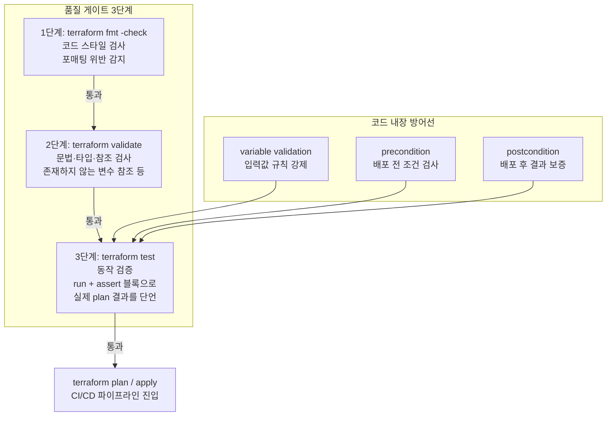



Terraform 1.6부터 내장된 `terraform test` 프레임워크로 모듈을 테스트합니다. 태그와 버킷 이름 규칙을 강제하는 S3 모듈에 대해 **plan 기반 테스트**를 작성하고, 의도적으로 실패하는 케이스까지 재현하면서 `fmt → validate → test` 3단계 품질 게이트를 완성합니다.

---

## Terraform 품질 게이트 3단계

인프라 코드도 애플리케이션 코드처럼 여러 겹의 검증 계층을 통과해야 합니다. 각 단계는 서로 다른 종류의 문제를 잡아냅니다.



### `terraform test`의 구성 요소

| 요소 | 역할 |
|------|------|
| `tests/*.tftest.hcl` | 테스트 파일 — 루트 모듈 옆 `tests/` 디렉터리에 위치 |
| `run` 블록 | 하나의 테스트 케이스. 이름과 실행 방식을 정의 |
| `command = plan` | plan만 실행해 결과를 검증 — **리소스를 만들지 않아 비용 0원** |
| `command = apply` | 실제 배포 후 검증, 테스트 종료 시 자동 destroy |
| `assert` 블록 | `condition`이 false면 테스트 실패, `error_message` 출력 |
| `variables` 블록 | 테스트용 입력값 주입 (파일 전역 또는 run 블록별) |
| `expect_failures` | "이 입력은 반드시 거부되어야 한다"는 부정 테스트 |


**`terraform test`는 Terraform 1.6 이상 필요**: `terraform version`으로 확인하세요. 이 랩은 `command = plan` 기반 테스트만 사용하므로 AWS 리소스가 실제로 생성되지 않으며, 비용이 발생하지 않습니다. (plan 실행을 위한 AWS 자격 증명은 필요합니다.)


---

## 이 랩이 입증하는 실무 역량

실제 LinkedIn 채용공고(JD)에서 요구하는 역량입니다.

> "Agile, Test-Driven Development (TDD)"
> — **Congensys Corp, Infrastructure Engineer (Terraform)**

> "Agile development practices and test-driven development"
> — **TALENTRIX AI, Terraform Infrastructure Engineer**

| JD 요구사항 | 이 랩에서 커버하는 내용 |
|-------------|------------------------|
| Test-Driven Development (TDD) | 모듈의 요구사항(이름 규칙, 필수 태그)을 테스트로 먼저 정의하고, 통과/실패 케이스를 모두 작성 |
| 테스트 자동화 | `terraform test` 네이티브 프레임워크 + `.tftest.hcl` 작성법 (run, assert, expect_failures) |
| Agile — 빠른 피드백 루프 | plan 기반 테스트로 리소스 생성 없이 수 초 내 검증, CI에서 PR마다 자동 실행 |
| 품질 게이트 | `fmt -check → validate → test` 3단계를 로컬과 GitHub Actions 양쪽에서 실행 |

---

## 실습 파일 구성

```
lab16-terraform-test/
├── versions.tf      ← required_version >= 1.6.0 (terraform test 기능 요구사항)
├── providers.tf
├── variables.tf     ← bucket_name/environment에 validation 블록, tags 맵
├── main.tf          ← random_string.suffix + aws_s3_bucket.this (precondition/postcondition 포함)
├── outputs.tf
└── tests/
    ├── naming.tftest.hcl
    └── tags.tftest.hcl
```


`main.tf`는 `random_string.suffix` 리소스를 두고 S3 버킷 이름 끝에 붙입니다. S3 버킷 이름은 전 세계에서 유일해야 하므로, `<bucket_name>-<environment>` 같은 고정 문자열만 쓰면 다른 사용자의 버킷과 충돌해 `BucketAlreadyExists` 오류가 발생합니다. 이 때문에 `versions.tf`에도 `random` 프로바이더가 추가로 필요하고, `tests/naming.tftest.hcl`의 이름 검증 테스트도 정확한 문자열이 아닌 접두어(prefix) 비교로 작성합니다.


---

## 전체 HCL 코드

### versions.tf

```hcl
terraform {
  required_version = ">= 1.6.0"   # terraform test는 1.6부터 지원

  required_providers {
    aws = {
      source  = "hashicorp/aws"
      version = "~> 5.0"
    }
    random = {
      source  = "hashicorp/random"
      version = "~> 3.0"
    }
  }
}
```

### providers.tf

```hcl
provider "aws" {
  region = "ap-northeast-2"
}
```

### variables.tf

`validation` 블록으로 잘못된 입력을 **plan 단계에서** 차단합니다.

```hcl
variable "bucket_name" {
  description = "버킷 이름 (lab16- 접두어, 소문자/숫자/하이픈만 허용)"
  type        = string

  validation {
    condition     = can(regex("^lab16-[a-z0-9-]+$", var.bucket_name))
    error_message = "bucket_name은 'lab16-'로 시작하고 소문자·숫자·하이픈만 사용해야 합니다."
  }
}

variable "environment" {
  description = "배포 환경"
  type        = string

  validation {
    condition     = contains(["dev", "stage", "prod"], var.environment)
    error_message = "environment는 dev, stage, prod 중 하나여야 합니다."
  }
}

variable "tags" {
  description = "버킷 태그 (Owner 키 필수)"
  type        = map(string)
  default     = {}
}
```

### main.tf

`precondition`은 plan 시점에 조건을 검사해 위반 시 배포를 막고, `postcondition`은 리소스 생성(또는 plan) 결과가 약속을 지키는지 보증합니다. 버킷 이름 뒤에는 `random_string.suffix`를 붙여 전역적으로 유일한 이름을 만듭니다.

```hcl
# 버킷 이름 중복 방지를 위한 무작위 접미사
resource "random_string" "suffix" {
  length  = 8
  special = false
  upper   = false
}

resource "aws_s3_bucket" "this" {
  bucket = "${var.bucket_name}-${var.environment}-${random_string.suffix.result}"

  tags = merge(var.tags, {
    Environment = var.environment
    ManagedBy   = "terraform"
  })

  lifecycle {
    # 배포 전 검사: Owner 태그가 없으면 plan 단계에서 실패
    precondition {
      condition     = contains(keys(var.tags), "Owner")
      error_message = "tags에 Owner 키는 필수입니다. 리소스 비용 추적에 사용됩니다."
    }

    # 결과 보증: 최종 버킷 이름은 63자를 넘을 수 없음 (S3 제약)
    postcondition {
      condition     = length(self.bucket) <= 63
      error_message = "버킷 이름이 S3 최대 길이(63자)를 초과했습니다."
    }
  }
}
```

### outputs.tf

```hcl
output "bucket_id" {
  description = "생성된 버킷 이름"
  value       = aws_s3_bucket.this.id
}

output "bucket_arn" {
  description = "생성된 버킷 ARN"
  value       = aws_s3_bucket.this.arn
}
```

### tests/naming.tftest.hcl


`main.tf`가 버킷 이름 끝에 `random_string.suffix.result`를 붙이므로, 매 테스트 실행마다 접미사가 달라집니다. 그래서 `valid_bucket_name` 테스트는 정확한 문자열(`==`)이 아니라 **접두어 비교(`startswith`)**로 검증합니다 — 고정 문자열과 비교하면 접미사가 바뀔 때마다 테스트가 항상 실패합니다.


```hcl
# 파일 전역 변수 — 모든 run 블록의 기본 입력
variables {
  bucket_name = "lab16-test-app"
  environment = "dev"
  tags = {
    Owner = "platform-team"
  }
}

# ✅ 정상 케이스: 이름 규칙을 지키면 plan이 성공하고
#    최종 버킷 이름이 <bucket_name>-<environment>-<random suffix> 형식이어야 한다
run "valid_bucket_name" {
  command = plan

  assert {
    condition     = startswith(aws_s3_bucket.this.bucket, "lab16-test-app-dev-")
    error_message = "버킷 이름은 '<bucket_name>-<environment>-' 접두어로 시작해야 합니다."
  }
}

# ❌ 부정 테스트: 대문자 이름은 variable validation에서 거부되어야 한다
run "uppercase_name_rejected" {
  command = plan

  variables {
    bucket_name = "LAB16-INVALID"
  }

  # var.bucket_name의 validation 실패를 '기대'한다
  # 거부되지 않으면 테스트가 실패한다
  expect_failures = [
    var.bucket_name,
  ]
}

# ❌ 부정 테스트: 허용되지 않은 환경 이름은 거부되어야 한다
run "invalid_environment_rejected" {
  command = plan

  variables {
    environment = "production"   # prod가 아닌 오타
  }

  expect_failures = [
    var.environment,
  ]
}
```

### tests/tags.tftest.hcl

```hcl
variables {
  bucket_name = "lab16-test-app"
  environment = "prod"
  tags = {
    Owner = "platform-team"
    Team  = "sre"
  }
}

# ✅ 정상 케이스: 사용자 태그와 자동 태그가 병합되어야 한다
run "tags_are_merged" {
  command = plan

  assert {
    condition     = aws_s3_bucket.this.tags["Environment"] == "prod"
    error_message = "Environment 태그가 자동으로 붙어야 합니다."
  }

  assert {
    condition     = aws_s3_bucket.this.tags["ManagedBy"] == "terraform"
    error_message = "ManagedBy=terraform 태그가 자동으로 붙어야 합니다."
  }

  assert {
    condition     = aws_s3_bucket.this.tags["Owner"] == "platform-team"
    error_message = "사용자가 넘긴 Owner 태그가 유지되어야 합니다."
  }
}

# ❌ 부정 테스트: Owner 태그가 없으면 precondition에서 거부되어야 한다
run "missing_owner_tag_rejected" {
  command = plan

  variables {
    tags = {
      Team = "sre"   # Owner 누락
    }
  }

  expect_failures = [
    aws_s3_bucket.this,   # 리소스의 precondition 실패를 기대
  ]
}
```

---

## 실행 단계

{}

### 1단계 품질 게이트 — fmt

```bash
cd lab16-terraform-test

# 포매팅 위반이 있으면 종료 코드 3으로 실패 (CI에서 그대로 사용)
terraform fmt -check -recursive
echo "exit code: $?"
```

일부러 실패시켜 봅니다. `main.tf`의 아무 줄에 들여쓰기를 흐트러뜨린 뒤:

```bash
terraform fmt -check -recursive
# main.tf          ← 위반 파일 목록 출력, exit code 3

terraform fmt -recursive   # 자동 수정
```

### 2단계 품질 게이트 — validate

```bash
terraform init
terraform validate
# Success! The configuration is valid. ✅
```

일부러 실패시켜 봅니다. `main.tf`에서 `var.environment`를 `var.enviroment`(오타)로 바꾸면:

```bash
terraform validate
# Error: Reference to undeclared input variable
```

오타를 원복하고 다음 단계로 갑니다.

### 3단계 품질 게이트 — test

```bash
terraform test
```

### 의도적 실패 재현 — 테스트가 회귀를 잡는지 확인

TDD의 핵심은 "테스트가 실제로 실패할 수 있는가"입니다. `main.tf`에서 태그 병합을 실수로 지웠다고 가정합니다:

```hcl
  # merge(...) 를 실수로 제거한 상황 시뮬레이션
  tags = var.tags
```

```bash
terraform test
```

`tags_are_merged` 테스트가 즉시 실패하며 회귀를 잡아냅니다. 확인 후 원복하세요:

```
tests/tags.tftest.hcl... in progress
  run "tags_are_merged"... fail
╷
│ Error: Test assertion failed
│   on tests/tags.tftest.hcl line 14:
│   Environment 태그가 자동으로 붙어야 합니다.
```

### CI에서 실행 — GitHub Actions 품질 게이트

`.github/workflows/quality-gate.yml`:

```yaml
name: terraform-quality-gate

on:
  pull_request:
    paths: ["**.tf", "**.tftest.hcl"]

jobs:
  quality-gate:
    runs-on: ubuntu-latest
    permissions:
      id-token: write   # OIDC로 AWS 자격 증명 획득 (Lab 08 참고)
      contents: read
    steps:
      - uses: actions/checkout@v4

      - uses: hashicorp/setup-terraform@v3
        with:
          terraform_version: "1.9.0"

      - uses: aws-actions/configure-aws-credentials@v4
        with:
          role-to-assume: ${{ secrets.AWS_ROLE_ARN }}
          aws-region: ap-northeast-2

      # 3단계 품질 게이트 — 하나라도 실패하면 PR 머지 차단
      - name: fmt
        run: terraform fmt -check -recursive

      - name: validate
        run: |
          terraform init -backend=false
          terraform validate

      - name: test
        run: terraform test
```

{}

---

## 예상 결과 / 검증

`terraform test`의 최종 출력이 다음과 같아야 합니다.

```
tests/naming.tftest.hcl... in progress
  run "valid_bucket_name"... pass
  run "uppercase_name_rejected"... pass
  run "invalid_environment_rejected"... pass
tests/naming.tftest.hcl... tearing down
tests/naming.tftest.hcl... pass
tests/tags.tftest.hcl... in progress
  run "tags_are_merged"... pass
  run "missing_owner_tag_rejected"... pass
tests/tags.tftest.hcl... tearing down
tests/tags.tftest.hcl... pass

Success! 6 passed, 0 failed. ✅
```

체크리스트:

| 확인 항목 | 기대 결과 |
|-----------|-----------|
| `terraform fmt -check -recursive` | 출력 없음, exit code 0 |
| `terraform validate` | `Success! The configuration is valid.` |
| `terraform test` | `6 passed, 0 failed` |
| 부정 테스트(`expect_failures`) | validation/precondition 위반이 **pass로 기록됨** (거부 자체가 성공 조건) |
| 태그 병합 제거 실험 | `tags_are_merged`가 fail — 테스트가 회귀를 잡아냄 |
| `aws s3 ls \| grep lab16` | **아무것도 없음** — plan 기반 테스트는 리소스를 만들지 않음 |

---

## 실습 정리

이 랩은 `command = plan` 기반 테스트만 사용했으므로 **실제로 생성된 AWS 리소스가 없습니다**. 그래도 습관을 위해 확인 절차를 수행합니다.

```bash
# 생성된 리소스가 없는지 확인
aws s3 ls | grep lab16 || echo "생성된 버킷 없음 ✅"

# 만약 command = apply 테스트를 실험했다면 terraform test가
# 종료 시 자동으로 destroy하지만, 중단된 경우 수동 정리:
terraform destroy -auto-approve

# 테스트 캐시 정리 (선택)
rm -rf .terraform terraform.tfstate*
```

---

## 실무 포인트


**plan 테스트와 apply 테스트의 역할 분담**: `command = plan`은 빠르고 무료라 PR마다 실행하는 단위 테스트에 적합합니다. `command = apply`는 실제 리소스를 만들어 통합 검증하고 테스트 종료 시 자동 destroy하므로, 비용과 시간이 들더라도 야간 스케줄이나 릴리스 전 단계에서 실행하는 것이 일반적입니다.



**`command = apply` 테스트가 중단되면 리소스가 남을 수 있습니다**: CI 러너가 강제 종료되면 자동 destroy가 실행되지 못합니다. apply 테스트는 전용 테스트 계정(샌드박스)에서 실행하고, 주기적인 리소스 청소(nuke) 파이프라인을 함께 운영하세요.



**validation·precondition은 테스트가 없어도 동작하는 상시 방어선**: `.tftest.hcl`은 개발자가 실행해야 잡아내지만, `variable validation`과 `precondition`은 실제 사용자가 `plan`을 실행하는 순간마다 강제됩니다. 규칙은 코드(validation/precondition)에 넣고, 테스트는 "그 규칙이 계속 동작하는지"를 회귀 검증하는 이중 구조가 실무 표준입니다.



**TDD 순서로 모듈을 만들어 보세요**: 요구사항("버킷 이름은 lab16- 접두어", "Owner 태그 필수")을 먼저 `.tftest.hcl`의 run 블록으로 작성하고, 테스트가 실패하는 것을 확인한 뒤 validation/precondition을 구현해 통과시키는 순서입니다. JD에서 말하는 Test-Driven Development가 정확히 이 흐름입니다.


---

→ 다음 실습: [Lab 17 드리프트 탐지 자동화](../drift-detection/) — 운영 환경의 변화를 자동으로 감지
